# Fleet Monitoring - Troubleshooting Guide

## Table of Contents
1. [Common Issues](#common-issues)
2. [Connection Problems](#connection-problems)
3. [Message Reception Issues](#message-reception-issues)
4. [Device Discovery Problems](#device-discovery-problems)
5. [Performance Issues](#performance-issues)
6. [MQTT Broker Issues](#mqtt-broker-issues)
7. [Network Diagnostics](#network-diagnostics)
8. [Advanced Debugging](#advanced-debugging)
9. [FAQ](#faq)

---

## Common Issues

### Diagnostic Sequence Flow

```mermaid
sequenceDiagram
    participant User
    participant App as Application
    participant Service as Fleet Monitoring
    participant Broker as MQTT Broker
    participant Network
    
    User->>App: Attempt to connect
    App->>Service: connect(broker, port, topic)
    Service->>Network: DNS resolve broker
    
    alt DNS Resolution Fails
        Network-->>Service: ENOTFOUND
        Service-->>App: Error: Invalid hostname
        App-->>User: Show error message
    else DNS OK
        Network-->>Service: IP Address
        Service->>Broker: TCP Connect (port 1883)
        
        alt Connection Refused
            Broker-->>Service: ECONNREFUSED
            Service-->>App: Broker not running
            App-->>User: Check broker status
        else Connection Timeout
            Broker-->>Service: ETIMEDOUT
            Service-->>App: Network/firewall issue
            App-->>User: Check firewall rules
        else Connection OK
            Broker-->>Service: Connection Accepted
            Service->>Broker: SUBSCRIBE topic
            
            alt Auth Required
                Broker-->>Service: Not authorized
                Service-->>App: Authentication failed
                App-->>User: Add credentials
            else Auth OK
                Broker-->>Service: SUBACK
                Service-->>App: Connected successfully
                App-->>User: Show "Connected" 🟢
            end
        end
    end
```



### Quick Diagnostic Flowchart


---

## Connection Problems

### Problem: "Connection Refused"

**Error Message:**
```
Error: Connection failed: connect ECONNREFUSED 192.168.1.100:1883
```

**Causes & Solutions:**

#### 1. Broker Not Running

**Verify broker status:**
```bash
# Linux (Mosquitto)
sudo systemctl status mosquitto

# Expected output:
# ● mosquitto.service - Mosquitto MQTT Broker
#    Active: active (running)

# Windows
netstat -an | findstr "1883"

# Expected output:
# TCP    0.0.0.0:1883    0.0.0.0:0    LISTENING
```

**Start broker:**
```bash
# Linux
sudo systemctl start mosquitto

# Windows
cd "C:\Program Files\mosquitto"
.\mosquitto.exe -v
```

#### 2. Wrong Port Number

**Common MQTT ports:**
| Port | Protocol | Usage |
|------|----------|-------|
| 1883 | MQTT | Default unencrypted |
| 8883 | MQTTS | TLS/SSL encrypted |
| 1884 | MQTT | Alternative port |

**Test port connectivity:**
```powershell
# Windows
Test-NetConnection -ComputerName 192.168.1.100 -Port 1883

# Expected:
# TcpTestSucceeded : True
```

```bash
# Linux
nc -zv 192.168.1.100 1883

# Expected:
# Connection to 192.168.1.100 1883 port [tcp/*] succeeded!
```

#### 3. Firewall Blocking

**Windows Firewall:**
```powershell
# Allow MQTT port
New-NetFirewallRule -DisplayName "MQTT" -Direction Inbound -Protocol TCP -LocalPort 1883 -Action Allow
```

**Linux firewall (ufw):**
```bash
sudo ufw allow 1883/tcp
sudo ufw reload
```

---

### Problem: "Connection Timeout"

**Error Message:**
```
Error: Connection failed: connect ETIMEDOUT
```

**Diagnostic Steps:**


**Solutions:**

#### 1. Check Network Connectivity
```bash
# Ping broker
ping 192.168.1.100

# Expected:
# Reply from 192.168.1.100: bytes=32 time<1ms TTL=64
```

#### 2. Verify Port Accessibility
```bash
# Telnet test
telnet 192.168.1.100 1883

# Or use PowerShell
Test-NetConnection -ComputerName 192.168.1.100 -Port 1883
```

#### 3. Increase Connection Timeout
```javascript
// In service config
this.client = mqtt.connect(brokerUrl, {
    connectTimeout: 30000,  // 30 seconds instead of 10
    keepalive: 120         // 2 minutes
});
```

---

### Problem: "Authentication Failed"

**Error Message:**
```
Error: Connection refused: Not authorized
```

**Solution:**

```javascript
// Add credentials to connection
this.client = mqtt.connect(brokerUrl, {
    username: 'your_username',
    password: 'your_password',
    clientId: `fleet_monitor_${Math.random().toString(16).slice(2, 10)}`
});
```

**Verify broker authentication:**
```bash
# Test with mosquitto_pub
mosquitto_pub -h 192.168.1.100 -p 1883 \
  -u username -P password \
  -t "test/topic" -m "test"

# No error = auth working
```

---

## Message Reception Issues

### Problem: "Connected But No Messages"

**Symptoms:**
- Status shows "Connected"
- Device count remains 0
- No messages in buffer

**Diagnostic Flowchart:**


**Solutions:**

#### 1. Verify Subscription
```javascript
// Enable subscription logging
this.client.subscribe(baseTopic, (err) => {
    if (err) {
        console.error('Subscription error:', err);
    } else {
        console.log(`✓ Subscribed to: ${baseTopic}`);
        
        // Log all received topics
        this.client.on('message', (topic, payload) => {
            console.log(`Received: ${topic}`);
            this.handleMessage(topic, payload);
        });
    }
});
```

#### 2. Test with MQTT Client
```bash
# Subscribe with mosquitto_sub to verify messages exist
mosquitto_sub -h 192.168.1.100 -p 1883 -t "nube-io/hvac/logs/#" -v

# Expected output:
# nube-io/hvac/logs/FGA-001/production/INFO {"timestamp":"...","message":"..."}
```

#### 3. Check Topic Wildcards

**Wildcard Examples:**
```javascript
// Too specific - won't match
baseTopic = 'nube-io/hvac/logs/FGA-001/production/INFO'

// Correct - matches all devices
baseTopic = 'nube-io/hvac/logs/#'

// Alternative - matches all levels of specific device
baseTopic = 'nube-io/hvac/logs/FGA-001/#'
```

#### 4. Verify Topic Format
```javascript
// Expected format:
// nube-io/hvac/logs/{client_id}/{environment}/{level}

// Invalid formats that will be ignored:
// - other/namespace/logs/...
// - nube-io/hvac/...  (missing 'logs')
// - nube-io/hvac/logs  (too short)
```

---

### Problem: "Messages Delayed or Intermittent"

**Symptoms:**
- Messages arrive in bursts
- Large gaps between updates
- Timestamp shows old messages arriving late

**Solutions:**

#### 1. Check QoS Level
```javascript
// Subscribe with QoS 1 for reliable delivery
this.client.subscribe(baseTopic, { qos: 1 }, (err) => {
    // ...
});
```

#### 2. Monitor Network Latency
```bash
# Continuous ping to broker
ping -t 192.168.1.100

# Check for packet loss or high latency
```

#### 3. Increase Keepalive
```javascript
this.client = mqtt.connect(brokerUrl, {
    keepalive: 120,  // 2 minutes instead of 60 seconds
    reconnectPeriod: 5000
});
```

---

## Device Discovery Problems

### Problem: "Devices Not Appearing in List"

**Symptoms:**
- Messages are received
- Device count remains 0 or incomplete
- Console shows messages but UI doesn't update

**Solutions:**

#### 1. Check Topic Parsing Logic
```javascript
// Add debug logging
handleMessage(topic, payload) {
    console.log(`Parsing topic: ${topic}`);
    const parts = topic.split('/');
    console.log(`Parts:`, parts);
    
    // Validate format
    if (parts.length < 5 || 
        parts[0] !== 'nube-io' || 
        parts[1] !== 'hvac' || 
        parts[2] !== 'logs') {
        console.warn(`Invalid topic format: ${topic}`);
        return;
    }
    
    const clientId = parts[3];
    console.log(`Extracted clientId: ${clientId}`);
    
    // ... rest of handling
}
```

#### 2. Verify Device Map
```javascript
// Check device map contents
setInterval(() => {
    console.log(`Device Map size: ${this.devices.size}`);
    this.devices.forEach((device, id) => {
        console.log(`  ${id}:`, device);
    });
}, 10000);
```

#### 3. Check UI Update Mechanism
```javascript
// Ensure IPC events are being sent
ipcMain.handle('fleet-monitoring:get-status', () => {
    const status = service.getStatus();
    console.log(`Returning status: ${status.deviceCount} devices`);
    return status;
});
```

---

## Performance Issues

### Problem: "High CPU Usage"

**Symptoms:**
- Application becomes slow
- CPU usage > 50%
- UI freezes or lags

**Diagnostic Steps:**


**Solutions:**

#### 1. Reduce Message Buffer
```javascript
constructor() {
    // ...
    this.maxMessages = 100;  // Instead of 500
}
```

#### 2. Throttle UI Updates
```javascript
// Update UI every 2 seconds instead of real-time
let lastUpdate = 0;
this.client.on('message', (topic, payload) => {
    this.handleMessage(topic, payload);
    
    const now = Date.now();
    if (now - lastUpdate > 2000) {
        // Send update to UI
        this.notifyUI();
        lastUpdate = now;
    }
});
```

#### 3. Disable Verbose Logging
```javascript
// Remove console.log in production
handleMessage(topic, payload) {
    // console.log(...); // Comment out
}
```

---

### Problem: "Memory Leak"

**Symptoms:**
- Memory usage grows over time
- Application slows down after hours
- Eventually crashes

**Solutions:**

#### 1. Limit Device Map Size
```javascript
handleMessage(topic, payload) {
    // Limit max devices tracked
    if (this.devices.size > 1000) {
        // Remove oldest device
        const oldestId = this.devices.keys().next().value;
        this.devices.delete(oldestId);
    }
    
    // ... rest of handling
}
```

#### 2. Implement Message Expiry
```javascript
// Remove messages older than 1 hour
clearOldMessages() {
    const oneHourAgo = Date.now() - (60 * 60 * 1000);
    
    this.messages = this.messages.filter(msg => {
        return new Date(msg.timestamp).getTime() > oneHourAgo;
    });
}

// Run every 10 minutes
setInterval(() => this.clearOldMessages(), 600000);
```

---

## MQTT Broker Issues

### Problem: "Broker Crashes or Restarts"

**Solutions:**

#### 1. Enable Auto-Reconnect
```javascript
// Already enabled by default
this.client = mqtt.connect(brokerUrl, {
    reconnectPeriod: 5000  // Reconnect after 5 seconds
});

// Log reconnection attempts
this.client.on('reconnect', () => {
    console.log('Reconnecting to broker...');
});

this.client.on('connect', () => {
    console.log('✓ Reconnected to broker');
    // Re-subscribe happens automatically
});
```

#### 2. Check Broker Logs
```bash
# Mosquitto logs
sudo tail -f /var/log/mosquitto/mosquitto.log

# Look for:
# - Connection errors
# - Authentication failures
# - Out of memory errors
```

---

## Network Diagnostics

### Wireshark MQTT Capture

**Capture MQTT traffic:**
```bash
# Capture filter
tcp port 1883

# Display filter
mqtt

# Or specific topic
mqtt.topic contains "nube-io/hvac/logs"
```

**Analyze:**
- CONNECT packets
- CONNACK responses
- SUBSCRIBE/SUBACK
- PUBLISH messages
- PINGREQ/PINGRESP

---

### Test MQTT with CLI Tools

```bash
# Publish test message
mosquitto_pub -h 192.168.1.100 -p 1883 \
  -t "nube-io/hvac/logs/TEST-001/development/INFO" \
  -m '{"timestamp":"2024-01-15T14:32:10.123Z","message":"Test message"}'

# Subscribe to verify
mosquitto_sub -h 192.168.1.100 -p 1883 \
  -t "nube-io/hvac/logs/#" -v
```

---

## Advanced Debugging

### Enable Debug Mode

```javascript
class FleetMonitoringService {
    constructor(debug = false) {
        this.debug = debug;
        // ...
    }
    
    handleMessage(topic, payload) {
        if (this.debug) {
            console.log(`\n=== DEBUG: Message Received ===`);
            console.log(`Topic: ${topic}`);
            console.log(`Payload: ${payload.toString()}`);
            console.log(`Devices: ${this.devices.size}`);
            console.log(`Messages: ${this.messages.length}`);
        }
        
        // ... normal handling
    }
}

// Usage
const service = new FleetMonitoringService(true);  // Debug mode
```

### Capture All Events

```javascript
// Log all MQTT client events
const events = [
    'connect', 'reconnect', 'close', 'disconnect',
    'offline', 'error', 'end', 'message'
];

events.forEach(event => {
    this.client.on(event, (...args) => {
        console.log(`[MQTT Event] ${event}:`, args);
    });
});
```

---

## FAQ

### Q1: Why am I receiving duplicate messages?

**A:** This can occur if:
1. Multiple instances of the app are running
2. QoS 1/2 retransmission
3. Broker is forwarding duplicates

**Solution:**
```javascript
// Use clean session to avoid queued messages
this.client = mqtt.connect(brokerUrl, {
    clean: true  // Don't store session on broker
});
```

---

### Q2: Can I monitor multiple brokers?

**A:** Yes, create multiple service instances:

```javascript
const service1 = new FleetMonitoringService();
const service2 = new FleetMonitoringService();

await service1.connect('broker1.example.com', 1883, 'fleet1/#');
await service2.connect('broker2.example.com', 1883, 'fleet2/#');
```

---

### Q3: How do I handle TLS/SSL connections?

**A:** Modify connection URL and add TLS options:

```javascript
const brokerUrl = `mqtts://${broker}:8883`;  // Note: mqtts

this.client = mqtt.connect(brokerUrl, {
    protocol: 'mqtts',
    port: 8883,
    rejectUnauthorized: true,  // Verify certificates
    ca: fs.readFileSync('ca.crt'),
    cert: fs.readFileSync('client.crt'),
    key: fs.readFileSync('client.key')
});
```

---

### Q4: Why do old devices remain in the list?

**A:** Devices are never removed by default. Implement cleanup:

```javascript
// Remove devices inactive for > 24 hours
cleanupInactiveDevices() {
    const oneDayAgo = Date.now() - (24 * 60 * 60 * 1000);
    
    this.devices.forEach((device, id) => {
        const lastSeen = new Date(device.lastSeen).getTime();
        if (lastSeen < oneDayAgo) {
            console.log(`Removing inactive device: ${id}`);
            this.devices.delete(id);
        }
    });
}

// Run daily
setInterval(() => this.cleanupInactiveDevices(), 86400000);
```

---

### Q5: What's the maximum message rate?

**A:** Depends on:
- CPU performance
- Network bandwidth
- Message size

**Typical limits:**
- **Sustainable**: 100-200 msg/sec
- **Burst**: 500+ msg/sec for short periods
- **Recommended**: < 50 msg/sec per device

---

### Q6: How do I export historical data?

**A:** Messages are only kept in memory (last 500 by default). For historical data:

**Option 1: Database Logging**
```javascript
handleMessage(topic, payload) {
    // ... normal handling
    
    // Also save to database
    saveToDatabase(this.messages[this.messages.length - 1]);
}
```

**Option 2: File Logging**
```javascript
const fs = require('fs');

handleMessage(topic, payload) {
    // ... normal handling
    
    const logEntry = JSON.stringify(this.messages[this.messages.length - 1]) + '\n';
    fs.appendFileSync('fleet-logs.jsonl', logEntry);
}
```

---

## Error Reference Table

| Error | Cause | Solution |
|-------|-------|----------|
| `ECONNREFUSED` | Broker not running | Start mosquitto service |
| `ETIMEDOUT` | Network/firewall issue | Check connectivity, firewall rules |
| `ENOTFOUND` | Invalid broker hostname | Verify broker address |
| `Not authorized` | Authentication failed | Add username/password |
| `ECONNRESET` | Connection dropped | Enable auto-reconnect |
| No messages received | Wrong topic/subscription | Verify topic wildcard pattern |
| Devices not appearing | Invalid topic format | Check topic structure |
| High CPU usage | Message rate too high | Reduce buffer, throttle updates |

---

## Summary

✅ **Common Issues** - Quick diagnostic flowchart  
✅ **Connection** - Refused, timeout, authentication fixes  
✅ **Messages** - Subscription, topic matching, delayed delivery  
✅ **Devices** - Discovery, parsing, UI updates  
✅ **Performance** - CPU usage, memory leaks, optimization  
✅ **Broker** - Crashes, restarts, logs  
✅ **Network** - Wireshark capture, CLI testing  
✅ **Advanced** - Debug mode, event logging  
✅ **FAQ** - 6 common questions with solutions  

**Quick Fixes:**

1. **Connection refused** → Start broker, check port 1883
2. **No messages** → Verify topic wildcard (`#`)
3. **Devices not appearing** → Check topic format validation
4. **High CPU** → Reduce maxMessages to 100
5. **Memory leak** → Implement message expiry

For detailed usage, see [UserGuide.md](UserGuide.md). For API reference, see [SourceCode.md](SourceCode.md).
