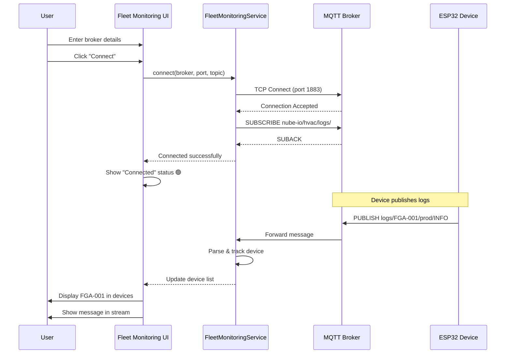
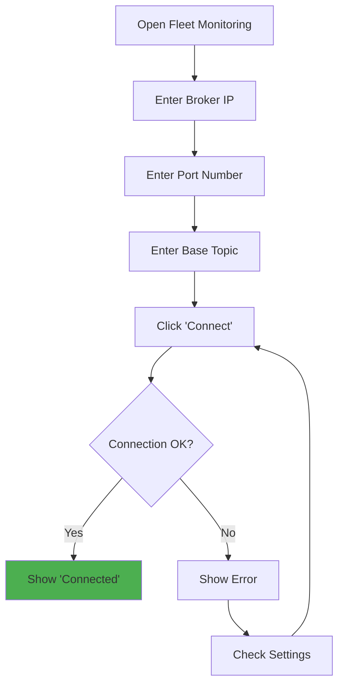
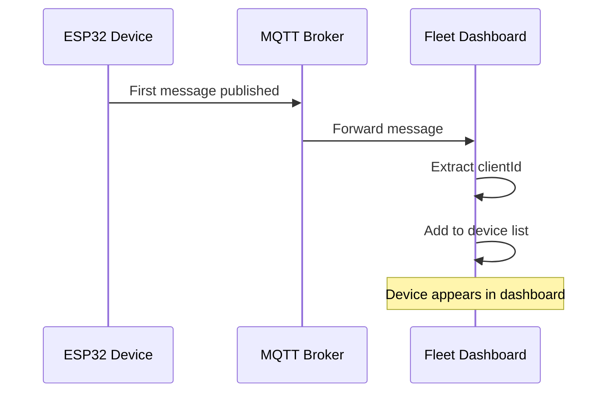
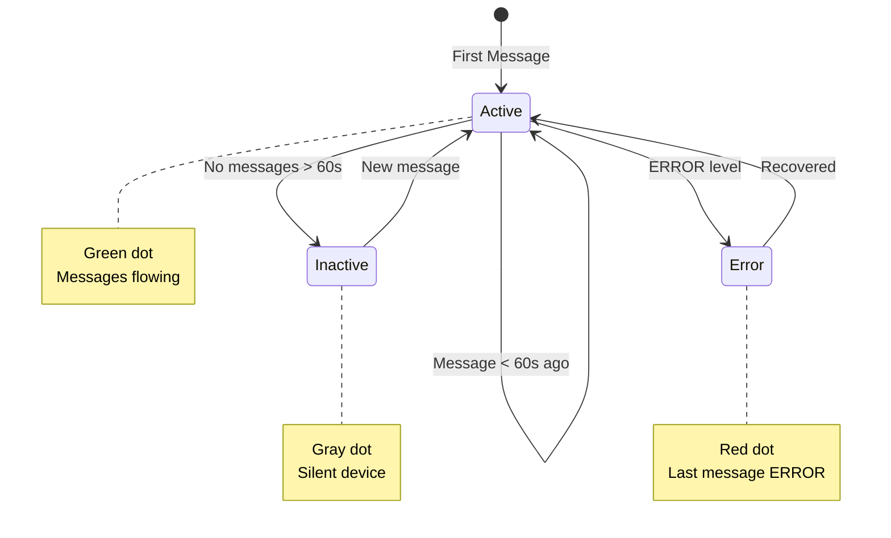

# Fleet Monitoring - User Guide

## Table of Contents
1. [Getting Started](#getting-started)
2. [Prerequisites](#prerequisites)
3. [Connecting to MQTT Broker](#connecting-to-mqtt-broker)
4. [Monitoring Devices](#monitoring-devices)
5. [Filtering Messages](#filtering-messages)
6. [Fleet Dashboard](#fleet-dashboard)
7. [Common Workflows](#common-workflows)
8. [Best Practices](#best-practices)
9. [Tips & Tricks](#tips--tricks)

---

## Getting Started

### Prerequisites

**Software Requirements:**
- ✅ Application with Fleet Monitoring feature enabled
- ✅ Network access to MQTT broker
- ✅ MQTT broker running (Mosquitto, HiveMQ, or cloud service)

**Network Requirements:**
- TCP port 1883 (MQTT) or 8883 (MQTTS) accessible
- Firewall rules allowing outbound connections
- Stable network connection (WiFi or Ethernet)

**Optional:**
- MQTT client for testing (MQTT Explorer, mosquitto_sub)
- Device firmware with MQTT logging enabled

---

## Prerequisites

### MQTT Broker Setup

#### Option 1: Local Mosquitto Broker (Development)

**Windows:**
```powershell
# Download Mosquitto from https://mosquitto.org/download/
# Run installer

# Start broker
cd "C:\Program Files\mosquitto"
.\mosquitto.exe -v

# Expected output:
# mosquitto version 2.0.15 starting
# Opening ipv4 listen socket on port 1883.
```

**Linux:**
```bash
# Install Mosquitto
sudo apt-get install mosquitto mosquitto-clients

# Start broker
sudo systemctl start mosquitto
sudo systemctl enable mosquitto

# Verify
sudo systemctl status mosquitto
```

#### Option 2: Cloud MQTT Broker

**HiveMQ Cloud (Free Tier):**
1. Sign up at https://www.hivemq.com/mqtt-cloud-broker/
2. Create cluster
3. Note broker URL and port
4. Configure credentials

**Example:**
```
Broker: your-cluster.hivemq.cloud
Port: 8883 (TLS)
Username: your_username
Password: your_password
```

---

## Connecting to MQTT Broker

### Step 1: Open Fleet Monitoring Tab

1. Launch the application
2. Navigate to **Fleet Monitoring** tab
3. UI shows connection configuration form

### Connection Sequence



### Step 2: Enter Broker Details



**Connection Form:**
```
Field: MQTT Broker
Value: 192.168.1.100
Note: IP address or hostname

Field: MQTT Port
Value: 1883
Note: Default MQTT port

Field: Base Topic
Value: nube-io/hvac/logs/#
Note: Topic pattern with wildcard
```

### Step 3: Click "Connect"

```
Status: Connecting to 192.168.1.100:1883...
Progress: Establishing connection...
Duration: 2-5 seconds

Expected Result:
✓ Connected to MQTT broker
✓ Subscribed to nube-io/hvac/logs/#
✓ Waiting for messages...
```

### Connection Indicators

| Indicator | Status | Description |
|-----------|--------|-------------|
| 🟢 Green | Connected | Broker reachable, subscribed |
| 🟡 Yellow | Connecting | Establishing connection |
| 🔴 Red | Disconnected | Connection failed or lost |
| 🔵 Blue | Reconnecting | Auto-reconnect in progress |

---

## Monitoring Devices

### Device Discovery

**Automatic Detection:**


Devices automatically appear when they publish their first message.

### Device List View

**Device Table Columns:**

| Column | Description | Example |
|--------|-------------|---------|
| **Client ID** | Unique device identifier | FGA-001 |
| **Environment** | Deployment environment | production |
| **First Seen** | Initial detection time | 2024-01-15 10:00:00 |
| **Last Seen** | Most recent message | 2024-01-15 14:32:10 |
| **Messages** | Total message count | 1,523 |
| **Status** | Device health | 🟢 Active |

### Device Status Indicators



---

## Filtering Messages

### Filter by Device

**Single Device View:**
```
1. Click on device row in device list
2. Message view filters to show only that device
3. Click "Show All" to reset filter
```

**Example:**
```
Filter: FGA-001
Messages: 234 (filtered from 1,523 total)

[FGA-001] 14:32:10 INFO: Temperature reading: 22.5°C
[FGA-001] 14:32:11 INFO: Humidity: 45%
[FGA-001] 14:32:12 DEBUG: MQTT publish success
```

### Filter by Log Level

**Level Selection:**
```
☐ DEBUG   - Detailed debugging information
☑ INFO    - General informational messages
☑ WARN    - Warning conditions
☑ ERROR   - Error conditions
☐ FATAL   - Critical failures
```

**Use Cases:**
- **Production Monitoring**: Enable INFO, WARN, ERROR only
- **Debugging**: Enable all levels including DEBUG
- **Alert Monitoring**: Enable ERROR and FATAL only

### Filter by Environment

**Environment Dropdown:**
```
[ All Environments ▼ ]
  ├─ production
  ├─ staging
  ├─ development
  └─ testing
```

Select specific environment to view only devices in that category.

### Filter by Time Range

```
From: [2024-01-15 00:00:00]
To:   [2024-01-15 23:59:59]

[Apply Filter]
```

Shows messages within specified time window.

### Search Text Filter

```
Search: [temperature______] 🔍

Results:
[FGA-001] 14:32:10 INFO: Temperature reading: 22.5°C
[FGA-002] 14:32:15 INFO: Temperature sensor OK
[FGA-003] 14:32:20 WARN: Temperature sensor timeout
```

Search is case-insensitive and searches within message content.

---

## Fleet Dashboard

### Dashboard Overview

```
╔═══════════════════════════════════════════════════════════╗
║ Fleet Monitoring Dashboard                                ║
╠═══════════════════════════════════════════════════════════╣
║ Status: 🟢 Connected to 192.168.1.100:1883               ║
║ Topic: nube-io/hvac/logs/#                                ║
╠═══════════════════════════════════════════════════════════╣
║ Fleet Statistics                                          ║
║   Total Devices: 12                                       ║
║   Active: 10  Inactive: 2  Error: 0                      ║
║   Total Messages: 15,234 (last 1 hour)                   ║
║   Message Rate: 4.2 msg/sec                               ║
╠═══════════════════════════════════════════════════════════╣
║ Device List                                               ║
║ ┌─────────┬──────────┬────────────┬───────────┬────────┐ ║
║ │ ID      │ Env      │ Last Seen  │ Messages  │ Status │ ║
║ ├─────────┼──────────┼────────────┼───────────┼────────┤ ║
║ │ FGA-001 │ prod     │ 2s ago     │ 1,523     │ 🟢     │ ║
║ │ FGA-002 │ prod     │ 5s ago     │ 1,402     │ 🟢     │ ║
║ │ FGA-003 │ staging  │ 1m ago     │ 234       │ 🟡     │ ║
║ └─────────┴──────────┴────────────┴───────────┴────────┘ ║
╠═══════════════════════════════════════════════════════════╣
║ Recent Messages                                           ║
║ [FGA-001] 14:32:10 INFO: Temperature: 22.5°C             ║
║ [FGA-002] 14:32:11 INFO: Device boot complete            ║
║ [FGA-001] 14:32:12 DEBUG: MQTT publish OK                ║
║ [FGA-003] 14:32:13 WARN: WiFi signal weak                ║
║ [FGA-002] 14:32:14 INFO: Sensor calibration done         ║
╚═══════════════════════════════════════════════════════════╝
```

### Dashboard Sections

**1. Connection Status Bar**
- Broker connection indicator
- Current subscription topic
- Reconnect button (if disconnected)

**2. Fleet Statistics Panel**
- Total device count
- Active/Inactive/Error breakdown
- Message count and rate
- Data refresh every 2 seconds

**3. Device List Table**
- Sortable by any column
- Click row to filter messages
- Right-click for device menu

**4. Message Stream**
- Real-time scrolling messages
- Color-coded by log level
- Auto-scroll toggle
- Export to CSV button

---

## Common Workflows

### Workflow 1: Monitor Production Fleet

**Scenario:** Monitor 50 deployed devices in production

**Steps:**
1. Connect to production MQTT broker
   ```
   Broker: 192.168.1.100
   Port: 1883
   Topic: nube-io/hvac/logs/+/production/#
   ```

2. Configure filters
   ```
   Levels: INFO, WARN, ERROR (disable DEBUG)
   Environment: production
   ```

3. Monitor dashboard
   - Check device count (should be 50)
   - Review error rate (target: < 1% of messages)
   - Watch for inactive devices

4. Alert on errors
   - Filter to ERROR level only
   - Export error logs for analysis

**Expected:**
- All 50 devices appear within 5 minutes
- Message rate: 10-50 msg/sec
- No inactive devices

---

### Workflow 2: Debug Specific Device

**Scenario:** Troubleshoot FGA-001 reporting errors

**Steps:**
1. Filter to single device
   ```
   Click on "FGA-001" row in device list
   ```

2. Enable all log levels
   ```
   ☑ DEBUG
   ☑ INFO
   ☑ WARN
   ☑ ERROR
   ```

3. Clear message buffer
   ```
   Click "Clear Messages" button
   ```

4. Observe real-time logs
   ```
   [FGA-001] 14:32:10 DEBUG: WiFi connecting...
   [FGA-001] 14:32:11 DEBUG: WiFi connected, IP: 192.168.1.50
   [FGA-001] 14:32:12 INFO: MQTT connecting...
   [FGA-001] 14:32:13 ERROR: MQTT connection failed
   [FGA-001] 14:32:14 DEBUG: Retry in 5 seconds...
   ```

5. Identify issue
   - MQTT connection failing
   - Check broker accessibility from device
   - Verify credentials

6. Export logs
   ```
   Click "Export Logs" → Save as fga-001-debug.csv
   ```

**Time to Resolution:** 5-10 minutes

---

### Workflow 3: Fleet Health Check

**Scenario:** Daily health check of all deployed devices

**Steps:**
1. Connect to fleet broker

2. Run health report
   ```
   Fleet Statistics:
   - Total: 50 devices
   - Active (< 60s): 48 (96%)
   - Inactive (> 60s): 2 (4%)
   - Errors: 1 device reporting ERROR
   ```

3. Investigate inactive devices
   ```
   FGA-015: Last seen 5 minutes ago
   FGA-023: Last seen 2 minutes ago
   
   Action: Check physical connections
   ```

4. Review error devices
   ```
   FGA-042: [ERROR] Sensor timeout
   
   Action: Replace sensor or recalibrate
   ```

5. Export daily report
   ```
   Date: 2024-01-15
   Uptime: 96%
   Issues: 3 (2 inactive, 1 error)
   Status: Good
   ```

**Frequency:** Daily at 9:00 AM

---

## Best Practices

### ✅ DO

1. **Use Specific Topics for Production**
   ```
   nube-io/hvac/logs/+/production/#
   ```
   Avoid mixing development and production logs.

2. **Monitor Device Activity**
   - Set up alerts for devices going inactive
   - Expected heartbeat: 1 message per minute minimum

3. **Filter Appropriately**
   - Production: INFO, WARN, ERROR
   - Development: All levels including DEBUG

4. **Export Logs Regularly**
   - Daily exports for analysis
   - Keep logs for compliance or debugging

5. **Check Connection Status**
   - Green indicator = healthy
   - Yellow/Red = investigate immediately

### ❌ DON'T

1. **Don't Leave DEBUG Enabled in Production**
   - Clutters logs
   - Slows performance
   - Use INFO level for production

2. **Don't Ignore Inactive Devices**
   - May indicate connectivity issues
   - Could be hardware failure

3. **Don't Subscribe to Overly Broad Topics**
   - `#` subscribes to ALL topics on broker
   - May receive unrelated messages

4. **Don't Ignore Error Messages**
   - ERROR level indicates actual problems
   - Investigate promptly

5. **Don't Forget to Disconnect**
   - Close connection when done
   - Frees broker resources

---

## Tips & Tricks

### 1. Custom Topic Filters

**Create focused views:**
```javascript
// All errors from any device
Topic: nube-io/hvac/logs/+/+/ERROR

// Specific environment
Topic: nube-io/hvac/logs/+/staging/#

// Single device all levels
Topic: nube-io/hvac/logs/FGA-001/#
```

### 2. Message Rate Monitoring

**Detect anomalies:**
- Normal rate: 1-10 msg/sec per device
- High rate (> 50 msg/sec): May indicate error loop
- Low rate (< 1 msg/min): Device may be idle or disconnected

### 3. Export and Analyze

**Export to CSV for analysis:**
```csv
Timestamp,ClientID,Environment,Level,Message
2024-01-15T14:32:10.123Z,FGA-001,production,INFO,"Temperature: 22.5°C"
2024-01-15T14:32:11.456Z,FGA-002,production,WARN,"WiFi signal weak"
```

**Import into Excel/Python for:**
- Error rate calculation
- Device availability statistics
- Trend analysis

### 4. Quick Device Search

**Keyboard shortcut:**
- Press `/` to focus search box
- Type device ID or keyword
- Press `Enter` to apply filter

### 5. Auto-Refresh Control

**Toggle auto-scroll:**
- Enable: Messages scroll automatically
- Disable: Freeze to review specific message

**Useful when:**
- High message rate makes reading difficult
- Need to copy specific message content

### 6. Color-Coded Levels

**Visual cues:**
- 🔵 DEBUG: Blue
- 🟢 INFO: Green
- 🟡 WARN: Yellow
- 🔴 ERROR: Red
- ⚫ FATAL: Black

Quick visual scan identifies problems.

---

## Summary

✅ **Prerequisites** - MQTT broker and network access  
✅ **Connecting** - 3-step broker connection process  
✅ **Monitoring** - Auto-discovery and real-time device tracking  
✅ **Filtering** - By device, level, environment, time, text  
✅ **Dashboard** - Fleet overview with statistics  
✅ **Workflows** - Production monitoring, debugging, health checks  
✅ **Best Practices** - Appropriate filtering, log exports, alerts  
✅ **Tips & Tricks** - Advanced filtering, analysis, shortcuts  

**Quick Start:**  
1. Connect to broker (IP + port + topic)  
2. Devices auto-appear as they publish  
3. Filter messages as needed  
4. Monitor dashboard for fleet health  
5. Export logs for analysis  

For troubleshooting, see [Troubleshooting.md](Troubleshooting.md). For API details, see [SourceCode.md](SourceCode.md).
