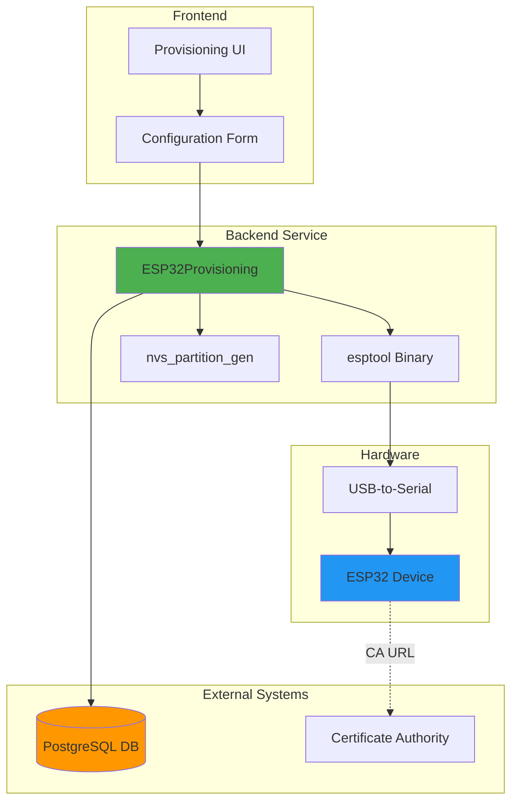
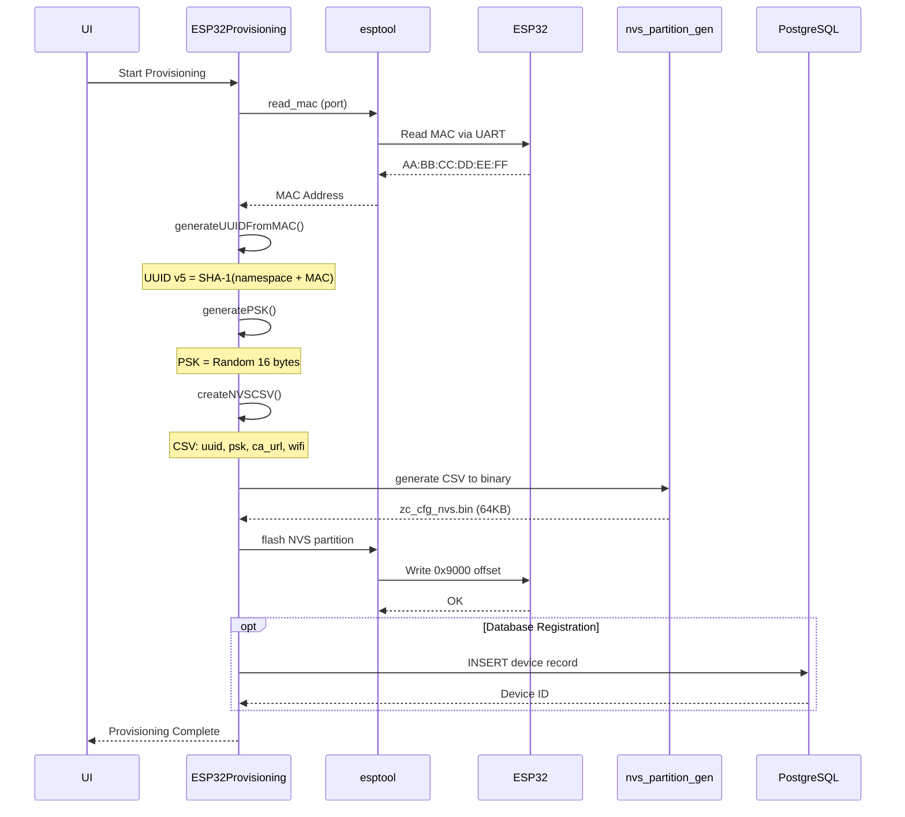
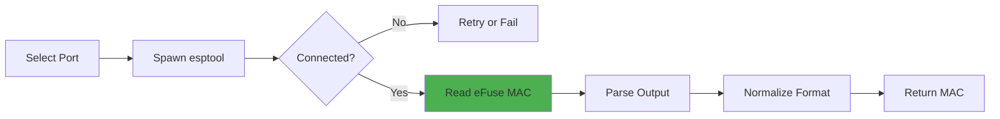
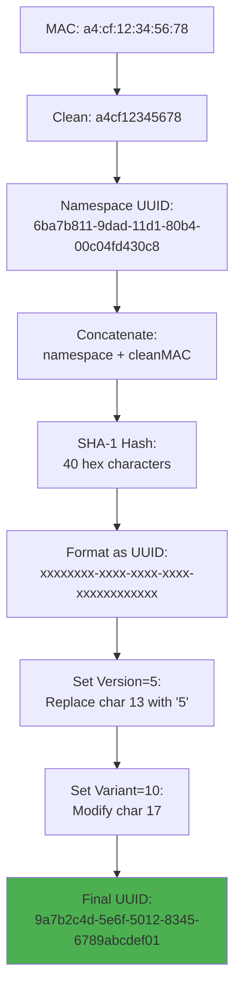
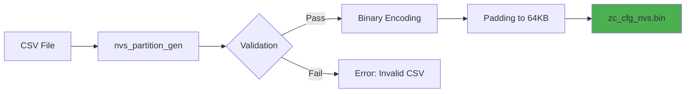
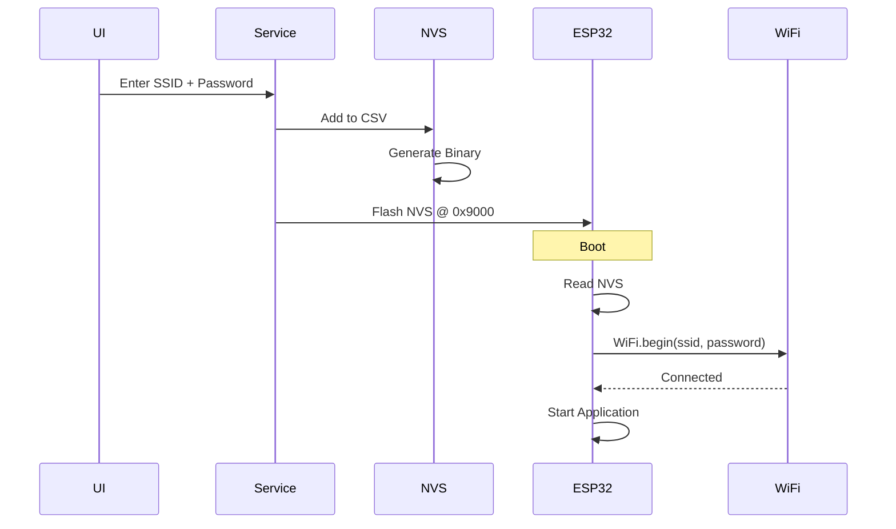
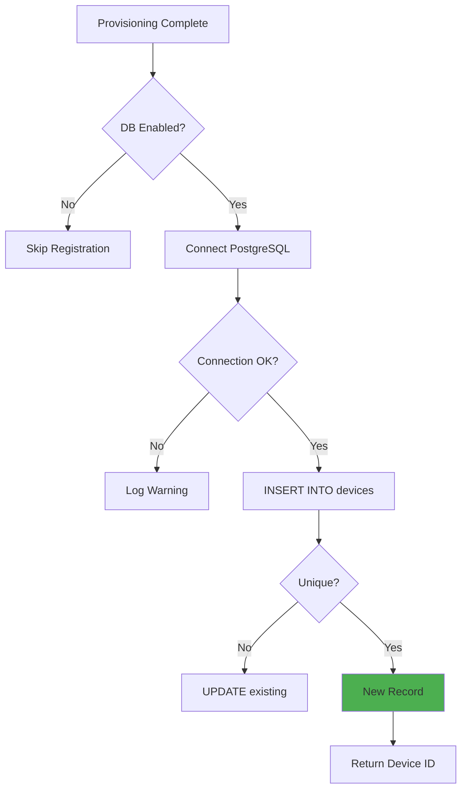
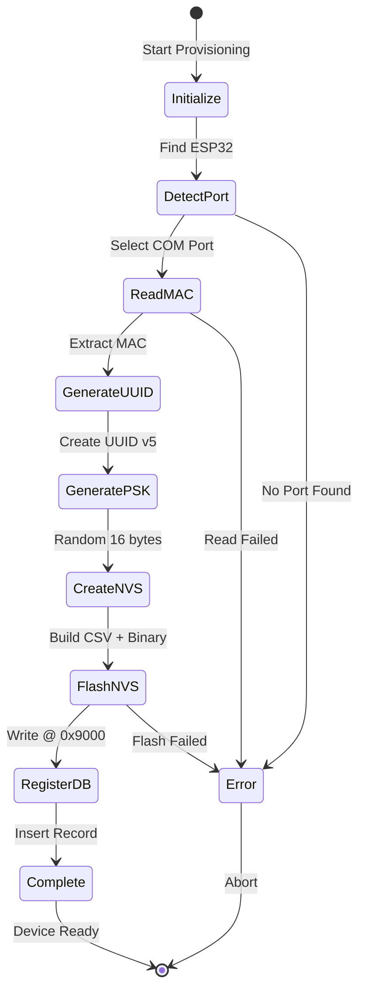

# Provisioning - Overview

## Table of Contents
1. [Introduction](#introduction)
2. [Architecture Overview](#architecture-overview)
3. [MAC Address Reading](#mac-address-reading)
4. [UUID Generation](#uuid-generation)
5. [PSK Generation](#psk-generation)
6. [NVS Partition](#nvs-partition)
7. [WiFi Credential Provisioning](#wifi-credential-provisioning)
8. [Database Integration](#database-integration)
9. [Complete Workflow](#complete-workflow)
10. [Performance Metrics](#performance-metrics)

---

## Introduction

The **Provisioning** feature provides a complete workflow for preparing ESP32 devices for deployment:
- Reading unique MAC addresses from ESP32 hardware
- Generating device UUIDs (Universally Unique Identifiers)
- Creating Pre-Shared Keys (PSK) for secure authentication
- Building NVS (Non-Volatile Storage) partitions with configuration
- Flashing WiFi credentials to devices
- Optional database registration for fleet management

**Key Technologies:**
- **esptool**: Python-based ESP32 flashing utility (read_mac command)
- **nvs_partition_gen**: ESP-IDF tool for creating NVS binary images
- **UUID v5**: SHA-1 based UUID generation from MAC address
- **PostgreSQL**: Optional database for device registration
- **SerialPort**: Node.js library for serial communication

**Use Cases:**
- 🏭 **Factory Provisioning**: Prepare devices before shipment
- 🔧 **Field Deployment**: Configure WiFi credentials on-site
- 🔐 **Security Setup**: Generate and flash cryptographic keys
- 📊 **Fleet Registration**: Track devices in central database

---

## Architecture Overview

### System Component Diagram



### Provisioning Flow Sequence



---

## MAC Address Reading

### Overview

Every ESP32 has a factory-programmed **6-byte MAC address** stored in eFuse. This MAC address is globally unique and used as the basis for device identification.

**MAC Address Structure:**
```
AA:BB:CC:DD:EE:FF
│  │  │  │  │  └─ Device-specific byte 6
│  │  │  │  └──── Device-specific byte 5
│  │  │  └─────── Device-specific byte 4
│  │  └────────── Espressif OUI byte 3
│  └───────────── Espressif OUI byte 2
└──────────────── Espressif OUI byte 1

Example: a4:cf:12:34:56:78
         └─OUI──┘ └─Device─┘
```

**Espressif OUI (Organizationally Unique Identifier):**
- Common prefixes: `30:AE:A4`, `24:0A:C4`, `C4:4F:33`, `A4:CF:12`
- Registered to Espressif Systems

### esptool read_mac Command

```bash
# Read MAC address
esptool --chip esp32 --port COM3 read_mac

# Output example:
# esptool.py v4.5.1
# Serial port COM3
# Connecting....
# Detecting chip type... ESP32
# Chip is ESP32-D0WDQ6 (revision 1)
# Features: WiFi, BT, Dual Core, 240MHz, VRef calibration in efuse, Coding Scheme None
# Crystal is 40MHz
# MAC: a4:cf:12:34:56:78    <- Extracted
# Uploading stub...
# Running stub...
# Stub running...
# MAC: a4:cf:12:34:56:78
# Hard resetting via RTS pin...
```

### Implementation Details

**Process Flow:**


**Parsing Logic:**
```javascript
// esptool output contains:
// "MAC: a4:cf:12:34:56:78"

const macMatch = output.match(/MAC:\s*([0-9A-Fa-f:]{17})/);
if (macMatch) {
    const mac = macMatch[1].toLowerCase().replace(/-/g, ':');
    return mac; // "a4:cf:12:34:56:78"
}
```

---

## UUID Generation

### UUID v5 Algorithm

The service generates **UUIDv5** (SHA-1 based) from the MAC address for deterministic, reproducible device identification.

**UUID v5 Structure:**
```
xxxxxxxx-xxxx-5xxx-yxxx-xxxxxxxxxxxx
│        │    │    │    └──────────── Random bits from hash
│        │    │    └───────────────── Variant bits (10)
│        │    └────────────────────── Version (5)
│        └─────────────────────────── Time-based or random
└──────────────────────────────────── Namespace hash
```

### Algorithm Steps



### Example Calculation

**Input:**
- MAC: `a4:cf:12:34:56:78`
- Namespace (URL): `6ba7b811-9dad-11d1-80b4-00c04fd430c8`

**Process:**
```
Step 1: Clean MAC
  a4:cf:12:34:56:78 → a4cf12345678

Step 2: Concatenate
  namespace_bytes + mac_bytes

Step 3: SHA-1 Hash
  SHA1("6ba7b8119dad11d180b400c04fd430c8a4cf12345678")
  = 9a7b2c4d5e6f012345636789abcdef0123456789

Step 4: Format UUID
  9a7b2c4d-5e6f-0123-4536-6789abcdef01

Step 5: Set Version (5)
  9a7b2c4d-5e6f-5123-4536-6789abcdef01
                 ^--- version 5

Step 6: Set Variant (10)
  9a7b2c4d-5e6f-5123-8536-6789abcdef01
                      ^--- variant 10xx (binary)

Final UUID: 9a7b2c4d-5e6f-5123-8536-6789abcdef01
```

**Benefits of UUID v5:**
- ✅ **Deterministic**: Same MAC always produces same UUID
- ✅ **Collision-resistant**: SHA-1 provides strong uniqueness
- ✅ **Reproducible**: Can regenerate UUID if MAC is known
- ✅ **Standard**: RFC 4122 compliant

---

## PSK Generation

### Pre-Shared Key

The **PSK (Pre-Shared Key)** is a 32-character hexadecimal string (16 bytes) used for device authentication with backend services.

**Generation:**
```javascript
crypto.randomBytes(16).toString('hex');
// Result: "a3f2e1d0c9b8a7f6e5d4c3b2a1098765"
```

**Properties:**
- **Length**: 128 bits (16 bytes) = 32 hex characters
- **Entropy**: Cryptographically secure random
- **Format**: Lowercase hexadecimal
- **Storage**: Stored in NVS partition, transmitted to CA server

**Example PSK:**
```
PSK: 7d8e9f0a1b2c3d4e5f6a7b8c9d0e1f2a
     └─────── 16 bytes = 128 bits ──────┘
```

---

## NVS Partition

### Non-Volatile Storage Structure

The **NVS (Non-Volatile Storage)** partition stores key-value pairs that persist across device resets.

**Partition Layout:**
```
Flash Memory (4MB ESP32)
├── 0x0000   - Bootloader (32 KB)
├── 0x8000   - Partition Table (4 KB)
├── 0x9000   - NVS Partition (64 KB) ← Provisioning data here
├── 0x19000  - OTA Data (8 KB)
├── 0x20000  - Application (1.5 MB)
└── 0x390000 - SPIFFS/FAT (remaining)
```

### NVS CSV Format

Input file for `nvs_partition_gen`:

```csv
key,type,encoding,value
zc,namespace,,
global_uuid,data,string,9a7b2c4d-5e6f-5123-8536-6789abcdef01
psk_secret,data,string,7d8e9f0a1b2c3d4e5f6a7b8c9d0e1f2a
ca_service_url,data,string,https://ca.example.com:8443
wifi_ssid,data,string,FactoryWiFi
wifi_password,data,string,SecurePassword123
```

**Field Descriptions:**

| Field | Description |
|-------|-------------|
| `key` | Variable name (max 15 chars) |
| `type` | `namespace`, `data`, `file`, or `uint8` |
| `encoding` | `string`, `u8`, `i32`, etc. |
| `value` | Actual data (strings, numbers) |

### Binary Generation



**Binary Structure:**
- **Page Size**: 4096 bytes
- **Pages per Partition**: 16 (64 KB / 4 KB)
- **Entry Format**: TLV (Type-Length-Value)
- **CRC**: Each page has CRC32 checksum

**NVS Binary Layout:**
```
Page 0 (4 KB)
├── Page Header (32 bytes)
│   ├── Magic (0xFEDA)
│   ├── Version
│   ├── State
│   └── Sequence Number
├── Entry 1: Namespace "zc"
├── Entry 2: global_uuid
├── Entry 3: psk_secret
├── Entry 4: ca_service_url
├── Entry 5: wifi_ssid
├── Entry 6: wifi_password
└── Free space (padded with 0xFF)
```

---

## WiFi Credential Provisioning

### WiFi Configuration Flow



### Supported WiFi Modes

| Mode | Description | Use Case |
|------|-------------|----------|
| **Static Credentials** | SSID + password in NVS | Factory default WiFi |
| **Runtime Config** | Provision via web portal | Field deployment |
| **WPS** | WiFi Protected Setup | Consumer devices |
| **SmartConfig** | Mobile app provisioning | IoT products |

**Static Provisioning (Tool Method):**
```csv
wifi_ssid,data,string,OfficeNetwork
wifi_password,data,string,P@ssw0rd!2024
```

**ESP32 Firmware Reads:**
```cpp
#include "nvs_flash.h"
#include "nvs.h"

nvs_handle_t nvs_handle;
nvs_open("zc", NVS_READONLY, &nvs_handle);

char ssid[32];
char password[64];
size_t ssid_len = sizeof(ssid);
size_t pass_len = sizeof(password);

nvs_get_str(nvs_handle, "wifi_ssid", ssid, &ssid_len);
nvs_get_str(nvs_handle, "wifi_password", password, &pass_len);

WiFi.begin(ssid, password);
```

---

## Database Integration

### PostgreSQL Schema

**Device Registration Table:**
```sql
CREATE TABLE devices (
    id SERIAL PRIMARY KEY,
    global_uuid VARCHAR(36) UNIQUE NOT NULL,
    mac_address VARCHAR(17) NOT NULL,
    psk_secret VARCHAR(32) NOT NULL,
    ca_service_url VARCHAR(255),
    wifi_ssid VARCHAR(32),
    provisioned_at TIMESTAMP DEFAULT CURRENT_TIMESTAMP,
    firmware_version VARCHAR(20),
    hardware_revision VARCHAR(10),
    location VARCHAR(100),
    status VARCHAR(20) DEFAULT 'provisioned'
);

CREATE INDEX idx_devices_uuid ON devices(global_uuid);
CREATE INDEX idx_devices_mac ON devices(mac_address);
CREATE INDEX idx_devices_status ON devices(status);
```

### Insertion Flow



**Example Query:**
```javascript
const query = `
    INSERT INTO devices (
        global_uuid, mac_address, psk_secret, 
        ca_service_url, wifi_ssid, firmware_version
    )
    VALUES ($1, $2, $3, $4, $5, $6)
    ON CONFLICT (global_uuid) 
    DO UPDATE SET 
        psk_secret = EXCLUDED.psk_secret,
        provisioned_at = CURRENT_TIMESTAMP
    RETURNING id;
`;

const result = await client.query(query, [
    uuid, mac, psk, caUrl, wifiSSID, firmwareVersion
]);
const deviceId = result.rows[0].id;
```

---

## Complete Workflow

### End-to-End Provisioning



### Workflow Steps Detail

**1. Initialization**
- Check esptool and nvs_partition_gen binaries
- Extract to temp directory
- Verify executability (chmod +x on Linux)

**2. Port Detection**
- List all serial ports via SerialPort.list()
- Filter by USB vendor ID (common: CP210x, CH340, FTDI)
- Display to user for selection

**3. MAC Address Reading**
- Spawn esptool with `--chip esp32 --port COMX read_mac`
- Parse stdout for "MAC: XX:XX:XX:XX:XX:XX"
- Normalize format (lowercase, colons)
- Retry 3 times on failure

**4. UUID Generation**
- Clean MAC (remove colons): `a4cf12345678`
- Apply UUID v5 algorithm with URL namespace
- Validate format: `xxxxxxxx-xxxx-5xxx-yxxx-xxxxxxxxxxxx`

**5. PSK Generation**
- Use crypto.randomBytes(16) for secure random
- Convert to hex string (32 characters)
- Store for database and NVS

**6. NVS Creation**
- Build CSV with all key-value pairs
- Spawn nvs_partition_gen
- Generate 64 KB binary (0x10000 bytes)
- Verify file size

**7. NVS Flashing**
- Spawn esptool with `write_flash 0x9000 zc_cfg_nvs.bin`
- Monitor progress (0-100%)
- Verify flash with read_flash (optional)

**8. Database Registration** (Optional)
- Connect to PostgreSQL
- Execute INSERT with device details
- Handle conflicts (UPDATE on duplicate UUID)
- Close connection

**9. Completion**
- Display success message with UUID and MAC
- Log provisioning record
- Cleanup temporary files

---

## Performance Metrics

### Timing Analysis

| Step | Duration | Notes |
|------|----------|-------|
| Port Detection | 0.5-1s | Depends on USB enumeration |
| MAC Reading | 2-5s | Includes ESP32 connection |
| UUID Generation | <10ms | SHA-1 computation |
| PSK Generation | <1ms | Random byte generation |
| CSV Creation | <5ms | File write operation |
| NVS Binary Generation | 0.5-1s | Python script execution |
| NVS Flashing | 3-7s | 64 KB @ 115200-921600 baud |
| Database Insert | 50-200ms | Network + DB latency |
| **Total** | **8-15s** | Complete provisioning |

### Throughput Comparison

**Baud Rate Impact on NVS Flash:**

| Baud Rate | 64 KB Flash Time | Recommended |
|-----------|------------------|-------------|
| 115200 | ~7s | Default, most compatible |
| 460800 | ~3s | Fast, some adapters |
| 921600 | ~2s | Fastest, may have errors |

**Batch Provisioning:**
```
Single Device: ~12s
10 Devices: ~120s (2 minutes)
100 Devices: ~1200s (20 minutes)
```

### Resource Usage

**Disk Space:**
- esptool binary: ~15 MB (Windows), ~5 MB (Linux)
- nvs_partition_gen: ~2 MB
- Temporary NVS files: ~100 KB per device

**Memory:**
- Service footprint: ~50 MB RAM
- esptool process: ~30 MB
- nvs_partition_gen: ~20 MB

---

## Summary

✅ **MAC Address Reading** - esptool read_mac extracts unique identifier  
✅ **UUID Generation** - Deterministic UUID v5 from MAC via SHA-1  
✅ **PSK Generation** - Cryptographically secure 128-bit keys  
✅ **NVS Partition** - CSV-to-binary tool creates 64 KB configuration  
✅ **WiFi Provisioning** - Static credentials embedded in NVS  
✅ **Database Integration** - PostgreSQL registration for fleet management  
✅ **Complete Workflow** - 8-step process taking 8-15 seconds  
✅ **Performance** - Baud rate optimization, batch processing support  

**Key Files:**
- `services/esp32-provisioning.js` - Backend service
- `embedded/esptool-binaries/` - Platform-specific binaries
- `embedded/nvs-binaries/` - nvs_partition_gen tools
- `pages/ProvisioningPage.js` - Frontend UI

**Next Steps:**  
See [UserGuide.md](UserGuide.md) for step-by-step instructions and [SourceCode.md](SourceCode.md) for API reference.
