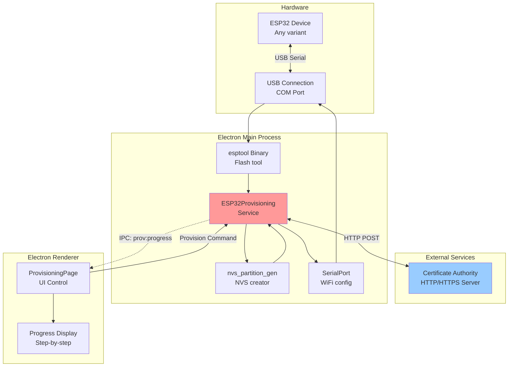

# Provisioning - ESP32 Device Provisioning & WiFi Configuration

**Feature:** Provisioning (Security & WiFi Setup)  
**Purpose:** Generate credentials, create NVS partition, provision ESP32 devices  
**Status:** Core feature - Always enabled  
**Last Updated:** December 9, 2025

---

## 📋 Overview

The **Provisioning** feature provides complete ESP32 device provisioning workflow including UUID/PSK generation from MAC address, NVS partition creation, firmware flashing, and automatic WiFi configuration. This is essential for secure device deployment in IoT applications.

### Key Capabilities

- 🔐 **Credential Generation** - Auto-generate UUID and PSK from MAC
- 📡 **MAC Address Reading** - Extract MAC from device
- 💾 **NVS Partition Creation** - Generate NVS binary with credentials
- ⚡ **Automated Flashing** - Flash NVS to device
- 📶 **WiFi Configuration** - Auto-configure WiFi via serial
- 🌐 **CA Integration** - Register device with Certificate Authority
- 🎯 **All ESP32 Chips** - ESP32, S2, S3, C2, C3, C6, H2

---

## 🚀 Quick Start

### 1. Connect ESP32

**Hardware:**
1. Connect ESP32 to PC via USB
2. Device should enumerate as COM port
3. Ensure device has firmware with provisioning support

### 2. Configure Settings

**Required Settings:**
- **Serial Port:** Select COM port
- **Chip Type:** Auto-detect or select manually
- **WiFi SSID:** Network name (mandatory)
- **WiFi Password:** Network password (mandatory)
- **CA URL:** Certificate Authority server URL

**Optional Settings:**
- Custom UUID (leave empty for auto-generation)
- Custom PSK (leave empty for auto-generation)
- NVS offset/size (use defaults)

### 3. Run Provisioning

1. Click **🚀 Provision Device** button
2. Workflow runs automatically:
   - Read MAC address from device
   - Generate UUID from MAC
   - Generate random PSK
   - Register with CA server (get certificate)
   - Create NVS partition with credentials + WiFi
   - Flash NVS to device
   - Configure WiFi via serial commands
3. Wait for completion (~60 seconds)
4. Device ready with WiFi and security configured

---

## 🏗️ Architecture

### System Overview



### Component Diagram

```mermaid
graph LR
    subgraph UI Components
        PORTSELECT[Port Selector<br/>COM port dropdown]
        CHIPSELECT[Chip Type<br/>Auto-detect]
        WIFIINPUT[WiFi Credentials<br/>SSID + Password]
        CAURL[CA URL Input<br/>Server address]
        PROVISION[Provision Button<br/>Start workflow]
        PROGRESSPANEL[Progress Panel<br/>Step display]
        RESULT[Result Display<br/>UUID, PSK, Status]
    end
    
    subgraph State
        CONFIG[Provisioning Config<br/>port, chip, WiFi, CA]
        MACADDR[MAC Address<br/>Read from device]
        UUID[Generated UUID<br/>From MAC]
        PSK[Generated PSK<br/>Random 32 bytes]
        CERTIFICATE[Device Certificate<br/>From CA]
    end
    
    subgraph Services
        MACREADER[MAC Reader<br/>esptool read_mac]
        UUIDGEN[UUID Generator<br/>SHA256(MAC)]
        PSKGEN[PSK Generator<br/>crypto.randomBytes]
        CAAPI[CA API Client<br/>HTTP POST]
        NVSBUILDER[NVS Builder<br/>CSV → Binary]
        FLASHER[NVS Flasher<br/>esptool write_flash]
        WIFICONFIG[WiFi Configurator<br/>Serial AT commands]
    end
    
    PORTSELECT --> CONFIG
    WIFIINPUT --> CONFIG
    CAURL --> CONFIG
    PROVISION --> MACREADER
    PROGRESSPANEL --> CONFIG
    
    MACREADER --> MACADDR
    MACADDR --> UUIDGEN
    UUIDGEN --> UUID
    PSKGEN --> PSK
    UUID --> CAAPI
    PSK --> CAAPI
    CAAPI --> CERTIFICATE
    UUID --> NVSBUILDER
    PSK --> NVSBUILDER
    CONFIG --> NVSBUILDER
    NVSBUILDER --> FLASHER
    FLASHER --> WIFICONFIG
    
    style NVSBUILDER fill:#ffcc99
    style CAAPI fill:#99ff99
```

---

## 🎮 Features

### MAC Address Reading

**Process:**
1. Connect to device via serial
2. Execute `esptool read_mac` command
3. Extract MAC address from output
4. Format as 12 hex digits (e.g., `A0B1C2D3E4F5`)

**MAC Address Types:**
- Station MAC (WiFi client) - Most common
- SoftAP MAC (WiFi access point)
- Bluetooth MAC
- Ethernet MAC (ESP32 with Ethernet)

**Used For:**
- UUID generation (unique device ID)
- Device identification
- Network tracking

### UUID Generation

**Algorithm:**
```javascript
// Generate UUID from MAC address
function generateUUID(macAddress) {
  // Format: XXXXXXXX-XXXX-XXXX-XXXX-XXXXXXXXXXXX
  // Use SHA256 hash of MAC for deterministic UUID
  const hash = crypto.createHash('sha256')
    .update(macAddress)
    .digest('hex');
  
  // Format as UUID v4 style
  const uuid = [
    hash.substring(0, 8),
    hash.substring(8, 12),
    '4' + hash.substring(13, 16), // Version 4
    hash.substring(16, 20),
    hash.substring(20, 32)
  ].join('-');
  
  return uuid;
}
```

**Example:**
```
MAC:  A0B1C2D3E4F5
UUID: 3a7f5b21-c4d9-4e8f-a1b2-3c4d5e6f7890
```

**Properties:**
- Deterministic (same MAC → same UUID)
- Unique per device
- Reproducible (can recalculate if lost)

### PSK Generation

**Pre-Shared Key (PSK):**
```javascript
// Generate random 32-byte PSK
function generatePSK() {
  // Cryptographically secure random bytes
  const psk = crypto.randomBytes(32).toString('hex');
  return psk; // 64 hex characters
}
```

**Example:**
```
PSK: 3f7a9c2e5b8d4f1a6c9e2b7d5f8a3c6e9b1d4f7a2c5e8b1d4f7a3c6e9b2d5f8a
```

**Properties:**
- Cryptographically random
- 256-bit security
- Used for TLS/DTLS connections
- Stored securely in NVS

### NVS Partition Creation

**NVS (Non-Volatile Storage):**
- Key-value storage in ESP32 flash
- Encrypted storage option available
- Survives firmware updates

**NVS Keys Written:**
```csv
key,type,encoding,value
deviceprovisioning,namespace,,
uuid,data,string,<generated UUID>
psk,data,string,<generated PSK>
device_cert,data,string,<CA certificate>
wifi_ssid,data,string,<WiFi SSID>
wifi_password,data,string,<WiFi password>
```

**NVS Binary Generation:**
1. Create CSV file with key-value pairs
2. Run `nvs_partition_gen` tool
3. Generate binary file (default: 64KB)
4. Flash to device at specified offset

**Default Flash Layout:**
```
0xA20000 - NVS partition (64KB)
Size: 0x10000 (configurable)
```

### WiFi Auto-Configuration

**Post-Flash Configuration:**
After NVS flashing, device WiFi configured via serial:

**AT Commands Sent:**
```
AT+WIFI_SSID=<SSID>
AT+WIFI_PASSWORD=<password>
AT+WIFI_CONNECT
AT+REBOOT
```

**Process:**
1. Open serial connection to device
2. Send WiFi SSID command
3. Send WiFi password command
4. Send connect command
5. Wait for connection confirmation
6. Reboot device
7. Device boots with WiFi enabled

### CA Integration

**Certificate Authority Registration:**

**API Endpoint:**
```
POST http://ca-server:8080/api/devices/register
Content-Type: application/json

{
  "uuid": "3a7f5b21-c4d9-4e8f-a1b2-3c4d5e6f7890",
  "psk": "3f7a9c2e5b8d4f1a6c9e2b7d5f8a3c6e9b1d4f7a2c5e8b1d4f7a3c6e9b2d5f8a",
  "mac": "A0B1C2D3E4F5",
  "type": "esp32s3"
}
```

**CA Response:**
```json
{
  "success": true,
  "certificate": "-----BEGIN CERTIFICATE-----\n...\n-----END CERTIFICATE-----",
  "ca_cert": "-----BEGIN CERTIFICATE-----\n...\n-----END CERTIFICATE-----",
  "expiry": "2026-12-09T00:00:00Z"
}
```

**Certificate Storage:**
- Device certificate stored in NVS
- Used for TLS authentication
- Expires after configurable period

---

## 💻 User Interface

### Configuration Panel

```
┌─────────────────────────────────────────────────┐
│ ESP32 Device Provisioning                       │
├─────────────────────────────────────────────────┤
│                                                 │
│  📱 Device Configuration                        │
│  ┌───────────────────────────────────────────┐  │
│  │ Port: [COM3 ▼]  [🔄]  [🔍 Detect]        │  │
│  │ Chip: [ESP32-S3 ▼]  Baud: [921600 ▼]     │  │
│  └───────────────────────────────────────────┘  │
│                                                 │
│  🔐 NVS Configuration                           │
│  ┌───────────────────────────────────────────┐  │
│  │ Offset: [0xA20000]  Size: [0x10000]      │  │
│  │ CA URL: [http://ca-server:8080]  [Test]  │  │
│  └───────────────────────────────────────────┘  │
│                                                 │
│  🔑 Credentials (Optional Override)             │
│  ┌───────────────────────────────────────────┐  │
│  │ UUID: [Auto-generate from MAC]           │  │
│  │ PSK:  [Auto-generate random]             │  │
│  └───────────────────────────────────────────┘  │
│                                                 │
│  📶 WiFi Configuration (Required)               │
│  ┌───────────────────────────────────────────┐  │
│  │ SSID:     [MyNetwork]         *           │  │
│  │ Password: [••••••••••]  [👁️]  *           │  │
│  │                                           │  │
│  │ ℹ️ WiFi credentials will be stored in     │  │
│  │    NVS and auto-configured after flash    │  │
│  └───────────────────────────────────────────┘  │
│                                                 │
│  [🚀 Provision Device]                          │
│                                                 │
│  ▓▓▓▓▓▓▓▓▓▓░░░░░░░░░░ 50%                      │
│  Registering with CA server...                  │
│                                                 │
└─────────────────────────────────────────────────┘
```

### Results Panel (After Completion)

```
┌─────────────────────────────────────────────────┐
│ ✅ Provisioning Complete!                       │
├─────────────────────────────────────────────────┤
│                                                 │
│  📱 Device Information                          │
│  ┌───────────────────────────────────────────┐  │
│  │ MAC Address: A0:B1:C2:D3:E4:F5           │  │
│  │ Chip Type:   ESP32-S3                     │  │
│  └───────────────────────────────────────────┘  │
│                                                 │
│  🔑 Generated Credentials                       │
│  ┌───────────────────────────────────────────┐  │
│  │ UUID: 3a7f5b21-c4d9-4e8f-a1b2-...        │  │
│  │       [📋 Copy]                           │  │
│  │ PSK:  3f7a9c2e5b8d4f1a6c9e2b7d...        │  │
│  │       [📋 Copy]                           │  │
│  └───────────────────────────────────────────┘  │
│                                                 │
│  📶 WiFi Status                                 │
│  ┌───────────────────────────────────────────┐  │
│  │ SSID:      MyNetwork                      │  │
│  │ Status:    ✅ Connected                   │  │
│  │ IP:        192.168.1.150                  │  │
│  └───────────────────────────────────────────┘  │
│                                                 │
│  [📄 Save Credentials to File]                  │
│                                                 │
└─────────────────────────────────────────────────┘
```

---

## 🎯 Common Tasks

### Task 1: Provision New Device

**Scenario:** Fresh ESP32, need full setup

**Procedure:**
1. Connect ESP32 via USB
2. Select COM port
3. Detect chip type (auto)
4. Enter WiFi credentials:
   - SSID: `ProductionWiFi`
   - Password: `SecurePass123`
5. Verify CA URL: `http://ca-server:8080`
6. Click **🚀 Provision Device**
7. Wait for workflow completion (~60 seconds)
8. Save credentials to file

**Result:**
- Device has UUID and PSK
- Device has CA certificate
- Device connected to WiFi
- Device ready for secure communication

---

### Task 2: Re-provision Device (Change WiFi)

**Scenario:** Device provisioned, but need different WiFi

**Procedure:**
1. Connect device
2. Enter new WiFi credentials
3. **Disable:** "Include credentials" (keep existing UUID/PSK)
4. **Enable:** "Configure WiFi" (update WiFi only)
5. Click **🚀 Provision Device**
6. Only WiFi updated, credentials preserved

---

### Task 3: Custom UUID/PSK

**Scenario:** External system provides UUID/PSK

**Procedure:**
1. Connect device
2. Detect chip type
3. Enter WiFi credentials
4. **Override Credentials:**
   - Custom UUID: `12345678-1234-1234-1234-123456789012`
   - Custom PSK: `0123456789abcdef...` (64 hex chars)
5. Click **🚀 Provision Device**
6. Device provisioned with custom credentials

**Use Case:**
- Migrating from different provisioning system
- External device management platform
- Pre-assigned device identities

---

### Task 4: Production Line Provisioning

**Setup:**
1. Configure WiFi once (production network)
2. Set CA URL
3. Prepare device tracking spreadsheet

**Per Device:**
1. Connect device
2. Click **🚀 Provision Device**
3. Wait for completion
4. Record UUID and MAC in spreadsheet
5. Physically label device with UUID
6. Disconnect device
7. Repeat

**Optimization:**
- Use barcode scanner for MAC tracking
- Automated label printing
- Database integration for UUID storage

---

## 🐛 Troubleshooting

### Issue: Can't Read MAC Address

**Symptoms:**
- "Failed to read MAC" error
- Timeout during MAC read
- Provisioning fails at first step

**Solutions:**

**1. Check USB Connection**
- Verify COM port is correct
- Try different USB cable
- Check Device Manager (Windows)

**2. Verify Chip Type**
- Auto-detect chip first
- Or manually select correct chip
- Some chips need specific baud rates

**3. Enter Boot Mode**
- Hold BOOT button
- Press RESET briefly
- Release BOOT
- Try MAC read again

**4. Try Lower Baud Rate**
- Change from 921600 → 115200
- Some devices/cables unreliable at high speeds

---

### Issue: CA Registration Failed

**Symptoms:**
- "CA server unreachable" error
- HTTP timeout
- Certificate not received

**Solutions:**

**1. Test CA Connection**
- Click **Test** button next to CA URL
- Should show "✅ CA server reachable"
- If fails, check network connectivity

**2. Verify CA URL**
```
Correct:   http://128.199.170.214:8080
Incorrect: http://128.199.170.214:8080/ (trailing slash may fail)
Incorrect: https://... (if server doesn't support HTTPS)
```

**3. Check Firewall**
- Allow outbound HTTP/HTTPS
- Corporate firewall may block
- Try from different network

**4. Verify CA Server Status**
```bash
# Test with curl
curl -X POST http://ca-server:8080/api/devices/register \
  -H "Content-Type: application/json" \
  -d '{"uuid":"test","psk":"test","mac":"000000000000","type":"esp32"}'
```

---

### Issue: NVS Flash Failed

**Symptoms:**
- "Flash failed" error
- Flashing times out
- NVS not written

**Solutions:**

**1. Check Flash Offset**
- Verify offset matches firmware partition table
- Default: 0xA20000
- Check `partitions.csv` in firmware project

**2. Verify Flash Size**
- NVS size must fit in partition
- Default: 64KB (0x10000)
- Large credentials may need bigger partition

**3. Erase Flash First**
```bash
# Use ESP32 Flasher to erase entire flash
# Then retry provisioning
```

**4. Check Flash Permissions**
- Some firmware has flash protection
- May need to disable protection first
- Or use firmware with writable NVS partition

---

### Issue: WiFi Configuration Failed

**Symptoms:**
- Provisioning completes but device can't connect to WiFi
- "WiFi config timeout" error
- Device not on network

**Solutions:**

**1. Verify WiFi Credentials**
- SSID correct (case-sensitive)
- Password correct
- Network is 2.4GHz (ESP32 doesn't support 5GHz)

**2. Check Firmware Support**
- Firmware must support serial WiFi configuration
- Must implement AT+WIFI_SSID and AT+WIFI_PASSWORD commands
- Or configure WiFi from NVS data

**3. Manual Configuration**
- Use Serial Console
- Send commands manually:
  ```
  AT+WIFI_SSID=MyNetwork
  AT+WIFI_PASSWORD=MyPassword
  AT+WIFI_CONNECT
  ```

**4. Check WiFi Signal**
- Device must be in range
- Strong signal required during provisioning
- Move closer to router

---

## 📚 Code References

**Main Files:**
- `renderer/pages/ProvisioningPage.js` - UI control (578 lines)
- `services/esp32-provisioning.js` - Provisioning logic (1313 lines)
- `embedded/esptool-binaries/` - esptool for flashing
- `embedded/nvs-binaries/` - nvs_partition_gen tool
- `main.js` - IPC handlers for provisioning

**Key Methods:**
- `ESP32Provisioning.readMACAddress(port, chip)` - Read MAC
- `ESP32Provisioning.generateUUID(mac)` - Generate UUID
- `ESP32Provisioning.generatePSK()` - Generate PSK
- `ESP32Provisioning.registerWithCA(uuid, psk, mac)` - CA API
- `ESP32Provisioning.createNVSPartition(data)` - Create NVS
- `ESP32Provisioning.flashNVS(port, nvsPath, offset)` - Flash
- `ESP32Provisioning.configureWiFi(port, ssid, password)` - WiFi setup

**IPC Channels:**
- `prov:provision-device` - Start provisioning
- `prov:read-mac` - Read MAC address
- `prov:detect-chip` - Detect chip type
- `prov:test-ca` - Test CA connection
- `prov:progress` - Progress updates (main → renderer)
- `prov:complete` - Provisioning complete (main → renderer)
- `prov:error` - Provisioning error (main → renderer)

---

## 🔗 Related Features

- **ESP32 Flasher** - Flash firmware before provisioning
- **Serial Console** - Monitor WiFi connection
- **UDP Logs** - Debug provisioning issues
- **Factory Testing** - Test provisioned devices

---

## 📝 Best Practices

### For Production

1. **Flash firmware first** - Then provision
2. **Use production WiFi** - Pre-configured for all devices
3. **Record UUID/MAC** - Database or spreadsheet
4. **Label devices** - Physical label with UUID
5. **Test connectivity** - Verify WiFi connection before shipping

### For Development

1. **Use test CA server** - Don't pollute production CA
2. **Save test credentials** - For debugging
3. **Manual WiFi config** - Faster than full reprovisioning
4. **Monitor serial output** - Use Serial Console during provision
5. **Keep CA logs** - Track all device registrations

### For Security

1. **Protect PSK** - Store encrypted
2. **Secure CA server** - Use HTTPS in production
3. **Rotate certificates** - Implement expiry and renewal
4. **Audit provisioning** - Log all operations
5. **Limit CA access** - Firewall and authentication

---

## 🎓 Learning Resources

**ESP32 NVS:**
- [ESP-IDF NVS Documentation](https://docs.espressif.com/projects/esp-idf/en/latest/esp32/api-reference/storage/nvs_flash.html)
- [NVS Partition Generator](https://docs.espressif.com/projects/esp-idf/en/latest/esp32/api-reference/storage/nvs_partition_gen.html)

**Device Provisioning:**
- [IoT Device Provisioning Best Practices](https://aws.amazon.com/blogs/iot/device-provisioning-for-iot/)
- [Secure Device Onboarding](https://www.micrium.com/iot/device-provisioning/)

**Related Documentation:**
- [Main Documentation Index](../../README.md)
- [ESP32 Flasher](../esp32-flasher/README.md)
- [Serial Console](../serial-console/README.md)
- [Factory Testing](../factory-testing/README.md)

---

## 📄 File Listing

**This Feature's Documentation:**
- [README.md](./README.md) - This file (overview)
- [Provisioning-Overview.md](./Provisioning-Overview.md) - Technical deep dive
- [Provisioning-UserGuide.md](./Provisioning-UserGuide.md) - Detailed procedures
- [Provisioning-SourceCode.md](./Provisioning-SourceCode.md) - Developer documentation
- [Provisioning-Troubleshooting.md](./Provisioning-Troubleshooting.md) - Problem solving

---

**Last Updated:** December 9, 2025  
**Status:** ✅ Core Feature - Always Available  
**Next:** Read [Provisioning-UserGuide.md](./Provisioning-UserGuide.md) for step-by-step provisioning
