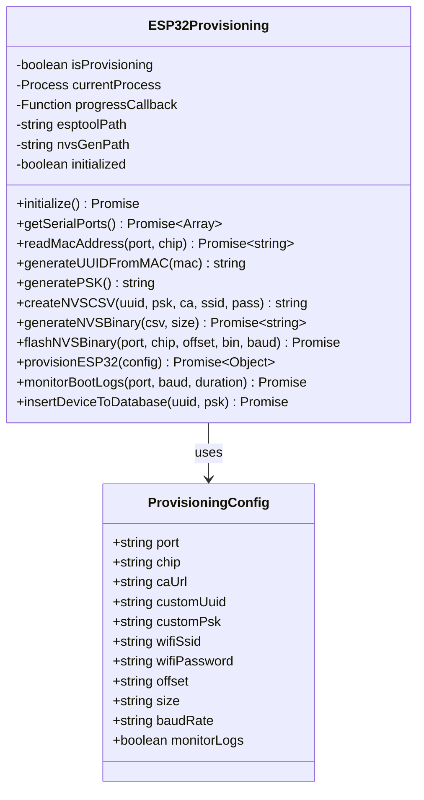

# Provisioning - Source Code Documentation

## Table of Contents
1. [Architecture](#architecture)
2. [ESP32Provisioning Class](#esp32provisioning-class)
3. [Initialization](#initialization)
4. [MAC Address Operations](#mac-address-operations)
5. [UUID and PSK Generation](#uuid-and-psk-generation)
6. [NVS Management](#nvs-management)
7. [Database Integration](#database-integration)
8. [Complete Provisioning Workflow](#complete-provisioning-workflow)
9. [Code Examples](#code-examples)
10. [Testing Guide](#testing-guide)

---

## Architecture

### Class Diagram



---

## ESP32Provisioning Class

**Location:** `services/esp32-provisioning.js`

### Constructor

```javascript
class ESP32Provisioning {
    constructor() {
        this.isProvisioning = false;
        this.currentProcess = null;
        this.progressCallback = null;
        this.esptoolPath = null;
        this.nvsGenPath = null;
        this.initialized = false;
    }
}
```

### Properties

| Property | Type | Description |
|----------|------|-------------|
| `isProvisioning` | `boolean` | Provisioning operation active flag |
| `currentProcess` | `ChildProcess` | Active esptool/nvs_gen process |
| `progressCallback` | `Function` | Progress update callback |
| `esptoolPath` | `string` | Path to esptool binary |
| `nvsGenPath` | `string` | Path to nvs_partition_gen |
| `initialized` | `boolean` | Service initialized successfully |

---

## Initialization

### initialize()

Prepares the provisioning service by extracting binaries to temporary directory.

**Signature:**
```javascript
async initialize(): Promise<Object>
```

**Returns:**
```javascript
{
    success: true
}
```

**Implementation:**
```javascript
async initialize() {
    const platform = os.platform();
    const esptoolDir = path.join(os.tmpdir(), 'fga-simulator-esptool');
    
    // Create temp directory
    if (!fs.existsSync(esptoolDir)) {
        fs.mkdirSync(esptoolDir, { recursive: true });
    }
    
    // Platform-specific binary selection
    let esptoolBinaryName, esptoolSourcePath;
    if (platform === 'win32') {
        esptoolBinaryName = 'esptool.exe';
        esptoolSourcePath = path.join(
            __dirname, 
            '../embedded/esptool-binaries/windows', 
            esptoolBinaryName
        );
        this.esptoolPath = path.join(esptoolDir, esptoolBinaryName);
    } else {
        esptoolBinaryName = 'esptool';
        esptoolSourcePath = path.join(
            __dirname, 
            '../embedded/esptool-binaries/linux', 
            esptoolBinaryName
        );
        this.esptoolPath = path.join(esptoolDir, esptoolBinaryName);
    }
    
    // Copy binary if needed
    if (fs.existsSync(esptoolSourcePath)) {
        const shouldCopy = !fs.existsSync(this.esptoolPath) ||
            fs.statSync(esptoolSourcePath).mtime > fs.statSync(this.esptoolPath).mtime;
        
        if (shouldCopy) {
            fs.copyFileSync(esptoolSourcePath, this.esptoolPath);
            
            // Make executable (Unix)
            if (platform !== 'win32') {
                fs.chmodSync(this.esptoolPath, 0o755);
            }
        }
    } else {
        throw new Error(`esptool binary not found at: ${esptoolSourcePath}`);
    }
    
    // Similar logic for nvs_partition_gen...
    
    this.initialized = true;
    return { success: true };
}
```

---

## MAC Address Operations

### readMacAddress()

Reads 6-byte MAC address from ESP32 eFuse.

**Signature:**
```javascript
async readMacAddress(port: string, chip: string = 'esp32'): Promise<string>
```

**Parameters:**
- `port`: Serial port (`COM3`, `/dev/ttyUSB0`)
- `chip`: ESP chip type (`'esp32'`, `'esp32s2'`, `'esp32c3'`)

**Returns:** MAC address string (e.g., `"a4:cf:12:34:56:78"`)

**Implementation:**
```javascript
async readMacAddress(port, chip = 'esp32') {
    return new Promise((resolve, reject) => {
        if (!fs.existsSync(this.esptoolPath)) {
            reject(new Error('esptool binary not found'));
            return;
        }
        
        const args = ['--chip', chip, '--port', port, 'read_mac'];
        const cmd = spawn(this.esptoolPath, args);
        
        let output = '';
        let errorOutput = '';
        
        cmd.stdout.on('data', (data) => {
            output += data.toString();
        });
        
        cmd.stderr.on('data', (data) => {
            errorOutput += data.toString();
        });
        
        cmd.on('close', (code) => {
            if (code === 0) {
                // Parse: "MAC: a4:cf:12:34:56:78"
                const macMatch = output.match(/MAC:\s*([0-9A-Fa-f:]{17})/);
                if (macMatch) {
                    const mac = macMatch[1].toLowerCase().replace(/-/g, ':');
                    resolve(mac);
                } else {
                    reject(new Error(`Could not parse MAC: ${output}`));
                }
            } else {
                reject(new Error(`Failed to read MAC: ${errorOutput || output}`));
            }
        });
        
        cmd.on('error', (error) => {
            reject(new Error(`esptool error: ${error.message}`));
        });
    });
}
```

---

## UUID and PSK Generation

### generateUUIDFromMAC()

Creates deterministic UUID v5 from MAC address.

**Signature:**
```javascript
generateUUIDFromMAC(macAddress: string): string
```

**Parameters:**
- `macAddress`: MAC in format `"a4:cf:12:34:56:78"`

**Returns:** UUID v5 string (e.g., `"9a7b2c4d-5e6f-5123-8536-6789abcdef01"`)

**Implementation:**
```javascript
generateUUIDFromMAC(macAddress) {
    const cleanMAC = macAddress.toLowerCase().replace(/:/g, '');
    
    // UUID v5 namespace (URL)
    const namespace = '6ba7b811-9dad-11d1-80b4-00c04fd430c8';
    
    // SHA-1 hash
    const hash = crypto.createHash('sha1');
    hash.update(namespace + cleanMAC);
    const hashBytes = hash.digest();
    
    // Format as UUID
    const uuid = [
        hashBytes.slice(0, 4).toString('hex'),
        hashBytes.slice(4, 6).toString('hex'),
        hashBytes.slice(6, 8).toString('hex'),
        hashBytes.slice(8, 10).toString('hex'),
        hashBytes.slice(10, 16).toString('hex')
    ].join('-');
    
    // Set version (5) and variant (10)
    const parts = uuid.split('-');
    parts[2] = '5' + parts[2].substring(1); // Version 5
    parts[3] = (parseInt(parts[3][0], 16) & 0x3 | 0x8).toString(16) + parts[3].substring(1); // Variant
    
    return parts.join('-');
}
```

### generatePSK()

Creates cryptographically secure random PSK.

**Signature:**
```javascript
generatePSK(): string
```

**Returns:** 32-character hex string (e.g., `"7d8e9f0a1b2c3d4e5f6a7b8c9d0e1f2a"`)

**Implementation:**
```javascript
generatePSK() {
    return crypto.randomBytes(16).toString('hex');
}
```

---

## NVS Management

### createNVSCSV()

Builds CSV file for nvs_partition_gen input.

**Signature:**
```javascript
createNVSCSV(
    globalUUID: string,
    pskSecret: string,
    caUrl: string,
    wifiSSID: string = '',
    wifiPassword: string = ''
): string
```

**Returns:** Path to created CSV file

**Implementation:**
```javascript
createNVSCSV(globalUUID, pskSecret, caUrl, wifiSSID = '', wifiPassword = '') {
    const csvPath = path.join(os.tmpdir(), 'zc_seed.csv');
    
    let content = 'key,type,encoding,value\r\n';
    content += 'zc,namespace,,\r\n';
    content += `global_uuid,data,string,${globalUUID}\r\n`;
    content += `psk_secret,data,string,${pskSecret}\r\n`;
    content += `ca_service_url,data,string,${caUrl}\r\n`;
    
    if (wifiSSID) {
        content += `wifi_ssid,data,string,${wifiSSID}\r\n`;
        if (wifiPassword) {
            content += `wifi_password,data,string,${wifiPassword}\r\n`;
        }
    }
    
    fs.writeFileSync(csvPath, content, 'utf8');
    console.log(`Created NVS CSV: ${csvPath}`);
    
    return csvPath;
}
```

### generateNVSBinary()

Converts CSV to binary NVS partition.

**Signature:**
```javascript
async generateNVSBinary(csvPath: string, size: string = '0x10000'): Promise<string>
```

**Parameters:**
- `csvPath`: Path to CSV file
- `size`: Partition size in hex (default: `'0x10000'` = 64 KB)

**Returns:** Path to generated `.bin` file

**Implementation:**
```javascript
async generateNVSBinary(csvPath, size = '0x10000') {
    return new Promise((resolve, reject) => {
        const binPath = path.join(os.tmpdir(), 'zc_cfg_nvs.bin');
        
        // Remove existing binary
        if (fs.existsSync(binPath)) {
            fs.unlinkSync(binPath);
        }
        
        if (!fs.existsSync(this.nvsGenPath)) {
            reject(new Error(`nvs_partition_gen not found at: ${this.nvsGenPath}`));
            return;
        }
        
        const args = ['generate', csvPath, binPath, size];
        const cmd = spawn(this.nvsGenPath, args);
        
        let output = '';
        
        cmd.stdout.on('data', (data) => {
            output += data.toString();
            console.log('[nvs_gen]', data.toString().trim());
        });
        
        cmd.stderr.on('data', (data) => {
            console.log('[nvs_gen]', data.toString().trim());
        });
        
        cmd.on('close', (code) => {
            if (code === 0 && fs.existsSync(binPath)) {
                console.log(`✓ NVS binary generated: ${binPath}`);
                resolve(binPath);
            } else {
                reject(new Error(`nvs_partition_gen failed: ${output}`));
            }
        });
        
        cmd.on('error', (error) => {
            reject(new Error(`nvs_gen error: ${error.message}`));
        });
    });
}
```

### flashNVSBinary()

Flashes NVS partition to ESP32.

**Signature:**
```javascript
async flashNVSBinary(
    port: string,
    chip: string,
    offset: string,
    binPath: string,
    baudRate: string = '921600'
): Promise<void>
```

**Parameters:**
- `port`: Serial port
- `chip`: ESP chip type
- `offset`: Flash offset (e.g., `'0x9000'`)
- `binPath`: Path to `.bin` file
- `baudRate`: Baud rate (default: `'921600'`)

---

## Complete Provisioning Workflow

### provisionESP32()

Executes complete provisioning sequence.

**Signature:**
```javascript
async provisionESP32(config: ProvisioningConfig): Promise<Object>
```

**Config Object:**
```javascript
{
    port: 'COM3',              // Serial port
    chip: 'esp32',             // Chip type
    caUrl: 'https://ca.example.com:8443',  // CA URL
    customUuid: '',            // Optional custom UUID
    customPsk: '',             // Optional custom PSK
    wifiSsid: 'OfficeNetwork', // Optional WiFi SSID
    wifiPassword: 'password',  // Optional WiFi password
    offset: '0x9000',          // NVS flash offset
    size: '0x10000',           // NVS size (64 KB)
    baudRate: '921600',        // Flash baud rate
    monitorLogs: true          // Monitor boot logs
}
```

**Returns:**
```javascript
{
    success: true,
    message: 'Provisioning completed successfully',
    macAddress: 'a4:cf:12:34:56:78',
    globalUUID: '9a7b2c4d-5e6f-5123-8536-6789abcdef01',
    presharedSecret: '7d8e9f0a1b2c3d4e5f6a7b8c9d0e1f2a',
    caUrl: 'https://ca.example.com:8443',
    stage: 'complete',
    bootLogs: [...],           // Boot log lines
    extendedLogs: [...]        // Extended log lines
}
```

**Workflow Implementation:**
```javascript
async provisionESP32(config) {
    const result = { success: false, stage: 'starting' };
    
    try {
        // Step 1: Read MAC
        result.stage = 'mac_read';
        result.macAddress = await this.readMacAddress(config.port, config.chip);
        await this.waitForPortRelease(500);
        
        // Step 2: Generate UUID
        result.stage = 'uuid_gen';
        result.globalUUID = config.customUuid || 
            this.generateUUIDFromMAC(result.macAddress);
        
        // Step 3: Generate PSK
        result.stage = 'psk_gen';
        result.presharedSecret = config.customPsk || this.generatePSK();
        
        // Step 4: Create NVS
        result.stage = 'nvs_create';
        const csvPath = this.createNVSCSV(
            result.globalUUID,
            result.presharedSecret,
            config.caUrl,
            config.wifiSsid,
            config.wifiPassword
        );
        
        const binPath = await this.generateNVSBinary(csvPath, config.size);
        
        // Step 5: Flash NVS
        result.stage = 'nvs_flash';
        await this.flashNVSBinary(
            config.port,
            config.chip,
            config.offset,
            binPath,
            config.baudRate
        );
        
        // Cleanup
        fs.unlinkSync(csvPath);
        fs.unlinkSync(binPath);
        
        // Step 6: Monitor boot logs
        result.stage = 'boot_monitor';
        await this.waitForPortRelease(1000);
        const bootResult = await this.monitorBootLogs(config.port, 115200, 5000);
        result.bootLogs = bootResult.logs;
        
        // Step 7: Database insert
        result.stage = 'db_insert';
        try {
            await this.insertDeviceToDatabase(result.globalUUID, result.presharedSecret);
        } catch (dbError) {
            console.error('Database insert failed:', dbError);
        }
        
        // Complete
        result.stage = 'complete';
        result.success = true;
        result.message = 'Provisioning completed successfully';
        
        return result;
    } catch (error) {
        result.success = false;
        result.message = error.message;
        throw error;
    }
}
```

---

## Code Examples

### Example 1: Basic Provisioning

```javascript
const ESP32Provisioning = require('./services/esp32-provisioning');

async function provisionDevice() {
    const service = new ESP32Provisioning();
    
    // Initialize
    await service.initialize();
    
    // Provision
    const result = await service.provisionESP32({
        port: 'COM3',
        chip: 'esp32',
        caUrl: 'https://ca.production.com:8443'
    });
    
    if (result.success) {
        console.log('✓ Provisioning Complete');
        console.log('MAC:', result.macAddress);
        console.log('UUID:', result.globalUUID);
    }
}

provisionDevice().catch(console.error);
```

### Example 2: Provisioning with WiFi

```javascript
async function provisionWithWiFi() {
    const service = new ESP32Provisioning();
    await service.initialize();
    
    const result = await service.provisionESP32({
        port: '/dev/ttyUSB0',
        chip: 'esp32',
        caUrl: 'https://ca.example.com:8443',
        wifiSsid: 'OfficeNetwork',
        wifiPassword: 'SecurePassword123'
    });
    
    console.log('Device provisioned with WiFi credentials');
    console.log('UUID:', result.globalUUID);
}
```

### Example 3: Batch Provisioning

```javascript
async function batchProvision(ports) {
    const service = new ESP32Provisioning();
    await service.initialize();
    
    const results = [];
    
    for (const port of ports) {
        console.log(`\n=== Provisioning ${port} ===`);
        
        try {
            const result = await service.provisionESP32({
                port,
                chip: 'esp32',
                caUrl: 'https://ca.production.com:8443'
            });
            
            results.push({
                port,
                success: true,
                uuid: result.globalUUID,
                mac: result.macAddress
            });
            
            console.log(`✓ ${port} provisioned`);
        } catch (error) {
            results.push({ port, success: false, error: error.message });
            console.error(`✗ ${port} failed:`, error.message);
        }
    }
    
    // Summary
    const successful = results.filter(r => r.success).length;
    console.log(`\n=== Batch Complete: ${successful}/${ports.length} ===`);
    
    return results;
}

batchProvision(['COM3', 'COM4', 'COM5']).catch(console.error);
```

---

## Testing Guide

### Unit Tests

```javascript
const ESP32Provisioning = require('./services/esp32-provisioning');
const assert = require('assert');

describe('ESP32Provisioning', () => {
    let service;
    
    beforeEach(async () => {
        service = new ESP32Provisioning();
        await service.initialize();
    });
    
    describe('generateUUIDFromMAC()', () => {
        it('should generate valid UUID v5', () => {
            const mac = 'a4:cf:12:34:56:78';
            const uuid = service.generateUUIDFromMAC(mac);
            
            // Check format
            assert.match(uuid, /^[0-9a-f]{8}-[0-9a-f]{4}-5[0-9a-f]{3}-[89ab][0-9a-f]{3}-[0-9a-f]{12}$/);
            
            // Check deterministic
            const uuid2 = service.generateUUIDFromMAC(mac);
            assert.strictEqual(uuid, uuid2);
        });
        
        it('should produce different UUIDs for different MACs', () => {
            const uuid1 = service.generateUUIDFromMAC('a4:cf:12:34:56:78');
            const uuid2 = service.generateUUIDFromMAC('a4:cf:12:34:56:79');
            assert.notStrictEqual(uuid1, uuid2);
        });
    });
    
    describe('generatePSK()', () => {
        it('should generate 32-character hex string', () => {
            const psk = service.generatePSK();
            assert.strictEqual(psk.length, 32);
            assert.match(psk, /^[0-9a-f]{32}$/);
        });
        
        it('should generate unique PSKs', () => {
            const psk1 = service.generatePSK();
            const psk2 = service.generatePSK();
            assert.notStrictEqual(psk1, psk2);
        });
    });
    
    describe('createNVSCSV()', () => {
        it('should create valid CSV file', () => {
            const uuid = '9a7b2c4d-5e6f-5123-8536-6789abcdef01';
            const psk = '7d8e9f0a1b2c3d4e5f6a7b8c9d0e1f2a';
            const ca = 'https://ca.test.com:8443';
            
            const csvPath = service.createNVSCSV(uuid, psk, ca);
            
            assert(fs.existsSync(csvPath));
            const content = fs.readFileSync(csvPath, 'utf8');
            assert(content.includes(uuid));
            assert(content.includes(psk));
            assert(content.includes(ca));
        });
    });
});
```

---

## Summary

✅ **Architecture** - ESP32Provisioning class structure  
✅ **Initialization** - Binary extraction and setup  
✅ **MAC Operations** - esptool read_mac integration  
✅ **UUID/PSK** - Deterministic UUID v5 and secure PSK generation  
✅ **NVS Management** - CSV creation, binary generation, flashing  
✅ **Database** - PostgreSQL device registration  
✅ **Complete Workflow** - 7-step provisioning process  
✅ **Code Examples** - Basic, WiFi, and batch provisioning  
✅ **Testing** - Unit tests for UUID and PSK generation  

**Key Methods:**

| Method | Purpose |
|--------|---------|
| `initialize()` | Extract binaries to temp directory |
| `readMacAddress()` | Read MAC via esptool |
| `generateUUIDFromMAC()` | Create deterministic UUID v5 |
| `generatePSK()` | Generate random 128-bit key |
| `createNVSCSV()` | Build NVS CSV file |
| `generateNVSBinary()` | Convert CSV to binary |
| `flashNVSBinary()` | Flash NVS to ESP32 |
| `provisionESP32()` | Complete provisioning workflow |

For troubleshooting, see [Troubleshooting.md](Troubleshooting.md).
