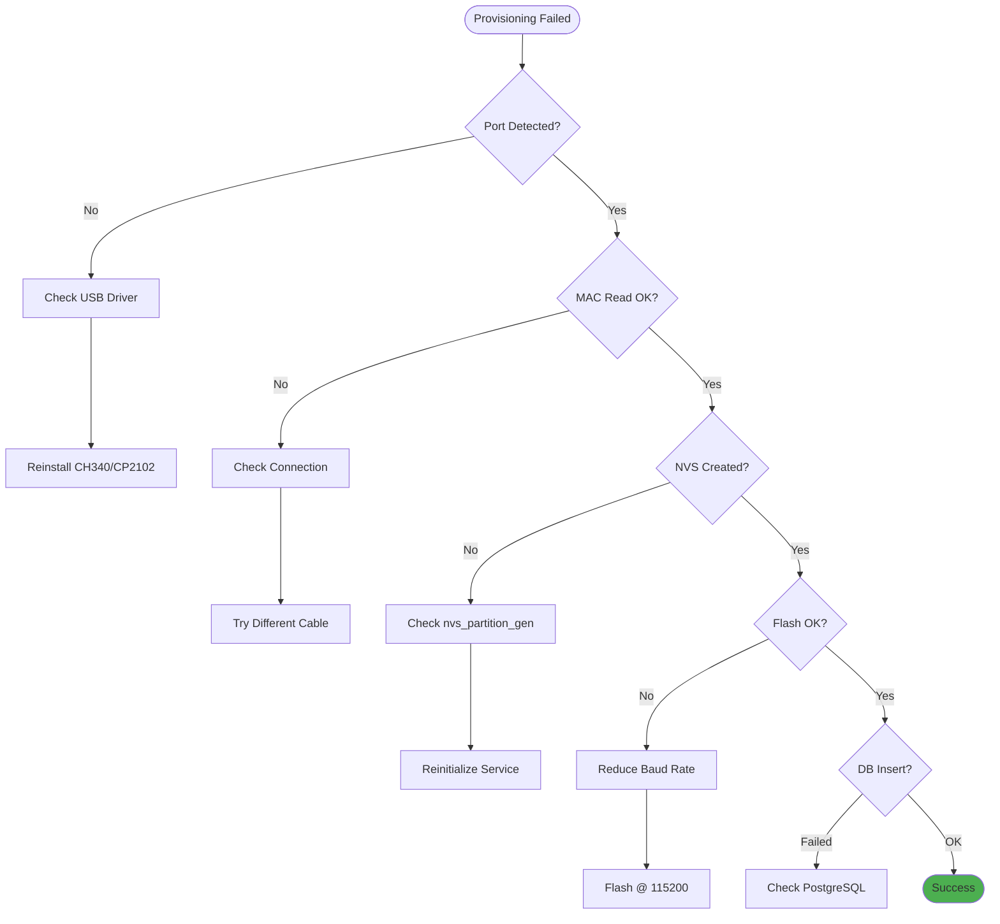
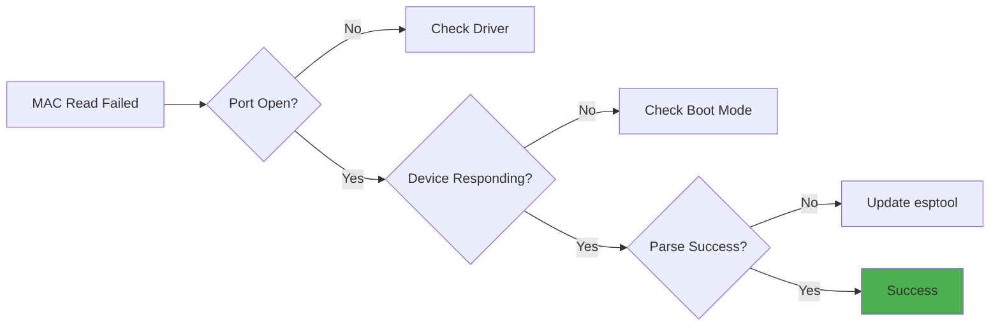
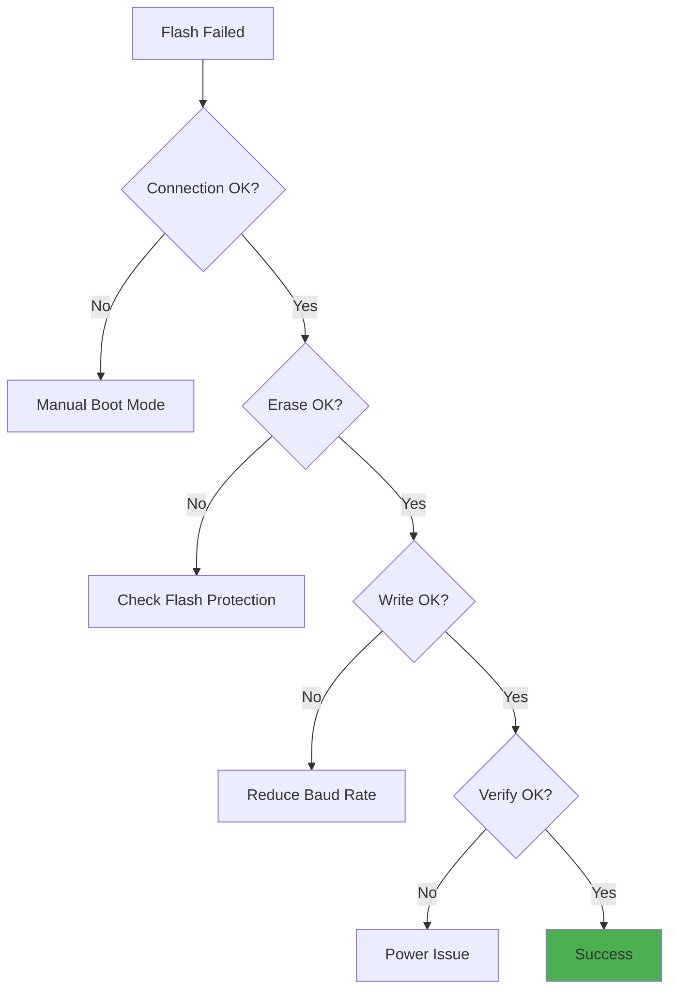

# Provisioning - Troubleshooting Guide

## Table of Contents
1. [Common Issues](#common-issues)
2. [MAC Reading Failures](#mac-reading-failures)
3. [UUID/PSK Generation Problems](#uuidpsk-generation-problems)
4. [NVS Binary Creation Errors](#nvs-binary-creation-errors)
5. [Flash Failures](#flash-failures)
6. [Serial Port Issues](#serial-port-issues)
7. [Database Problems](#database-problems)
8. [Platform-Specific Issues](#platform-specific-issues)
9. [Advanced Diagnostics](#advanced-diagnostics)
10. [FAQ](#faq)

---

## Common Issues

### Quick Diagnostic Flowchart



---

## MAC Reading Failures

### Problem: "Failed to Read MAC Address"

**Error Messages:**
- `Error: Failed to read MAC: timeout`
- `Could not parse MAC address from output`
- `esptool: error: Device not found`

**Diagnostic Steps:**



**Solutions:**

#### 1. Verify USB Connection
```powershell
# Windows - Check device manager
Get-PnpDevice | Where-Object { $_.FriendlyName -like "*USB*Serial*" }

# Expected output:
# Status  FriendlyName
# ------  ------------
# OK      USB-SERIAL CH340 (COM3)
```

#### 2. Manual Boot Mode Entry
ESP32 may need manual boot mode for initial connection:

1. Hold **BOOT** button
2. Press **EN (Reset)** button
3. Release **EN** button
4. Release **BOOT** button
5. Device now in download mode
6. Retry MAC read

#### 3. Test with esptool Directly
```bash
# Windows
cd C:\Users\<USER>\AppData\Local\Temp\fga-simulator-esptool
.\esptool.exe --chip esp32 --port COM3 read_mac

# Linux
/tmp/fga-simulator-esptool/esptool --chip esp32 --port /dev/ttyUSB0 read_mac

# Expected output should include:
# MAC: a4:cf:12:34:56:78
```

#### 4. Check esptool Version
```bash
esptool.exe version

# Update if version < 4.0
# Download latest from: https://github.com/espressif/esptool
```

#### 5. Try Different Baud Rates
```javascript
// Modify service to try slower baud
const args = [
    '--chip', chip,
    '--port', port,
    '--baud', '115200',  // Instead of default 460800
    'read_mac'
];
```

---

## UUID/PSK Generation Problems

### Problem: "Invalid UUID Generated"

**Symptoms:**
- UUID doesn't match v5 format
- UUID contains invalid characters
- Same UUID for different MACs

**Solutions:**

#### 1. Verify UUID Format
```javascript
// Test UUID generation
const service = new ESP32Provisioning();
const uuid = service.generateUUIDFromMAC('a4:cf:12:34:56:78');

// Valid format: xxxxxxxx-xxxx-5xxx-yxxx-xxxxxxxxxxxx
const uuidRegex = /^[0-9a-f]{8}-[0-9a-f]{4}-5[0-9a-f]{3}-[89ab][0-9a-f]{3}-[0-9a-f]{12}$/;

if (!uuidRegex.test(uuid)) {
    console.error('Invalid UUID format:', uuid);
}
```

#### 2. Check Node.js crypto Module
```javascript
// Verify crypto is available
const crypto = require('crypto');

try {
    const hash = crypto.createHash('sha1');
    hash.update('test');
    console.log('✓ crypto module working');
} catch (error) {
    console.error('✗ crypto error:', error);
    // Reinstall Node.js or check OpenSSL
}
```

---

## NVS Binary Creation Errors

### Problem: "nvs_partition_gen Failed"

**Error Messages:**
- `nvs_partition_gen not found at: ...`
- `Error: nvs_partition_gen failed: ...`
- `CSV validation error`

**Solutions:**

#### 1. Verify Binary Exists
```powershell
# Windows
Test-Path "C:\Users\<USER>\AppData\Local\Temp\fga-simulator-nvs\nvs_partition_gen.exe"

# Should return: True
```

#### 2. Test nvs_partition_gen Manually
```bash
# Windows
cd C:\Users\<USER>\AppData\Local\Temp\fga-simulator-nvs
.\nvs_partition_gen.exe generate test.csv test.bin 0x10000

# Linux
/tmp/fga-simulator-nvs/nvs_partition_gen generate test.csv test.bin 0x10000
```

**Create test.csv:**
```csv
key,type,encoding,value
zc,namespace,,
test_key,data,string,test_value
```

#### 3. Check CSV Format
Common CSV errors:

| Error | Cause | Solution |
|-------|-------|----------|
| `Invalid key` | Key > 15 characters | Shorten key name |
| `Invalid encoding` | Wrong type/encoding combo | Use `data,string` for text |
| `Namespace required` | Missing namespace entry | Add namespace as first entry |
| `Size mismatch` | CSV data > partition size | Increase size parameter |

#### 4. Validate CSV Content
```javascript
// Check generated CSV
const csvPath = path.join(os.tmpdir(), 'zc_seed.csv');
const content = fs.readFileSync(csvPath, 'utf8');

console.log('CSV Content:');
console.log(content);

// Should contain:
// - Namespace row
// - All required keys
// - Proper formatting (no extra spaces)
```

---

## Flash Failures

### Problem: "NVS Flash Failed"

**Error Messages:**
- `A fatal error occurred: Failed to connect to ESP32`
- `Hash of data verified. Failed`
- `Timeout during flash operation`

**Diagnostic Flowchart:**



**Solutions:**

#### 1. Reduce Baud Rate
```javascript
// In provisionESP32 config
const config = {
    port: 'COM3',
    chip: 'esp32',
    caUrl: 'https://ca.example.com:8443',
    baudRate: '115200'  // Instead of 921600
};
```

**Baud Rate Reliability:**
| Baud Rate | Speed | Reliability | Recommended |
|-----------|-------|-------------|-------------|
| 921600 | Fast (2s) | 70% | USB 2.0 direct |
| 460800 | Medium (3s) | 85% | Most adapters |
| 115200 | Slow (7s) | 99% | **Default** |

#### 2. Check Flash Offset
```javascript
// Verify NVS partition offset in partition table
// Common offsets:
const offsets = {
    'standard': '0x9000',      // Default ESP-IDF
    'custom_a': '0xA20000',    // Custom partition scheme
    'custom_b': '0x110000'     // Alternative
};
```

#### 3. Manual Flash Test
```bash
# Test flash manually
esptool --chip esp32 --port COM3 --baud 115200 write_flash 0x9000 zc_cfg_nvs.bin

# Expected output:
# Writing at 0x00009000... (100 %)
# Hash of data verified.
```

#### 4. Erase Before Flash
```javascript
// Add erase step to workflow
await service.eraseFlash(config.port, 'region');  // Erase NVS region only
await service.flashNVSBinary(...);  // Then flash
```

---

## Serial Port Issues

### Problem: "Port Access Denied"

**Windows:**
```
Error: Opening COM3: Access is denied
```

**Solution:**
```powershell
# Close other applications using the port
Get-Process | Where-Object { $_.MainWindowTitle -like "*COM3*" } | Stop-Process

# Or use Device Manager:
# 1. Device Manager → Ports (COM & LPT)
# 2. Right-click → Disable device
# 3. Right-click → Enable device
```

**Linux:**
```
Error: Opening /dev/ttyUSB0: Permission denied
```

**Solution:**
```bash
# Add user to dialout group (permanent)
sudo usermod -aG dialout $USER
sudo reboot

# Or temporary fix
sudo chmod 666 /dev/ttyUSB0
```

---

### Problem: "Port Not Released After Operation"

**Symptoms:**
- First provision succeeds, second fails
- "Port already open" error
- Need to replug USB between provisions

**Solution:**

```javascript
// Add port release delay in service
async waitForPortRelease(delayMs) {
    return new Promise(resolve => setTimeout(resolve, delayMs));
}

// Use between operations
await this.readMacAddress(port, chip);
await this.waitForPortRelease(500);  // Wait 500ms
await this.flashNVSBinary(...);
```

---

## Database Problems

### Problem: "Database Insertion Failed"

**Error Messages:**
- `Connection refused: PostgreSQL`
- `Database "device_registry" does not exist`
- `Permission denied for table devices`

**Solutions:**

#### 1. Test Database Connection
```javascript
const { Client } = require('pg');

async function testDB() {
    const client = new Client({
        host: '192.168.1.100',
        port: 5432,
        database: 'device_registry',
        user: 'provisioning',
        password: 'password'
    });
    
    try {
        await client.connect();
        console.log('✓ Database connected');
        
        const res = await client.query('SELECT NOW()');
        console.log('✓ Query successful:', res.rows[0]);
        
        await client.end();
    } catch (error) {
        console.error('✗ Database error:', error.message);
    }
}

testDB();
```

#### 2. Verify Table Schema
```sql
-- Check table exists
SELECT EXISTS (
    SELECT FROM information_schema.tables 
    WHERE table_name = 'devices'
);

-- Check columns
\d devices

-- Expected columns:
-- id, global_uuid, mac_address, psk_secret, ca_service_url, 
-- wifi_ssid, provisioned_at, firmware_version, status
```

#### 3. Check User Permissions
```sql
-- Grant permissions
GRANT SELECT, INSERT, UPDATE ON devices TO provisioning;
GRANT USAGE, SELECT ON SEQUENCE devices_id_seq TO provisioning;
```

#### 4. Make Database Optional
```javascript
// Provisioning should succeed even if DB fails
try {
    await this.insertDeviceToDatabase(uuid, psk);
} catch (dbError) {
    console.warn('Database insert failed:', dbError.message);
    // Don't throw - device is already provisioned
}
```

---

## Platform-Specific Issues

### Windows Issues

#### Issue: "esptool.exe Not Found"

**Solution:**
```powershell
# Check antivirus quarantine
# Some AVs flag esptool.exe as suspicious

# Whitelist path:
C:\Users\<USER>\AppData\Local\Temp\fga-simulator-esptool\

# Or disable real-time protection temporarily
```

#### Issue: "DLL Load Failed"

**Solution:**
```powershell
# Install Visual C++ Redistributable
# Download: https://aka.ms/vs/17/release/vc_redist.x64.exe

# Verify installation
Get-ItemProperty "HKLM:\SOFTWARE\Microsoft\VisualStudio\14.0\VC\Runtimes\x64"
```

---

### Linux Issues

#### Issue: "Permission Denied on Binary Execution"

**Solution:**
```bash
# Make binaries executable
chmod +x /tmp/fga-simulator-esptool/esptool
chmod +x /tmp/fga-simulator-nvs/nvs_partition_gen

# Verify
ls -l /tmp/fga-simulator-esptool/esptool
# Should show: -rwxr-xr-x
```

#### Issue: "ModemManager Interferes"

**Solution:**
```bash
# Stop ModemManager
sudo systemctl stop ModemManager
sudo systemctl disable ModemManager

# Or blacklist device
# Create /etc/udev/rules.d/99-usb-blacklist.rules:
SUBSYSTEM=="usb", ATTRS{idVendor}=="1a86", ATTRS{idProduct}=="7523", MODE="0666", ENV{ID_MM_DEVICE_IGNORE}="1"

# Reload rules
sudo udevadm control --reload-rules
sudo udevadm trigger
```

---

## Advanced Diagnostics

### Enable Full Logging

```javascript
// In esp32-provisioning.js
async provisionESP32(config) {
    const logFile = 'provision_debug.log';
    const logStream = fs.createWriteStream(logFile, { flags: 'a' });
    
    const log = (msg) => {
        const timestamp = new Date().toISOString();
        const line = `[${timestamp}] ${msg}\n`;
        logStream.write(line);
        console.log(msg);
    };
    
    log(`=== Provisioning Started ===`);
    log(`Port: ${config.port}`);
    log(`Chip: ${config.chip}`);
    log(`CA URL: ${config.caUrl}`);
    
    try {
        // ... provisioning steps with logging
        log(`MAC read: ${result.macAddress}`);
        log(`UUID generated: ${result.globalUUID}`);
        // ...
    } finally {
        logStream.end();
    }
}
```

### Test Each Component Individually

```javascript
// Test 1: MAC Reading
async function testMACRead() {
    const service = new ESP32Provisioning();
    await service.initialize();
    
    const mac = await service.readMacAddress('COM3', 'esp32');
    console.log('✓ MAC:', mac);
}

// Test 2: UUID Generation
function testUUIDGen() {
    const service = new ESP32Provisioning();
    const uuid = service.generateUUIDFromMAC('a4:cf:12:34:56:78');
    console.log('✓ UUID:', uuid);
}

// Test 3: NVS Creation
async function testNVS() {
    const service = new ESP32Provisioning();
    await service.initialize();
    
    const csvPath = service.createNVSCSV(
        '9a7b2c4d-5e6f-5123-8536-6789abcdef01',
        '7d8e9f0a1b2c3d4e5f6a7b8c9d0e1f2a',
        'https://ca.test.com:8443'
    );
    console.log('✓ CSV:', csvPath);
    
    const binPath = await service.generateNVSBinary(csvPath);
    console.log('✓ Binary:', binPath);
}

// Run all tests
(async () => {
    await testMACRead();
    testUUIDGen();
    await testNVS();
})();
```

---

## FAQ

### Q1: Can I re-provision a device?

**A:** Yes, flashing NVS overwrites previous data. The new UUID/PSK will replace old values.

```bash
# Device can be re-provisioned unlimited times
# Each flash overwrites NVS partition at 0x9000
```

---

### Q2: What if MAC reading times out?

**A:** Try these steps:
1. Manual boot mode (hold BOOT, press RST)
2. Reduce baud rate to 115200
3. Check USB cable quality
4. Try different USB port
5. Power cycle the device

---

### Q3: How do I recover from a bad NVS flash?

**A:** Re-provision the device:

```javascript
// Erase NVS region
await service.eraseFlash('COM3', 'region');

// Re-provision
await service.provisionESP32({ port: 'COM3', ... });
```

Or manually:
```bash
esptool --chip esp32 --port COM3 erase_region 0x9000 0x10000
```

---

### Q4: Why is UUID generation deterministic?

**A:** UUID v5 uses SHA-1 hash of MAC address, so:
- Same MAC → Same UUID (reproducible)
- Different MAC → Different UUID (unique)
- No network required (offline generation)

Benefits:
- Can regenerate UUID if database lost
- Verifiable device identity
- Collision-resistant

---

### Q5: Can I use custom UUIDs?

**A:** Yes, pass `customUuid` in config:

```javascript
await service.provisionESP32({
    port: 'COM3',
    chip: 'esp32',
    caUrl: 'https://ca.example.com:8443',
    customUuid: '12345678-1234-5678-1234-567812345678'
});
```

**Warning:** Ensure UUIDs are globally unique if using custom values.

---

### Q6: How do I provision without database?

**A:** Database is optional. Service will log warning but provision succeeds:

```javascript
// Provisioning works without database
// Database errors are caught and logged but don't fail operation
```

---

## Error Reference Table

| Error | Cause | Solution |
|-------|-------|----------|
| `esptool binary not found` | Binary not extracted | Run `initialize()` |
| `Failed to read MAC: timeout` | Device not connected | Manual boot mode |
| `nvs_partition_gen failed` | Invalid CSV | Check CSV format |
| `Hash of data verified. Failed` | Flash verification failed | Reduce baud rate |
| `Port access denied` | Permission issue | Add to dialout group (Linux) |
| `Database connection refused` | PostgreSQL offline | Check database |
| `Invalid UUID format` | crypto module error | Reinstall Node.js |
| `Port already open` | Port not released | Add delay between operations |

---

## Summary

✅ **Common Issues** - Quick diagnostic flowchart  
✅ **MAC Reading** - Connection, boot mode, baud rate solutions  
✅ **UUID/PSK** - Format validation and crypto troubleshooting  
✅ **NVS Creation** - Binary generation and CSV validation  
✅ **Flash Failures** - Baud rate, offset, manual flash testing  
✅ **Serial Ports** - Permission fixes and port release issues  
✅ **Database** - Connection testing and optional insertion  
✅ **Platform-Specific** - Windows and Linux unique issues  
✅ **Advanced Diagnostics** - Full logging and component testing  
✅ **FAQ** - 6 common questions with detailed answers  

**Quick Fixes:**

1. **MAC read fails** → Manual boot mode (hold BOOT, press RST)
2. **Flash fails** → Reduce baud to 115200
3. **Port denied** → Add to dialout group (Linux), replug (Windows)
4. **NVS error** → Check CSV format and partition size
5. **Database fails** → Provision still succeeds, check PostgreSQL

For detailed procedures, see [UserGuide.md](UserGuide.md). For API reference, see [SourceCode.md](SourceCode.md).
