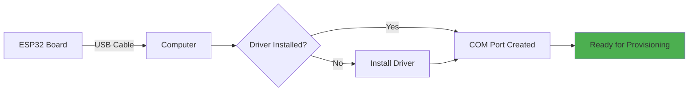
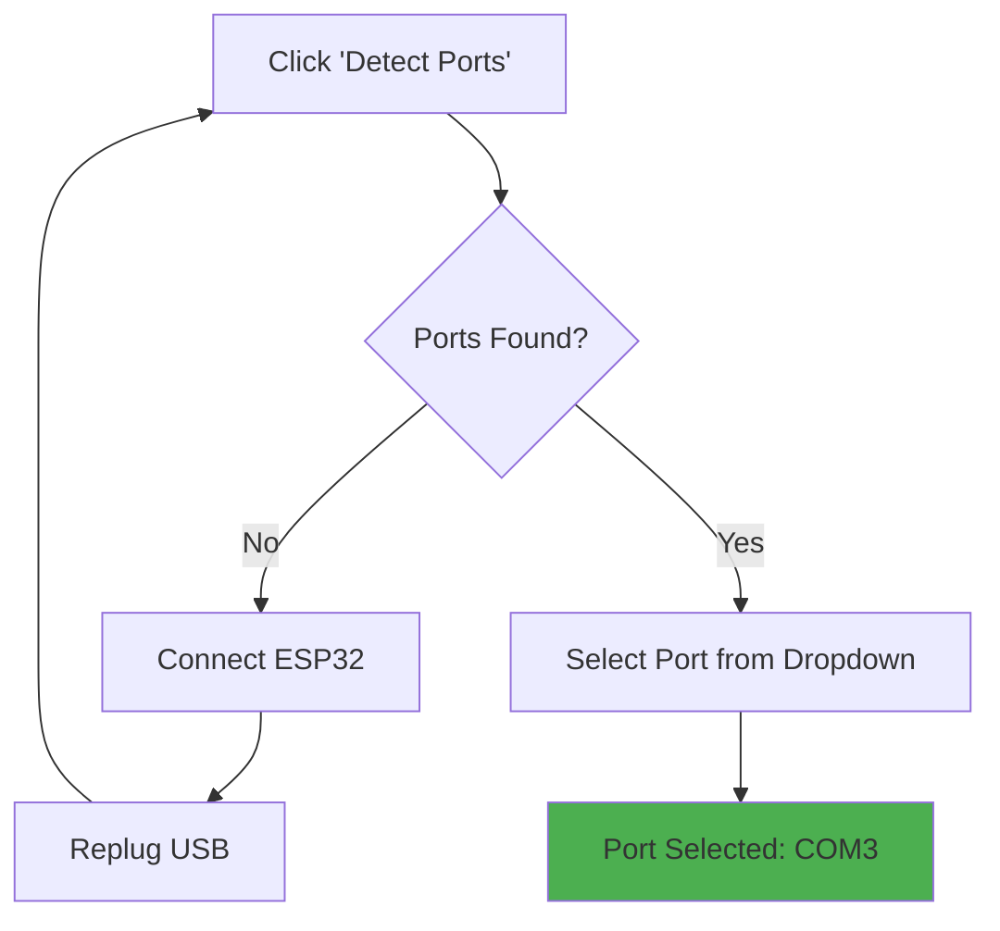
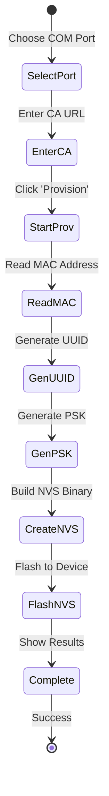
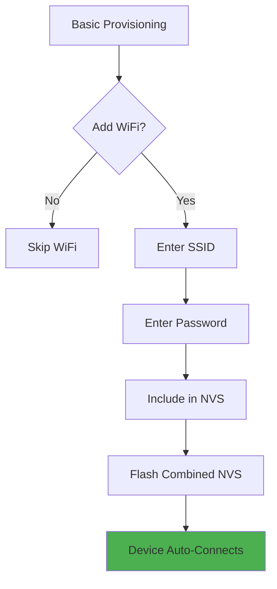
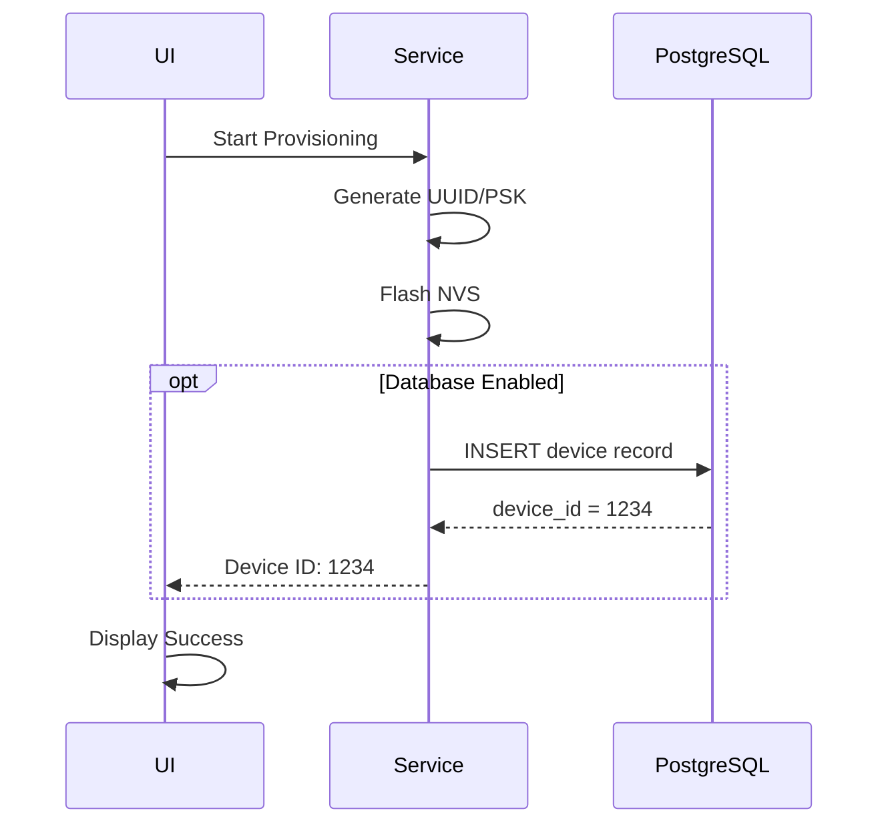

# Provisioning - User Guide

## Table of Contents
1. [Getting Started](#getting-started)
2. [Prerequisites](#prerequisites)
3. [Hardware Setup](#hardware-setup)
4. [Device Selection](#device-selection)
5. [Basic Provisioning](#basic-provisioning)
6. [WiFi Configuration](#wifi-configuration)
7. [Database Registration](#database-registration)
8. [Verification](#verification)
9. [Common Workflows](#common-workflows)
10. [Best Practices](#best-practices)

---

## Getting Started

### Prerequisites

**Software Requirements:**
- ✅ Application installed with provisioning feature enabled
- ✅ esptool binaries (included in `embedded/esptool-binaries/`)
- ✅ nvs_partition_gen tool (included in `embedded/nvs-binaries/`)
- ✅ USB drivers for ESP32 (CH340, CP2102, or FTDI)

**Hardware Requirements:**
- ESP32 development board or custom hardware
- USB cable (data-capable, not charge-only)
- Computer USB port (USB 2.0 or 3.0)

**Optional:**
- PostgreSQL database for device registration
- Network access to Certificate Authority server

---

## Prerequisites

### Driver Installation

#### Windows

**1. CH340 Driver** (most common):
```powershell
# Download from: http://www.wch.cn/downloads/CH341SER_EXE.html
# Run installer as Administrator
# Restart computer

# Verify installation
Get-PnpDevice | Where-Object { $_.FriendlyName -like "*CH340*" }

# Expected output:
# Status  Class   FriendlyName
# ------  -----   ------------
# OK      Ports   USB-SERIAL CH340 (COM3)
```

**2. CP2102 Driver**:
```powershell
# Download from: https://www.silabs.com/developers/usb-to-uart-bridge-vcp-drivers
# Run CP210xVCPInstaller_x64.exe
```

**3. FTDI Driver**:
```powershell
# Download from: https://ftdichip.com/drivers/vcp-drivers/
# Windows 10/11 usually includes FTDI drivers automatically
```

#### Linux

```bash
# Ubuntu/Debian - CH340
sudo apt-get install linux-headers-$(uname -r)
# Driver included in kernel (ch341)

# Check if device detected
lsusb | grep -i "1a86:7523"  # CH340
# Bus 001 Device 005: ID 1a86:7523 QinHeng Electronics CH340 serial converter

# Add user to dialout group (permanent solution)
sudo usermod -aG dialout $USER
sudo reboot

# Or use sudo for temporary access
sudo chmod 666 /dev/ttyUSB0
```

---

## Hardware Setup

### ESP32 Connection



### Physical Connection Diagram

```
┌─────────────────────┐
│  ESP32-DevKitC-32E  │
│                     │
│  ┌───┐   ┌───┐     │      USB Cable
│  │   │   │   │     │    (Data + Power)
│  │CP2│   │ESP│     │ ──────────────────►  Computer
│  │102│   │ 32│     │                       COM3/ttyUSB0
│  │   │   │   │     │
│  └───┘   └───┘     │
│                     │
│  [BOOT] [EN]       │
└─────────────────────┘
```

**LED Indicators:**
- **Power LED (Red)**: ON when USB connected
- **TX/RX LEDs**: Blink during communication
- **User LED (GPIO2)**: May blink during provisioning

---

## Device Selection

### Step 1: Open Provisioning Tab

1. Launch the application
2. Navigate to **Provisioning** tab
3. UI shows "Provisioning Configuration" form

### Step 2: Detect Serial Ports



**Expected Port Names:**
- **Windows**: `COM3`, `COM4`, `COM5`, etc.
- **Linux**: `/dev/ttyUSB0`, `/dev/ttyACM0`
- **macOS**: `/dev/cu.usbserial-*`, `/dev/cu.SLAB_USBtoUART`

### Step 3: Verify Connection

```javascript
// Application automatically shows:
Port: COM3
Manufacturer: Silicon Labs
Chip: ESP32-D0WD
```

---

## Basic Provisioning

### Standard Provisioning Flow



### Step-by-Step Procedure

**1. Enter Certificate Authority URL**
```
Field: CA Service URL
Value: https://ca.example.com:8443
```

**2. Start Provisioning**
- Click **"Start Provisioning"** button
- Progress bar appears: 0%

**3. MAC Address Reading**
```
Status: Reading MAC address...
Progress: 20%
Duration: 2-5 seconds

Console Output:
[esptool] Connecting to ESP32...
[esptool] Detecting chip type... ESP32
[esptool] MAC: a4:cf:12:34:56:78
```

**4. UUID Generation**
```
Status: Generating UUID...
Progress: 40%
Duration: <100ms

Generated UUID: 9a7b2c4d-5e6f-5123-8536-6789abcdef01
(Displayed in UI)
```

**5. PSK Generation**
```
Status: Generating PSK...
Progress: 50%
Duration: <10ms

Generated PSK: 7d8e9f0a1b2c3d4e5f6a7b8c9d0e1f2a
(Hidden in UI for security, logged internally)
```

**6. NVS Creation**
```
Status: Creating NVS partition...
Progress: 60%
Duration: 0.5-1 second

NVS Contents:
- global_uuid
- psk_secret
- ca_service_url
```

**7. NVS Flashing**
```
Status: Flashing NVS partition...
Progress: 70% → 100%
Duration: 3-7 seconds

[esptool] Writing at 0x00009000... (100%)
[esptool] Hash of data verified.
```

**8. Completion**
```
Status: Provisioning complete!
Progress: 100%

Device Details:
- MAC: a4:cf:12:34:56:78
- UUID: 9a7b2c4d-5e6f-5123-8536-6789abcdef01
- Provisioned: 2024-01-15 14:32:10
```

---

## WiFi Configuration

### Adding WiFi Credentials

**Optional Step:** Flash WiFi credentials for automatic network connection.

### Workflow



### Configuration Form

**1. Enable WiFi Provisioning**
```
☑ Include WiFi Credentials
```

**2. Enter Network Details**
```
Field: WiFi SSID
Value: OfficeNetwork
Note: Case-sensitive, max 32 characters

Field: WiFi Password
Value: SecurePassword123
Note: WPA2/WPA3, max 64 characters
```

**3. Verify NVS Content**
```
CSV Preview:
key,type,encoding,value
zc,namespace,,
global_uuid,data,string,9a7b2c4d-5e6f-5123-8536-6789abcdef01
psk_secret,data,string,7d8e9f0a1b2c3d4e5f6a7b8c9d0e1f2a
ca_service_url,data,string,https://ca.example.com:8443
wifi_ssid,data,string,OfficeNetwork
wifi_password,data,string,SecurePassword123
```

### Device Behavior After Provisioning

```cpp
// ESP32 firmware reads WiFi from NVS and connects
nvs_get_str(nvs, "wifi_ssid", ssid, &len);
nvs_get_str(nvs, "wifi_password", pass, &len);

WiFi.begin(ssid, pass);
while (WiFi.status() != WL_CONNECTED) {
    delay(500);
}
Serial.println("WiFi Connected!");
```

---

## Database Registration

### Enable Database Integration

**Optional:** Register devices in PostgreSQL for fleet management.

### Configuration

**1. Database Settings** (application config):
```json
{
    "database": {
        "enabled": true,
        "host": "192.168.1.100",
        "port": 5432,
        "database": "device_registry",
        "user": "provisioning",
        "password": "SecureDBPass"
    }
}
```

**2. Test Connection**
```
Click: "Test Database Connection"
Result: ✓ Connected to PostgreSQL
```

### Registration Flow



### Database Record Example

```sql
SELECT * FROM devices WHERE global_uuid = '9a7b2c4d-5e6f-5123-8536-6789abcdef01';

-- Result:
id  | 1234
global_uuid | 9a7b2c4d-5e6f-5123-8536-6789abcdef01
mac_address | a4:cf:12:34:56:78
psk_secret  | 7d8e9f0a1b2c3d4e5f6a7b8c9d0e1f2a
ca_service_url | https://ca.example.com:8443
wifi_ssid   | OfficeNetwork
provisioned_at | 2024-01-15 14:32:10
status      | provisioned
```

---

## Verification

### Verify Provisioning Success

**Method 1: Read NVS Partition**
```bash
# Use esptool to read back NVS
esptool --chip esp32 --port COM3 read_flash 0x9000 0x10000 nvs_readback.bin

# Compare with original
fc /b zc_cfg_nvs.bin nvs_readback.bin

# Expected: Files are identical
```

**Method 2: Device Serial Monitor**
```cpp
// Add to ESP32 firmware for debugging
void printNVSContents() {
    nvs_handle_t nvs;
    nvs_open("zc", NVS_READONLY, &nvs);
    
    char uuid[64], psk[64], ca[256];
    size_t len;
    
    len = sizeof(uuid);
    nvs_get_str(nvs, "global_uuid", uuid, &len);
    Serial.printf("UUID: %s\n", uuid);
    
    len = sizeof(psk);
    nvs_get_str(nvs, "psk_secret", psk, &len);
    Serial.printf("PSK: %s\n", psk);
    
    len = sizeof(ca);
    nvs_get_str(nvs, "ca_service_url", ca, &len);
    Serial.printf("CA URL: %s\n", ca);
}
```

**Method 3: Database Query**
```sql
-- Verify latest provisioned device
SELECT 
    id,
    global_uuid,
    mac_address,
    provisioned_at,
    status
FROM devices
ORDER BY provisioned_at DESC
LIMIT 1;
```

---

## Common Workflows

### Workflow 1: Factory Provisioning (No WiFi)

**Use Case:** Mass production, WiFi configured later in field

**Steps:**
1. Connect ESP32 via USB
2. Select COM port
3. Enter CA URL: `https://ca.production.com:8443`
4. Click "Start Provisioning"
5. Wait 8-12 seconds
6. Record UUID and MAC in spreadsheet
7. Disconnect device, move to next

**Time per Device:** ~15 seconds (including manual steps)

---

### Workflow 2: Field Deployment (With WiFi)

**Use Case:** On-site installation with known WiFi

**Steps:**
1. Connect device at installation site
2. Select port
3. Enter CA URL
4. ☑ Enable WiFi Credentials
5. Enter site-specific SSID and password
6. Click "Start Provisioning"
7. Device auto-connects to WiFi after boot
8. Verify connection via ping or web interface

**Time per Device:** ~20 seconds

---

### Workflow 3: Development Testing

**Use Case:** Repeated provisioning during firmware development

**Steps:**
1. Keep ESP32 connected
2. Use same CA URL: `https://ca.dev.local:8443`
3. Leave WiFi as `DevLab` network
4. Re-provision as needed (overwrites existing NVS)
5. Monitor serial output for confirmation

**Tip:** Create a batch script for rapid re-provisioning:
```bash
#!/bin/bash
# reprovision.sh
esptool --chip esp32 --port /dev/ttyUSB0 erase_region 0x9000 0x10000
node provision_script.js --port /dev/ttyUSB0 --ca https://ca.dev.local:8443
```

---

### Workflow 4: Batch Provisioning

**Use Case:** Provisioning 10+ devices sequentially

**Steps:**
1. Prepare devices on table with labels
2. Open provisioning tab
3. For each device:
   - Plug USB
   - Click "Quick Provision" (uses last settings)
   - Wait for completion tone/LED
   - Label device with UUID (printed on sticker)
   - Unplug and move to next
4. Export database records to CSV

**Optimization:**
- Use USB hub with individual port switches
- Pre-label devices with sequential numbers
- Use barcode scanner for UUID tracking

**Throughput:** ~4-5 devices per minute

---

## Best Practices

### ✅ DO

1. **Verify Driver Installation**
   - Test with simple serial terminal first
   - Check Device Manager/lsusb before provisioning

2. **Use Quality USB Cables**
   - Avoid charge-only cables
   - Keep cables < 1 meter for reliability

3. **Record Provisioning Data**
   - Export database records regularly
   - Keep backup of UUID-to-MAC mappings

4. **Test WiFi Before Mass Provisioning**
   - Verify SSID and password on one device
   - Check network connectivity

5. **Use Descriptive CA URLs**
   - Include environment: `ca.production.com`, `ca.staging.com`
   - Use HTTPS with valid certificates

### ❌ DON'T

1. **Don't Skip Verification**
   - Always check NVS flash success
   - Verify at least first device in batch

2. **Don't Reuse PSKs**
   - Each device should have unique PSK
   - Never manually set PSK to same value

3. **Don't Provision Without Power Check**
   - Ensure stable USB power (5V, 500mA)
   - Avoid underpowered USB hubs

4. **Don't Ignore Errors**
   - Stop batch provisioning on first error
   - Investigate root cause before continuing

5. **Don't Store PSKs Insecurely**
   - Database should have encrypted PSK column
   - Use TLS for database connections

### Tips & Tricks

**1. Speed Up Provisioning**
```javascript
// Increase baud rate for NVS flash (if supported)
const flashOptions = {
    baudRate: 921600,  // Instead of 115200
    port: selectedPort
};
```

**2. Auto-Increment Device Labels**
```javascript
// Generate sequential device names
const deviceName = `ZC-${String(deviceNumber).padStart(4, '0')}`;
// ZC-0001, ZC-0002, etc.
```

**3. Parallel Provisioning**
```javascript
// Use multiple USB ports simultaneously
const ports = ['COM3', 'COM4', 'COM5'];
await Promise.all(ports.map(port => provisionDevice(port)));
```

**4. QR Code Generation**
```javascript
// Generate QR code for UUID
const QRCode = require('qrcode');
QRCode.toFile(`device_${uuid}.png`, uuid);
```

**5. Provision Logging**
```javascript
// Log all provisions to file
const logEntry = {
    timestamp: new Date().toISOString(),
    mac, uuid, psk, caUrl, operator: 'John Doe'
};
fs.appendFileSync('provision_log.jsonl', JSON.stringify(logEntry) + '\n');
```

---

## Summary

✅ **Prerequisites** - USB drivers and binary tools installed  
✅ **Hardware Setup** - ESP32 connected via USB cable  
✅ **Device Selection** - Port detection and verification  
✅ **Basic Provisioning** - 8-step workflow (8-15 seconds)  
✅ **WiFi Configuration** - Optional SSID/password embedding  
✅ **Database Registration** - PostgreSQL fleet management  
✅ **Verification** - NVS readback, serial monitor, DB query  
✅ **Common Workflows** - Factory, field, development, batch  
✅ **Best Practices** - Quality cables, verification, secure storage  

**Quick Start:**  
1. Connect ESP32  
2. Select port  
3. Enter CA URL  
4. Click "Start Provisioning"  
5. Wait 10 seconds  
6. Done!  

For troubleshooting, see [Troubleshooting.md](Troubleshooting.md). For API details, see [SourceCode.md](SourceCode.md).
