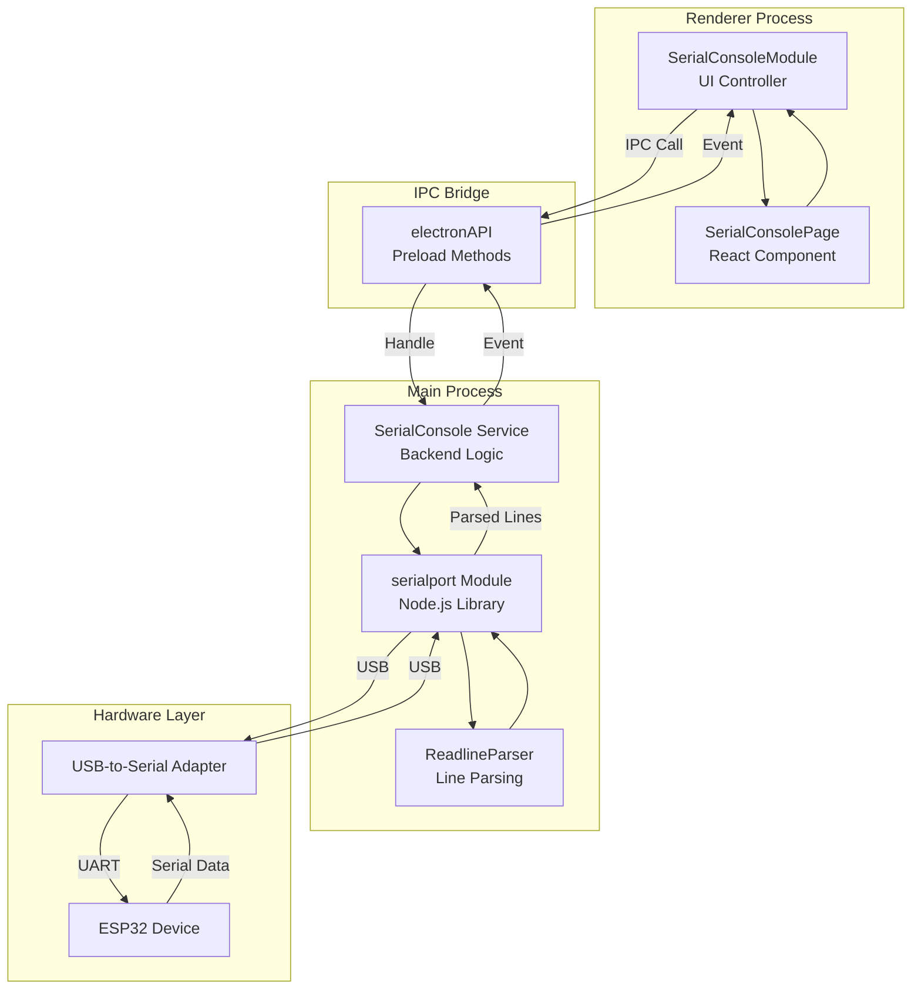
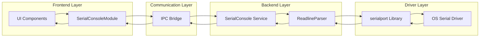
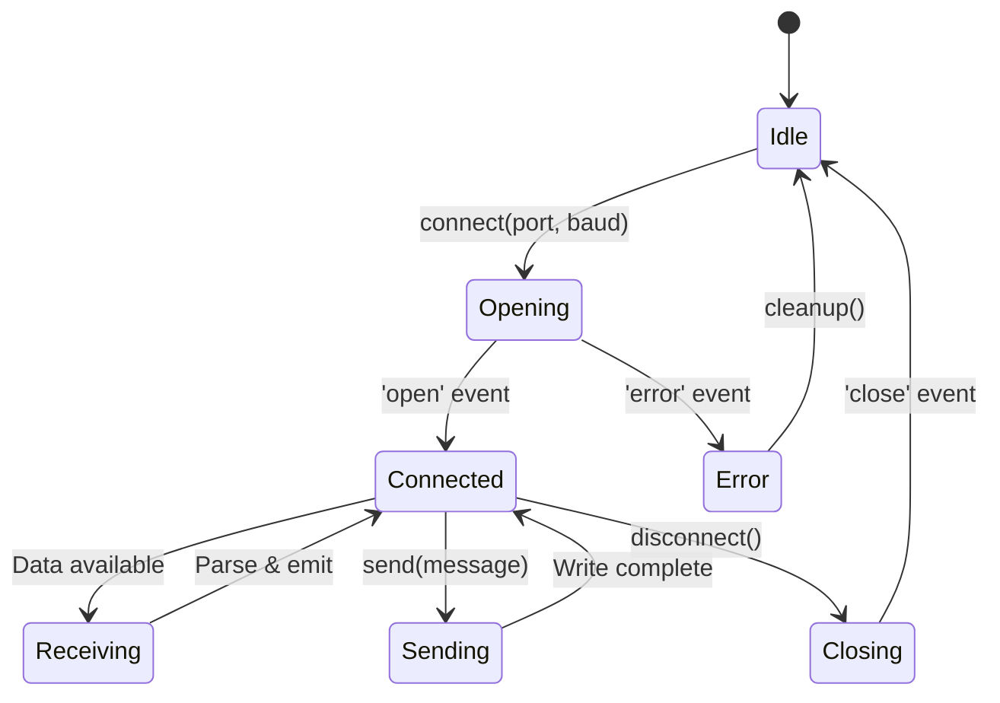
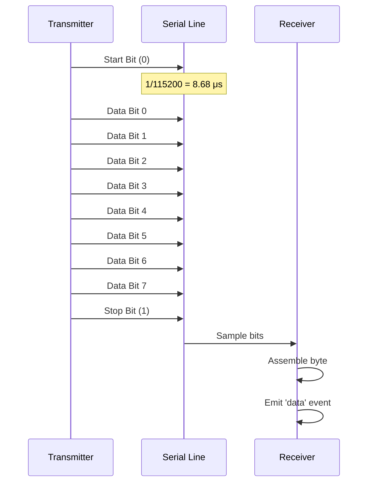
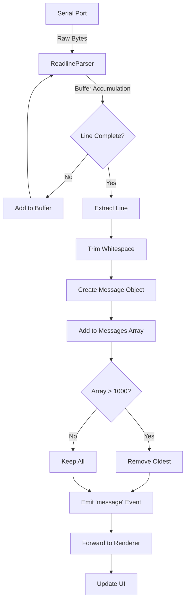
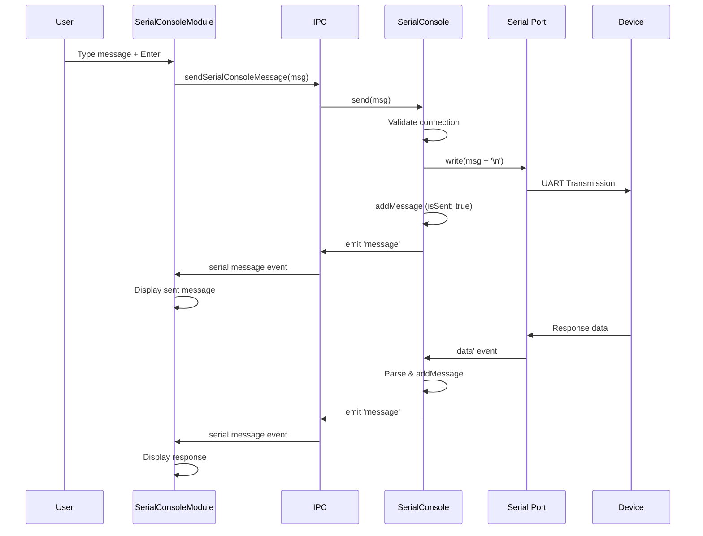
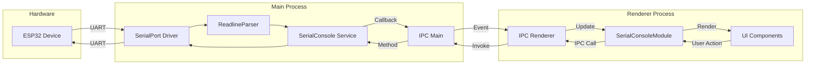

# Serial Console - Technical Overview

## Table of Contents
1. [Introduction](#introduction)
2. [Architecture Overview](#architecture-overview)
3. [Serial Port Communication](#serial-port-communication)
4. [UART Protocol](#uart-protocol)
5. [Data Flow](#data-flow)
6. [Performance & Scalability](#performance--scalability)
7. [Security Considerations](#security-considerations)
8. [Integration Points](#integration-points)

---

## Introduction

The **Serial Console** feature provides UART (Universal Asynchronous Receiver-Transmitter) serial communication capabilities for debugging and interacting with embedded devices, particularly ESP32 microcontrollers. It enables developers and testers to:

- View real-time serial output from devices
- Send commands to embedded systems
- Monitor device boot sequences and firmware execution
- Debug firmware issues via serial logs
- Configure devices through serial interface

### Key Features

✅ **Multi-Port Support** - Auto-detect and connect to any available serial port  
✅ **Configurable Baud Rates** - Support for 9600 to 921600 baud  
✅ **Real-Time Monitoring** - Live message streaming with timestamps  
✅ **Line-Based Parsing** - Automatic line break detection  
✅ **Message History** - Buffer up to 1,000 messages  
✅ **Send Commands** - Interactive command transmission  
✅ **Auto-Scroll** - Optional automatic scrolling to latest messages  

### Use Cases

| Use Case | Description | Typical Workflow |
|----------|-------------|------------------|
| **Firmware Debugging** | View ESP32 boot logs and runtime messages | Connect → Monitor boot → Check errors |
| **Device Configuration** | Send AT commands or configuration data | Connect → Send commands → Verify response |
| **Production Testing** | Monitor device initialization during testing | Connect → Run test → Capture logs |
| **Development Iteration** | Rapid firmware development feedback | Flash → Connect → Monitor → Debug |

---

## Architecture Overview

### System Components



### Component Diagram



---

## Serial Port Communication

### SerialPort Library

The Serial Console uses the **`serialport`** npm package, which provides:

- **Cross-Platform Support**: Windows, Linux, macOS
- **Native Bindings**: Direct access to OS serial APIs
- **Event-Driven**: Asynchronous data handling
- **Parser Support**: Line-based, byte-length, delimiter parsers

**Installation:**
```bash
npm install serialport
npm install @serialport/parser-readline
```

### Port Discovery

**Mechanism:**
```javascript
const { SerialPort } = require('serialport');

async getSerialPorts() {
  const ports = await SerialPort.list();
  return ports.map(port => ({
    path: port.path,              // e.g., "COM3", "/dev/ttyUSB0"
    manufacturer: port.manufacturer || 'Unknown',
    serialNumber: port.serialNumber || '',
    productId: port.productId || '',
    vendorId: port.vendorId || ''
  }));
}
```

**Example Output (Windows):**
```json
[
  {
    "path": "COM3",
    "manufacturer": "FTDI",
    "serialNumber": "FT1234567",
    "productId": "6001",
    "vendorId": "0403"
  },
  {
    "path": "COM4",
    "manufacturer": "Silicon Labs",
    "serialNumber": "00123456",
    "productId": "EA60",
    "vendorId": "10C4"
  }
]
```

**Example Output (Linux):**
```json
[
  {
    "path": "/dev/ttyUSB0",
    "manufacturer": "FTDI",
    "serialNumber": "FT1234567",
    "productId": "6001",
    "vendorId": "0403"
  },
  {
    "path": "/dev/ttyACM0",
    "manufacturer": "Arduino",
    "serialNumber": "",
    "productId": "0043",
    "vendorId": "2341"
  }
]
```

### Connection Lifecycle



### Port Configuration

**Parameters:**

| Parameter | Type | Default | Description |
|-----------|------|---------|-------------|
| `path` | String | Required | Port path (e.g., "COM3", "/dev/ttyUSB0") |
| `baudRate` | Number | 115200 | Baud rate (bits per second) |
| `dataBits` | Number | 8 | Number of data bits (5, 6, 7, 8) |
| `stopBits` | Number | 1 | Number of stop bits (1, 1.5, 2) |
| `parity` | String | 'none' | Parity ('none', 'even', 'odd', 'mark', 'space') |
| `flowControl` | Boolean | false | Hardware flow control (RTS/CTS) |
| `autoOpen` | Boolean | false | Open port immediately on creation |

**Example Configuration:**
```javascript
this.port = new SerialPort({
  path: '/dev/ttyUSB0',
  baudRate: 115200,
  dataBits: 8,
  stopBits: 1,
  parity: 'none',
  autoOpen: false
});
```

---

## UART Protocol

### What is UART?

**UART (Universal Asynchronous Receiver-Transmitter)** is a hardware communication protocol for serial data transmission between devices. Unlike synchronous protocols (SPI, I2C), UART does not use a clock signal.

### Frame Structure

**Standard UART Frame:**
```
START  D0 D1 D2 D3 D4 D5 D6 D7  PARITY  STOP
  ↓    ← Data Bits (8) →         ↓       ↓
  0    1  0  1  0  0  1  1       1       1

Duration: 1/baudRate per bit
```

**Frame Components:**

| Component | Duration | Description |
|-----------|----------|-------------|
| **Start Bit** | 1 bit | Logic LOW (0) - signals start of transmission |
| **Data Bits** | 5-8 bits | Actual data payload (LSB first) |
| **Parity Bit** | 0-1 bit | Optional error checking |
| **Stop Bits** | 1-2 bits | Logic HIGH (1) - signals end of transmission |

### Baud Rate

**Definition:** Number of signal changes (symbols) per second.

**Common Baud Rates:**

| Baud Rate | Bits/Second | Bytes/Second | Use Case |
|-----------|-------------|--------------|----------|
| 9600 | 9,600 | ~960 | Slow sensors, legacy devices |
| 19200 | 19,200 | ~1,920 | Low-bandwidth communication |
| 38400 | 38,400 | ~3,840 | Moderate speed |
| 57600 | 57,600 | ~5,760 | Standard speed |
| **115200** | 115,200 | **~11,520** | **ESP32 default** |
| 230400 | 230,400 | ~23,040 | High-speed logging |
| 460800 | 460,800 | ~46,080 | Very high speed |
| 921600 | 921,600 | ~92,160 | Maximum common speed |

**ESP32 Typical Usage:**
- **Boot logs**: 74880 baud (non-standard)
- **Application logs**: 115200 baud (standard)
- **High-speed data**: 921600 baud

### Timing Diagram



**Timing Calculation:**

For **115200 baud**, **8N1** configuration (8 data bits, no parity, 1 stop bit):
- **Bits per frame:** 1 (start) + 8 (data) + 1 (stop) = 10 bits
- **Time per bit:** 1 / 115200 = 8.68 μs
- **Time per byte:** 10 bits × 8.68 μs = **86.8 μs**
- **Maximum throughput:** 1 / 86.8 μs = **11,520 bytes/sec**

---

## Data Flow

### Receiving Data

**Flow Diagram:**



**Message Object Structure:**
```javascript
{
  timestamp: "2024-12-09T14:23:45.678Z",
  data: "ESP32 booting...",
  isSent: false,      // false for received
  isError: false,     // true if error message
  isSystem: false     // true if system message
}
```

### Sending Data

**Sequence Diagram:**



### Line Parsing

**ReadlineParser Behavior:**

```javascript
const { ReadlineParser } = require('@serialport/parser-readline');

this.parser = this.port.pipe(new ReadlineParser({ 
  delimiter: '\n'  // Split on newline
}));

this.parser.on('data', (line) => {
  // Receives complete lines only
  const message = {
    timestamp: new Date().toISOString(),
    data: line.trim()  // Remove leading/trailing whitespace
  };
  
  this.messages.push(message);
  
  if (this.onMessageCallback) {
    this.onMessageCallback(message);
  }
});
```

**Example Input Stream:**
```
Raw bytes: "Hello\nWorld\nESP32 Ready\n"
```

**Parser Output:**
```javascript
'data' event 1: "Hello"
'data' event 2: "World"
'data' event 3: "ESP32 Ready"
```

---

## Performance & Scalability

### Throughput Analysis

**Maximum Data Rates:**

| Baud Rate | Theoretical Max (bytes/s) | Practical Max (bytes/s) | Packet Loss Risk |
|-----------|---------------------------|-------------------------|------------------|
| 9600 | 960 | ~900 | Very Low |
| 57600 | 5,760 | ~5,400 | Low |
| 115200 | 11,520 | ~10,800 | Low |
| 230400 | 23,040 | ~21,600 | Medium |
| 460800 | 46,080 | ~43,200 | Medium-High |
| 921600 | 92,160 | ~86,400 | High |

**ESP32 Serial Output Example:**

Typical ESP32 application logging at 115200 baud:
- **Average log line:** 80 characters
- **Lines per second:** 11,520 / 80 = **144 lines/sec**
- **Sustainable rate:** ~100 lines/sec (with processing overhead)

### Message Buffer Management

**Buffer Strategy:**


**Memory Calculation:**

Assume average message size of 100 bytes:
- **Buffer capacity:** 1,000 messages
- **Memory usage:** 1,000 × 100 bytes = **100 KB**
- **With metadata:** ~120 KB

**Performance Impact:**

| Operation | Complexity | Time (1000 items) |
|-----------|-----------|-------------------|
| Add message | O(1) | < 1 ms |
| Remove oldest | O(1) | < 1 ms |
| Get all messages | O(n) | < 5 ms |
| Clear all | O(1) | < 1 ms |

### UI Rendering Performance

**Optimization Techniques:**

1. **Incremental Updates:**
   ```javascript
   updateMessagesOnly() {
     // Only append new messages, don't re-render all
     const newMessagesCount = this.messages.length - container.children.length;
     
     if (newMessagesCount > 0) {
       const fragment = document.createDocumentFragment();
       
       for (let i = newMessagesCount; i > 0; i--) {
         const msg = this.messages[this.messages.length - i];
         fragment.appendChild(this.createMessageElement(msg));
       }
       
       container.appendChild(fragment);
     }
   }
   ```

2. **Virtual Scrolling** (Future Enhancement):
   - Only render visible messages
   - Dramatically improves performance with large message counts

3. **DOM Throttling:**
   ```javascript
   // Batch updates with requestAnimationFrame
   if (!this.updatePending) {
     this.updatePending = true;
     requestAnimationFrame(() => {
       this.updateMessagesOnly();
       this.updatePending = false;
     });
   }
   ```

---

## Security Considerations

### Permission Requirements

**Windows:**
- User must have permissions to access COM ports
- Some USB-to-serial adapters require driver installation
- No administrator privileges required for standard ports

**Linux:**
- User must be in `dialout` group
- Check permissions: `ls -l /dev/ttyUSB0`
- Add user to group: `sudo usermod -a -G dialout $USER`

**macOS:**
- No special permissions required
- May need to approve USB device in System Preferences

### Data Security

**Potential Risks:**

| Risk | Impact | Mitigation |
|------|--------|------------|
| **Sensitive Data in Logs** | High | Avoid logging passwords, keys |
| **Command Injection** | Medium | Validate input before sending |
| **Unauthorized Access** | Medium | Implement authentication on device |
| **Log File Exposure** | Low | Secure log storage permissions |

**Best Practices:**

1. **Filter Sensitive Data:**
   ```javascript
   addMessage(from, message, type) {
     // Redact sensitive patterns
     const filtered = message.replace(/password=\S+/gi, 'password=***');
     
     const logEntry = {
       timestamp: new Date().toISOString(),
       data: filtered
     };
     
     this.messages.push(logEntry);
   }
   ```

2. **Limit Log Retention:**
   ```javascript
   // Clear logs after specific time
   setInterval(() => {
     const now = Date.now();
     this.messages = this.messages.filter(msg => {
       const age = now - new Date(msg.timestamp).getTime();
       return age < 3600000;  // Keep only last hour
     });
   }, 300000);  // Check every 5 minutes
   ```

---

## Integration Points

### IPC Methods

**Exposed to Renderer Process:**

```javascript
// preload.js
contextBridge.exposeInMainWorld('electronAPI', {
  // Serial Console Methods
  getSerialPorts: () => ipcRenderer.invoke('serial:get-ports'),
  connectSerialConsole: (port, baud) => ipcRenderer.invoke('serial:connect', port, baud),
  disconnectSerialConsole: () => ipcRenderer.invoke('serial:disconnect'),
  sendSerialConsoleMessage: (msg) => ipcRenderer.invoke('serial:send', msg),
  getSerialConsoleStatus: () => ipcRenderer.invoke('serial:get-status'),
  getSerialConsoleMessages: () => ipcRenderer.invoke('serial:get-messages'),
  clearSerialConsoleMessages: () => ipcRenderer.invoke('serial:clear-messages'),
  
  // Event Listener
  onSerialMessage: (callback) => {
    ipcRenderer.on('serial:message', (event, data) => callback(data));
  }
});
```

### Main Process Handlers

```javascript
// main.js
const SerialConsole = require('./services/serial-console');
const serialConsole = new SerialConsole();

// Register handlers
ipcMain.handle('serial:get-ports', async () => {
  return await serialConsole.getSerialPorts();
});

ipcMain.handle('serial:connect', async (event, port, baudRate) => {
  return await serialConsole.connect(port, baudRate);
});

ipcMain.handle('serial:disconnect', async () => {
  return await serialConsole.disconnect();
});

ipcMain.handle('serial:send', async (event, message) => {
  return await serialConsole.send(message);
});

// Forward messages to renderer
serialConsole.setMessageCallback((message) => {
  mainWindow.webContents.send('serial:message', message);
});
```

### Event Flow Architecture



---

## Summary

This technical overview covers:

✅ **Architecture** - Complete system component diagram and data flow  
✅ **Serial Port Communication** - Port discovery, configuration, lifecycle  
✅ **UART Protocol** - Frame structure, baud rates, timing analysis  
✅ **Data Flow** - Receiving, sending, and parsing mechanisms  
✅ **Performance** - Throughput analysis, buffer management, UI optimization  
✅ **Security** - Permissions, data protection, best practices  
✅ **Integration** - IPC bridge, event system, handler registration  

**Key Takeaways:**

- Serial Console uses Node.js `serialport` library for cross-platform UART communication
- Supports baud rates from 9600 to 921600, with 115200 as ESP32 default
- Line-based parsing with ReadlineParser for structured message handling
- Message buffer limited to 1,000 entries for memory efficiency
- Event-driven architecture with IPC bridge for main↔renderer communication
- Security considerations include permission management and sensitive data filtering

**Next Steps:**
- [User Guide](./UserGuide.md) - Learn how to use Serial Console
- [Source Code Documentation](./SourceCode.md) - Detailed API reference
- [Troubleshooting](./Troubleshooting.md) - Common issues and solutions
