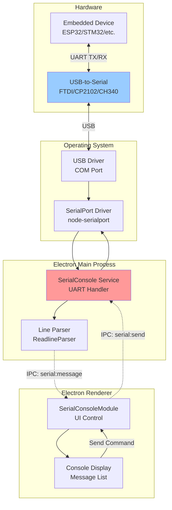
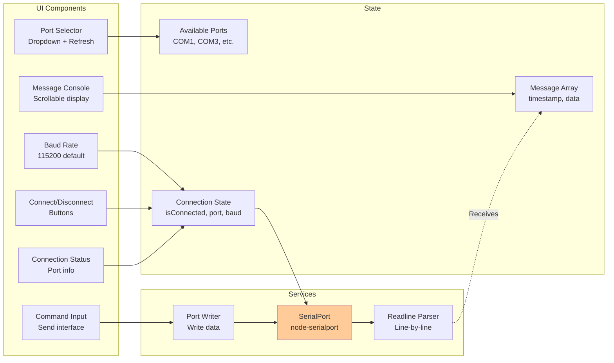

# Serial Console - UART Terminal Interface

**Feature:** Serial Console (Hardware Interface)  
**Purpose:** Direct UART communication with devices via USB/Serial  
**Status:** Core feature - Always enabled  
**Last Updated:** December 9, 2025

---

## 📋 Overview

The **Serial Console** provides direct UART (Universal Asynchronous Receiver-Transmitter) communication with devices through USB-to-Serial adapters or built-in serial ports. This is the most reliable way to debug embedded devices, especially during development and factory testing.

### Key Capabilities

- 🔌 **Serial Port Detection** - Auto-detect USB-to-Serial adapters
- 📡 **UART Communication** - Send and receive serial data
- ⚡ **Configurable Baud Rates** - 9600 to 921600 bps
- 📝 **Real-Time Display** - Live serial terminal
- 💾 **Message History** - Keep last 1000 messages
- 🔧 **Hardware Debugging** - Direct firmware access
- 🎮 **Interactive Commands** - Send AT commands, test commands

---

## 🚀 Quick Start

### 1. Connect Device

**Hardware Setup:**
1. Connect USB-to-Serial adapter to PC
2. Connect adapter TX → Device RX
3. Connect adapter RX → Device TX
4. Connect GND → GND
5. Power device

### 2. Select Port

1. Open **Serial Console** tab
2. Click **Refresh Ports** if needed
3. Select COM port from dropdown (e.g., COM3)
4. Set baud rate (default: 115200)

### 3. Connect

1. Click **Connect** button
2. Status indicator turns green
3. Device boot messages appear
4. Console ready for commands

### 4. Send Commands

1. Type command in input field
2. Press **Enter** to send
3. Device response appears below
4. Repeat as needed

---

## 🏗️ Architecture

### System Overview



### Component Diagram



---

## 🎮 Features

### Serial Port Detection

**Auto-Discovery:**
- Scans for USB-to-Serial adapters
- Detects COM ports (Windows) or /dev/ttyUSB* (Linux)
- Shows manufacturer information
- Lists serial numbers
- Refresh on demand

**Supported Adapters:**
- ✅ FTDI (FT232, FT2232, etc.)
- ✅ Silicon Labs CP210x (CP2102, CP2104)
- ✅ WCH CH340/CH341
- ✅ Prolific PL2303
- ✅ Native USB-CDC devices (ESP32-S2/S3/C3)

### Baud Rate Configuration

**Common Rates:**
- 9600 - Standard low-speed
- 19200 - Legacy systems
- 38400 - Older embedded systems
- **115200** - Most common (default)
- 230400 - High-speed debugging
- 460800 - Very fast transfer
- 921600 - Maximum supported

**Format:**
- 8 data bits
- No parity
- 1 stop bit
- No flow control

### Real-Time Console

**Message Display:**
```
[HH:MM:SS] Log message from device
[HH:MM:SS] [SENT] Command sent to device
[HH:MM:SS] [ERROR] Error message
```

**Features:**
- Line-by-line parsing (terminated by `\n`)
- Timestamps on all messages
- Auto-scroll to latest
- 1000 message history
- Color-coded message types

### Command Interface

**Sending Data:**
- Type command in input field
- Press **Enter** (instant send)
- Or click **Send** button
- Newline automatically appended

**Common Commands:**
```
AT              → Test connection
AT+VERSION      → Get firmware version
AT+HELP         → List commands
reboot          → Restart device
logs            → Show system logs
```

---

## 💻 User Interface

### Connection Panel

**Disconnected:**
```
┌─────────────────────────────────────────┐
│ Port: [COM3 ▼]  Baud: [115200 ▼]        │
│ [Refresh Ports]         [Connect]       │
└─────────────────────────────────────────┘
```

**Connected:**
```
┌─────────────────────────────────────────┐
│ ● Connected: COM3 @ 115200 baud         │
│                             [Disconnect] │
└─────────────────────────────────────────┘
```

### Console Display

```
┌─────────────────────────────────────────┐
│ Serial Console              [Clear]     │
├─────────────────────────────────────────┤
│ [14:23:47] Booting ESP32...             │
│ [14:23:48] WiFi connected               │
│ [14:23:50] [SENT] AT+VERSION            │
│ [14:23:50] Firmware v2.1.0              │
│                                         │
│ (Scrollable console area)               │
│                                         │
├─────────────────────────────────────────┤
│ [Type command...]               [Send]  │
└─────────────────────────────────────────┘
```

---

## 🔧 Hardware Setup

### Wiring Diagram

**Standard UART Connection:**
```
PC USB Port                     Embedded Device
┌────────────┐                  ┌────────────┐
│            │                  │            │
│  USB       │    USB-to-       │  UART      │
│  Port      │ ← Serial Adapter →  Port     │
│            │                  │            │
└────────────┘                  └────────────┘
     │                               │
     └─────── USB Cable ─────────────┘

Adapter Pins:
  TX  ───────────────────────────→ RX
  RX  ←─────────────────────────── TX
  GND ←────────────────────────→ GND
  VCC → (optional 3.3V/5V power)
```

**⚠️ Important:**
- **Cross TX/RX:** Adapter TX → Device RX, Adapter RX → Device TX
- **Common Ground:** Always connect GND
- **Voltage Levels:** Use 3.3V for ESP32, check device specs
- **Flow Control:** Usually not needed (leave RTS/CTS disconnected)

### USB-to-Serial Adapters

**Recommended Adapters:**

**1. FTDI FT232RL**
- ✅ Most reliable
- ✅ Best driver support
- ✅ Automatic driver installation
- ✅ 3.3V and 5V selectable
- 💰 Cost: $5-15

**2. Silicon Labs CP2102**
- ✅ Very common
- ✅ Good driver support
- ✅ Small form factor
- ✅ 3.3V/5V models available
- 💰 Cost: $2-5

**3. CH340G/CH341**
- ⚠️ Requires driver installation
- ✅ Very cheap
- ⚠️ Driver issues on some systems
- ✅ Works well once configured
- 💰 Cost: $1-3

---

## 🎯 Common Tasks

### Task 1: First Connection to ESP32

**Hardware:**
1. Connect USB-to-Serial adapter to ESP32:
   - Adapter TX → ESP32 RX (GPIO3)
   - Adapter RX → ESP32 TX (GPIO1)
   - GND → GND
2. Power ESP32 (via USB or external)
3. Connect adapter to PC USB port

**Software:**
1. Open Serial Console
2. Click **Refresh Ports**
3. Select new COM port (e.g., COM3)
4. Set baud rate: **115200**
5. Click **Connect**

**Expected Output:**
```
[14:23:45] ets Jun  8 2016 00:22:57
[14:23:45] rst:0x1 (POWERON_RESET),boot:0x13 (SPI_FAST_FLASH_BOOT)
[14:23:45] configsip: 0, SPIWP:0xee
[14:23:45] clk_drv:0x00,q_drv:0x00,d_drv:0x00,cs0_drv:0x00,hd_drv:0x00,wp_drv:0x00
[14:23:45] mode:DIO, clock div:2
[14:23:45] load:0x3fff0030,len:1184
[14:23:45] load:0x40078000,len:13192
[14:23:45] entry 0x400805e4
[14:23:46] [INFO] Application started
```

---

### Task 2: Send AT Commands

**Scenario:** Query device status

**Commands:**
```
1. Send: AT
   Response: OK

2. Send: AT+VERSION
   Response: Firmware v2.1.0

3. Send: AT+STATUS
   Response: 
   WiFi: Connected
   IP: 192.168.1.100
   Uptime: 1234 seconds

4. Send: AT+HELP
   Response: (list of available commands)
```

---

### Task 3: Monitor Boot Sequence

**Purpose:** Verify firmware boots correctly

**Procedure:**
1. Connect serial console **before** powering device
2. Set baud rate: 115200
3. Connect
4. Power on device (or press reset button)
5. Observe boot messages

**What to Look For:**
- ✅ Boot ROM messages (normal)
- ✅ Bootloader output
- ✅ Application start message
- ❌ Brownout reset (power issue)
- ❌ Watchdog reset (crash)
- ❌ Stack overflow (firmware bug)

---

### Task 4: Factory Reset via Serial

**Scenario:** Device stuck, need factory reset

**Commands:**
```
1. Connect serial console

2. Send: AT+RESET
   Response: Resetting...
   (Device reboots)

3. If AT commands not working, try bootloader:
   - Press and hold BOOT button
   - Press and release RESET button
   - Release BOOT button
   - Device enters bootloader mode

4. Send: erase_flash
   (Erases all flash memory)

5. Power cycle device
   (Boots with factory settings)
```

---

## 🐛 Troubleshooting

### Issue: No COM Port Detected

**Symptoms:**
- Port dropdown empty
- "No ports available" message

**Solutions:**

**1. Check USB Connection**
- Reconnect USB cable
- Try different USB port
- Check cable quality

**2. Install Drivers**
```powershell
# Windows - Check Device Manager
devmgmt.msc
# Look for "Ports (COM & LPT)"
# Yellow exclamation = driver issue
```

**Driver Links:**
- [FTDI Drivers](https://ftdichip.com/drivers/)
- [CP210x Drivers](https://www.silabs.com/developers/usb-to-uart-bridge-vcp-drivers)
- [CH340 Drivers](http://www.wch.cn/downloads/CH341SER_ZIP.html)

**3. Linux Permissions**
```bash
# Add user to dialout group
sudo usermod -a -G dialout $USER
# Log out and back in

# Check port permissions
ls -l /dev/ttyUSB*
# Should show dialout group
```

---

### Issue: Can Connect But No Messages

**Symptoms:**
- Connection successful (green status)
- No boot messages
- No response to commands

**Solutions:**

**1. Check Baud Rate**
- Common ESP32 bootloader: 115200
- Some devices use 9600
- Try different baud rates

**2. Check Wiring**
```
Correct:   Adapter TX → Device RX
           Adapter RX → Device TX

Incorrect: Adapter TX → Device TX  ❌
```

**3. Check Voltage Levels**
- ESP32 uses 3.3V UART
- Some adapters output 5V
- Use level shifter if needed

**4. Verify Device is Running**
- Power LED on?
- Measure power supply voltage
- Check for shorts

---

### Issue: Garbled Text

**Symptoms:**
- Random characters appear
- Unreadable messages
- Like: `��������`

**Causes & Solutions:**

**1. Wrong Baud Rate**
- Device sending at different rate
- Try: 9600, 115200, 460800

**2. Loose Connection**
- Check wiring
- Reseat connectors
- Check for broken wires

**3. Power Issues**
- Insufficient power supply
- Voltage drops during transmission
- Add capacitors, improve power

**4. Interference**
- EMI from nearby devices
- Keep UART wires short
- Use shielded cable if needed

---

### Issue: Connection Drops Randomly

**Symptoms:**
- Connected, then disconnects
- Status changes to disconnected
- Must reconnect manually

**Solutions:**

**1. USB Power Management**
```powershell
# Windows - Disable USB selective suspend
Control Panel → Power Options → Advanced Settings
→ USB Settings → USB selective suspend setting → Disabled
```

**2. Check Device Manager**
```
Device Manager → Ports → Right-click port
→ Properties → Power Management
→ Uncheck "Allow computer to turn off this device"
```

**3. Cable Quality**
- Use short, high-quality USB cable
- Avoid hubs if possible
- Try different cable

---

## 📚 Code References

**Main Files:**
- `renderer/modules/SerialConsoleModule.js` - UI control (392 lines)
- `services/serial-console.js` - Serial port logic (248 lines)
- `main.js` - IPC handlers for serial

**Key Methods:**
- `SerialConsole.getSerialPorts()` - List available ports
- `SerialConsole.connect(port, baudRate)` - Open connection
- `SerialConsole.disconnect()` - Close connection
- `SerialConsole.sendMessage(data)` - Send to device
- `SerialConsoleModule.render()` - UI rendering

**IPC Channels:**
- `serial:get-ports` - List available ports
- `serial:connect` - Connect to port
- `serial:disconnect` - Disconnect
- `serial:send` - Send message
- `serial:get-status` - Get connection state
- `serial:get-messages` - Get message history
- `serial:clear-messages` - Clear console
- `serial:message` - New message received (main → renderer)

---

## 🔗 Related Features

- **UDP Logs** - Wireless logging alternative
- **TCP Console** - Network-based terminal
- **ESP32 Flasher** - Uses serial port for flashing
- **STM32 Flasher** - Uses SWD (not serial)
- **Provisioning** - Uses serial for initial config

---

## 📝 Best Practices

### For Users

1. **Connect before powering device** - Don't miss boot messages
2. **Use correct baud rate** - Most common: 115200
3. **Check wiring carefully** - TX/RX crossover
4. **Use short cables** - Reduces interference
5. **Install official drivers** - Avoid generic drivers

### For Developers

1. **Add AT command interface** - Easier debugging
2. **Use consistent baud rate** - 115200 standard
3. **Send newline-terminated messages** - Easier parsing
4. **Add verbose boot messages** - Helps troubleshooting
5. **Implement command help** - Document available commands

### For Hardware Engineers

1. **Add test points for UART** - Easy probe access
2. **Use 3.3V levels** - Compatible with most devices
3. **Add level shifter if needed** - For 5V systems
4. **Protect against ESD** - Use protection diodes
5. **Label TX/RX clearly** - Prevent wiring errors

---

## 🎓 Learning Resources

**UART Protocol:**
- [UART Basics (SparkFun)](https://learn.sparkfun.com/tutorials/serial-communication)
- [Understanding UART](https://www.analog.com/en/analog-dialogue/articles/uart-a-hardware-communication-protocol.html)

**Related Documentation:**
- [Main Documentation Index](../../README.md)
- [ESP32 Flasher](../esp32-flasher/README.md)
- [TCP Console](../tcp-console/README.md)
- [UDP Logs](../udp-logs/README.md)

---

## 📄 File Listing

**This Feature's Documentation:**
- [README.md](./README.md) - This file (overview)
- [SerialConsole-Overview.md](./SerialConsole-Overview.md) - Technical deep dive
- [SerialConsole-UserGuide.md](./SerialConsole-UserGuide.md) - Detailed procedures
- [SerialConsole-SourceCode.md](./SerialConsole-SourceCode.md) - Developer documentation
- [SerialConsole-Troubleshooting.md](./SerialConsole-Troubleshooting.md) - Problem solving

---

**Last Updated:** December 9, 2025  
**Status:** ✅ Core Feature - Always Available  
**Next:** Read [SerialConsole-UserGuide.md](./SerialConsole-UserGuide.md) for detailed hardware setup
