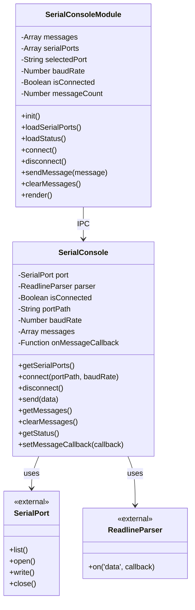
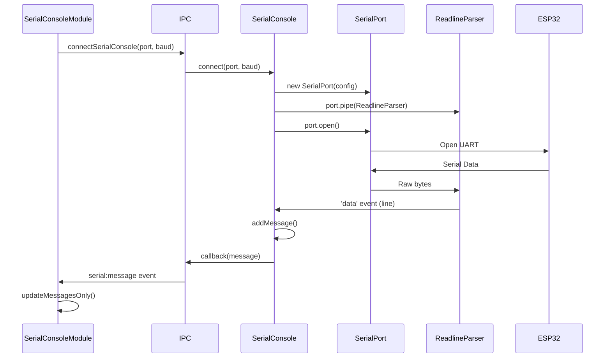
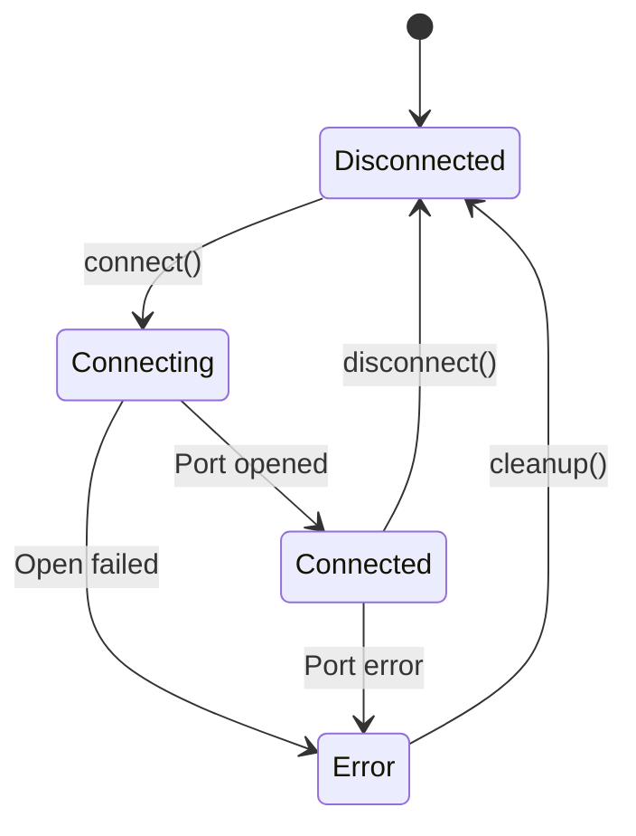
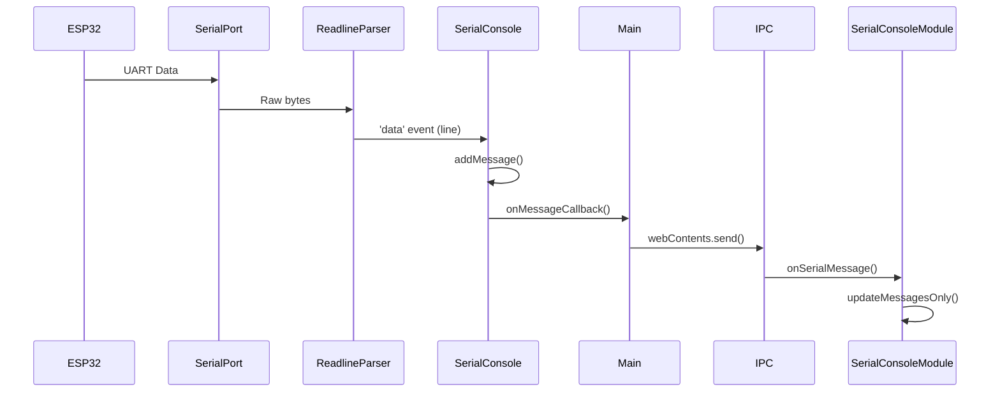

# Serial Console - Source Code Documentation

## Table of Contents
1. [Architecture Overview](#architecture-overview)
2. [SerialConsole Class (Backend)](#serialconsole-class-backend)
3. [SerialConsoleModule Class (Frontend)](#serialconsolemodule-class-frontend)
4. [IPC Communication](#ipc-communication)
5. [Event System](#event-system)
6. [Code Examples](#code-examples)
7. [Testing Guide](#testing-guide)

---

## Architecture Overview

### Class Diagram



### Component Flow



---

## SerialConsole Class (Backend)

**File:** `services/serial-console.js`

### Class Structure

```javascript
const { SerialPort } = require('serialport');
const { ReadlineParser } = require('@serialport/parser-readline');

class SerialConsole {
  constructor() {
    this.port = null;
    this.parser = null;
    this.isConnected = false;
    this.portPath = '';
    this.baudRate = 115200;
    this.messages = [];
    this.maxMessages = 1000;
    this.onMessageCallback = null;
  }
}

module.exports = SerialConsole;
```

### Properties Reference

| Property | Type | Default | Description |
|----------|------|---------|-------------|
| `port` | `SerialPort` | `null` | Serial port instance |
| `parser` | `ReadlineParser` | `null` | Line parser instance |
| `isConnected` | `Boolean` | `false` | Connection state |
| `portPath` | `String` | `''` | Current port path (e.g., "COM3") |
| `baudRate` | `Number` | `115200` | Current baud rate |
| `messages` | `Array<Object>` | `[]` | Message buffer |
| `maxMessages` | `Number` | `1000` | Maximum messages to retain |
| `onMessageCallback` | `Function` | `null` | Message event callback |

---

### Method: `async getSerialPorts()`

Returns list of available serial ports.

**Signature:**
```javascript
async getSerialPorts(): Promise<Array<Object>>
```

**Returns:**
```javascript
[
  {
    path: string,          // e.g., "COM3", "/dev/ttyUSB0"
    manufacturer: string,  // e.g., "FTDI", "Silicon Labs"
    serialNumber: string,
    productId: string,
    vendorId: string
  },
  // ...
]
```

**Example:**
```javascript
const ports = await serialConsole.getSerialPorts();
console.log('Available ports:', ports);

// Output:
// [
//   {
//     path: 'COM3',
//     manufacturer: 'Silicon Labs',
//     serialNumber: 'AB123456',
//     productId: 'EA60',
//     vendorId: '10C4'
//   }
// ]
```

**Implementation:**
```javascript
async getSerialPorts() {
  try {
    const ports = await SerialPort.list();
    return ports.map(port => ({
      path: port.path,
      manufacturer: port.manufacturer || 'Unknown',
      serialNumber: port.serialNumber || '',
      productId: port.productId || '',
      vendorId: port.vendorId || ''
    }));
  } catch (error) {
    console.error('Error listing serial ports:', error);
    return [];
  }
}
```

**Error Handling:**
- Returns empty array on error
- Logs error to console
- Does not throw (safe to call anytime)

---

### Method: `async connect(portPath, baudRate)`

Establishes connection to serial port.

**Signature:**
```javascript
async connect(portPath: string, baudRate: number = 115200): Promise<Object>
```

**Parameters:**
- `portPath` (String): Port path (e.g., "COM3", "/dev/ttyUSB0")
- `baudRate` (Number): Baud rate (default: 115200)

**Returns:**
```javascript
{
  success: true,
  port: string,
  baudRate: number
}
```

**Throws:**
- Error if already connected
- Error if port cannot be opened

**Behavior:**
1. Validates not already connected
2. Creates SerialPort instance with configuration
3. Creates ReadlineParser for line-based parsing
4. Sets up event handlers (data, error, close)
5. Opens port asynchronously
6. Returns success result

**Example:**
```javascript
try {
  const result = await serialConsole.connect('/dev/ttyUSB0', 115200);
  console.log('Connected:', result);
  // Output: { success: true, port: '/dev/ttyUSB0', baudRate: 115200 }
} catch (error) {
  console.error('Connection failed:', error.message);
}
```

**Implementation Details:**

```javascript
async connect(portPath, baudRate = 115200) {
  if (this.isConnected) {
    throw new Error('Already connected to a serial port');
  }

  try {
    this.portPath = portPath;
    this.baudRate = baudRate;

    console.log(`Connecting to serial port: ${portPath} @ ${baudRate} baud`);

    // Create port
    this.port = new SerialPort({
      path: portPath,
      baudRate: baudRate,
      autoOpen: false
    });

    // Create line parser
    this.parser = this.port.pipe(new ReadlineParser({ delimiter: '\n' }));

    // Set up event handlers
    this.parser.on('data', (data) => {
      const message = {
        timestamp: new Date().toISOString(),
        data: data.toString().trim()
      };

      this.messages.push(message);

      // Keep only last N messages
      if (this.messages.length > this.maxMessages) {
        this.messages.shift();
      }

      // Notify callback if set
      if (this.onMessageCallback) {
        this.onMessageCallback(message);
      }
    });

    this.port.on('error', (err) => {
      console.error('Serial port error:', err);
      if (this.onMessageCallback) {
        this.onMessageCallback({
          timestamp: new Date().toISOString(),
          data: `[ERROR] ${err.message}`,
          isError: true
        });
      }
    });

    this.port.on('close', () => {
      console.log('Serial port closed');
      this.isConnected = false;
      if (this.onMessageCallback) {
        this.onMessageCallback({
          timestamp: new Date().toISOString(),
          data: '[INFO] Serial port disconnected',
          isSystem: true
        });
      }
    });

    // Open the port
    await new Promise((resolve, reject) => {
      this.port.open((err) => {
        if (err) {
          reject(new Error(`Failed to open port: ${err.message}`));
        } else {
          this.isConnected = true;
          resolve();
        }
      });
    });

    console.log('Serial port connected successfully');
    return { success: true, port: portPath, baudRate: baudRate };
  } catch (error) {
    console.error('Failed to connect to serial port:', error);
    this.cleanup();
    throw error;
  }
}
```

**State Transition:**



---

### Method: `async disconnect()`

Closes serial port connection.

**Signature:**
```javascript
async disconnect(): Promise<Object>
```

**Returns:**
```javascript
{ success: true }
// or
{ success: true, message: 'Not connected' }
```

**Example:**
```javascript
await serialConsole.disconnect();
console.log('Disconnected');
```

**Implementation:**
```javascript
async disconnect() {
  if (!this.isConnected) {
    return { success: true, message: 'Not connected' };
  }

  try {
    if (this.port && this.port.isOpen) {
      await new Promise((resolve, reject) => {
        this.port.close((err) => {
          if (err) reject(err);
          else resolve();
        });
      });
    }

    this.cleanup();
    console.log('Serial port disconnected');
    return { success: true };
  } catch (error) {
    console.error('Error disconnecting serial port:', error);
    this.cleanup();
    throw error;
  }
}
```

---

### Method: `async send(data)`

Sends data to serial port.

**Signature:**
```javascript
async send(data: string): Promise<Object>
```

**Parameters:**
- `data` (String): Data to send (newline added automatically)

**Returns:**
```javascript
{ success: true }
```

**Throws:**
- Error if not connected
- Error if write fails

**Behavior:**
1. Validates connection state
2. Appends newline if not present
3. Writes data to port
4. Drains output buffer
5. Adds sent message to log
6. Triggers message callback

**Example:**
```javascript
try {
  await serialConsole.send('status');
  console.log('Command sent');
} catch (error) {
  console.error('Send failed:', error.message);
}
```

**Implementation:**
```javascript
async send(data) {
  if (!this.isConnected || !this.port) {
    throw new Error('Not connected to a serial port');
  }

  try {
    // Add newline if not present
    const dataToSend = data.endsWith('\n') ? data : data + '\n';

    await new Promise((resolve, reject) => {
      this.port.write(dataToSend, (err) => {
        if (err) {
          reject(new Error(`Failed to send data: ${err.message}`));
        } else {
          this.port.drain((drainErr) => {
            if (drainErr) {
              reject(new Error(`Failed to drain: ${drainErr.message}`));
            } else {
              resolve();
            }
          });
        }
      });
    });

    // Add sent message to log
    const sentMessage = {
      timestamp: new Date().toISOString(),
      data: `> ${data}`,
      isSent: true
    };
    this.messages.push(sentMessage);

    if (this.onMessageCallback) {
      this.onMessageCallback(sentMessage);
    }

    return { success: true };
  } catch (error) {
    console.error('Error sending data:', error);
    throw error;
  }
}
```

---

### Method: `getMessages()`

Returns all buffered messages.

**Signature:**
```javascript
getMessages(): Array<Object>
```

**Returns:**
```javascript
[
  {
    timestamp: "2024-12-09T14:23:45.678Z",
    data: "ESP32 booting...",
    isSent: false,
    isError: false,
    isSystem: false
  },
  // ...
]
```

**Example:**
```javascript
const messages = serialConsole.getMessages();
console.log(`${messages.length} messages in buffer`);

messages.forEach(msg => {
  console.log(`[${msg.timestamp}] ${msg.data}`);
});
```

---

### Method: `clearMessages()`

Clears message buffer.

**Signature:**
```javascript
clearMessages(): Object
```

**Returns:**
```javascript
{ success: true }
```

**Example:**
```javascript
serialConsole.clearMessages();
console.log('Messages cleared');
```

**Implementation:**
```javascript
clearMessages() {
  this.messages = [];
  return { success: true };
}
```

---

### Method: `getStatus()`

Returns current connection status.

**Signature:**
```javascript
getStatus(): Object
```

**Returns:**
```javascript
{
  isConnected: boolean,
  port: string,
  baudRate: number,
  messageCount: number
}
```

**Example:**
```javascript
const status = serialConsole.getStatus();
console.log('Status:', status);

// Output:
// {
//   isConnected: true,
//   port: '/dev/ttyUSB0',
//   baudRate: 115200,
//   messageCount: 45
// }
```

**Implementation:**
```javascript
getStatus() {
  return {
    isConnected: this.isConnected,
    port: this.portPath,
    baudRate: this.baudRate,
    messageCount: this.messages.length
  };
}
```

---

### Method: `setMessageCallback(callback)`

Sets callback for new messages.

**Signature:**
```javascript
setMessageCallback(callback: Function): void
```

**Parameters:**
- `callback` (Function): Called with message object on each new message

**Example:**
```javascript
serialConsole.setMessageCallback((message) => {
  console.log('New message:', message.data);
  
  // Forward to UI via IPC
  mainWindow.webContents.send('serial:message', message);
});
```

---

### Method: `cleanup()` (Internal)

Cleans up internal state.

**Signature:**
```javascript
cleanup(): void
```

**Behavior:**
- Resets `isConnected` to false
- Nulls `port` and `parser` references
- Called on disconnect or error

**Implementation:**
```javascript
cleanup() {
  this.isConnected = false;
  this.port = null;
  this.parser = null;
}
```

---

## SerialConsoleModule Class (Frontend)

**File:** `renderer/modules/SerialConsoleModule.js`

### Class Structure

```javascript
class SerialConsoleModule {
  constructor(app) {
    this.app = app;
    this.messages = [];
    this.serialPorts = [];
    this.selectedPort = '';
    this.baudRate = 115200;
    this.isConnected = false;
    this.messageCount = 0;
  }
}
```

### Properties Reference

| Property | Type | Default | Description |
|----------|------|---------|-------------|
| `app` | `Object` | Required | Main app instance |
| `messages` | `Array` | `[]` | Local message cache |
| `serialPorts` | `Array` | `[]` | Available serial ports |
| `selectedPort` | `String` | `''` | Currently selected port |
| `baudRate` | `Number` | `115200` | Selected baud rate |
| `isConnected` | `Boolean` | `false` | Connection state |
| `messageCount` | `Number` | `0` | Total message count |

---

### Method: `async init()`

Initializes module and sets up event listeners.

**Signature:**
```javascript
async init(): Promise<void>
```

**Example:**
```javascript
const serialConsole = new SerialConsoleModule(app);
await serialConsole.init();
console.log('Serial Console initialized');
```

**Implementation:**
```javascript
async init() {
  console.log('Initializing Serial Console Module...');
  
  // Setup serial message listener
  if (window.electronAPI && window.electronAPI.onSerialMessage) {
    window.electronAPI.onSerialMessage((message) => {
      this.messages.push(message);
      
      // Keep only last 1000 messages
      if (this.messages.length > 1000) {
        this.messages.shift();
      }
      
      this.messageCount = this.messages.length;
      
      // Update UI if on serial console page
      if (this.app.currentPage === 'serial-console') {
        this.updateMessagesOnly();
      }
    });
  }

  // Load initial status
  await this.loadStatus();
  await this.loadSerialPorts();
  
  console.log('Serial Console Module initialized');
}
```

---

### Method: `async loadSerialPorts()`

Loads available serial ports from backend.

**Signature:**
```javascript
async loadSerialPorts(): Promise<void>
```

**Example:**
```javascript
await serialConsole.loadSerialPorts();
console.log('Loaded ports:', serialConsole.serialPorts);
```

**Implementation:**
```javascript
async loadSerialPorts() {
  try {
    const ports = await window.electronAPI.getSerialPorts();
    
    if (ports && ports.length > 0) {
      // Convert to consistent format
      if (typeof ports[0] === 'string') {
        this.serialPorts = ports.map(path => ({
          path: path,
          manufacturer: 'Unknown'
        }));
      } else {
        this.serialPorts = ports;
      }
      
      // Auto-select first port if none selected
      if (this.serialPorts.length > 0 && !this.selectedPort) {
        this.selectedPort = this.serialPorts[0].path;
      }
    } else {
      this.serialPorts = [];
    }
    
    console.log('Serial ports loaded:', this.serialPorts);
  } catch (error) {
    console.error('Failed to load serial ports:', error);
    this.serialPorts = [];
  }
}
```

---

### Method: `async connect()`

Initiates connection to selected port.

**Signature:**
```javascript
async connect(): Promise<void>
```

**Example:**
```javascript
serialConsole.selectedPort = '/dev/ttyUSB0';
serialConsole.baudRate = 115200;
await serialConsole.connect();
```

**Implementation:**
```javascript
async connect() {
  if (!this.selectedPort) {
    alert('Please select a serial port');
    return;
  }

  try {
    await window.electronAPI.connectSerialConsole(this.selectedPort, this.baudRate);
    await this.loadStatus();
    await this.loadMessages();
    this.app.render();
  } catch (error) {
    console.error('Failed to connect:', error);
    alert(`Failed to connect: ${error.message}`);
  }
}
```

---

### Method: `async sendMessage(message)`

Sends message to connected device.

**Signature:**
```javascript
async sendMessage(message: string): Promise<void>
```

**Parameters:**
- `message` (String): Message to send

**Example:**
```javascript
await serialConsole.sendMessage('status');
```

**Implementation:**
```javascript
async sendMessage(message) {
  if (!this.isConnected) {
    alert('Not connected to serial port');
    return;
  }

  if (!message.trim()) {
    return;
  }

  try {
    await window.electronAPI.sendSerialConsoleMessage(message);
    // Message will be added to list via event listener
  } catch (error) {
    console.error('Failed to send message:', error);
    alert(`Failed to send: ${error.message}`);
  }
}
```

---

### Method: `updateMessagesOnly()`

Updates message display without full re-render.

**Signature:**
```javascript
updateMessagesOnly(): void
```

**Behavior:**
- Calculates new message count
- Creates DOM elements only for new messages
- Uses DocumentFragment for batch insertion
- Preserves scroll position
- Auto-scrolls if user was at bottom

**Implementation:**
```javascript
updateMessagesOnly() {
  const container = document.getElementById('serial-messages-container');
  if (!container) return;

  // Check if user is scrolled to bottom
  const isScrolledToBottom = 
    container.scrollHeight - container.scrollTop <= container.clientHeight + 50;

  // Update message count
  const countElement = document.getElementById('serial-message-count');
  if (countElement) {
    countElement.textContent = this.messageCount;
  }

  // Add only new messages
  const currentChildCount = container.children.length;
  const newMessagesCount = this.messages.length - currentChildCount;

  if (newMessagesCount > 0) {
    const fragment = document.createDocumentFragment();
    const newMessages = this.messages.slice(-newMessagesCount);

    newMessages.forEach(msg => {
      const messageDiv = this.createMessageElement(msg);
      fragment.appendChild(messageDiv);
    });

    container.appendChild(fragment);

    // Keep only last 1000 messages in DOM
    while (container.children.length > 1000) {
      container.removeChild(container.firstChild);
    }

    // Auto-scroll if user was at bottom
    if (isScrolledToBottom) {
      requestAnimationFrame(() => {
        container.scrollTop = container.scrollHeight;
      });
    }
  }
}
```

---

### Method: `createMessageElement(msg)`

Creates DOM element for message.

**Signature:**
```javascript
createMessageElement(msg: Object): HTMLElement
```

**Parameters:**
- `msg` (Object): Message object with `timestamp`, `data`, flags

**Returns:**
- `HTMLDivElement`: Styled message element

**Example:**
```javascript
const msg = {
  timestamp: "2024-12-09T14:23:45.678Z",
  data: "ESP32 booting...",
  isSent: false
};

const element = serialConsole.createMessageElement(msg);
document.getElementById('container').appendChild(element);
```

**Implementation:**
```javascript
createMessageElement(msg) {
  const messageDiv = document.createElement('div');
  messageDiv.style.cssText = `
    margin-bottom: 2px; 
    padding: 2px 0; 
    font-family: "Consolas", "Courier New", monospace; 
    font-size: 13px; 
    line-height: 1.5;
  `;

  const timeSpan = document.createElement('span');
  timeSpan.style.cssText = 'color: #6b7280; margin-right: 8px;';
  timeSpan.textContent = new Date(msg.timestamp).toLocaleTimeString();

  const dataSpan = document.createElement('span');
  if (msg.isSent) {
    dataSpan.style.cssText = 'color: #2563eb; font-weight: 600;';
  } else if (msg.isError) {
    dataSpan.style.cssText = 'color: #dc2626;';
  } else if (msg.isSystem) {
    dataSpan.style.cssText = 'color: #059669; font-style: italic;';
  } else {
    dataSpan.style.cssText = 'color: #1f2937;';
  }
  dataSpan.textContent = msg.data;

  messageDiv.appendChild(timeSpan);
  messageDiv.appendChild(dataSpan);

  return messageDiv;
}
```

---

### Method: `render()`

Renders complete UI.

**Signature:**
```javascript
render(): string
```

**Returns:**
- `string`: Complete HTML markup

**Example:**
```javascript
const html = serialConsole.render();
document.getElementById('app-container').innerHTML = html;
```

*Implementation details omitted for brevity (see full source file)*

---

## IPC Communication

### IPC API Reference

**Renderer → Main:**

```javascript
// Get available ports
const ports = await electronAPI.getSerialPorts();

// Connect to port
await electronAPI.connectSerialConsole(portPath, baudRate);

// Disconnect
await electronAPI.disconnectSerialConsole();

// Send message
await electronAPI.sendSerialConsoleMessage(message);

// Get status
const status = await electronAPI.getSerialConsoleStatus();

// Get messages
const messages = await electronAPI.getSerialConsoleMessages();

// Clear messages
await electronAPI.clearSerialConsoleMessages();
```

**Main → Renderer (Events):**

```javascript
// Listen for new messages
electronAPI.onSerialMessage((message) => {
  console.log('New message:', message);
});
```

### Handler Registration (main.js)

```javascript
const SerialConsole = require('./services/serial-console');
const serialConsole = new SerialConsole();

// Get ports
ipcMain.handle('serial:get-ports', async () => {
  return await serialConsole.getSerialPorts();
});

// Connect
ipcMain.handle('serial:connect', async (event, port, baudRate) => {
  return await serialConsole.connect(port, baudRate);
});

// Disconnect
ipcMain.handle('serial:disconnect', async () => {
  return await serialConsole.disconnect();
});

// Send
ipcMain.handle('serial:send', async (event, message) => {
  return await serialConsole.send(message);
});

// Get status
ipcMain.handle('serial:get-status', async () => {
  return serialConsole.getStatus();
});

// Get messages
ipcMain.handle('serial:get-messages', async () => {
  return serialConsole.getMessages();
});

// Clear messages
ipcMain.handle('serial:clear-messages', async () => {
  return serialConsole.clearMessages();
});

// Forward messages to renderer
serialConsole.setMessageCallback((message) => {
  mainWindow.webContents.send('serial:message', message);
});
```

---

## Event System

### Event Flow



---

## Code Examples

### Example 1: Basic Serial Communication

```javascript
const SerialConsole = require('./services/serial-console');

async function basicExample() {
  const serial = new SerialConsole();
  
  // List ports
  const ports = await serial.getSerialPorts();
  console.log('Available ports:', ports);
  
  // Connect to first port
  if (ports.length > 0) {
    const port = ports[0].path;
    await serial.connect(port, 115200);
    console.log('Connected to:', port);
    
    // Send command
    await serial.send('status');
    console.log('Command sent');
    
    // Wait for responses
    await new Promise(resolve => setTimeout(resolve, 2000));
    
    // Get messages
    const messages = serial.getMessages();
    console.log('Received messages:', messages.length);
    messages.forEach(msg => {
      console.log(`  ${msg.data}`);
    });
    
    // Disconnect
    await serial.disconnect();
    console.log('Disconnected');
  }
}

basicExample().catch(console.error);
```

### Example 2: Real-Time Message Handler

```javascript
const serial = new SerialConsole();

// Set up message callback
serial.setMessageCallback((message) => {
  const time = new Date(message.timestamp).toLocaleTimeString();
  
  if (message.isError) {
    console.error(`[${time}] ERROR: ${message.data}`);
  } else if (message.isSent) {
    console.log(`[${time}] SENT: ${message.data}`);
  } else {
    console.log(`[${time}] RECV: ${message.data}`);
  }
  
  // Check for specific patterns
  if (message.data.includes('WIFI CONNECTED')) {
    console.log('✓ WiFi connection established');
  }
  
  if (message.data.includes('ERROR')) {
    console.warn('⚠ Error detected in logs');
  }
});

// Connect and monitor
await serial.connect('/dev/ttyUSB0', 115200);
console.log('Monitoring serial port...');

// Keep running
process.on('SIGINT', async () => {
  await serial.disconnect();
  process.exit();
});
```

### Example 3: Automated Testing

```javascript
async function testDeviceBoot() {
  const serial = new SerialConsole();
  const testResults = {
    bootSuccess: false,
    wifiConnected: false,
    noErrors: true
  };
  
  // Connect
  await serial.connect('/dev/ttyUSB0', 115200);
  
  // Clear old messages
  serial.clearMessages();
  
  // Trigger reset
  await serial.send('reset');
  
  // Wait for boot
  await new Promise(resolve => setTimeout(resolve, 5000));
  
  // Analyze messages
  const messages = serial.getMessages();
  
  messages.forEach(msg => {
    if (msg.data.includes('System ready')) {
      testResults.bootSuccess = true;
    }
    if (msg.data.includes('WIFI CONNECTED')) {
      testResults.wifiConnected = true;
    }
    if (msg.data.match(/ERROR|FAIL|PANIC/i)) {
      testResults.noErrors = false;
    }
  });
  
  // Report results
  console.log('Test Results:');
  console.log('  Boot Success:', testResults.bootSuccess ? '✓' : '✗');
  console.log('  WiFi Connected:', testResults.wifiConnected ? '✓' : '✗');
  console.log('  No Errors:', testResults.noErrors ? '✓' : '✗');
  
  await serial.disconnect();
  
  return testResults;
}
```

---

## Testing Guide

### Unit Tests

```javascript
const assert = require('assert');
const SerialConsole = require('../services/serial-console');

describe('SerialConsole', () => {
  let serial;

  beforeEach(() => {
    serial = new SerialConsole();
  });

  afterEach(async () => {
    if (serial.isConnected) {
      await serial.disconnect();
    }
  });

  it('should list serial ports', async () => {
    const ports = await serial.getSerialPorts();
    assert.ok(Array.isArray(ports));
    ports.forEach(port => {
      assert.ok(port.path);
    });
  });

  it('should connect to port', async () => {
    const ports = await serial.getSerialPorts();
    if (ports.length > 0) {
      const result = await serial.connect(ports[0].path, 115200);
      assert.strictEqual(result.success, true);
      assert.strictEqual(serial.isConnected, true);
    }
  });

  it('should disconnect from port', async () => {
    const ports = await serial.getSerialPorts();
    if (ports.length > 0) {
      await serial.connect(ports[0].path, 115200);
      await serial.disconnect();
      assert.strictEqual(serial.isConnected, false);
    }
  });

  it('should buffer messages', () => {
    serial.messages.push({ data: 'Test 1' });
    serial.messages.push({ data: 'Test 2' });
    
    const messages = serial.getMessages();
    assert.strictEqual(messages.length, 2);
  });

  it('should enforce message limit', () => {
    for (let i = 0; i < 1500; i++) {
      serial.messages.push({ data: `Message ${i}` });
    }
    
    assert.ok(serial.messages.length <= serial.maxMessages);
  });

  it('should clear messages', () => {
    serial.messages.push({ data: 'Test' });
    serial.clearMessages();
    assert.strictEqual(serial.messages.length, 0);
  });
});
```

### Run Tests

```bash
npm test
```

---

## Summary

This source code documentation covers:

✅ **Architecture** - Class diagrams and component flow  
✅ **Backend Class** - Complete SerialConsole API reference  
✅ **Frontend Class** - SerialConsoleModule methods and properties  
✅ **IPC Communication** - Complete API and event system  
✅ **Event System** - Message flow and event handling  
✅ **Code Examples** - Practical implementation patterns  
✅ **Testing** - Unit test examples and test suite  

**Key Takeaways:**
- SerialConsole uses Node.js `serialport` library for cross-platform UART
- ReadlineParser provides automatic line-based message parsing
- Message buffer limited to 1,000 entries with FIFO behavior
- IPC bridge enables main↔renderer communication
- Event-driven architecture for real-time message streaming

**Related Documentation:**
- [Technical Overview](./Overview.md) - Architecture and protocol details
- [User Guide](./UserGuide.md) - How to use Serial Console
- [Troubleshooting](./Troubleshooting.md) - Common issues and solutions
