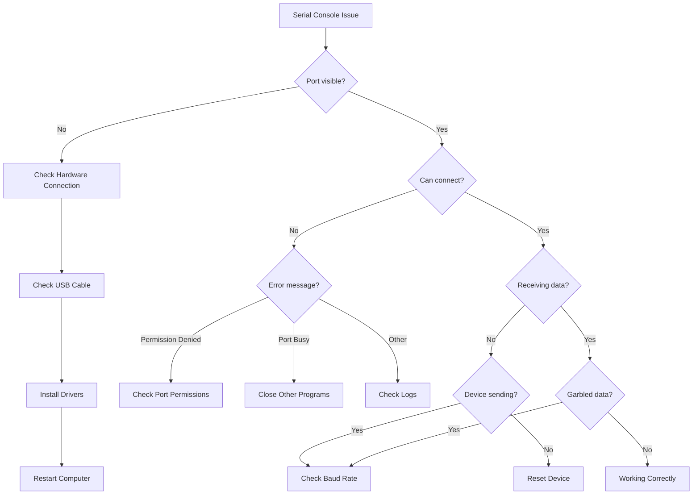
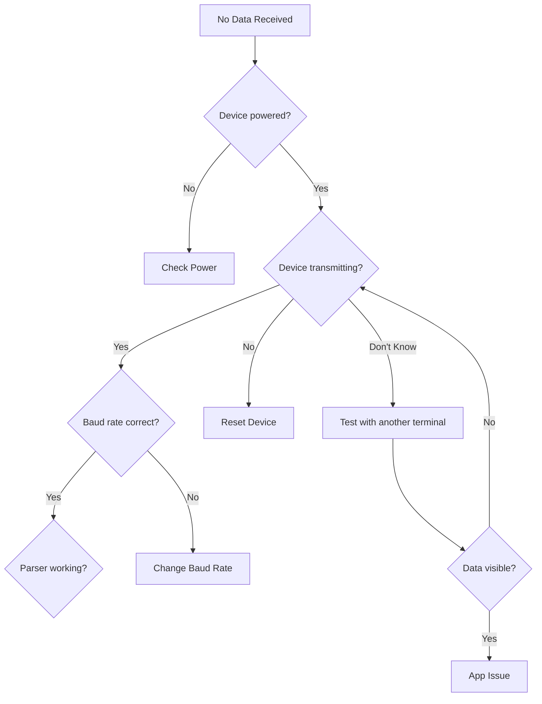
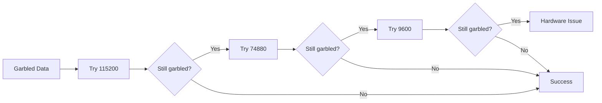

# Serial Console - Troubleshooting Guide

## Table of Contents
1. [Diagnostic Flowchart](#diagnostic-flowchart)
2. [Connection Issues](#connection-issues)
3. [Data Reception Problems](#data-reception-problems)
4. [Communication Errors](#communication-errors)
5. [Port Access Issues](#port-access-issues)
6. [Performance Problems](#performance-problems)
7. [Platform-Specific Issues](#platform-specific-issues)
8. [Common Error Messages](#common-error-messages)
9. [Advanced Diagnostics](#advanced-diagnostics)
10. [FAQ](#faq)

---

## Diagnostic Flowchart



---

## Connection Issues

### Issue: Port Not Visible

**Symptom:**  
Port dropdown is empty or doesn't show expected COM port/ttyUSB device.

**Causes:**

| Cause | Windows | Linux | Solution |
|-------|---------|-------|----------|
| **No USB Connection** | Device Manager shows nothing | `lsusb` shows nothing | Check physical USB connection |
| **Driver Not Installed** | Yellow exclamation in Device Manager | No /dev/ttyUSB* device | Install appropriate driver |
| **Port Conflict** | Port exists but grayed out | Permission denied | Close other programs using port |
| **Hardware Failure** | Device not detected at all | No USB enumeration | Try different USB cable/port |

**Diagnostic Steps:**

**Windows:**
```powershell
# 1. Check Device Manager
devmgmt.msc
# Look under "Ports (COM & LPT)"

# 2. List COM ports
Get-WmiObject Win32_SerialPort | Select-Object Name, DeviceID

# 3. Check USB devices
Get-PnpDevice | Where-Object {$_.Class -eq "Ports"}

# 4. Look for unknown devices
Get-PnpDevice | Where-Object {$_.Status -eq "Error"}
```

**Linux:**
```bash
# 1. List USB devices
lsusb

# 2. Check serial devices
ls -l /dev/ttyUSB* /dev/ttyACM*

# 3. Watch kernel logs
dmesg | tail -20

# 4. Watch for new devices
dmesg -w
# Then plug/unplug device

# 5. Check udev rules
cat /etc/udev/rules.d/*serial*.rules
```

---

### Issue: Cannot Connect (Port Access Denied)

**Symptom:**
```
Error: Failed to open port: Access denied
```
or
```
Error: Failed to open port: Permission denied
```

**Linux Solution:**

```bash
# 1. Check current groups
groups

# 2. Add user to dialout group
sudo usermod -a -G dialout $USER

# 3. Log out and log back in for changes to take effect

# 4. Verify group membership
groups
# Should now include "dialout"

# 5. Check device permissions
ls -l /dev/ttyUSB0
# Should show: crw-rw---- 1 root dialout

# 6. If still not working, change permissions temporarily (for testing)
sudo chmod 666 /dev/ttyUSB0
```

**Alternative (udev rule):**

```bash
# Create udev rule
sudo nano /etc/udev/rules.d/50-serial.rules

# Add this line (replace XXXX:YYYY with your vendor:product ID from lsusb):
SUBSYSTEM=="tty", ATTRS{idVendor}=="XXXX", ATTRS{idProduct}=="YYYY", MODE="0666"

# Example for CH340:
SUBSYSTEM=="tty", ATTRS{idVendor}=="1a86", ATTRS{idProduct}=="7523", MODE="0666"

# Reload udev rules
sudo udevadm control --reload-rules
sudo udevadm trigger
```

**Windows Solution:**

```powershell
# 1. Check if port is in use
$port = "COM3"
Get-Process | Where-Object {$_.MainWindowTitle -match $port}

# 2. Close conflicting programs
# Common culprits: Arduino IDE, PuTTY, TeraTerm, other serial monitors

# 3. Reset port (advanced)
# Device Manager → Right-click port → Disable → Enable

# 4. Reinstall driver
# Device Manager → Right-click port → Uninstall → Scan for hardware changes
```

---

### Issue: Port Busy (Already in Use)

**Symptom:**
```
Error: Port is already open
```
or
```
Error: Resource busy
```

**Cause:** Another application is using the serial port.

**Common Applications:**

| Application | Platform | How to Close |
|-------------|----------|--------------|
| **Arduino IDE** | All | Close Serial Monitor, Close IDE |
| **PuTTY** | Windows | Close PuTTY window |
| **screen** | Linux/macOS | `screen -ls`, then `screen -X -S [id] quit` |
| **minicom** | Linux | Exit minicom, or `killall minicom` |
| **TeraTerm** | Windows | Close TeraTerm window |
| **VSCode PlatformIO** | All | Close Serial Monitor |

**Diagnostic:**

**Linux:**
```bash
# Find processes using serial port
lsof /dev/ttyUSB0

# Example output:
# COMMAND   PID USER   FD   TYPE DEVICE SIZE/OFF NODE NAME
# screen  12345 user    3u   CHR  188,0      0t0  540 /dev/ttyUSB0

# Kill process
kill 12345

# Or force kill
kill -9 12345
```

**Windows:**
```powershell
# Use Process Explorer (from Sysinternals)
# Or check Task Manager for applications with "Serial" or port name
```

---

### Issue: Driver Not Installed

**Symptom:**  
Device appears in Device Manager with yellow exclamation mark, or shows as "Unknown Device".

**Driver Installation:**

**CH340/CH341 (Most Common on ESP32):**

1. **Download:**
   - Windows: [CH341SER.EXE](http://www.wch-ic.com/downloads/CH341SER_EXE.html)
   - Linux: Usually built into kernel (module: `ch341`)

2. **Install (Windows):**
   ```
   - Run CH341SER.EXE as Administrator
   - Click "Install"
   - Restart computer if prompted
   ```

3. **Verify (Windows):**
   ```powershell
   Get-WmiObject Win32_SerialPort | Where-Object {$_.Name -like "*CH340*"}
   ```

4. **Load Module (Linux):**
   ```bash
   # Check if module loaded
   lsmod | grep ch341
   
   # If not loaded
   sudo modprobe ch341
   
   # Verify
   dmesg | grep ch341
   ```

**CP2102/CP210x (Silicon Labs):**

1. **Download:**
   - [CP210x VCP Drivers](https://www.silabs.com/developers/usb-to-uart-bridge-vcp-drivers)

2. **Install (Windows):**
   - Run installer as Administrator
   - Follow installation wizard

3. **Verify (Windows):**
   ```powershell
   Get-WmiObject Win32_SerialPort | Where-Object {$_.Name -like "*CP210*"}
   ```

**FTDI (FT232):**

1. **Download:**
   - [FTDI VCP Drivers](https://ftdichip.com/drivers/vcp-drivers/)

2. **Install:**
   - Windows: Run installer
   - Linux: Usually built-in (`ftdi_sio` module)

---

## Data Reception Problems

### Issue: No Data Received

**Symptom:**  
Connected successfully, but console shows no messages.

**Diagnostic Flowchart:**



**Verification Steps:**

**1. Test Device with External Terminal:**

**Windows - PuTTY:**
```
1. Open PuTTY
2. Connection type: Serial
3. Serial line: COM3 (your port)
4. Speed: 115200
5. Click "Open"
6. Should see data if device is transmitting
```

**Linux - screen:**
```bash
# Install screen
sudo apt-get install screen

# Connect
screen /dev/ttyUSB0 115200

# Exit: Ctrl+A, then K, then Y
```

**2. Check Device is Transmitting:**

```bash
# Use esptool to read chip info (proves serial working)
esptool.py --port COM3 chip_id

# Should output chip information
```

**3. Try Different Baud Rates:**

ESP32 common baud rates to test:
- **115200** (application default)
- **74880** (ROM bootloader)
- **9600** (some firmware)

**4. Reset Device:**

- Press physical RESET button on ESP32
- Or send reset command (if firmware supports)
- Watch for boot messages

**5. Check RX/TX Not Swapped:**

Verify correct USB-to-Serial wiring:
- Device TX → Adapter RX
- Device RX → Adapter TX
- GND → GND

---

### Issue: Garbled or Corrupted Data

**Symptom:**  
Console shows characters like: `���Ϥ�����ţ��`

**Cause:** Baud rate mismatch.

**Solution:**



**ESP32 Baud Rate Notes:**

```
Boot Stage         | Baud Rate | What You See
-------------------|-----------|-------------
ROM Bootloader     | 74880     | Boot mode info
Secondary Bootloader| 115200   | Loading messages  
Application        | 115200    | Your app logs
```

**Example Output at Wrong Baud Rate:**

```
At 115200 when device is at 74880:
���r�~�b|�b�b��bnn�lnn�og�b

At 74880 (correct):
rst:0x1 (POWERON),boot:0x13 (SPI_FAST_FLASH_BOOT)
```

**Fix:**

1. Change baud rate dropdown to **74880** (or type manually)
2. Click **Connect**
3. Press **RESET** on ESP32
4. Should see clear ROM bootloader messages
5. After boot, change to **115200** for application logs

---

### Issue: Incomplete Lines or Missing Data

**Symptom:**  
Messages appear cut off or split incorrectly.

**Cause:** Buffer overflow or parsing issue.

**Example:**

```
Expected:
I (123) wifi: Connected to network

Actual:
I (123) wi
fi: Connected to network
```

**Debug:**

```javascript
// In renderer console (F12)
const messages = await electronAPI.getSerialConsoleMessages();
console.log('Message count:', messages.length);

// Check for very long messages
messages.forEach((msg, i) => {
  if (msg.data.length > 200) {
    console.log(`Long message ${i}:`, msg.data.length, 'chars');
  }
});
```

**Solution:**

1. **Increase Buffer Size:**
   ```javascript
   // In serial-console.js
   this.maxMessages = 2000;  // Increase from 1000
   ```

2. **Check Parser Delimiter:**
   ```javascript
   // Ensure using correct delimiter
   this.parser = this.port.pipe(new ReadlineParser({ 
     delimiter: '\n'  // or '\r\n' if needed
   }));
   ```

---

## Communication Errors

### Issue: Cannot Send Commands

**Symptom:**  
Typing in input field and pressing Enter does nothing.

**Diagnostic:**

```javascript
// Browser console (F12)

// 1. Check connection status
const status = await electronAPI.getSerialConsoleStatus();
console.log('Connected:', status.isConnected);

// 2. Try sending directly
const result = await electronAPI.sendSerialConsoleMessage('test');
console.log('Send result:', result);

// 3. Check for errors
// Look in console for error messages
```

**Common Causes:**

| Cause | Symptom | Fix |
|-------|---------|-----|
| Not connected | Status shows "Disconnected" | Click Connect |
| Input field disabled | Cannot type | Check UI state |
| JavaScript error | Console shows error | Check browser DevTools |
| IPC handler missing | No response | Check main.js handlers |

---

### Issue: Device Not Responding to Commands

**Symptom:**  
Commands sent successfully, but device doesn't respond.

**Verification:**

1. **Check command is received:**
   ```
   Input: status
   Console shows: > status
   ```

2. **Check device supports command:**
   - Some firmware doesn't have command interface
   - Try: `help`, `?`, `AT`, `menu`

3. **Check line endings:**
   ```javascript
   // In serial-console.js send() method
   // Try different line endings:
   const dataToSend = data + '\n';    // LF
   // or
   const dataToSend = data + '\r\n';  // CRLF
   // or
   const dataToSend = data + '\r';    // CR
   ```

4. **Test with echo firmware:**
   ```c
   // Upload simple echo firmware to ESP32
   void loop() {
     if (Serial.available()) {
       char c = Serial.read();
       Serial.print("Echo: ");
       Serial.println(c);
     }
   }
   ```

---

## Port Access Issues

### Issue: Permission Denied (Linux)

**Full Error:**
```
Error: Error: Permission denied, cannot open /dev/ttyUSB0
```

**Solution (Permanent):**

```bash
# 1. Add user to dialout group
sudo usermod -a -G dialout $USER

# 2. Log out and log back in (required!)
exit

# 3. After logging back in, verify
groups
# Should include "dialout"

# 4. Test connection
cat /dev/ttyUSB0
# Should not show "Permission denied"
```

**Solution (Temporary, for testing):**

```bash
# Give everyone permission (not recommended for permanent use)
sudo chmod 666 /dev/ttyUSB0

# This will reset on device unplug/replug
```

---

### Issue: Port Permissions Reset on Replug (Linux)

**Symptom:**  
Port works after `chmod 666`, but stops working after unplugging and replugging device.

**Cause:** udev rules not set up.

**Permanent Solution:**

```bash
# 1. Find vendor and product ID
lsusb
# Look for your device, note XXXX:YYYY

# Example output:
# Bus 001 Device 005: ID 1a86:7523 QinHeng Electronics HL-340 USB-Serial adapter

# 2. Create udev rule
sudo nano /etc/udev/rules.d/50-usb-serial.rules

# 3. Add rule (replace XXXX:YYYY with your IDs):
SUBSYSTEM=="tty", ATTRS{idVendor}=="1a86", ATTRS{idProduct}=="7523", MODE="0666", SYMLINK+="ttyUSB_ESP32"

# 4. Reload udev
sudo udevadm control --reload-rules
sudo udevadm trigger

# 5. Unplug and replug device

# 6. Verify
ls -l /dev/ttyUSB0
# Should show: crw-rw-rw- (666 permissions)
```

---

## Performance Problems

### Issue: UI Freezes with Many Messages

**Symptom:**  
Console becomes unresponsive after receiving thousands of messages.

**Cause:** DOM overload.

**Solutions:**

**1. Clear Messages Regularly:**
```javascript
// Auto-clear old messages every 5 minutes
setInterval(() => {
  if (serialConsole.messages.length > 500) {
    serialConsole.clearMessages();
  }
}, 300000);
```

**2. Limit DOM Children:**
```javascript
// In updateMessagesOnly()
while (container.children.length > 500) {
  container.removeChild(container.firstChild);
}
```

**3. Disable Auto-Scroll:**
- Uncheck "Auto-scroll" checkbox
- Reduces browser reflow calculations

**4. Increase Update Interval:**
```javascript
// Batch updates every 100ms instead of every message
let updateTimer = null;
electronAPI.onSerialMessage((message) => {
  this.messages.push(message);
  
  if (!updateTimer) {
    updateTimer = setTimeout(() => {
      this.updateMessagesOnly();
      updateTimer = null;
    }, 100);
  }
});
```

---

### Issue: Memory Leak

**Symptom:**  
Application memory usage grows continuously over time.

**Diagnostic:**

```javascript
// Chrome DevTools Memory Profiler
// 1. Open DevTools (F12)
// 2. Go to Memory tab
// 3. Take heap snapshot
// 4. Let serial console run for 10 minutes
// 5. Take another snapshot
// 6. Compare

// Look for:
// - Growing arrays
// - Unreleased event listeners
```

**Solutions:**

**1. Enforce Message Limit:**
```javascript
// In SerialConsole.connect()
this.parser.on('data', (data) => {
  const message = {
    timestamp: new Date().toISOString(),
    data: data.toString().trim()
  };

  this.messages.push(message);

  // Enforce limit
  if (this.messages.length > this.maxMessages) {
    this.messages.shift();  // Remove oldest
  }
});
```

**2. Clean Up on Disconnect:**
```javascript
disconnect() {
  // Remove parser listener
  if (this.parser) {
    this.parser.removeAllListeners();
  }
  
  // Remove port listeners
  if (this.port) {
    this.port.removeAllListeners();
  }
  
  // Clear callback
  this.onMessageCallback = null;
}
```

---

## Platform-Specific Issues

### Windows: CH340 Driver Issues

**Symptom:**  
CH340 device shows in Device Manager but cannot connect.

**Solution:**

1. **Uninstall old driver:**
   ```
   Device Manager → USB-SERIAL CH340 → Right-click → Uninstall device
   Check "Delete the driver software" → OK
   ```

2. **Download latest driver:**
   - [CH341SER.EXE](http://www.wch-ic.com/downloads/CH341SER_EXE.html)

3. **Install as Administrator:**
   ```
   Right-click CH341SER.EXE → Run as administrator → Install
   ```

4. **Restart computer**

5. **Verify:**
   ```powershell
   Get-WmiObject Win32_SerialPort | Select-Object Name, DeviceID
   # Should show: USB-SERIAL CH340 (COMX)
   ```

---

### Linux: ModemManager Interference

**Symptom:**  
Port appears briefly then disappears, or connection fails immediately.

**Cause:** ModemManager trying to probe device as modem.

**Solution:**

```bash
# 1. Stop ModemManager
sudo systemctl stop ModemManager

# 2. Disable permanently
sudo systemctl disable ModemManager

# 3. Or blacklist your device
# Create file: /etc/udev/rules.d/99-usb-serial.rules
# Add (replace XXXX:YYYY with your device):
ATTRS{idVendor}=="1a86", ATTRS{idProduct}=="7523", ENV{ID_MM_DEVICE_IGNORE}="1"

# 4. Reload udev
sudo udevadm control --reload-rules
```

---

### macOS: Kernel Extension Blocked

**Symptom:**  
Driver installed but port not appearing.

**Solution:**

1. **Open System Preferences**

2. **Security & Privacy → General**

3. **Look for message about blocked software**

4. **Click "Allow"**

5. **Restart Mac**

6. **Verify:**
   ```bash
   ls /dev/cu.* /dev/tty.*
   # Should show: /dev/cu.usbserial-XXXX
   ```

---

## Common Error Messages

### Error Reference Table

| Error Message | Meaning | Solution |
|---------------|---------|----------|
| **"Permission denied"** | No access to port | Add user to `dialout` group (Linux) |
| **"Port is already open"** | Another program using port | Close other serial programs |
| **"No such file or directory"** | Port path invalid | Check port exists: `ls /dev/ttyUSB*` |
| **"Device not configured"** | Driver issue | Reinstall drivers |
| **"Resource busy"** | Port locked by another process | `lsof /dev/ttyUSB0`, kill process |
| **"Failed to open port"** | Generic open failure | Check all above causes |

---

### Error: "Failed to open port: Access denied"

**Full Stack Trace:**
```
Error: Failed to open port: Access denied
    at SerialConsole.connect (serial-console.js:45:15)
    at async IpcMainImpl.handle (electron/js2c/browser_init.js:186:10)
```

**Windows Fix:**
1. Close all programs using the port
2. Check Device Manager for driver issues
3. Try different USB port

**Linux Fix:**
```bash
# Add to dialout group
sudo usermod -a -G dialout $USER

# Log out and back in

# Verify
groups | grep dialout
```

---

## Advanced Diagnostics

### Enable Debug Logging

**Backend (serial-console.js):**

```javascript
class SerialConsole {
  constructor() {
    super();
    this.debug = true;  // Enable debug
  }

  log(message) {
    if (this.debug) {
      const timestamp = new Date().toISOString();
      console.log(`[Serial Debug ${timestamp}] ${message}`);
    }
  }

  async connect(portPath, baudRate) {
    this.log(`Attempting connection to ${portPath} @ ${baudRate} baud`);
    // ... rest of method
  }
}
```

**Frontend (SerialConsoleModule.js):**

```javascript
class SerialConsoleModule {
  constructor(app) {
    this.app = app;
    this.debug = true;
  }

  async connect() {
    if (this.debug) {
      console.log('[Serial UI] Connecting to:', this.selectedPort, this.baudRate);
    }
    // ...
  }
}
```

---

### Raw Port Monitor

**Test script to monitor raw port data:**

```javascript
// test-serial-raw.js
const { SerialPort } = require('serialport');

const port = new SerialPort({
  path: '/dev/ttyUSB0',
  baudRate: 115200
});

port.on('open', () => {
  console.log('Port opened');
});

port.on('data', (data) => {
  console.log('Raw hex:', data.toString('hex'));
  console.log('Raw ASCII:', data.toString('ascii'));
  console.log('---');
});

port.on('error', (err) => {
  console.error('Error:', err);
});

// Keep running
process.on('SIGINT', () => {
  port.close();
  process.exit();
});
```

**Run:**
```bash
node test-serial-raw.js
```

---

### Hardware Loopback Test

**Test if serial adapter is working:**

**1. Short TX and RX pins together** (loopback mode)

**2. Run test script:**

```javascript
// test-loopback.js
const { SerialPort } = require('serialport');

const port = new SerialPort({
  path: '/dev/ttyUSB0',
  baudRate: 115200
});

port.on('open', () => {
  console.log('Port opened. Testing loopback...');
  
  // Send test data
  port.write('HELLO', (err) => {
    if (err) {
      console.error('Write error:', err);
    } else {
      console.log('Sent: HELLO');
    }
  });
});

port.on('data', (data) => {
  console.log('Received:', data.toString());
  // Should receive: HELLO (if loopback working)
  process.exit(0);
});

setTimeout(() => {
  console.log('Timeout - no data received');
  process.exit(1);
}, 3000);
```

**Expected:** Should receive back what was sent.

---

## FAQ

### Q: Which COM port is my ESP32?

**Windows:**
```powershell
# Unplug ESP32, run:
Get-WmiObject Win32_SerialPort | Select-Object DeviceID

# Note the ports. Plug in ESP32, run again:
Get-WmiObject Win32_SerialPort | Select-Object DeviceID

# The new port is your ESP32
```

**Linux:**
```bash
# Before plugging:
ls /dev/ttyUSB* /dev/ttyACM*

# After plugging:
ls /dev/ttyUSB* /dev/ttyACM*

# New device is your ESP32
```

---

### Q: Why do I see garbage during ESP32 reset?

**A:** ESP32 ROM bootloader outputs at **74880 baud** (non-standard). This is expected. After boot, application runs at **115200 baud**.

**To see bootloader messages clearly:**
- Use external terminal (PuTTY, screen) at 74880 baud
- Or ignore garbled text - it's just bootloader

---

### Q: How do I test if my USB cable is good?

**A:**
1. Try cable with phone charger - if charges, cable has power
2. Try different cable - if new cable works, old cable is bad
3. Data cables have 4 wires, charge-only cables have 2

**Test:**
```bash
# Linux - device should enumerate
dmesg | tail
# Should show USB device detection

# If shows "new device" but no serial port, likely charge-only cable
```

---

### Q: Can I connect multiple devices simultaneously?

**A:** Current implementation supports single connection. To connect multiple:

1. Open multiple instances of application (if supported)
2. Or modify code to support multiple connections:

```javascript
class SerialConsoleManager {
  constructor() {
    this.connections = new Map();
  }

  async connect(id, portPath, baudRate) {
    const serial = new SerialConsole();
    await serial.connect(portPath, baudRate);
    this.connections.set(id, serial);
    return id;
  }

  getConnection(id) {
    return this.connections.get(id);
  }
}
```

---

### Q: How do I capture logs to file?

**Manual Method:**
1. Select all text in console (Ctrl+A)
2. Copy (Ctrl+C)
3. Paste into text editor
4. Save as .txt file

**Programmatic Method:**

```javascript
// Add to SerialConsole class
saveToFile(filename) {
  const fs = require('fs');
  const content = this.messages.map(msg => {
    return `${msg.timestamp} ${msg.data}`;
  }).join('\n');
  
  fs.writeFileSync(filename, content);
  console.log(`Saved ${this.messages.length} messages to ${filename}`);
}
```

---

### Q: ESP32 stuck in boot loop, how to see errors?

**A:**

1. Connect Serial Console at 115200 baud
2. Press Reset on ESP32
3. Watch for error messages:

```
rst:0x3 (SW_RESET),boot:0x13
Brownout detector was triggered

or

Guru Meditation Error: Core 0 panic'ed (LoadProhibited)

or

E (123) spi_flash: Detected size(4MB) smaller than the size in the binary image header(16MB)
```

4. Note the error message
5. Search ESP32 forums for specific error
6. Common fixes:
   - Flash size mismatch → use correct flash settings
   - Brownout → check power supply
   - Panic → debug firmware with stack trace

---

## Summary

This troubleshooting guide covered:

✅ **Diagnostic Flowcharts** - Visual problem resolution paths  
✅ **Connection Issues** - Port visibility, access denied, driver problems  
✅ **Data Reception** - No data, garbled output, incomplete messages  
✅ **Communication Errors** - Send failures, device not responding  
✅ **Port Access** - Permission issues, udev rules, port busy  
✅ **Performance** - UI freezes, memory leaks, optimization  
✅ **Platform-Specific** - Windows drivers, Linux ModemManager, macOS security  
✅ **Error Messages** - Complete reference with solutions  
✅ **Advanced Diagnostics** - Debug logging, raw monitoring, loopback tests  
✅ **FAQ** - Common questions with detailed answers  

**Quick Reference:**

| Problem | First Check | Quick Fix |
|---------|-------------|-----------|
| Port not visible | USB connected? | Check cable, install drivers |
| Cannot connect | Permissions? | `sudo usermod -a -G dialout $USER` (Linux) |
| Garbled data | Baud rate? | Try 115200, then 74880 |
| No data | Device transmitting? | Reset device, test with another terminal |
| Port busy | Other programs? | Close Arduino IDE, PuTTY, etc. |

**Need More Help?**  
Check application logs in: `%APPDATA%\nube-eol-toolkit\logs\`
