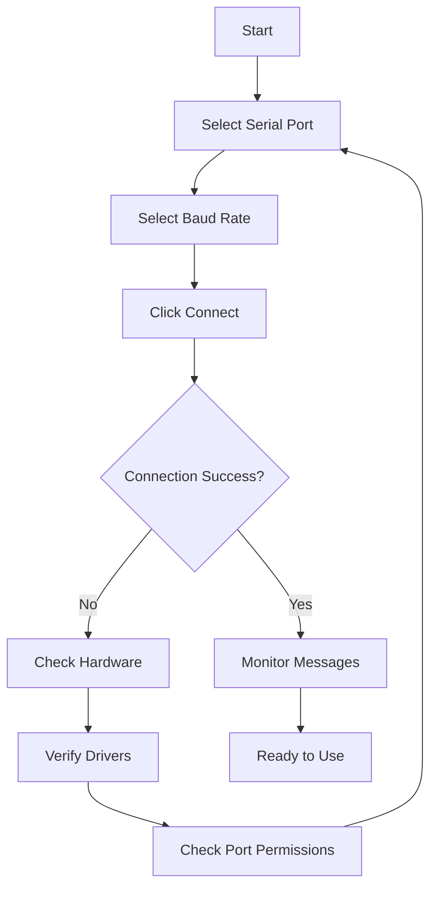
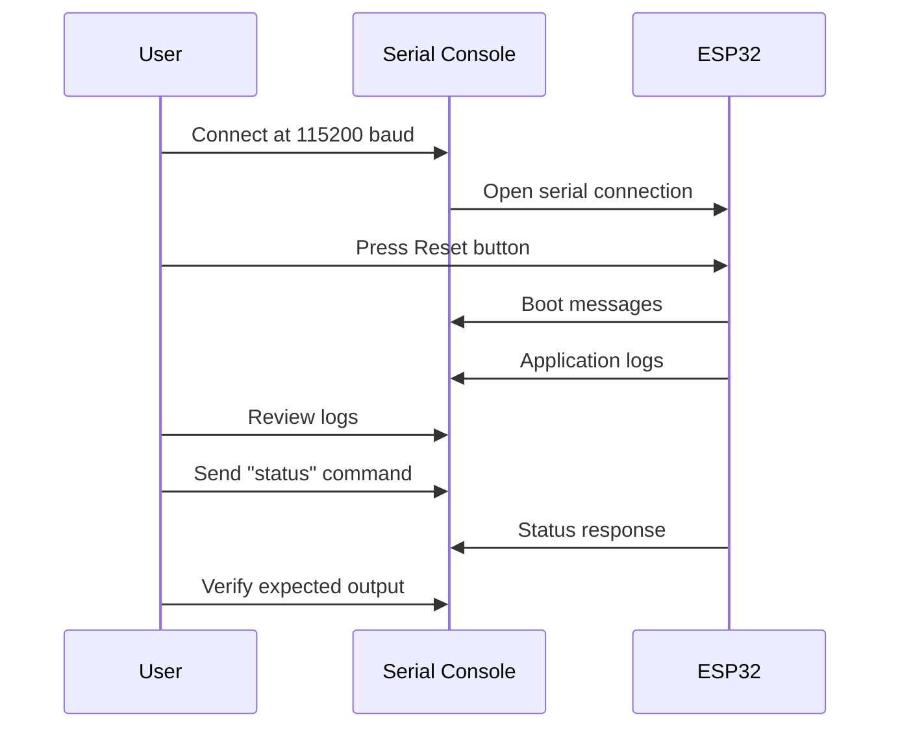

# Serial Console - User Guide

## Table of Contents
1. [Getting Started](#getting-started)
2. [Connection Setup](#connection-setup)
3. [Monitoring Serial Output](#monitoring-serial-output)
4. [Sending Commands](#sending-commands)
5. [Common Workflows](#common-workflows)
6. [Best Practices](#best-practices)
7. [Tips & Tricks](#tips--tricks)

---

## Getting Started

### What You Need

**Hardware:**
- ESP32 development board or compatible device
- USB cable (USB-A to Micro-USB or USB-C, depending on board)
- Computer with available USB port

**Software:**
- Nube EOL Toolkit installed
- USB-to-Serial drivers installed (if required)

**Driver Installation:**

| Chip | Manufacturer | Driver Download |
|------|--------------|-----------------|
| **CP2102** | Silicon Labs | [Download](https://www.silabs.com/developers/usb-to-uart-bridge-vcp-drivers) |
| **CH340** | WCH | [Download](http://www.wch-ic.com/downloads/CH341SER_EXE.html) |
| **FTDI** | FTDI Chip | [Download](https://ftdichip.com/drivers/vcp-drivers/) |

**Check Driver Installation (Windows):**
```powershell
# List COM ports
Get-WmiObject Win32_SerialPort | Select-Object Name, DeviceID, Description

# Expected output:
# Name                  DeviceID  Description
# ----                  --------  -----------
# USB-SERIAL CH340 (COM3)  COM3   USB-SERIAL CH340
```

**Check Driver Installation (Linux):**
```bash
# List USB serial devices
ls /dev/ttyUSB* /dev/ttyACM*

# Check device info
dmesg | grep tty

# Add user to dialout group
sudo usermod -a -G dialout $USER
# Log out and log back in for changes to take effect
```

### First Connection

1. **Connect Hardware:**
   - Plug ESP32 into computer via USB cable
   - Wait for drivers to load (Windows may auto-install)
   - LED on ESP32 should light up

2. **Open Serial Console:**
   - Launch Nube EOL Toolkit
   - Click **"Serial Console"** tab in navigation menu

3. **Verify Port Detected:**
   - Check "Serial Port" dropdown
   - Should show available ports (e.g., COM3, /dev/ttyUSB0)
   - If no ports shown, click refresh button (🔄)

---

## Connection Setup

### Step-by-Step Connection



### 1. Select Serial Port

**Windows Example:**
- Port will appear as **COM3**, **COM4**, etc.
- Usually the highest COM number is the most recent device

**Linux Example:**
- ESP32 with CH340: **/dev/ttyUSB0**
- ESP32 with CP2102: **/dev/ttyUSB0** or **/dev/ttyUSB1**
- Arduino boards: **/dev/ttyACM0**

**Port Information:**

The dropdown shows:
```
COM3 (Silicon Labs CP210x)
```
or
```
/dev/ttyUSB0 (FTDI)
```

**If Port Not Showing:**
1. Click refresh button (🔄) next to dropdown
2. Unplug and replug USB cable
3. Check Device Manager (Windows) or `dmesg` (Linux)
4. Install appropriate drivers

### 2. Select Baud Rate

**Common Baud Rates:**

| Baud Rate | Use Case |
|-----------|----------|
| **115200** | ✅ **ESP32 default** - Use this for most ESP32 devices |
| 9600 | Legacy devices, GPS modules |
| 57600 | Some Arduino boards |
| 230400 | High-speed logging |
| 460800 | Very high-speed data |
| 921600 | Maximum speed (may be unreliable on some hardware) |

**ESP32 Special Note:**
- ESP32 ROM bootloader outputs at **74880 baud** during reset
- Application firmware typically uses **115200 baud**
- If you see garbled text during boot, it's the bootloader (expected)

### 3. Connect

**Click the "🔌 Connect" button**

**Success Indicators:**
- Button changes to "🔌 Disconnect" (red)
- Status dot turns **green**
- Status text shows "Connected (COM3)" or similar
- Message counter appears

**Connection State Display:**

```
┌─────────────────────────────────────────────┐
│ Serial Console                              │
│ 🟢 Connected (COM3) | 15 messages          │
│ [🔌 Disconnect] [🗑️ Clear]                 │
└─────────────────────────────────────────────┘
```

---

## Monitoring Serial Output

### Understanding the Console

**Console Layout:**

```
┌───────────────────────────────────────────────────────────────┐
│  14:23:45  ESP-ROM:esp32s3-20210327                           │
│  14:23:45  Build:Mar 27 2021                                  │
│  14:23:45  rst:0x1 (POWERON),boot:0x13 (SPI_FAST_FLASH_BOOT) │
│  14:23:45  mode:DIO, clock div:1                              │
│  14:23:45  entry 0x403c9938                                   │
│  14:23:46  I (123) main: Starting application...              │
│  14:23:46  I (124) wifi: WiFi initialized                     │
│  14:23:47  I (1234) main: System ready                        │
│  > ESP32 status                                               │
│  14:23:48  Temperature: 45.2°C, Uptime: 2s                    │
└───────────────────────────────────────────────────────────────┘
```

**Message Components:**

| Component | Example | Description |
|-----------|---------|-------------|
| **Timestamp** | `14:23:45` | Local time when message received |
| **Message Text** | `I (123) main: Starting...` | Actual serial data |
| **Sent Indicator** | `> ESP32 status` | Prefixed with `>` |
| **Color Coding** | Blue for sent, gray for received | Visual distinction |

### Message Types

**1. Boot Messages (ESP32):**
```
ESP-ROM:esp32s3-20210327
Build:Mar 27 2021
rst:0x1 (POWERON),boot:0x13 (SPI_FAST_FLASH_BOOT)
```
- Indicates ESP32 is booting
- Shows reset reason and boot mode
- May appear garbled if baud rate doesn't match

**2. Application Logs:**
```
I (123) main: Starting application...
W (456) wifi: Connection timeout
E (789) mqtt: Failed to connect
```
- **I** = Info
- **W** = Warning  
- **E** = Error
- Number in parentheses = Timestamp (milliseconds since boot)

**3. Debug Output:**
```
[DEBUG] Sensor reading: 23.5
[TRACE] Function called: init_wifi
```
- Custom debug messages from firmware
- Useful for tracking program flow

### Auto-Scroll Behavior

**Default:** Auto-scroll is **OFF**

**When Enabled:**
- Console automatically scrolls to show latest messages
- Useful for continuous monitoring

**When Disabled:**
- Console stays at current scroll position
- Allows reading older messages without interruption

**To Toggle:**
- Check/uncheck "Auto-scroll" checkbox in UI

**Tip:** Auto-scroll automatically disables when you manually scroll up.

---

## Sending Commands

### Basic Command Sending

**Steps:**

1. **Ensure Connected**
   - Status must show "Connected"
   - Disconnect button should be visible

2. **Type Command**
   - Click in input field at bottom
   - Type your command or message

3. **Send**
   - Press **Enter** key, OR
   - Click **Send** button

**Example:**
```
Input: status
```

**Result:**
```
> status
Temperature: 45.2°C
Uptime: 123s
WiFi: Connected
```

### Common Commands

**AT Commands (if device supports):**

| Command | Description | Example Response |
|---------|-------------|------------------|
| `AT` | Test AT interface | `OK` |
| `AT+GMR` | Get firmware version | `AT version:2.1.0.0` |
| `AT+CWMODE=1` | Set WiFi station mode | `OK` |
| `AT+CWJAP="SSID","pass"` | Connect to WiFi | `WIFI CONNECTED\nOK` |

**Custom Commands (firmware-specific):**

| Command | Description | Example |
|---------|-------------|---------|
| `help` | Show available commands | `Available: status, reset, test` |
| `status` | Get device status | `Temperature: 45°C, Uptime: 10s` |
| `reset` | Reboot device | `Resetting...` |
| `test` | Run self-test | `Test passed` |
| `config wifi "SSID" "password"` | Configure WiFi | `WiFi configured` |

### Interactive Sessions

**Example: WiFi Configuration**

```
User Input:  > config wifi start
Device:      WiFi config mode active. Enter SSID:

User Input:  > MyHomeWiFi
Device:      SSID set. Enter password:

User Input:  > MyPassword123
Device:      Password set. Connecting...
Device:      WiFi connected! IP: 192.168.1.100

User Input:  > config wifi stop
Device:      WiFi config mode exited.
```

### Command History

**Feature:** Recently sent commands are stored (browser-dependent)

**Access:**
- Use **Up Arrow** key to cycle through previous commands
- Use **Down Arrow** key to go back to newer commands

---

## Common Workflows

### Workflow 1: ESP32 Firmware Debugging

**Scenario:** You've just flashed new firmware and want to verify it works.



**Steps:**

1. **Flash Firmware:**
   - Use ESP32 Flasher tab to upload firmware
   - Wait for "Flash completed successfully"

2. **Connect Serial Console:**
   - Select correct COM port
   - Set baud rate to **115200**
   - Click **Connect**

3. **Reset ESP32:**
   - Press physical **RESET** button on board
   - Or send command: `reset`

4. **Monitor Boot Sequence:**
   ```
   ESP-ROM:esp32s3-20210327
   Build:Mar 27 2021
   rst:0x1 (POWERON),boot:0x13
   I (10) boot: ESP-IDF v4.4.1
   I (15) boot: Starting app from partition 'factory'
   I (123) main: Application started successfully
   ```

5. **Verify Expected Behavior:**
   - Check for errors in logs
   - Verify initialization messages
   - Test commands

6. **Debug Issues:**
   - Look for error messages (E tag)
   - Check warning messages (W tag)
   - Send diagnostic commands

---

### Workflow 2: Production Device Testing

**Scenario:** Testing devices on production line.

**Test Sequence:**

```
Test Step 1: Power On
Expected:    Boot sequence completes without errors
Verify:      Look for "System ready" message

Test Step 2: WiFi Test
Command:     test wifi
Expected:    WiFi scan shows networks
Verify:      At least 3 networks detected

Test Step 3: Sensor Test
Command:     test sensors
Expected:    Temperature reading within 20-30°C
Verify:      Value is numeric and in range

Test Step 4: Connectivity Test
Command:     test mqtt
Expected:    MQTT connection successful
Verify:      "Connected to broker" message appears
```

**Automated Testing Script:**

```javascript
// test-device.js
async function testDevice() {
  // Connect
  await electronAPI.connectSerialConsole('/dev/ttyUSB0', 115200);
  await sleep(2000);
  
  // Clear previous messages
  await electronAPI.clearSerialConsoleMessages();
  
  // Reset device
  await electronAPI.sendSerialConsoleMessage('reset');
  await sleep(5000);
  
  // Get messages
  const messages = await electronAPI.getSerialConsoleMessages();
  
  // Check for errors
  const errors = messages.filter(m => m.data.includes('ERROR'));
  if (errors.length > 0) {
    console.log('❌ Test FAILED - Errors detected');
    return false;
  }
  
  // Check for "System ready"
  const ready = messages.some(m => m.data.includes('System ready'));
  if (!ready) {
    console.log('❌ Test FAILED - System not ready');
    return false;
  }
  
  console.log('✅ Test PASSED');
  return true;
}
```

---

### Workflow 3: Device Configuration

**Scenario:** Configure device WiFi credentials.

**Steps:**

1. **Enter Configuration Mode:**
   ```
   User: > config start
   ESP32: Configuration mode active
   ESP32: Type 'config wifi SSID PASSWORD' to set WiFi
   ```

2. **Set WiFi Credentials:**
   ```
   User: > config wifi "MyNetwork" "MyPassword123"
   ESP32: WiFi SSID set: MyNetwork
   ESP32: WiFi password set: ********
   ESP32: Credentials saved to NVS
   ```

3. **Test Connection:**
   ```
   User: > wifi connect
   ESP32: Connecting to MyNetwork...
   ESP32: WiFi connected
   ESP32: IP address: 192.168.1.100
   ```

4. **Verify Configuration:**
   ```
   User: > config show
   ESP32: WiFi SSID: MyNetwork
   ESP32: WiFi Status: Connected
   ESP32: IP Address: 192.168.1.100
   ESP32: MQTT Broker: 192.168.1.50:1883
   ```

5. **Exit Configuration Mode:**
   ```
   User: > config save
   ESP32: Configuration saved
   ESP32: Rebooting...
   (Device resets)
   ESP32: System ready
   ```

---

### Workflow 4: Continuous Monitoring

**Scenario:** Monitor device logs over extended period.

**Setup:**

1. **Connect Device:**
   - Select port and baud rate
   - Click Connect

2. **Clear Old Messages:**
   - Click **Clear** button to start fresh

3. **Enable Auto-Scroll:**
   - Check "Auto-scroll" checkbox
   - Console will always show latest messages

4. **Monitor for Events:**
   - Watch for specific patterns
   - Note timestamps of interesting events

**Example Monitoring Session:**

```
14:23:45  System started
14:23:46  WiFi connected
14:23:50  MQTT connected
14:25:00  Sensor reading: Temp=25.1°C, Humidity=45%
14:26:00  Sensor reading: Temp=25.3°C, Humidity=46%
14:27:00  Sensor reading: Temp=25.2°C, Humidity=45%
14:30:15  ⚠️ W (420123) wifi: Beacon timeout
14:30:16  WiFi disconnected
14:30:18  WiFi reconnecting...
14:30:20  WiFi connected
14:30:22  MQTT reconnected
14:31:00  Sensor reading: Temp=25.4°C, Humidity=45%
```

**Analysis:**
- WiFi connection dropped at 14:30:15
- Automatic reconnection worked
- Total downtime: ~7 seconds
- No data loss during reconnection

---

## Best Practices

### Hardware Setup

✅ **DO:**
- Use good quality USB cables (data cables, not charge-only)
- Keep cable length under 3 meters for reliable communication
- Use powered USB hub if connecting multiple devices
- Secure USB connections to prevent accidental disconnects

❌ **DON'T:**
- Use damaged or frayed USB cables
- Connect/disconnect while device is transmitting data
- Hot-plug devices repeatedly (can cause port issues)
- Use very long USB extension cables (signal degradation)

### Baud Rate Selection

✅ **DO:**
- Use **115200** for ESP32 devices (default)
- Match baud rate to device firmware configuration
- Lower baud rate if experiencing data corruption
- Test different baud rates if output is garbled

❌ **DON'T:**
- Use higher baud rates than device supports
- Mix baud rates across different devices without noting configuration
- Assume all devices use the same baud rate

### Message Management

✅ **DO:**
- Clear messages before starting new test session
- Save important logs to file (future feature)
- Note timestamps of critical events
- Use descriptive commands for clarity

❌ **DON'T:**
- Let message buffer grow indefinitely (max 1000 messages)
- Ignore error messages in logs
- Send commands without waiting for response

### Troubleshooting

✅ **DO:**
- Check "Serial Console" is selected in navigation
- Verify device is powered on (LED lit)
- Confirm correct COM port selected
- Test with different baud rate if garbled output
- Try different USB port if connection fails

❌ **DON'T:**
- Keep sending commands if device not responding
- Disconnect without checking if operation is complete
- Ignore driver installation prompts

---

## Tips & Tricks

### Tip 1: Identify Correct COM Port

**Windows:**
```powershell
# List all COM ports with description
Get-WmiObject Win32_SerialPort | Format-Table DeviceID, Description

# Watch for new ports (run before plugging device)
Get-WmiObject Win32_SerialPort | Select-Object DeviceID
# Then plug device and run again - new port is your device
```

**Linux:**
```bash
# Watch for new devices
dmesg -w
# Then plug device - will show ttyUSB0 or ttyACM0

# Or use:
ls /dev/ttyUSB* /dev/ttyACM*
# Before and after plugging device
```

### Tip 2: See ESP32 ROM Bootloader Messages

ESP32 ROM bootloader outputs at **74880 baud** (non-standard).

**To view:**
1. Disconnect if connected
2. Change baud rate to **74880** (not in dropdown - type manually if possible)
3. Or use external terminal: `screen /dev/ttyUSB0 74880`
4. Press ESP32 **RESET** button
5. Will see bootloader messages clearly

**Then change back to 115200 for application logs.**

### Tip 3: Capture Logs for Analysis

**Manual Method:**
1. Open Serial Console
2. Connect device
3. Let it run
4. Select all text in console (Ctrl+A)
5. Copy (Ctrl+C)
6. Paste into text editor
7. Save as `device-log-YYYY-MM-DD-HHMMSS.txt`

**Automated Method (Future Enhancement):**
- "Save Logs" button will export to file
- Include timestamps and device info

### Tip 4: Reset Device from Serial Console

**Hardware Reset:**
- Press physical **RESET** button on ESP32 board
- Causes complete restart
- Useful for testing boot sequence

**Software Reset (if firmware supports):**
```
> reset
```
or
```
> reboot
```
- Depends on firmware command implementation
- May not fully reset hardware state

### Tip 5: Filter Logs in Real-Time

**Browser Console Filtering (Advanced):**

```javascript
// In browser DevTools console (F12)
const messages = await electronAPI.getSerialConsoleMessages();

// Filter errors only
const errors = messages.filter(m => m.data.includes('ERROR') || m.data.includes('E ('));
console.table(errors);

// Filter by tag
const wifiLogs = messages.filter(m => m.data.includes('wifi:'));
console.table(wifiLogs);

// Filter by time range
const recentLogs = messages.filter(m => {
  const time = new Date(m.timestamp);
  const fiveMinAgo = Date.now() - 5*60*1000;
  return time > fiveMinAgo;
});
console.table(recentLogs);
```

### Tip 6: Use Multiple Windows

**Workflow:**
1. Open Serial Console in one window
2. Open ESP32 Flasher in another window (if app supports)
3. Flash firmware in one, monitor output in other
4. No need to disconnect/reconnect

**Benefits:**
- Faster development iteration
- Continuous monitoring during flashing
- Compare logs between firmware versions

### Tip 7: Decode ESP32 Panic Messages

If ESP32 crashes, you'll see:

```
Guru Meditation Error: Core 0 panic'ed (LoadProhibited)
. at 0x400d1234
Stack:
0x3ffb1234:0x400d5678 0x400d9abc:0x400ddef0
...
```

**To Decode:**
1. Copy panic message
2. Use `xtensa-esp32-elf-addr2line` tool (from ESP-IDF)
3. Get human-readable stack trace with file names and line numbers

**Example:**
```bash
xtensa-esp32-elf-addr2line -e build/app.elf 0x400d1234
# Output: /src/main.c:123
```

---

## Summary

This user guide covered:

✅ **Getting Started** - Hardware setup, driver installation, first connection  
✅ **Connection Setup** - Port selection, baud rate configuration, connection process  
✅ **Monitoring** - Understanding console output, message types, auto-scroll  
✅ **Sending Commands** - Basic commands, interactive sessions, command history  
✅ **Workflows** - Debugging, testing, configuration, monitoring  
✅ **Best Practices** - Hardware setup, baud rates, message management  
✅ **Tips & Tricks** - Advanced techniques for power users  

**Quick Reference Card:**

| Task | Action |
|------|--------|
| **Connect** | Select port → Select baud (115200) → Click Connect |
| **Send Command** | Type in input field → Press Enter |
| **Clear Logs** | Click Clear button |
| **Disconnect** | Click Disconnect button |
| **Refresh Ports** | Click 🔄 button next to port dropdown |
| **Enable Auto-Scroll** | Check Auto-scroll checkbox |

**Next Steps:**
- [Technical Overview](./Overview.md) - Understand the architecture
- [Source Code Documentation](./SourceCode.md) - API reference for developers
- [Troubleshooting Guide](./Troubleshooting.md) - Fix common problems

Need help? Check the Troubleshooting guide or contact support.
