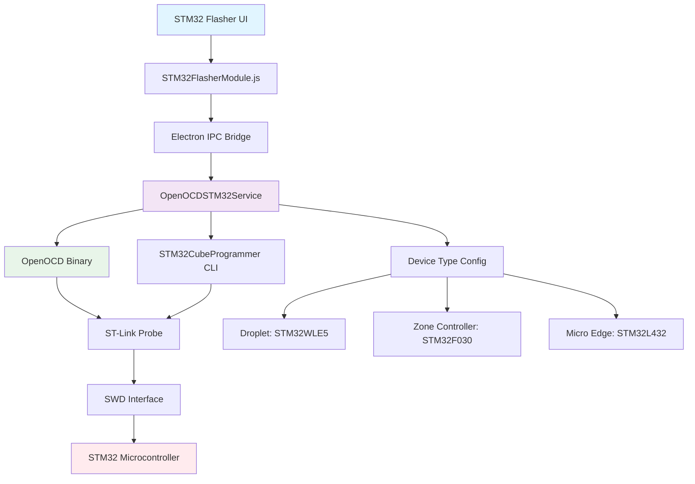
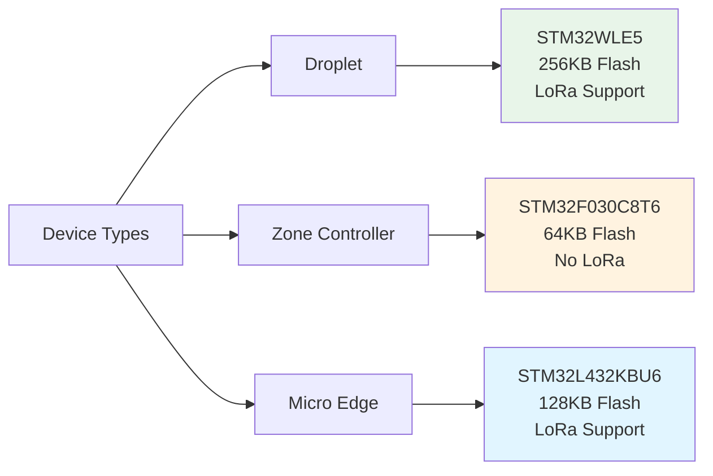
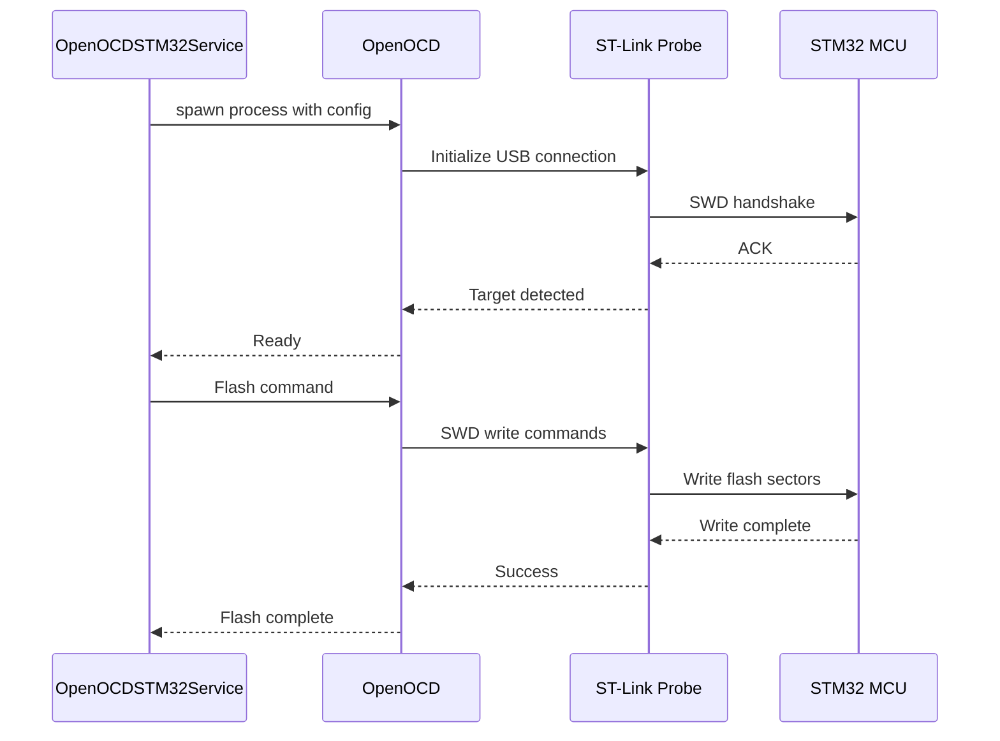
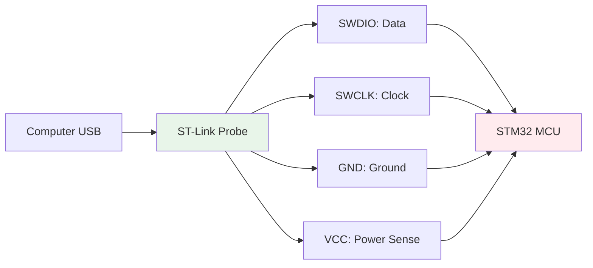
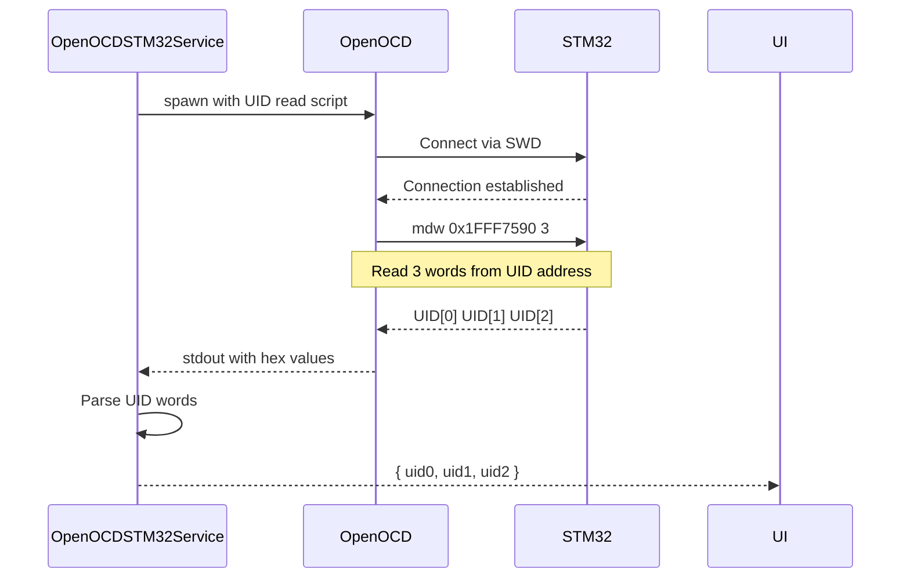
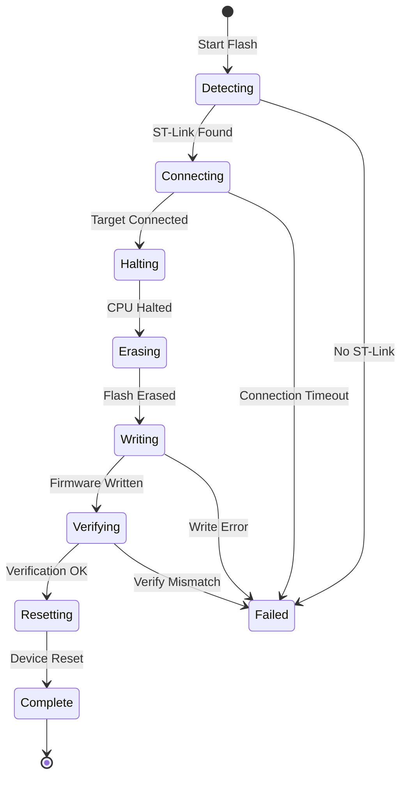
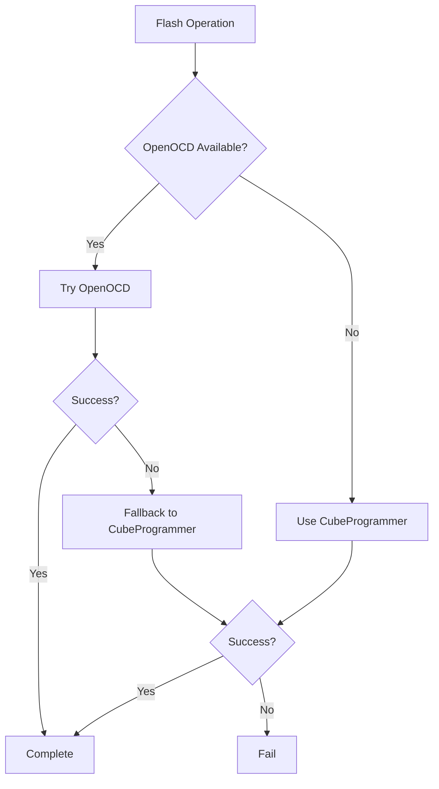

# STM32 Flasher - Technical Overview

## Table of Contents
1. [Introduction](#introduction)
2. [Architecture Overview](#architecture-overview)
3. [Supported Device Types](#supported-device-types)
4. [OpenOCD Integration](#openocd-integration)
5. [ST-Link Protocol](#st-link-protocol)
6. [STM32 Memory Architecture](#stm32-memory-architecture)
7. [UID Reading and LoRa ID](#uid-reading-and-lora-id)
8. [Flash Process](#flash-process)
9. [CubeProgrammer Fallback](#cubeprogrammer-fallback)
10. [Platform Support](#platform-support)

---

## Introduction

The **STM32 Flasher** module provides firmware programming capabilities for STM32 microcontrollers using **OpenOCD** (Open On-Chip Debugger) and **ST-Link** debug probes. This module supports multiple Nube iO device types with different STM32 variants.

### Key Features

- **Multi-Device Support**: Droplet (STM32WLE5), Zone Controller (STM32F030), Micro Edge (STM32L432)
- **OpenOCD Integration**: Industry-standard debug and flash tool
- **ST-Link Interface**: Hardware debugging probe support
- **UID Reading**: Read unique device identifier
- **LoRa ID Calculation**: Automatic LoRa device ID generation
- **CubeProgrammer Fallback**: Alternative flashing via STM32CubeProgrammer CLI
- **Multi-Platform**: Windows, Linux, macOS support

### Use Cases

| Use Case | Description |
|----------|-------------|
| **Factory Programming** | Flash firmware during device manufacturing |
| **Firmware Updates** | Update field devices with new firmware |
| **Device Provisioning** | Read UID and calculate LoRa IDs for registration |
| **Recovery** | Restore bricked devices via SWD interface |
| **Development** | Rapid firmware iteration during development |

---

## Architecture Overview

### System Components



### Component Roles

| Component | Responsibility |
|-----------|----------------|
| **OpenOCDSTM32Service** | Backend service managing flash operations |
| **OpenOCD** | Low-level SWD debugging and flash programming |
| **STM32CubeProgrammer** | Alternative CLI-based programming tool |
| **ST-Link** | Hardware debug probe (USB to SWD adapter) |
| **Device Type Config** | MCU-specific settings (addresses, targets) |

---

## Supported Device Types

### Device Configuration



### Device Specifications

#### 1. Droplet (STM32WLE5)

| Property | Value |
|----------|-------|
| **MCU** | STM32WLE5 (Cortex-M4) |
| **Flash Size** | 256 KB |
| **RAM** | 64 KB |
| **Core Features** | Dual-core (M4 + M0+), LoRa radio |
| **OpenOCD Target** | `stm32wlx.cfg` |
| **Flash Address** | `0x08000000` |
| **UID Address** | `0x1FFF7590` (96-bit unique ID) |
| **LoRa ID Support** | ✅ Yes |

**Use Case:** LoRaWAN sensor nodes, wireless controllers

---

#### 2. Zone Controller (STM32F030C8T6)

| Property | Value |
|----------|-------|
| **MCU** | STM32F030C8T6 (Cortex-M0) |
| **Flash Size** | 64 KB |
| **RAM** | 8 KB |
| **Core Features** | Entry-level, low power |
| **OpenOCD Target** | `stm32f0x.cfg` |
| **Flash Address** | `0x08000000` |
| **UID Address** | `0x1FFFF7AC` (96-bit unique ID) |
| **LoRa ID Support** | ❌ No |

**Use Case:** HVAC zone control, simple controllers

---

#### 3. Micro Edge (STM32L432KBU6)

| Property | Value |
|----------|-------|
| **MCU** | STM32L432KBU6 (Cortex-M4) |
| **Flash Size** | 128 KB |
| **RAM** | 64 KB |
| **Core Features** | Ultra-low-power, DSP, FPU |
| **OpenOCD Target** | `stm32l4x.cfg` |
| **Flash Address** | `0x08000000` |
| **UID Address** | `0x1FFF7590` (96-bit unique ID) |
| **LoRa ID Support** | ✅ Yes |

**Use Case:** Edge computing, battery-powered devices

---

### Device Type Selection

```javascript
// Device type configuration object
const DEVICE_TYPES = {
    DROPLET: {
        name: 'Droplet',
        mcu: 'STM32WLE5',
        target: 'stm32wlx.cfg',
        flashSize: '256KB',
        supportsLoRaID: true,
        flashAddress: '0x08000000',
        uidAddress: '0x1FFF7590'
    },
    ZONE_CONTROLLER: { /* ... */ },
    MICRO_EDGE: { /* ... */ }
};
```

---

## OpenOCD Integration

### What is OpenOCD?

**OpenOCD** (Open On-Chip Debugger) is an open-source debugging, in-system programming, and boundary-scan testing tool for embedded targets.

**Capabilities:**
- Flash memory programming
- RAM access
- CPU register reading/writing
- Breakpoint and watchpoint support
- GDB remote debugging

### Architecture



### OpenOCD Configuration Files

**Interface Configuration:** `interface/stlink.cfg`
```tcl
# ST-Link interface configuration
interface hla
hla_layout stlink
hla_device_desc "ST-LINK"
hla_vid_pid 0x0483 0x3748 0x0483 0x374b 0x0483 0x374e
```

**Target Configuration:** `target/stm32wlx.cfg` (Droplet)
```tcl
# STM32WLxx target
source [find target/swj-dp.tcl]
source [find mem_helper.tcl]

set CHIPNAME stm32wlx
set CONNECT_UNDER_RESET 1

# Cortex-M4 core
swj_newdap $_CHIPNAME cpu -irlen 4 -ircapture 0x1 -irmask 0xf
dap create $_CHIPNAME.dap -chain-position $_CHIPNAME.cpu

# Flash bank
set _FLASHNAME $_CHIPNAME.flash
flash bank $_FLASHNAME stm32l4x 0x08000000 0 0 0 $_TARGETNAME
```

### OpenOCD Commands Used

| Command | Purpose | Example |
|---------|---------|---------|
| **init** | Initialize debug adapter | `openocd -f interface/stlink.cfg -f target/stm32wlx.cfg -c "init"` |
| **targets** | List connected targets | `openocd ... -c "targets"` |
| **reset halt** | Reset and halt CPU | `openocd ... -c "reset halt"` |
| **flash write_image** | Program flash | `openocd ... -c "flash write_image erase firmware.bin 0x08000000"` |
| **verify_image** | Verify flash contents | `openocd ... -c "verify_image firmware.bin 0x08000000"` |
| **mdw** | Memory display word | `openocd ... -c "mdw 0x1FFF7590 3"` (read UID) |
| **shutdown** | Close OpenOCD | `openocd ... -c "shutdown"` |

---

## ST-Link Protocol

### ST-Link Debug Probe

**ST-Link** is STMicroelectronics' USB-to-SWD/JTAG debug adapter.

**Versions:**
- **ST-Link V2**: Basic debugging, SWD/JTAG
- **ST-Link V2-1**: Integrated on Nucleo boards
- **ST-Link V3**: High-speed, advanced features

### SWD (Serial Wire Debug)



**SWD Pins:**
- **SWDIO**: Bidirectional data line
- **SWCLK**: Clock signal
- **GND**: Common ground
- **VCC**: Target voltage sense (3.3V)

### Physical Connection

```
┌─────────────────┐         ┌─────────────────┐
│   ST-Link V2    │         │  STM32 Device   │
├─────────────────┤         ├─────────────────┤
│ Pin 1: VCC      │────────►│ 3.3V            │
│ Pin 2: SWCLK    │────────►│ PA14 (SWCLK)    │
│ Pin 3: GND      │────────►│ GND             │
│ Pin 4: SWDIO    │◄───────►│ PA13 (SWDIO)    │
│ Pin 5: NRST     │────────►│ NRST (Reset)    │
└─────────────────┘         └─────────────────┘
```

### SWD Speed Configuration

```javascript
// Speed configurations for different targets
const speedConfigs = {
    DROPLET: 4000,        // 4 MHz (STM32WLE5)
    ZONE_CONTROLLER: 1000, // 1 MHz (STM32F030)
    MICRO_EDGE: 4000      // 4 MHz (STM32L432)
};

// OpenOCD speed command
-c "adapter speed 4000"
```

**Speed Considerations:**
- **Higher Speed (4 MHz)**: Faster flash, requires good connections
- **Lower Speed (1 MHz)**: More reliable, longer wires, noisy environments
- **Connection Quality**: Short wires (< 10cm) support higher speeds

---

## STM32 Memory Architecture

### Memory Map (STM32 Generic)

```
┌─────────────────────────────────┐  0xFFFFFFFF
│  Reserved                       │
├─────────────────────────────────┤  0x60000000
│  External Memory (FMC)          │
├─────────────────────────────────┤  0x40000000
│  Peripherals                    │
├─────────────────────────────────┤  0x20000000
│  SRAM                           │
├─────────────────────────────────┤  0x08000000
│  Flash Memory                   │  ← Firmware stored here
├─────────────────────────────────┤  0x00000000
│  System Memory (Bootloader)     │
└─────────────────────────────────┘
```

### Flash Memory Layout

**Droplet (STM32WLE5) - 256KB:**
```
0x08000000  ┌─────────────────────────────────┐
            │  Interrupt Vector Table         │  1 KB
0x08000400  ├─────────────────────────────────┤
            │  Application Code               │  ~200 KB
            │  (Firmware binary)              │
            ├─────────────────────────────────┤
            │  Configuration Data             │  ~50 KB
            │  (Settings, calibration)        │
0x0803FFFF  └─────────────────────────────────┘
```

**Zone Controller (STM32F030) - 64KB:**
```
0x08000000  ┌─────────────────────────────────┐
            │  Interrupt Vector Table         │  512 bytes
0x08000200  ├─────────────────────────────────┤
            │  Application Code               │  ~60 KB
0x0800FFFF  └─────────────────────────────────┘
```

### Unique ID (UID) Locations

Each STM32 has a factory-programmed 96-bit unique ID.

**UID Structure:**
```
UID[0] (32 bits) → Lot number
UID[1] (32 bits) → Wafer number + Coordinate X/Y
UID[2] (32 bits) → Lot number + Wafer number
```

**Memory Addresses:**

| Device | UID Address | Size | Format |
|--------|-------------|------|--------|
| **Droplet** | `0x1FFF7590` | 96 bits (12 bytes) | 3 × 32-bit words |
| **Zone Controller** | `0x1FFFF7AC` | 96 bits (12 bytes) | 3 × 32-bit words |
| **Micro Edge** | `0x1FFF7590` | 96 bits (12 bytes) | 3 × 32-bit words |

---

## UID Reading and LoRa ID

### UID Reading Process



### OpenOCD UID Read Command

```bash
# Read 3 words (12 bytes) from UID address
openocd \
  -f interface/stlink.cfg \
  -f target/stm32wlx.cfg \
  -c "init" \
  -c "mdw 0x1FFF7590 3" \
  -c "shutdown"

# Output:
# 0x1fff7590: 0x12345678 0x9abcdef0 0x00112233
```

### LoRa ID Calculation

For devices with LoRa support (Droplet, Micro Edge), a unique LoRa device ID is calculated from the UID.

**Algorithm:**

```javascript
/**
 * Calculate LoRa ID from UID
 * @param {number} uid0 - First 32-bit word
 * @param {number} uid1 - Second 32-bit word
 * @param {number} uid2 - Third 32-bit word
 * @param {number} version - Device version (0xC0 for Droplet)
 * @returns {string} - 8-character hex LoRa ID
 */
function calculateLoRaID(uid0, uid1, uid2, version = 0xC0) {
    // Combine UID words
    const combined = (uid0 ^ uid1 ^ uid2) >>> 0;
    
    // XOR with version
    const result = (combined ^ version) >>> 0;
    
    // Format as 8-digit hex (uppercase)
    return result.toString(16).toUpperCase().padStart(8, '0');
}

// Example:
// UID: 0x00340031, 0x33365111, 0x001A0043
// Version: 0xC0
// LoRa ID: 33375200
```

**Calculation Steps:**

```
1. XOR UID words:
   uid0 ⊕ uid1 ⊕ uid2 = 0x332050C3

2. XOR with version:
   0x332050C3 ⊕ 0xC0 = 0x33205003

3. Format as hex:
   LoRa ID = "33205003"
```

### LoRa ID Use Cases

| Use Case | Description |
|----------|-------------|
| **Device Registration** | Unique identifier for LoRaWAN network |
| **Asset Tracking** | Tracking specific devices in fleet |
| **Provisioning** | Automatically register device with server |
| **Duplicate Detection** | Ensure no ID collisions |

---

## Flash Process

### Complete Flash Workflow



### Flash Command Sequence

**OpenOCD Script:**
```tcl
# 1. Initialize
init

# 2. Reset and halt target
reset halt

# 3. Erase flash (optional but recommended)
flash erase_sector 0 0 last

# 4. Write firmware
flash write_image erase firmware.bin 0x08000000

# 5. Verify
verify_image firmware.bin 0x08000000

# 6. Reset and run
reset run

# 7. Shutdown
shutdown
```

### Timing Analysis

**Typical Flash Operation (128KB firmware):**

| Stage | Duration | Description |
|-------|----------|-------------|
| **Detection** | 1-2s | Find ST-Link probe |
| **Connection** | 1-2s | SWD handshake with target |
| **Erase** | 2-5s | Erase flash sectors |
| **Write** | 5-15s | Program flash memory |
| **Verify** | 3-5s | Read back and compare |
| **Reset** | <1s | Reset microcontroller |
| **Total** | **12-30s** | Complete operation |

**Speed Factors:**
- Flash size (larger = longer)
- SWD speed (4 MHz vs 1 MHz)
- Connection quality (retries add time)
- Erase enabled/disabled

---

## CubeProgrammer Fallback

### STM32CubeProgrammer CLI

**STM32CubeProgrammer** is STMicroelectronics' official programming tool.

**Why Fallback?**
- OpenOCD connection issues
- Specific chip variants not fully supported by OpenOCD
- Alternative verification method

### Detection Priority



### CubeProgrammer CLI Commands

**Detection:**
```bash
STM32_Programmer_CLI.exe -l
# Lists connected ST-Link probes
```

**Connect:**
```bash
STM32_Programmer_CLI.exe -c port=SWD freq=4000
# Connect via SWD at 4 MHz
```

**Flash:**
```bash
STM32_Programmer_CLI.exe \
  -c port=SWD \
  -w firmware.bin 0x08000000 \
  -v \
  -s
  
# -w: Write firmware
# -v: Verify
# -s: Start execution after flash
```

**Read UID:**
```bash
STM32_Programmer_CLI.exe \
  -c port=SWD \
  -c "memory read 0x1FFF7590 12"
```

---

## Platform Support

### Binary Locations

**Development Mode:**
```
embedded/
  openocd-binaries/
    windows/
      bin/
        openocd.exe
      openocd/
        scripts/
    linux/
      bin/
        openocd
      share/
        openocd/
          scripts/
    macos/
      bin/
        openocd
```

**Platform Detection:**

```javascript
const platform = process.platform;

switch (platform) {
    case 'win32':
        openocdPath = 'embedded/openocd-binaries/windows/bin/openocd.exe';
        scriptsPath = 'embedded/openocd-binaries/windows/openocd/scripts';
        break;
    case 'linux':
        openocdPath = 'embedded/openocd-binaries/linux/bin/openocd';
        scriptsPath = 'embedded/openocd-binaries/linux/share/openocd/scripts';
        break;
    case 'darwin':
        openocdPath = 'embedded/openocd-binaries/macos/bin/openocd';
        scriptsPath = 'embedded/openocd-binaries/macos/share/openocd/scripts';
        break;
}
```

### Platform-Specific Considerations

**Windows:**
- ST-Link drivers via ST-Link USB driver installer
- May require running as Administrator
- CubeProgrammer typically installed to `C:\Program Files\STMicroelectronics\`

**Linux:**
- Requires udev rules for non-root access
- libusb dependencies
- ModemManager can interfere with ST-Link

**macOS:**
- May need to allow kernel extension in Security settings
- Homebrew can install OpenOCD: `brew install openocd`

---

## Summary

This technical overview covered:

✅ **Architecture** - Component interaction and service design  
✅ **Supported Devices** - Droplet, Zone Controller, Micro Edge specifications  
✅ **OpenOCD Integration** - Configuration files, commands, process flow  
✅ **ST-Link Protocol** - SWD interface, physical connections, speed settings  
✅ **Memory Architecture** - Flash layout, memory maps, address ranges  
✅ **UID and LoRa ID** - Reading unique IDs, calculating LoRa device IDs  
✅ **Flash Process** - Complete workflow, timing, command sequences  
✅ **CubeProgrammer** - Fallback tool, CLI commands, use cases  
✅ **Platform Support** - Windows, Linux, macOS configurations  

**Key Concepts:**

| Concept | Description |
|---------|-------------|
| **OpenOCD** | Open-source debugging and flashing tool |
| **ST-Link** | Hardware debug probe (USB to SWD) |
| **SWD** | Serial Wire Debug - 2-wire debug interface |
| **UID** | 96-bit factory-programmed unique identifier |
| **LoRa ID** | 32-bit calculated device identifier for LoRaWAN |
| **Device Type** | Droplet/Zone Controller/Micro Edge configuration |

**Next Steps:**  
See [UserGuide.md](UserGuide.md) for step-by-step flashing procedures.
