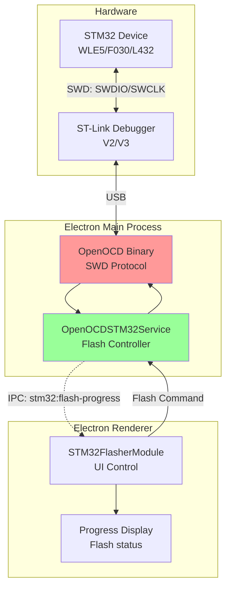
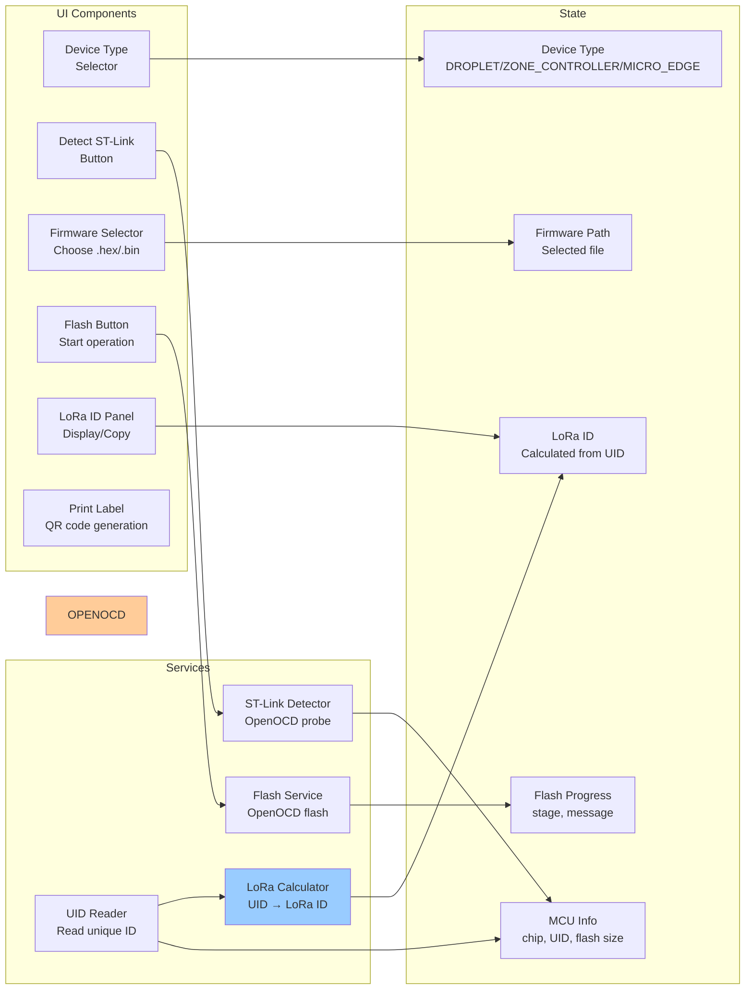

# STM32 Flasher - STM32 Firmware Flashing Tool

**Feature:** STM32 Flasher (Firmware Update)  
**Purpose:** Flash firmware to STM32 microcontrollers via SWD  
**Status:** Core feature - Always enabled  
**Last Updated:** December 9, 2025

---

## 📋 Overview

The **STM32 Flasher** provides production-grade firmware flashing for STM32 microcontrollers using ST-Link debuggers and OpenOCD. It supports multiple device types including Droplet (STM32WLE5), Zone Controller (STM32F030), and Micro Edge (STM32L432).

### Key Capabilities

- 🔌 **ST-Link Detection** - Auto-detect ST-Link/V2, V3 debuggers
- 🎯 **Multiple Device Support** - Droplet, Zone Controller, Micro Edge
- 📡 **LoRa ID Calculation** - Automatic LoRa ID from device UID
- 🔍 **MCU Verification** - Detect chip type and verify match
- ⚡ **SWD Programming** - Fast flash via Serial Wire Debug
- 📝 **Device UID Reading** - Read unique device identifier
- 🖨️ **Label Printing** - Generate QR code labels for devices

---

## 🚀 Quick Start

### 1. Connect ST-Link

**Hardware:**
1. Connect ST-Link debugger to PC via USB
2. Connect ST-Link to device:
   - SWDIO → SWDIO
   - SWCLK → SWCLK
   - GND → GND
   - VCC → 3.3V (optional, for power)

### 2. Select Device Type

**Choose target device:**
- **Droplet** - STM32WLE5 (LoRa wireless)
- **Zone Controller** - STM32F030C8T6 (damper control)
- **Micro Edge** - STM32L432KBU6 (compact gateway)

### 3. Detect ST-Link

1. Click **🔍 Detect ST-Link** button
2. Wait for detection (2-5 seconds)
3. Status shows "ST-Link detected"
4. MCU info displayed (chip type, UID)

### 4. Select Firmware

1. Click **📁 Select Firmware** button
2. Choose `.hex` or `.bin` file
3. Firmware path displayed

### 5. Flash Firmware

1. Click **⚡ Flash Firmware**
2. Wait for completion (~10-30 seconds)
3. Green success message appears
4. LoRa ID displayed (if applicable)

---

## 🏗️ Architecture

### System Overview



### Component Diagram



---

## 🎮 Features

### Device Type Support

**1. Droplet (STM32WLE5)**
- MCU: STM32WLE5 (Cortex-M4 + LoRa)
- Flash: 256KB
- UID Address: 0x1FFF7590
- LoRa ID: ✅ Supported (calculated from UID)
- OpenOCD Target: `stm32wlx.cfg`

**2. Zone Controller (STM32F030C8T6)**
- MCU: STM32F030C8T6 (Cortex-M0)
- Flash: 64KB
- UID Address: 0x1FFFF7AC
- LoRa ID: ❌ Not supported
- OpenOCD Target: `stm32f0x.cfg`

**3. Micro Edge (STM32L432KBU6)**
- MCU: STM32L432KBU6 (Cortex-M4 low-power)
- Flash: 128KB
- UID Address: 0x1FFF7590
- LoRa ID: ✅ Supported (calculated from UID)
- OpenOCD Target: `stm32l4x.cfg`

### ST-Link Detection

**Detection Process:**
1. Scan USB for ST-Link devices
2. Connect via SWD interface
3. Read MCU chip ID
4. Read device UID (96-bit unique identifier)
5. Verify MCU type matches selected device type
6. Calculate LoRa ID (if applicable)

**Supported ST-Link Versions:**
- ✅ ST-Link/V2 (most common)
- ✅ ST-Link/V2-1 (integrated on Nucleo boards)
- ✅ ST-Link/V3 (latest, faster)
- ✅ Chinese clones (mostly compatible)

**Detection Time:** 2-5 seconds

### LoRa ID Calculation

**For Droplet and Micro Edge:**

**Algorithm:**
```c
// Read 96-bit UID from device
uint32_t uid[3]; // UID[0], UID[1], UID[2]

// Calculate LoRa ID (DevEUI)
uint64_t lora_id = (VERSION << 56) |    // Version byte (0xC0 for Droplet)
                   ((uid[2] & 0xFF) << 48) |
                   ((uid[1] & 0xFFFF) << 32) |
                   (uid[0] & 0xFFFFFFFF);

// Format as hex string
sprintf(lora_id_str, "%016llX", lora_id);
```

**Example:**
```
Device UID:  0x12345678 0x9ABCDEF0 0x11223344
Version:     0xC0 (Droplet v192)
LoRa ID:     C0449ABCDEF012345678
```

**Use Cases:**
- LoRaWAN device provisioning
- Device tracking and identification
- QR code label generation
- Database registration

### MCU Verification

**Mismatch Detection:**
- Reads chip ID from device
- Compares with expected MCU for selected device type
- Shows warning if mismatch detected

**Example:**
```
Selected: Droplet (expects STM32WLE5)
Detected: STM32F030
→ Warning: "MCU mismatch! Expected STM32WLE5 but detected STM32F030"
```

---

## 💻 User Interface

### Main Controls

```
┌─────────────────────────────────────────────────┐
│ STM32 Flasher                                   │
├─────────────────────────────────────────────────┤
│                                                 │
│  Device Type: [Droplet ▼]                      │
│   (STM32WLE5 - 256KB Flash - Supports LoRa ID) │
│                                                 │
│  [🔍 Detect ST-Link]                            │
│  ✅ ST-Link detected                            │
│  Chip: STM32WLE5JC (256KB)                      │
│  UID: 12345678 9ABCDEF0 11223344                │
│                                                 │
│  Firmware: [📁 Select Firmware]                 │
│  Selected: droplet_v2.1.0.hex                   │
│                                                 │
│  [⚡ Flash Firmware]                             │
│                                                 │
│  ▓▓▓▓▓▓▓▓▓▓▓▓▓▓▓▓▓▓▓▓ 100%                      │
│  ✅ Flash complete!                             │
│                                                 │
│  📡 LoRa ID: C0449ABCDEF012345678               │
│  [📋 Copy LoRa ID]  [🖨️ Print Label]            │
│                                                 │
└─────────────────────────────────────────────────┘
```

---

## 🔧 Hardware Setup

### SWD Wiring Diagram

**Standard 4-Wire SWD:**
```
ST-Link                         STM32 Device
┌────────────┐                  ┌────────────┐
│            │                  │            │
│  SWDIO     ├──────────────────┤  SWDIO     │
│  SWCLK     ├──────────────────┤  SWCLK     │
│  GND       ├──────────────────┤  GND       │
│  3.3V/VDD  ├──────────────────┤  VDD       │ (optional)
│            │                  │            │
└────────────┘                  └────────────┘
```

**⚠️ Important:**
- **SWDIO/SWCLK:** Must be connected for programming
- **GND:** Must be connected (common ground)
- **VDD:** Optional, ST-Link can power device (check current limit)
- **NRST:** Optional, for hard reset during programming

### ST-Link Connectors

**ST-Link/V2 20-pin Connector:**
```
Pin 1:  VDD         Pin 2:  SWCLK
Pin 3:  GND         Pin 4:  SWDIO
Pin 5:  GND         Pin 6:  SWO (optional)
Pin 7:  KEY         Pin 8:  NC
Pin 9:  GND         Pin 10: NC
Pin 11: GND         Pin 12: NC
Pin 13: SWD         Pin 14: NC
Pin 15: NRST        Pin 16: NC
Pin 17: GND         Pin 18: NC
Pin 19: GND         Pin 20: NC
```

**Minimal Connection:**
- Pin 2 (SWCLK) → Device SWCLK
- Pin 4 (SWDIO) → Device SWDIO
- Pin 3,5,7,9 (GND) → Device GND

---

## 🎯 Common Tasks

### Task 1: Flash Droplet Device

**Hardware Setup:**
1. Connect ST-Link to Droplet board
2. Ensure power is connected

**Software:**
1. Select device type: **Droplet**
2. Click **Detect ST-Link**
3. Verify MCU: STM32WLE5
4. Select firmware: `droplet_v2.1.0.hex`
5. Click **Flash Firmware**
6. Wait for completion (~20 seconds)
7. Copy LoRa ID
8. Print label (optional)

**Expected Result:**
```
✅ Flash complete!
📡 LoRa ID: C0449ABCDEF012345678
```

---

### Task 2: Production Line Flashing

**Setup:**
1. Prepare flashing fixture with pogo pins
2. Load firmware file once
3. Print label sheets

**Per Device:**
1. Place device in fixture
2. Click **Detect ST-Link**
3. Click **Flash Firmware**
4. Wait for completion
5. Print label automatically
6. Remove device
7. Repeat

**Optimization:**
- Keep firmware file selected
- Use fast detection (continuous mode for Micro Edge)
- Batch print labels

---

### Task 3: Read LoRa ID Without Flashing

**Scenario:** Device already flashed, just need LoRa ID

**Procedure:**
1. Select device type
2. Click **Detect ST-Link**
3. LoRa ID calculated automatically
4. Click **Copy LoRa ID**
5. No need to flash

**Use Case:** Re-printing labels, database updates

---

### Task 4: Recover Bricked Device

**Scenario:** Device won't boot, firmware corrupted

**Procedure:**
1. Connect ST-Link
2. Select correct device type
3. Detect ST-Link (should work even if device bricked)
4. Select known-good firmware
5. Flash firmware
6. Device should boot normally

**If detection fails:**
- Check SWD connections
- Verify power supply
- Try slower SWD speed (in OpenOCD config)
- Check for hardware damage

---

## 🐛 Troubleshooting

### Issue: ST-Link Not Detected

**Symptoms:**
- "ST-Link not found" error
- Detection timeout

**Solutions:**

**1. Check USB Connection**
```powershell
# Windows - Check Device Manager
devmgmt.msc
# Look for "STMicroelectronics STLink dongle"
```

**2. Install ST-Link Drivers**
- Download from [ST Website](https://www.st.com/en/development-tools/stsw-link009.html)
- Or install STM32CubeProgrammer (includes drivers)

**3. Check SWD Wiring**
- Verify SWDIO, SWCLK, GND connections
- Check for shorts or broken wires
- Measure continuity with multimeter

**4. Power Device**
- ST-Link needs device powered to detect
- Check VDD voltage (should be 3.3V)
- Try external power supply

---

### Issue: Flash Failed / Timeout

**Symptoms:**
- Flash starts but fails midway
- "Could not halt target" error
- Timeout during flash

**Solutions:**

**1. Check Read Protection**
```
Device may have read protection enabled (RDP)
→ Need to mass erase first (data loss!)
→ Use STM32CubeProgrammer to disable RDP
```

**2. Lower SWD Speed**
- Long cables or poor connections need slower speed
- Edit OpenOCD config to reduce adapter speed
- Default: 4000 kHz → Try 1000 kHz

**3. Check Power Stability**
- Insufficient power during flash
- Use external regulated power supply
- Add decoupling capacitors

**4. Try Hard Reset**
- Connect NRST pin
- OpenOCD can reset device during programming
- Helps with stubborn devices

---

### Issue: MCU Mismatch Warning

**Symptoms:**
- Warning: "Expected STM32WLE5 but detected STM32F030"
- Flash may fail or wrong firmware

**Solutions:**

**1. Verify Device Type Selection**
- Check physical device label
- Select correct device type in dropdown
- Droplet = STM32WLE5
- Zone Controller = STM32F030
- Micro Edge = STM32L432

**2. Check Board Revision**
- Different board revisions may use different MCUs
- Consult hardware documentation

**3. Flash Anyway (Advanced)**
- If you're sure firmware is correct
- Mismatch warning can be bypassed (risky!)

---

### Issue: LoRa ID Not Calculated

**Symptoms:**
- LoRa ID field empty or shows error
- Only affects Droplet and Micro Edge

**Solutions:**

**1. Verify Device Type**
- Zone Controller doesn't support LoRa ID
- Only Droplet and Micro Edge have LoRa

**2. Check UID Read**
- LoRa ID requires valid UID
- Ensure ST-Link detection completed successfully
- UID should be 96-bit hex (24 hex digits)

**3. Version Parameter**
- LoRa ID uses version byte (default: 0xC0)
- Verify version parameter is correct
- Different versions for different firmware releases

---

## 📚 Code References

**Main Files:**
- `renderer/modules/STM32FlasherModule.js` - UI control (986 lines)
- `services/openocd-stm32.js` - OpenOCD service (2568 lines)
- `embedded/openocd-binaries/` - Embedded OpenOCD binaries
- `main.js` - IPC handlers for STM32 flashing

**Key Methods:**
- `OpenOCDSTM32Service.setDeviceType(type)` - Select device
- `OpenOCDSTM32Service.detectSTLink()` - Detect debugger
- `OpenOCDSTM32Service.flashFirmware(path)` - Flash firmware
- `OpenOCDSTM32Service.readDeviceUID()` - Read unique ID
- `STM32FlasherModule.calculateLoRaID(uid)` - Calculate LoRa ID

**IPC Channels:**
- `stm32:set-device-type` - Select device type
- `stm32:detect-stlink` - Detect ST-Link
- `stm32:flash-firmware` - Start flashing
- `stm32:read-uid` - Read device UID
- `stm32:flash-progress` - Progress updates (main → renderer)
- `stm32:flash-complete` - Flash complete (main → renderer)
- `stm32:flash-error` - Flash error (main → renderer)

---

## 🔗 Related Features

- **Factory Testing** - Automated testing after flashing
- **Serial Console** - Monitor device UART output
- **Label Printing** - Generate QR code labels with LoRa ID

---

## 📝 Best Practices

### For Production

1. **Use pogo pin fixture** - Faster, no manual wiring
2. **Batch firmware selection** - Load once, flash many
3. **Automated label printing** - Immediate tracking
4. **Verify LoRa ID** - Scan QR code after printing
5. **Log flash operations** - Track success/failure rates

### For Development

1. **Keep ST-Link connected** - Faster reflash cycles
2. **Use known-good firmware first** - Verify hardware
3. **Read UID before flashing** - Document device identity
4. **Test with different SWD speeds** - Find optimal speed
5. **Monitor serial output** - Use Serial Console feature

### For Troubleshooting

1. **Check connections first** - Most common issue
2. **Verify device power** - Measure voltages
3. **Try slow SWD speed** - Eliminates signal integrity issues
4. **Use STM32CubeProgrammer** - Alternative tool for comparison
5. **Document failures** - Track patterns for hardware issues

---

## 🎓 Learning Resources

**SWD Protocol:**
- [ARM Debug Interface](https://developer.arm.com/documentation/ihi0031/a/)
- [SWD vs JTAG](https://www.segger.com/products/debug-probes/j-link/technology/interface-description/)

**OpenOCD:**
- [OpenOCD User's Guide](http://openocd.org/doc/html/index.html)
- [STM32 Programming with OpenOCD](https://openocd.org/doc/html/Flash-Programming.html)

**Related Documentation:**
- [Main Documentation Index](../../README.md)
- [Factory Testing](../factory-testing/README.md)
- [Serial Console](../serial-console/README.md)

---

## 📄 File Listing

**This Feature's Documentation:**
- [README.md](./README.md) - This file (overview)
- [STM32Flasher-Overview.md](./STM32Flasher-Overview.md) - Technical deep dive
- [STM32Flasher-UserGuide.md](./STM32Flasher-UserGuide.md) - Detailed procedures
- [STM32Flasher-SourceCode.md](./STM32Flasher-SourceCode.md) - Developer documentation
- [STM32Flasher-Troubleshooting.md](./STM32Flasher-Troubleshooting.md) - Problem solving

---

**Last Updated:** December 9, 2025  
**Status:** ✅ Core Feature - Always Available  
**Next:** Read [STM32Flasher-UserGuide.md](./STM32Flasher-UserGuide.md) for hardware setup
