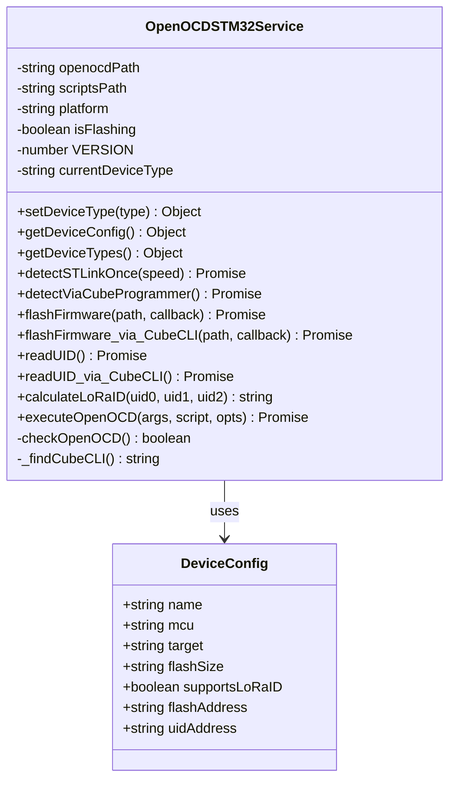
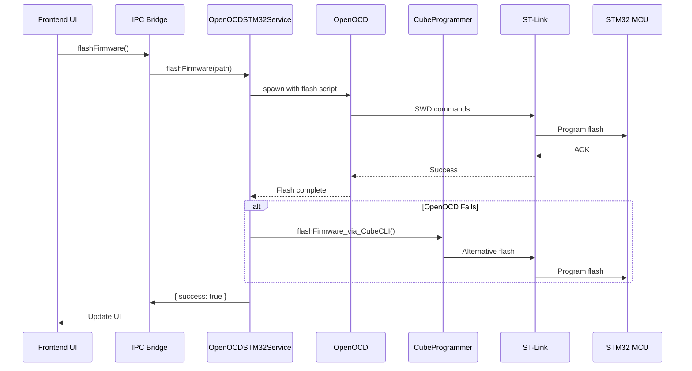

# STM32 Flasher - Source Code Documentation

## Table of Contents
1. [Architecture Overview](#architecture-overview)
2. [OpenOCDSTM32Service Class](#openocdstm32service-class)
3. [Device Type Management](#device-type-management)
4. [ST-Link Detection](#st-link-detection)
5. [Firmware Flashing](#firmware-flashing)
6. [UID Operations](#uid-operations)
7. [LoRa ID Calculation](#lora-id-calculation)
8. [CubeProgrammer Integration](#cubeprogrammer-integration)
9. [Code Examples](#code-examples)
10. [Testing Guide](#testing-guide)

---

## Architecture Overview

### Class Diagram



### Component Flow



---

## OpenOCDSTM32Service Class

**Location:** `services/openocd-stm32.js`

### Class Constructor

```javascript
/**
 * OpenOCD STM32 Service
 * Manages STM32 firmware flashing via OpenOCD and ST-Link
 */
class OpenOCDSTM32Service {
    constructor() {
        const basePath = app.isPackaged
            ? path.join(process.resourcesPath)
            : path.join(__dirname, '..');

        const platform = process.platform;
        
        // Platform-specific binary paths
        if (platform === 'win32') {
            this.openocdPath = path.join(basePath, 'embedded/openocd-binaries/windows/bin/openocd.exe');
            this.scriptsPath = path.join(basePath, 'embedded/openocd-binaries/windows/openocd/scripts');
        } else if (platform === 'linux') {
            this.openocdPath = path.join(basePath, 'embedded/openocd-binaries/linux/bin/openocd');
            this.scriptsPath = path.join(basePath, 'embedded/openocd-binaries/linux/share/openocd/scripts');
        }
        
        this.platform = platform;
        this.isFlashing = false;
        this.VERSION = 0xC0; // Droplet version for LoRa ID
        this.currentDeviceType = 'DROPLET';
    }
}
```

### Properties

| Property | Type | Description |
|----------|------|-------------|
| `openocdPath` | `string` | Path to OpenOCD binary |
| `scriptsPath` | `string` | Path to OpenOCD config scripts |
| `platform` | `string` | 'win32', 'linux', or 'darwin' |
| `isFlashing` | `boolean` | Flash operation in progress |
| `VERSION` | `number` | Device version for LoRa ID (0xC0) |
| `currentDeviceType` | `string` | Active device type |

---

## Device Type Management

### Device Type Configuration

```javascript
const DEVICE_TYPES = {
    DROPLET: {
        name: 'Droplet',
        mcu: 'STM32WLE5',
        target: 'stm32wlx.cfg',
        flashSize: '256KB',
        supportsLoRaID: true,
        flashAddress: '0x08000000',
        uidAddress: '0x1FFF7590'
    },
    ZONE_CONTROLLER: {
        name: 'Zone Controller',
        mcu: 'STM32F030C8T6',
        target: 'stm32f0x.cfg',
        flashSize: '64KB',
        supportsLoRaID: false,
        flashAddress: '0x08000000',
        uidAddress: '0x1FFFF7AC'
    },
    MICRO_EDGE: {
        name: 'Micro Edge',
        mcu: 'STM32L432KBU6',
        target: 'stm32l4x.cfg',
        flashSize: '128KB',
        supportsLoRaID: true,
        flashAddress: '0x08000000',
        uidAddress: '0x1FFF7590'
    }
};
```

### setDeviceType()

Sets active device type for subsequent operations.

**Signature:**
```javascript
setDeviceType(deviceType: string): Object
```

**Parameters:**
- `deviceType`: `'DROPLET'`, `'ZONE_CONTROLLER'`, or `'MICRO_EDGE'`

**Returns:**
```javascript
{
    success: true,
    deviceType: {
        name: "Droplet",
        mcu: "STM32WLE5",
        // ... other properties
    }
}
```

**Example:**
```javascript
const service = new OpenOCDSTM32Service();
const result = service.setDeviceType('DROPLET');
console.log(result.deviceType.name); // "Droplet"
```

---

### getDeviceConfig()

Returns configuration for currently selected device type.

**Signature:**
```javascript
getDeviceConfig(): Object
```

**Returns:**
```javascript
{
    name: "Droplet",
    mcu: "STM32WLE5",
    target: "stm32wlx.cfg",
    flashSize: "256KB",
    supportsLoRaID: true,
    flashAddress: "0x08000000",
    uidAddress: "0x1FFF7590"
}
```

---

## ST-Link Detection

### detectSTLinkOnce()

Attempts single ST-Link detection with configurable speed.

**Signature:**
```javascript
async detectSTLinkOnce(speed: number = 4000): Promise<Object>
```

**Parameters:**
- `speed`: SWD clock speed in kHz (default: 4000 = 4 MHz)

**Returns:**
```javascript
{
    success: true,
    detected: true,
    info: {
        interface: "ST-Link",
        chip: "STM32WLE5",
        flashSize: "256 KB"
    },
    output: "OpenOCD full output..."
}
```

**Implementation:**
```javascript
async detectSTLinkOnce(speed = 4000) {
    // Try CubeProgrammer first
    try {
        const probes = await this.listCubeProbes();
        if (probes && probes.found) {
            return { 
                success: true, 
                detected: true, 
                info: { interface: 'ST-Link' }
            };
        }
    } catch (e) {
        // Fallback to OpenOCD
    }

    // OpenOCD detection
    const deviceConfig = this.getDeviceConfig();
    const args = [
        '-s', this.scriptsPath,
        '-f', 'interface/stlink.cfg',
        '-c', 'transport select hla_swd',
        '-c', `adapter speed ${speed}`,
        '-c', `source [find target/${deviceConfig.target}]`,
        '-c', 'init',
        '-c', 'targets',
        '-c', 'shutdown'
    ];

    const result = await this.executeOpenOCD(args, null, { timeout: 8000 });
    const output = result?.output || '';
    const detected = output.includes(deviceConfig.mcu.toLowerCase());

    return {
        success: detected,
        detected: detected,
        info: { chip: deviceConfig.mcu },
        output
    };
}
```

---

## Firmware Flashing

### flashFirmware()

Flashes firmware using OpenOCD with progress callbacks.

**Signature:**
```javascript
async flashFirmware(
    firmwarePath: string,
    progressCallback?: Function
): Promise<Object>
```

**Parameters:**
- `firmwarePath`: Absolute path to .bin file
- `progressCallback`: Optional callback for progress updates

**Progress Callback Structure:**
```javascript
progressCallback({
    stage: 'connecting' | 'erasing' | 'writing' | 'verifying' | 'complete',
    progress: 0-100,
    message: 'Status message'
});
```

**Returns:**
```javascript
{
    success: true,
    message: "Firmware flashed successfully",
    output: "OpenOCD output..."
}
```

**Implementation:**
```javascript
async flashFirmware(firmwarePath, progressCallback = null) {
    if (this.isFlashing) {
        throw new Error('Flash operation already in progress');
    }

    if (!fs.existsSync(firmwarePath)) {
        throw new Error(`Firmware file not found: ${firmwarePath}`);
    }

    this.isFlashing = true;
    const deviceConfig = this.getDeviceConfig();

    try {
        // Progress: Connecting
        if (progressCallback) {
            progressCallback({ stage: 'connecting', progress: 0 });
        }

        // OpenOCD flash script
        const flashScript = `
            init
            reset halt
            flash erase_sector 0 0 last
            flash write_image erase "${firmwarePath}" ${deviceConfig.flashAddress}
            verify_image "${firmwarePath}" ${deviceConfig.flashAddress}
            reset run
            shutdown
        `;

        const args = [
            '-s', this.scriptsPath,
            '-f', 'interface/stlink.cfg',
            '-c', 'transport select hla_swd',
            '-c', 'adapter speed 4000',
            '-c', `source [find target/${deviceConfig.target}]`
        ];

        const result = await this.executeOpenOCD(
            args,
            flashScript,
            { timeout: 120000 }  // 2 minutes
        );

        this.isFlashing = false;

        if (result.success) {
            if (progressCallback) {
                progressCallback({ stage: 'complete', progress: 100 });
            }
            return {
                success: true,
                message: 'Firmware flashed successfully',
                output: result.output
            };
        } else {
            // Try CubeProgrammer fallback
            return await this.flashFirmware_via_CubeCLI(
                firmwarePath,
                progressCallback
            );
        }
    } catch (error) {
        this.isFlashing = false;
        throw error;
    }
}
```

---

## UID Operations

### readUID()

Reads 96-bit unique identifier from STM32.

**Signature:**
```javascript
async readUID(): Promise<Object>
```

**Returns:**
```javascript
{
    success: true,
    uid0: 0x00340031,
    uid1: 0x33365111,
    uid2: 0x001A0043,
    serial: "00340031-33365111-001A0043",
    raw: "OpenOCD output..."
}
```

**Implementation:**
```javascript
async readUID() {
    const deviceConfig = this.getDeviceConfig();
    const uidAddress = deviceConfig.uidAddress;

    // OpenOCD script to read 3 words (12 bytes)
    const readScript = `
        init
        mdw ${uidAddress} 3
        shutdown
    `;

    const args = [
        '-s', this.scriptsPath,
        '-f', 'interface/stlink.cfg',
        '-c', 'transport select hla_swd',
        '-c', 'adapter speed 4000',
        '-c', `source [find target/${deviceConfig.target}]`
    ];

    const result = await this.executeOpenOCD(args, readScript);

    if (!result.success) {
        // Fallback to CubeProgrammer
        return await this.readUID_via_CubeCLI();
    }

    // Parse output: "0x1fff7590: 0x00340031 0x33365111 0x001A0043"
    const match = result.output.match(
        /0x[0-9a-fA-F]+:\s*0x([0-9a-fA-F]{8})\s*0x([0-9a-fA-F]{8})\s*0x([0-9a-fA-F]{8})/
    );

    if (match) {
        const uid0 = parseInt(match[1], 16);
        const uid1 = parseInt(match[2], 16);
        const uid2 = parseInt(match[3], 16);

        const serial = [
            match[1].toUpperCase(),
            match[2].toUpperCase(),
            match[3].toUpperCase()
        ].join('-');

        return {
            success: true,
            uid0,
            uid1,
            uid2,
            serial,
            raw: result.output
        };
    }

    throw new Error('Failed to parse UID from output');
}
```

---

## LoRa ID Calculation

### calculateLoRaID()

Calculates 32-bit LoRa device ID from UID.

**Signature:**
```javascript
calculateLoRaID(
    uid0: number,
    uid1: number,
    uid2: number,
    version: number = 0xC0
): string
```

**Parameters:**
- `uid0`: First 32-bit UID word
- `uid1`: Second 32-bit UID word
- `uid2`: Third 32-bit UID word
- `version`: Device version byte (default: 0xC0 for Droplet)

**Returns:**
```javascript
"33205003"  // 8-character uppercase hex string
```

**Implementation:**
```javascript
calculateLoRaID(uid0, uid1, uid2, version = this.VERSION) {
    // XOR all UID words
    const combined = (uid0 ^ uid1 ^ uid2) >>> 0;
    
    // XOR with version
    const result = (combined ^ version) >>> 0;
    
    // Format as 8-digit uppercase hex
    return result.toString(16).toUpperCase().padStart(8, '0');
}
```

**Example:**
```javascript
const service = new OpenOCDSTM32Service();

// Example UID from device
const uid0 = 0x00340031;
const uid1 = 0x33365111;
const uid2 = 0x001A0043;

const loraId = service.calculateLoRaID(uid0, uid1, uid2);
console.log(loraId); // "33205003"
```

**Algorithm Explanation:**
```
Step 1: XOR UID words
  0x00340031 ⊕ 0x33365111 ⊕ 0x001A0043 = 0x332050C3

Step 2: XOR with version
  0x332050C3 ⊕ 0xC0 = 0x33205003

Step 3: Format as hex string
  LoRa ID = "33205003"
```

---

## CubeProgrammer Integration

### flashFirmware_via_CubeCLI()

Alternative flashing using STM32CubeProgrammer CLI.

**Signature:**
```javascript
async flashFirmware_via_CubeCLI(
    firmwarePath: string,
    progressCallback?: Function
): Promise<Object>
```

**Implementation:**
```javascript
async flashFirmware_via_CubeCLI(firmwarePath, progressCallback = null) {
    const cli = this._findCubeCLI();
    if (!cli) {
        throw new Error('STM32_Programmer_CLI not found');
    }

    const normalized = firmwarePath.replace(/\\/g, '/');
    
    // Try multiple connection variants
    const connectVariants = [
        'port=SWD',
        'port=SWD mode=UR',
        'port=SWD frequency=4000',
        'port=SWD frequency=4000 mode=UR'
    ];

    for (const connectToken of connectVariants) {
        if (progressCallback) {
            progressCallback({ 
                stage: 'connect', 
                message: `Trying: ${connectToken}` 
            });
        }

        const args = [
            '--connect', connectToken,
            '--erase', 'all',
            '--download', normalized, '0x08000000',
            '--verify'
        ];

        const res = await this.runCubeCLI(args, 180000); // 3 minutes
        const output = res?.output || '';

        if (res && res.exit === 0 && /verified successfully/i.test(output)) {
            if (progressCallback) {
                progressCallback({ 
                    stage: 'complete', 
                    message: 'Flash completed' 
                });
            }
            return { 
                success: true, 
                output, 
                connectToken 
            };
        }
    }

    throw new Error('CubeProgrammer flash failed');
}
```

### _findCubeCLI()

Locates STM32CubeProgrammer CLI executable.

**Returns:** Path to `STM32_Programmer_CLI.exe` or `null`

```javascript
_findCubeCLI() {
    const possiblePaths = [
        'C:\\Program Files (x86)\\STMicroelectronics\\STM32Cube\\STM32CubeProgrammer\\bin\\STM32_Programmer_CLI.exe',
        'C:\\Program Files\\STMicroelectronics\\STM32Cube\\STM32CubeProgrammer\\bin\\STM32_Programmer_CLI.exe'
    ];

    for (const p of possiblePaths) {
        if (fs.existsSync(p)) return p;
    }

    // Try PATH
    try {
        const which = spawnSync('where', ['STM32_Programmer_CLI.exe'], { shell: true });
        const out = which.stdout?.toString().trim();
        if (out) return out.split('\r\n')[0];
    } catch (e) {}

    return null;
}
```

---

## Code Examples

### Example 1: Complete Flash Operation

```javascript
const OpenOCDSTM32Service = require('./services/openocd-stm32');

async function flashDevice() {
    const service = new OpenOCDSTM32Service();
    
    // 1. Set device type
    service.setDeviceType('DROPLET');
    
    // 2. Detect ST-Link
    console.log('Detecting ST-Link...');
    const detection = await service.detectSTLinkOnce(4000);
    
    if (!detection.success) {
        console.error('ST-Link not found');
        return;
    }
    
    console.log('✓ ST-Link detected');
    
    // 3. Flash firmware with progress
    console.log('Flashing firmware...');
    const result = await service.flashFirmware(
        'C:\\firmware\\droplet_v1.0.0.bin',
        (progress) => {
            console.log(`[${progress.stage}] ${progress.progress || 0}%`);
        }
    );
    
    if (result.success) {
        console.log('✓ Flash completed successfully');
    }
}

flashDevice().catch(console.error);
```

---

### Example 2: Read UID and Calculate LoRa ID

```javascript
async function provisionDevice() {
    const service = new OpenOCDSTM32Service();
    service.setDeviceType('DROPLET');
    
    // Read UID
    console.log('Reading UID...');
    const uidResult = await service.readUID();
    
    console.log('UID:', uidResult.serial);
    console.log('  UID[0]:', `0x${uidResult.uid0.toString(16)}`);
    console.log('  UID[1]:', `0x${uidResult.uid1.toString(16)}`);
    console.log('  UID[2]:', `0x${uidResult.uid2.toString(16)}`);
    
    // Calculate LoRa ID
    const deviceConfig = service.getDeviceConfig();
    if (deviceConfig.supportsLoRaID) {
        const loraId = service.calculateLoRaID(
            uidResult.uid0,
            uidResult.uid1,
            uidResult.uid2
        );
        console.log('LoRa ID:', loraId);
        
        // Register with network server
        await registerDeviceWithLoRaServer(loraId, uidResult.serial);
    }
}

provisionDevice().catch(console.error);
```

---

### Example 3: Batch Device Programming

```javascript
async function batchFlash(firmwarePath, deviceCount) {
    const service = new OpenOCDSTM32Service();
    service.setDeviceType('DROPLET');
    
    const results = [];
    
    for (let i = 0; i < deviceCount; i++) {
        console.log(`\n=== Device ${i + 1}/${deviceCount} ===`);
        
        // Wait for device connection
        console.log('Connect device and press Enter...');
        await waitForEnter();
        
        try {
            // Detect
            const detection = await service.detectSTLinkOnce();
            if (!detection.success) {
                console.error('✗ Detection failed');
                results.push({ device: i + 1, success: false });
                continue;
            }
            
            // Flash
            const flashResult = await service.flashFirmware(firmwarePath);
            
            // Read UID
            const uidResult = await service.readUID();
            const loraId = service.calculateLoRaID(
                uidResult.uid0,
                uidResult.uid1,
                uidResult.uid2
            );
            
            console.log(`✓ Device ${i + 1} programmed`);
            console.log(`  UID: ${uidResult.serial}`);
            console.log(`  LoRa ID: ${loraId}`);
            
            results.push({
                device: i + 1,
                success: true,
                uid: uidResult.serial,
                loraId
            });
        } catch (error) {
            console.error(`✗ Failed: ${error.message}`);
            results.push({ device: i + 1, success: false, error: error.message });
        }
    }
    
    // Summary
    console.log('\n=== Batch Flash Summary ===');
    const successful = results.filter(r => r.success).length;
    console.log(`Successful: ${successful}/${deviceCount}`);
    console.log('Results:', JSON.stringify(results, null, 2));
}

batchFlash('C:\\firmware\\droplet.bin', 10).catch(console.error);
```

---

## Testing Guide

### Unit Tests

```javascript
const OpenOCDSTM32Service = require('./services/openocd-stm32');
const assert = require('assert');

describe('OpenOCDSTM32Service', () => {
    let service;
    
    beforeEach(() => {
        service = new OpenOCDSTM32Service();
    });
    
    describe('setDeviceType()', () => {
        it('should set DROPLET device type', () => {
            const result = service.setDeviceType('DROPLET');
            assert.strictEqual(result.success, true);
            assert.strictEqual(result.deviceType.name, 'Droplet');
        });
        
        it('should throw error for invalid device type', () => {
            assert.throws(() => {
                service.setDeviceType('INVALID');
            }, /Invalid device type/);
        });
    });
    
    describe('getDeviceConfig()', () => {
        it('should return current device configuration', () => {
            service.setDeviceType('DROPLET');
            const config = service.getDeviceConfig();
            assert.strictEqual(config.mcu, 'STM32WLE5');
            assert.strictEqual(config.supportsLoRaID, true);
        });
    });
    
    describe('calculateLoRaID()', () => {
        it('should calculate correct LoRa ID', () => {
            const uid0 = 0x00340031;
            const uid1 = 0x33365111;
            const uid2 = 0x001A0043;
            
            const loraId = service.calculateLoRaID(uid0, uid1, uid2);
            assert.strictEqual(loraId, '33205003');
        });
        
        it('should handle different version bytes', () => {
            const loraId = service.calculateLoRaID(0x12345678, 0x9ABCDEF0, 0x00112233, 0xFF);
            assert.strictEqual(typeof loraId, 'string');
            assert.strictEqual(loraId.length, 8);
        });
    });
});
```

### Integration Tests

```javascript
describe('STM32 Flasher Integration', () => {
    it('should detect ST-Link hardware', async function() {
        this.timeout(10000);
        
        const service = new OpenOCDSTM32Service();
        service.setDeviceType('DROPLET');
        
        const result = await service.detectSTLinkOnce();
        
        // May pass or fail depending on hardware
        if (result.success) {
            assert.strictEqual(result.detected, true);
            console.log('ST-Link detected:', result.info);
        } else {
            console.log('No ST-Link hardware connected');
        }
    });
});
```

---

## Summary

✅ **Architecture** - Class structure and component interaction  
✅ **OpenOCDSTM32Service** - Core backend service with full API  
✅ **Device Management** - Type selection and configuration  
✅ **ST-Link Detection** - Hardware probe detection methods  
✅ **Firmware Flashing** - OpenOCD and CubeProgrammer integration  
✅ **UID Operations** - Reading unique device identifiers  
✅ **LoRa ID Calculation** - Algorithm and implementation  
✅ **CubeProgrammer** - Alternative flashing tool integration  
✅ **Code Examples** - 3 practical implementations  
✅ **Testing Guide** - Unit and integration tests  

**Key Methods:**

| Method | Purpose |
|--------|---------|
| `setDeviceType()` | Select Droplet/Zone Controller/Micro Edge |
| `detectSTLinkOnce()` | Find and connect to ST-Link probe |
| `flashFirmware()` | Program firmware via OpenOCD |
| `readUID()` | Read 96-bit unique identifier |
| `calculateLoRaID()` | Generate LoRa device ID from UID |
| `flashFirmware_via_CubeCLI()` | Alternative flash via CubeProgrammer |

**Next Steps:**  
See [Troubleshooting.md](Troubleshooting.md) for common issues and solutions.
