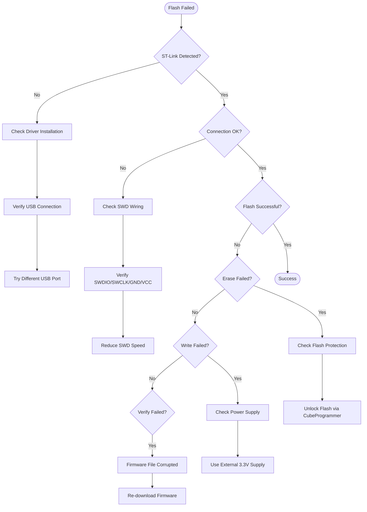
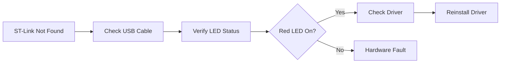
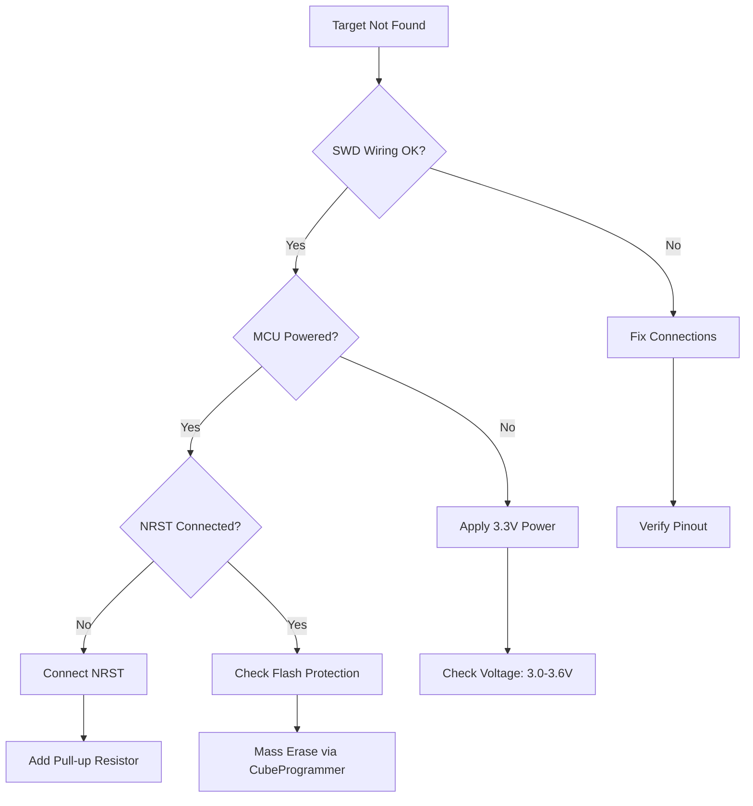
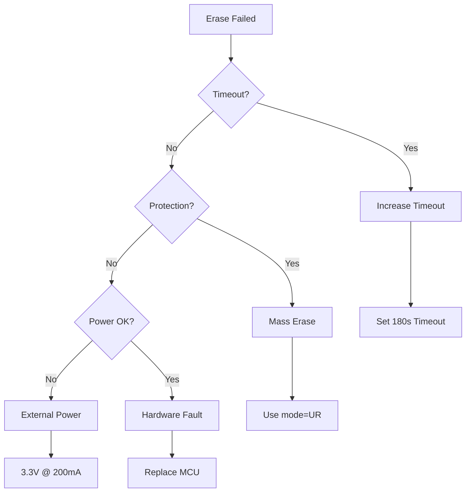
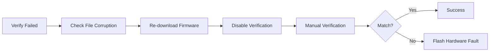

# STM32 Flasher - Troubleshooting Guide

## Table of Contents
1. [Common Issues](#common-issues)
2. [ST-Link Detection Problems](#st-link-detection-problems)
3. [Connection Failures](#connection-failures)
4. [Flash Errors](#flash-errors)
5. [UID Read Failures](#uid-read-failures)
6. [Platform-Specific Issues](#platform-specific-issues)
7. [OpenOCD Diagnostics](#openocd-diagnostics)
8. [STM32CubeProgrammer Issues](#stm32cubeprogrammer-issues)
9. [Advanced Debugging](#advanced-debugging)
10. [FAQ](#faq)

---

## Common Issues

### Quick Diagnostic Flowchart



---

## ST-Link Detection Problems

### Problem: "ST-Link Not Detected"

**Symptoms:**
- UI shows "No device detected"
- Console: `Error: no device found`

**Diagnostic Steps:**



**Solutions:**

#### 1. Driver Installation (Windows)
```powershell
# Check if driver is installed
Get-PnpDevice | Where-Object { $_.FriendlyName -like "*STLink*" }

# Expected output:
# Status  Class   FriendlyName
# ------  -----   ------------
# OK      USB     STMicroelectronics STLink dongle
```

If not found, install official driver:
1. Download from [STM32 ST-LINK Utility](https://www.st.com/en/development-tools/stsw-link009.html)
2. Run `ST-LINK_winusb_install.bat` as Administrator
3. Replug ST-Link

#### 2. Driver Installation (Linux)
```bash
# Check if device is visible
lsusb | grep -i "stm"

# Expected output:
# Bus 001 Device 005: ID 0483:3748 STMicroelectronics ST-LINK/V2

# Install udev rules
sudo cp /path/to/49-stlinkv2.rules /etc/udev/rules.d/
sudo udevadm control --reload-rules
sudo udevadm trigger

# Add user to plugdev group
sudo usermod -aG plugdev $USER
```

**udev rule content** (`49-stlinkv2.rules`):
```
# ST-Link V2
SUBSYSTEM=="usb", ATTR{idVendor}=="0483", ATTR{idProduct}=="3748", MODE="0666", GROUP="plugdev"

# ST-Link V2-1
SUBSYSTEM=="usb", ATTR{idVendor}=="0483", ATTR{idProduct}=="374b", MODE="0666", GROUP="plugdev"

# ST-Link V3
SUBSYSTEM=="usb", ATTR{idVendor}=="0483", ATTR{idProduct}=="374f", MODE="0666", GROUP="plugdev"
```

#### 3. USB Port Issues
- Try different USB 2.0 port (avoid USB 3.0 hubs)
- Use short, high-quality USB cable (<1m)
- Disable USB selective suspend (Windows)

#### 4. ST-Link Firmware Update
```bash
# Windows: Run ST-Link Upgrade utility
# Download: https://www.st.com/en/development-tools/stsw-link007.html

# Linux: Use openocd
openocd -f interface/stlink.cfg -c "init; exit"
```

---

## Connection Failures

### Problem: "Target Not Found"

**Symptoms:**
- ST-Link detected but cannot connect to MCU
- Error: `Error: init mode failed (unable to connect to target)`

**Diagnostic Steps:**



**Solutions:**

#### 1. Verify SWD Wiring

| ST-Link Pin | Signal | STM32 Pin | Notes |
|-------------|--------|-----------|-------|
| Pin 1 | VCC (3.3V) | VDD | Red wire |
| Pin 2 | SWCLK | PA14 (SWCLK) | Yellow wire |
| Pin 3 | GND | GND | Black wire |
| Pin 4 | SWDIO | PA13 (SWDIO) | Green wire |
| Pin 5 | NRST | NRST | White wire (optional) |

**Test continuity with multimeter:**
```bash
# On Linux
# Install i2c-tools
sudo apt-get install i2c-tools

# Check connections
# Use continuity mode on multimeter to verify each wire
```

#### 2. Reduce SWD Speed

Modify detection speed in UI or code:

```javascript
// Try slower speeds
const speeds = [4000, 2000, 1000, 500]; // kHz

for (const speed of speeds) {
    console.log(`Trying ${speed} kHz...`);
    const result = await service.detectSTLinkOnce(speed);
    if (result.success) {
        console.log(`✓ Connected at ${speed} kHz`);
        break;
    }
}
```

#### 3. Connect Under Reset

Add NRST connection and use "Connect Under Reset" mode:

```javascript
// In OpenOCD
const args = [
    '-c', 'transport select hla_swd',
    '-c', 'adapter speed 1000',
    '-c', 'reset_config srst_only', // Use SRST
    // ... other args
];
```

#### 4. Check Flash Protection

If device is read-protected:

```powershell
# Windows: Use STM32CubeProgrammer CLI
cd "C:\Program Files\STMicroelectronics\STM32Cube\STM32CubeProgrammer\bin"

# Check protection status
.\STM32_Programmer_CLI.exe -c port=SWD -ob displ

# Mass erase (removes protection)
.\STM32_Programmer_CLI.exe -c port=SWD mode=UR -ob RDP=0xAA
```

---

## Flash Errors

### Problem: "Flash Erase Failed"

**Error Messages:**
- `Error: flash erase failed`
- `Timeout during erase operation`

**Diagnostic Flowchart:**



**Solutions:**

#### 1. Increase Timeout
```javascript
// In openocd-stm32.js
const result = await this.executeOpenOCD(
    args,
    flashScript,
    { timeout: 180000 }  // 3 minutes instead of 2
);
```

#### 2. Use "Under Reset" Mode
```javascript
// Try CubeProgrammer with mode=UR
const connectToken = 'port=SWD mode=UR';
await service.flashFirmware_via_CubeCLI(firmwarePath);
```

#### 3. Mass Erase Before Flash
```bash
# Windows PowerShell
& "C:\Program Files\STMicroelectronics\STM32Cube\STM32CubeProgrammer\bin\STM32_Programmer_CLI.exe" `
  -c port=SWD -e all

# Then flash normally
```

---

### Problem: "Flash Write Failed"

**Symptoms:**
- Erase succeeds but write fails
- Error: `Error writing to flash at address 0x08000000`

**Solutions:**

#### 1. Check Firmware File
```bash
# Verify file size matches flash capacity
ls -lh firmware.bin

# Droplet: Max 256 KB
# Zone Controller: Max 64 KB
# Micro Edge: Max 128 KB
```

#### 2. Verify File Integrity
```bash
# Calculate MD5 checksum
md5sum firmware.bin

# Compare with expected checksum from build server
```

#### 3. Try Different Flash Address
```javascript
// For bootloader scenarios
const flashAddress = '0x08008000'; // Offset if bootloader present
```

---

### Problem: "Flash Verification Failed"

**Error Messages:**
- `embedded:startup.tcl:XXX Error: verify_image failed`
- `Verify failed at 0x08000000`

**Diagnostic Steps:**



**Solutions:**

#### 1. Disable Auto-Verification
```javascript
// Modify flash script to skip verify
const flashScript = `
    init
    reset halt
    flash erase_sector 0 0 last
    flash write_image erase "${firmwarePath}" 0x08000000
    # verify_image "${firmwarePath}" 0x08000000  <- Comment out
    reset run
    shutdown
`;
```

#### 2. Manual Verification via Read-back
```javascript
async function verifyFlash(firmwarePath) {
    const firmware = fs.readFileSync(firmwarePath);
    
    // Read flash content
    const readScript = `
        init
        dump_image /tmp/readback.bin 0x08000000 ${firmware.length}
        shutdown
    `;
    
    await executeOpenOCD(args, readScript);
    
    // Compare files
    const readback = fs.readFileSync('/tmp/readback.bin');
    return Buffer.compare(firmware, readback) === 0;
}
```

---

## UID Read Failures

### Problem: "Cannot Read UID"

**Symptoms:**
- Flash succeeds but UID read fails
- Empty or incorrect UID values

**Solutions:**

#### 1. Verify UID Address
```javascript
// Check device-specific UID address
const DEVICE_UID_ADDRESSES = {
    'DROPLET': '0x1FFF7590',
    'ZONE_CONTROLLER': '0x1FFFF7AC',  // Note different address
    'MICRO_EDGE': '0x1FFF7590'
};
```

#### 2. Direct OpenOCD Test
```bash
# Test UID reading manually
openocd -f interface/stlink.cfg \
  -f target/stm32wlx.cfg \
  -c "init" \
  -c "mdw 0x1FFF7590 3" \
  -c "shutdown"

# Expected output:
# 0x1fff7590: 0x00340031 0x33365111 0x001a0043
```

#### 3. Try CubeProgrammer Read
```powershell
# Windows
& "C:\Program Files\STMicroelectronics\STM32Cube\STM32CubeProgrammer\bin\STM32_Programmer_CLI.exe" `
  -c port=SWD `
  -r 0x1FFF7590 12 -r 0x1FFF7590 12

# Output will show 12 bytes (3 x 32-bit words)
```

---

## Platform-Specific Issues

### Windows Issues

#### Issue: "DLL Load Failed"

**Error:** `The specified module could not be found`

**Solution:**
```powershell
# Install Visual C++ Redistributable
# Download from: https://aka.ms/vs/17/release/vc_redist.x64.exe

# Verify installation
Get-ItemProperty "HKLM:\SOFTWARE\Microsoft\VisualStudio\14.0\VC\Runtimes\x64"
```

#### Issue: "Access Denied" on COM Port

**Solution:**
```powershell
# Run application as Administrator
# Or disable device security in Device Manager:
# 1. Open Device Manager
# 2. Find ST-Link under "Universal Serial Bus devices"
# 3. Right-click → Properties → Power Management
# 4. Uncheck "Allow computer to turn off device"
```

---

### Linux Issues

#### Issue: "Permission Denied"

**Error:** `Error: libusb_open() failed with LIBUSB_ERROR_ACCESS`

**Solution:**
```bash
# Add user to plugdev group
sudo usermod -aG plugdev $USER

# Install udev rules (as shown earlier)
sudo cp 49-stlinkv2.rules /etc/udev/rules.d/
sudo udevadm control --reload-rules

# Log out and back in for group changes
```

#### Issue: "libusb Not Found"

**Solution:**
```bash
# Ubuntu/Debian
sudo apt-get install libusb-1.0-0 libusb-1.0-0-dev

# Fedora
sudo dnf install libusb

# Arch
sudo pacman -S libusb
```

---

### macOS Issues

#### Issue: "System Extension Blocked"

**Solution:**
```bash
# Allow system extension in Security & Privacy
# 1. System Preferences → Security & Privacy
# 2. Click lock to make changes
# 3. Click "Allow" next to blocked extension

# Or disable SIP (not recommended for production)
csrutil disable  # From Recovery Mode
```

---

## OpenOCD Diagnostics

### Enable Debug Output

```javascript
// Add verbose logging to OpenOCD execution
async executeOpenOCD(args, script, options = {}) {
    const debugArgs = [
        '-d3',  // Debug level 3 (max verbosity)
        ...args
    ];
    
    const result = await this._spawnProcess(
        this.openocdPath,
        debugArgs,
        script,
        options
    );
    
    console.log('=== OpenOCD Debug Output ===');
    console.log(result.output);
    
    return result;
}
```

### Test OpenOCD Binary

```bash
# Windows
cd embedded\openocd-binaries\windows\bin
.\openocd.exe --version

# Expected output:
# Open On-Chip Debugger 0.12.0
# Licensed under GNU GPL v2

# Test ST-Link detection
.\openocd.exe -f interface/stlink.cfg -c "init; exit"
```

---

## STM32CubeProgrammer Issues

### Issue: "CubeProgrammer Not Found"

**Solution:**
```javascript
// Check installation paths
const possiblePaths = [
    'C:\\Program Files (x86)\\STMicroelectronics\\STM32Cube\\STM32CubeProgrammer\\bin\\STM32_Programmer_CLI.exe',
    'C:\\Program Files\\STMicroelectronics\\STM32Cube\\STM32CubeProgrammer\\bin\\STM32_Programmer_CLI.exe'
];

// Add to PATH
// 1. Control Panel → System → Advanced → Environment Variables
// 2. Edit PATH variable
// 3. Add: C:\Program Files\STMicroelectronics\STM32Cube\STM32CubeProgrammer\bin
```

### Test CubeProgrammer Manually

```powershell
# List connected probes
& "C:\Program Files\STMicroelectronics\STM32Cube\STM32CubeProgrammer\bin\STM32_Programmer_CLI.exe" -l

# Expected output:
# -------- Connected ST-Link Probes List --------
# ST-Link Probe 0:
#   Serial Number: 066BFF575051897367072643
#   Firmware version: V2J40M27
```

---

## Advanced Debugging

### Capture Full OpenOCD Session

```javascript
const fs = require('fs');

async function debugFlash(firmwarePath) {
    const service = new OpenOCDSTM32Service();
    
    // Enable full logging
    const logPath = 'C:\\Logs\\openocd-debug.log';
    const logStream = fs.createWriteStream(logPath, { flags: 'a' });
    
    try {
        const result = await service.flashFirmware(firmwarePath);
        
        logStream.write(`=== Flash Attempt ===\n`);
        logStream.write(`Time: ${new Date().toISOString()}\n`);
        logStream.write(`Firmware: ${firmwarePath}\n`);
        logStream.write(`Result: ${JSON.stringify(result, null, 2)}\n\n`);
        
        console.log(`Debug log saved to: ${logPath}`);
    } finally {
        logStream.end();
    }
}
```

### Use Wireshark USB Capture (Advanced)

For deep USB protocol debugging:

```bash
# Windows: Install USBPcap
# Download: https://desowin.org/usbpcap/

# Linux: Use usbmon
sudo modprobe usbmon
sudo wireshark

# Capture filter: usb.device_address == 5
# (Find ST-Link address with lsusb)
```

---

## Error Reference Table

| Error Code | Description | Solution |
|------------|-------------|----------|
| `LIBUSB_ERROR_ACCESS` | Permission denied | Install udev rules, add to plugdev group |
| `LIBUSB_ERROR_NOT_FOUND` | Device not found | Check USB cable, replug, try different port |
| `init mode failed` | Cannot connect to MCU | Check SWD wiring, reduce speed, connect NRST |
| `Error: flash erase failed` | Erase timeout or protection | Mass erase via CubeProgrammer, check power |
| `verify_image failed` | Written data doesn't match | Check file integrity, try manual verification |
| `Error: timed out` | Operation exceeded timeout | Increase timeout, improve power supply |
| `Error: target not halted` | MCU won't stop | Connect NRST, use mode=UR |
| `Error: address 0x08000000 is out of bounds` | Invalid flash address | Check device type selection |

---

## FAQ

### Q1: Why does detection work but flashing fails?

**A:** This usually indicates:
1. **Weak power supply** - ST-Link can enumerate but cannot provide enough current for flash operation
   - **Solution:** Use external 3.3V power supply
2. **Flash protection** - Device is read-protected
   - **Solution:** Mass erase via CubeProgrammer with `mode=UR`

---

### Q2: Can I flash without NRST connection?

**A:** Yes, but:
- NRST is recommended for reliable connection
- Without NRST, device must be in stopped state
- Some devices require NRST for "Connect Under Reset" mode

**Workaround:**
```javascript
// Use software reset instead
const flashScript = `
    init
    soft_reset halt
    flash erase_sector 0 0 last
    # ... rest of flash
`;
```

---

### Q3: How do I recover a bricked device?

**A:** Try these steps in order:

1. **Connect Under Reset**
   ```bash
   STM32_Programmer_CLI.exe -c port=SWD mode=UR -e all
   ```

2. **Boot0 Method** (if available)
   - Set BOOT0 pin HIGH
   - Power cycle device
   - Device enters system bootloader
   - Flash via UART/USB

3. **SWD Mass Erase**
   ```bash
   openocd -f interface/stlink.cfg \
     -f target/stm32wlx.cfg \
     -c "init; halt; stm32wlx mass_erase 0; exit"
   ```

---

### Q4: What does "mode=UR" mean?

**A:** "Under Reset" mode:
- CubeProgrammer connects while holding device in reset
- Bypasses any application code that might interfere
- Required for:
  - Recovering from invalid firmware
  - Devices with flash protection
  - Low-power states that disable SWD

---

### Q5: Why is flashing slow (~30 seconds)?

**A:** Flash speed depends on:

| Factor | Impact | Optimization |
|--------|--------|--------------|
| SWD Speed | 500 kHz = 30s, 4 MHz = 15s | Increase to 4 MHz |
| Erase | Full erase = +10s | Erase only used sectors |
| Verification | +5s | Disable if not critical |
| USB Hub | Adds latency | Connect directly to PC |

**Optimize with:**
```javascript
// Fast flash configuration
const args = [
    '-c', 'adapter speed 4000',  // 4 MHz
    '-c', 'set FLASH_SIZE 0x40000',  // Only erase used space
    // Skip verification if acceptable
];
```

---

### Q6: Can I flash multiple devices simultaneously?

**A:** Yes, with multiple ST-Link probes:

```javascript
async function flashMultiple(firmwarePath, serialNumbers) {
    const promises = serialNumbers.map(serial => {
        const service = new OpenOCDSTM32Service();
        
        // Specify ST-Link by serial number
        const args = [
            '-c', `adapter serial ${serial}`,
            // ... other args
        ];
        
        return service.flashFirmware(firmwarePath);
    });
    
    const results = await Promise.all(promises);
    console.log(`Flashed ${results.length} devices`);
}
```

---

## Summary

✅ **Common Issues** - Quick diagnostic flowchart  
✅ **ST-Link Detection** - Driver installation and USB troubleshooting  
✅ **Connection Failures** - Wiring, speed, and reset issues  
✅ **Flash Errors** - Erase, write, and verification problems  
✅ **UID Read Failures** - Address verification and readback  
✅ **Platform-Specific** - Windows/Linux/macOS solutions  
✅ **OpenOCD Diagnostics** - Debug logging and testing  
✅ **CubeProgrammer** - Alternative tool troubleshooting  
✅ **Advanced Debugging** - USB capture and logging  
✅ **FAQ** - 6 common questions with detailed answers  

**Quick Fixes:**

1. **ST-Link not found** → Reinstall driver, try different USB port
2. **Target not found** → Check SWD wiring (especially GND), reduce speed
3. **Flash erase failed** → Use `mode=UR`, mass erase
4. **Verification failed** → Check firmware file integrity
5. **Permission denied (Linux)** → Install udev rules, add to plugdev group

For additional support, see [Overview.md](Overview.md) for architecture details and [UserGuide.md](UserGuide.md) for procedures.
