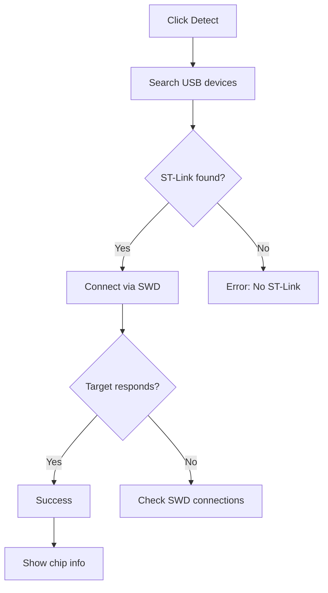
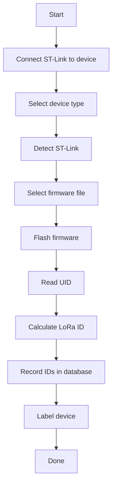
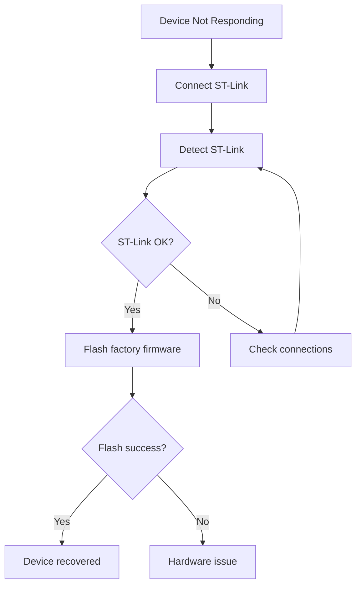

# STM32 Flasher - User Guide

## Table of Contents
1. [Getting Started](#getting-started)
2. [Hardware Setup](#hardware-setup)
3. [Device Type Selection](#device-type-selection)
4. [ST-Link Connection](#st-link-connection)
5. [Flashing Firmware](#flashing-firmware)
6. [Reading UID](#reading-uid)
7. [LoRa ID Calculation](#lora-id-calculation)
8. [Common Workflows](#common-workflows)
9. [Best Practices](#best-practices)
10. [Tips & Tricks](#tips--tricks)

---

## Getting Started

### Prerequisites

**Hardware:**
- STM32-based device (Droplet, Zone Controller, or Micro Edge)
- ST-Link V2 debug probe (or compatible)
- 4-pin SWD connection cable
- Computer with available USB port

**Software:**
- Nube EOL Toolkit installed
- ST-Link USB drivers installed
- Firmware .bin file for your device type

### Driver Installation

**Windows:**

**Option 1: ST-Link Official Drivers**
```
1. Download: ST-Link USB Drivers from STMicroelectronics website
2. Run installer: ST-LinkUpgrade.exe
3. Follow installation wizard
4. Restart computer if prompted
```

**Option 2: STM32CubeProgrammer** (includes drivers)
```
1. Download STM32CubeProgrammer from STMicroelectronics
2. Run installer
3. Drivers installed automatically
4. Verify in Device Manager: "STMicroelectronics STLink dongle"
```

**Verify Installation:**
```powershell
# Check Device Manager
devmgmt.msc

# Look under "Universal Serial Bus devices"
# Should show: "STMicroelectronics STLink dongle" or "ST-Link V2"
```

**Linux:**

```bash
# Install required packages
sudo apt-get update
sudo apt-get install openocd libusb-1.0-0-dev

# Create udev rule for ST-Link
sudo nano /etc/udev/rules.d/49-stlinkv2.rules

# Add this content:
# ST-Link V2
SUBSYSTEM=="usb", ATTR{idVendor}=="0483", ATTR{idProduct}=="3748", MODE="0666"
# ST-Link V2-1
SUBSYSTEM=="usb", ATTR{idVendor}=="0483", ATTR{idProduct}=="374b", MODE="0666"
# ST-Link V3
SUBSYSTEM=="usb", ATTR{idVendor}=="0483", ATTR{idProduct}=="374e", MODE="0666"

# Reload udev rules
sudo udevadm control --reload-rules
sudo udevadm trigger

# Add user to plugdev group (if needed)
sudo usermod -a -G plugdev $USER

# Log out and log back in
```

**Verify:**
```bash
# Check if ST-Link detected
lsusb | grep STMicro

# Should show:
# Bus 001 Device 005: ID 0483:3748 STMicroelectronics ST-LINK/V2
```

---

## Hardware Setup

### ST-Link to STM32 Connection

**4-Pin SWD Connection:**

```
ST-Link V2 Programmer
┌─────────────────────────┐
│  1  2  3  4  5  6  7  8 │
│  9 10 11 12 13 14 15 16 │
└─────────────────────────┘

Pin Mapping:
Pin 1  - VCC (3.3V)     →  3.3V on target
Pin 2  - SWCLK          →  PA14 (SWCLK)
Pin 3  - GND            →  GND on target
Pin 4  - SWDIO          →  PA13 (SWDIO)
Pin 5  - NRST (optional)→  NRST on target
```

### Physical Connection Steps

**Step 1: Identify SWD Pins on Device**

**Droplet (STM32WLE5):**
```
Device Header:
[GND] [3.3V] [SWDIO] [SWCLK]
```

**Zone Controller (STM32F030):**
```
Programming Header:
[SWDIO] [SWCLK] [GND] [3.3V]
```

**Micro Edge (STM32L432):**
```
SWD Pads:
[SWDIO] [SWCLK] [GND] [VCC]
```

**Step 2: Connect Wires**

```
ST-Link          Wire Color     Device
────────────────────────────────────────
Pin 1 (VCC)      Red       →   3.3V
Pin 2 (SWCLK)    Yellow    →   SWCLK (PA14)
Pin 3 (GND)      Black     →   GND
Pin 4 (SWDIO)    Blue      →   SWDIO (PA13)
```

**Important:**
- ✅ **Always connect GND first**
- ✅ **Verify 3.3V supply** (not 5V!)
- ✅ **Short wires** (< 10cm for reliable connection)
- ❌ **Never swap SWDIO and SWCLK** (will not work)

**Step 3: Power Up Sequence**

```
1. Connect ST-Link to computer USB
2. Connect SWD wires (GND → 3.3V → SWDIO → SWCLK)
3. Power on target device (if separate power)
4. LED on ST-Link should be solid or blinking (indicates power)
```

**Step 4: Verify Connection**

**Windows:**
```powershell
# Check if ST-Link detected
Get-PnpDevice | Where-Object {$_.FriendlyName -like "*ST-Link*"}

# Should show:
# Status: OK
# Class:  USB
# FriendlyName: STMicroelectronics STLink dongle
```

**Linux:**
```bash
# Check USB connection
lsusb | grep STMicro

# Should output:
# Bus 001 Device 005: ID 0483:3748 STMicroelectronics ST-LINK/V2
```

---

## Device Type Selection

### Selecting Device Type in Application

**Step 1: Open STM32 Flasher Tab**

```
┌────────────────────────────────────────────┐
│ Nube EOL Toolkit                           │
├────────────────────────────────────────────┤
│ [Devices] [ESP32] [STM32 Flasher] [Prov.] │
│                   ^^^^^^^^^^^^^^^^         │
└────────────────────────────────────────────┘
```

**Step 2: Select Device Type**

```
┌─────────────────────────────────────┐
│  STM32 Flasher                      │
├─────────────────────────────────────┤
│  Device Type: [Droplet ▼]          │◄── Click dropdown
│               - Droplet             │
│               - Zone Controller     │
│               - Micro Edge          │
└─────────────────────────────────────┘
```

**Step 3: Configuration Updates**

After selection, device-specific settings load:

```
Device: Droplet
┌─────────────────────────────────────┐
│  MCU:         STM32WLE5            │
│  Flash Size:  256 KB               │
│  Target:      stm32wlx.cfg         │
│  LoRa ID:     Supported ✓          │
└─────────────────────────────────────┘
```

### Device Type Characteristics

| Device | Flash Size | LoRa ID | Typical Use |
|--------|------------|---------|-------------|
| **Droplet** | 256 KB | ✅ Yes | LoRaWAN sensors, wireless I/O |
| **Zone Controller** | 64 KB | ❌ No | HVAC control, wired systems |
| **Micro Edge** | 128 KB | ✅ Yes | Edge computing, battery devices |

---

## ST-Link Connection

### Detection Process

**Step 1: Click "Detect ST-Link"**

```
┌─────────────────────────────────────┐
│  [Detect ST-Link]                   │◄── Click
└─────────────────────────────────────┘

Status: Detecting ST-Link probe...
```

**Step 2: Detection Flow**



**Step 3: Detection Result**

**Success:**
```
┌─────────────────────────────────────┐
│  ✓ ST-Link detected                 │
│                                     │
│  Chip:       STM32WLE5             │
│  Device ID:  0x435                 │
│  Flash Size: 256 KB                │
└─────────────────────────────────────┘
```

**Failure:**
```
┌─────────────────────────────────────┐
│  ✗ Failed to detect ST-Link         │
│                                     │
│  • Check USB connection             │
│  • Verify ST-Link drivers installed │
│  • Check SWD wiring                 │
└─────────────────────────────────────┘
```

---

## Flashing Firmware

### Pre-Flash Checklist

✅ **Device type selected correctly**  
✅ **ST-Link detected successfully**  
✅ **Firmware file (.bin) ready**  
✅ **Target device powered on**  
✅ **SWD connections secure**

### Flash Procedure

**Step 1: Select Firmware File**

```
┌─────────────────────────────────────┐
│  Firmware: [Select Firmware...]     │◄── Click
└─────────────────────────────────────┘
```

Navigate to firmware file:
```
Common locations:
- C:\firmware\droplet\
- ~/firmware/
- Project build folder
```

**Step 2: Verify Firmware Match**

```
Selected: droplet_v1.2.3.bin
Device Type: Droplet
Status: ✓ Match confirmed
```

**Important:** Ensure firmware matches device type:
- ❌ Droplet firmware → Zone Controller (will brick device)
- ✅ Droplet firmware → Droplet device

**Step 3: Click "Flash Firmware"**

```
┌─────────────────────────────────────┐
│  [Flash Firmware]                   │◄── Click
└─────────────────────────────────────┘
```

**Step 4: Monitor Progress**

```
┌─────────────────────────────────────┐
│  Stage: Writing firmware...         │
│                                     │
│  [████████████████░░░░░░░] 65%     │
│                                     │
│  Address: 0x08002000                │
│  Time: 8s elapsed                   │
└─────────────────────────────────────┘
```

**Flash Stages:**

| Stage | What Happens | Duration |
|-------|--------------|----------|
| **Connecting** | SWD handshake with target | 1-2s |
| **Halting** | Stop CPU execution | <1s |
| **Erasing** | Clear flash sectors | 2-5s |
| **Writing** | Program flash memory | 5-15s |
| **Verifying** | Read back and compare | 3-5s |
| **Resetting** | Restart microcontroller | <1s |

**Step 5: Flash Complete**

```
┌─────────────────────────────────────┐
│  ✓ Flash completed successfully!    │
│                                     │
│  [████████████████████████] 100%   │
│                                     │
│  Total time: 12 seconds             │
│  Device reset and running           │
└─────────────────────────────────────┘
```

---

## Reading UID

### What is UID?

**UID (Unique Identifier)** is a 96-bit factory-programmed number unique to each STM32 chip.

**Structure:**
- **UID[0]**: Lot number (32 bits)
- **UID[1]**: Wafer number + coordinates (32 bits)
- **UID[2]**: Lot + wafer number (32 bits)

**Uses:**
- Device serial number
- License key generation
- LoRa ID calculation
- Asset tracking

### Reading UID

**Step 1: Click "Read UID"**

```
┌─────────────────────────────────────┐
│  [Read UID]                         │◄── Click
└─────────────────────────────────────┘

Status: Reading unique ID...
```

**Step 2: UID Result**

```
┌─────────────────────────────────────┐
│  ✓ UID read successfully            │
│                                     │
│  UID[0]: 0x00340031                │
│  UID[1]: 0x33365111                │
│  UID[2]: 0x001A0043                │
│                                     │
│  Serial: 00340031-33365111-001A0043│
└─────────────────────────────────────┘
```

**Step 3: Copy UID (Optional)**

```
[Copy to Clipboard]  ← Copies full serial number
```

---

## LoRa ID Calculation

**Note:** Only available for Droplet and Micro Edge (devices with LoRa support).

### What is LoRa ID?

**LoRa ID** is a 32-bit identifier calculated from the UID, used for:
- LoRaWAN device registration
- Network server provisioning
- Fleet management
- Device tracking

### Calculating LoRa ID

**Automatic Calculation:**

After reading UID, LoRa ID automatically calculated:

```
┌─────────────────────────────────────┐
│  UID Read Complete                  │
├─────────────────────────────────────┤
│  UID[0]: 0x00340031                │
│  UID[1]: 0x33365111                │
│  UID[2]: 0x001A0043                │
│                                     │
│  LoRa ID: 33205003                 │◄── Auto-calculated
│                                     │
│  [Copy LoRa ID]                     │
└─────────────────────────────────────┘
```

**Manual Calculation (if needed):**

```
Algorithm:
1. XOR all three UID words: uid0 ⊕ uid1 ⊕ uid2
2. XOR result with version (0xC0 for Droplet)
3. Format as 8-digit uppercase hex

Example:
  0x00340031 ⊕ 0x33365111 ⊕ 0x001A0043 = 0x332050C3
  0x332050C3 ⊕ 0xC0 = 0x33205003
  LoRa ID = "33205003"
```

---

## Common Workflows

### Workflow 1: Factory Programming (First Flash)

**Scenario:** New device from manufacturing, needs firmware.

**Steps:**



**Expected Time:** ~30 seconds per device

**Configuration:**
- Device Type: Droplet
- Firmware: Production release (e.g., `droplet_v1.0.0.bin`)
- Erase: Always (clean state)

---

### Workflow 2: Firmware Update

**Scenario:** Update existing device with new firmware version.

**Steps:**

```
1. Connect ST-Link to device
   → Verify device powered on

2. Detect ST-Link
   → Confirms connection working

3. Select new firmware file
   → E.g., droplet_v1.2.0.bin (update from v1.0.0)

4. Flash firmware
   → Overwrites old firmware, preserves UID

5. Verify device boots
   → Check LED patterns or serial output

6. Done
```

**Expected Time:** ~15 seconds

---

### Workflow 3: Device Provisioning

**Scenario:** Register device with LoRaWAN network server.

**Steps:**

```
1. Connect and detect
   → Ensure device communicates

2. Read UID
   → Retrieves unique 96-bit ID

3. Calculate LoRa ID
   → Automatic from UID

4. Copy LoRa ID to clipboard
   → For registration

5. Register on network server
   → Paste LoRa ID as DevEUI or similar

6. Flash provisioned firmware (if needed)
   → Firmware with network credentials

7. Done
```

**Expected Time:** ~2 minutes (including server registration)

---

### Workflow 4: Recovery (Bricked Device)

**Scenario:** Device not responding, needs firmware restore.

**Steps:**



**Recovery Firmware:**
- Use known-good factory firmware
- Try bootloader + app if available
- Contact support if hardware damaged

---

## Best Practices

### Hardware Setup

✅ **Use short SWD wires**
- Maximum 10cm for 4 MHz speed
- Longer wires require lower SWD speed (1 MHz)

✅ **Secure connections**
- Use connectors, not loose wires
- Avoid moving device during flash
- Check continuity if unreliable

✅ **Stable power supply**
- Power device before connecting SWD
- Don't rely on ST-Link 3.3V for high-power devices
- Use external power supply if needed

### Firmware Management

✅ **Version your firmware**
```
Naming convention:
<device>_v<major>.<minor>.<patch>.bin

Examples:
droplet_v1.0.0.bin    → Initial release
droplet_v1.1.0.bin    → Feature update
droplet_v1.1.1.bin    → Bug fix
```

✅ **Keep firmware archive**
```
firmware/
  droplet/
    v1.0.0/
      droplet_v1.0.0.bin
      release_notes.txt
    v1.1.0/
      droplet_v1.1.0.bin
      release_notes.txt
```

✅ **Test firmware before production**
- Flash test device first
- Verify all features work
- Document any configuration steps

### Device Records

✅ **Log UID and LoRa ID**

```
Device Database:
Serial    UID                               LoRa ID    Firmware   Date
────────────────────────────────────────────────────────────────────────
DROP001   00340031-33365111-001A0043       33205003   v1.0.0     2024-01-15
DROP002   00450022-44476222-002B0054       44316114   v1.0.0     2024-01-15
```

✅ **Label devices**
- Print QR code with LoRa ID
- Apply to device case
- Enables quick identification

---

## Tips & Tricks

### Tip 1: Faster Detection

If detection is slow, try:

```
1. Close other applications using ST-Link (STM32CubeIDE, etc.)
2. Use shorter USB cable (< 1m)
3. Try different USB port (USB 3.0 preferred)
```

### Tip 2: Connection Issues

If "Failed to detect" error:

```
Checklist:
☐ ST-Link LED is on (indicates power)
☐ SWD wires connected correctly (SWDIO ↔ PA13, SWCLK ↔ PA14)
☐ GND connected
☐ Target device powered
☐ No short circuits
```

### Tip 3: Firmware Verification

After flashing, verify device boots:

**Method 1: LED Pattern**
- Most devices have power LED and status LED
- Status LED should show specific pattern after boot

**Method 2: Serial Console**
- Connect UART adapter to device TX pin
- Open serial console at 115200 baud
- Should see boot messages

**Method 3: Read Flash**
```
Use "Verify" option in application (if available)
Or use STM32CubeProgrammer to read flash and compare
```

### Tip 4: Batch Programming

For multiple devices:

```
Setup:
- Multiple ST-Link probes (one per device)
- USB hub
- Multiple firmware files (same version)

Process:
1. Open multiple application instances (if supported)
2. Or use command-line OpenOCD script
3. Flash devices in parallel

Saves time in production!
```

### Tip 5: Keep ST-Link Firmware Updated

```
ST-Link has updatable firmware.
Newer versions fix bugs and improve reliability.

Update via:
- STM32CubeProgrammer → Firmware Upgrade
- Or standalone ST-Link Upgrade tool
```

### Tip 6: SWD Speed Adjustment

If flash fails or is unreliable:

```
Default: 4000 kHz (4 MHz)
Try:    1000 kHz (1 MHz) for longer wires or noisy environments

Lower speed = more reliable, slightly slower flash
```

---

## Summary

This user guide covered:

✅ **Getting Started** - Prerequisites, driver installation  
✅ **Hardware Setup** - ST-Link wiring, physical connections  
✅ **Device Selection** - Choosing Droplet/Zone Controller/Micro Edge  
✅ **ST-Link Connection** - Detection process, troubleshooting  
✅ **Flashing Firmware** - Complete flash procedure with progress  
✅ **Reading UID** - Unique identifier retrieval  
✅ **LoRa ID Calculation** - Automatic ID generation from UID  
✅ **Common Workflows** - Factory programming, updates, provisioning, recovery  
✅ **Best Practices** - Hardware setup, firmware management, record keeping  
✅ **Tips & Tricks** - Speed optimization, verification, batch programming  

**Quick Reference:**

```
┌─────────────────────────────────────────────┐
│  STM32 Flasher Quick Reference              │
├─────────────────────────────────────────────┤
│  Connection:   ST-Link V2 via SWD (4-wire)  │
│  Flash Time:   10-30s (depends on size)     │
│  SWD Speed:    4 MHz (default), 1 MHz (safe)│
│  Erase:        Always for factory flash     │
│  UID Location: 0x1FFF7590 (Droplet/Edge)    │
│                0x1FFFF7AC (Zone Controller)  │
│  LoRa ID:      Calculated from UID ⊕ 0xC0   │
└─────────────────────────────────────────────┘
```

**Need Help?**  
See [Troubleshooting.md](Troubleshooting.md) for common issues and solutions.
