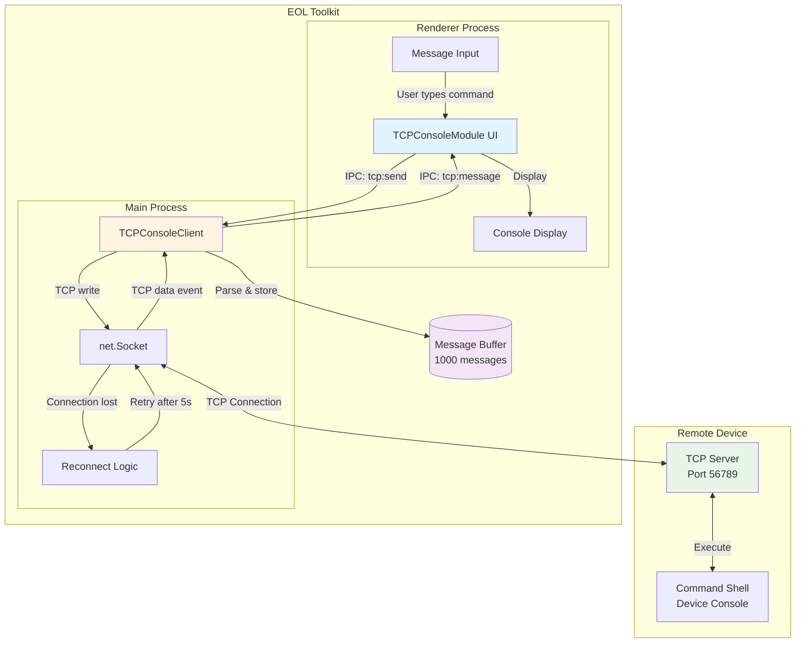
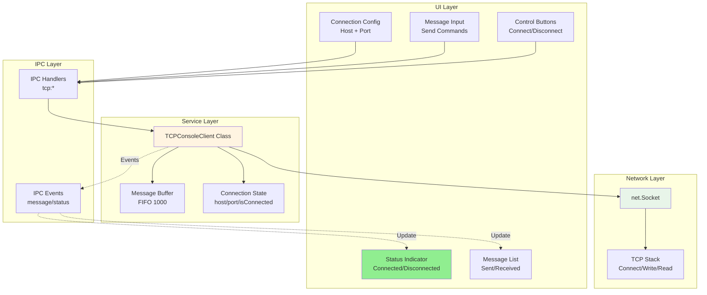
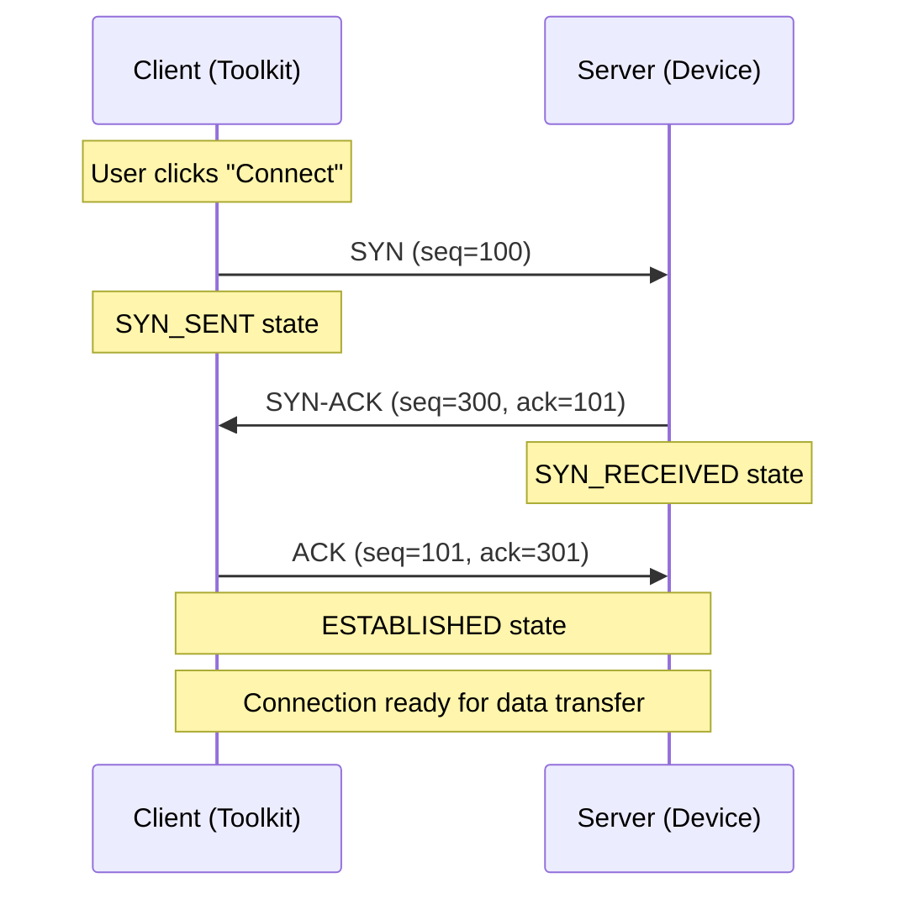
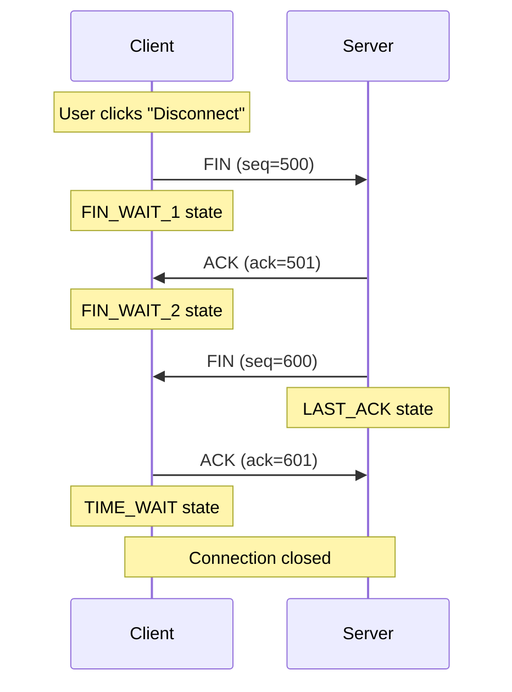
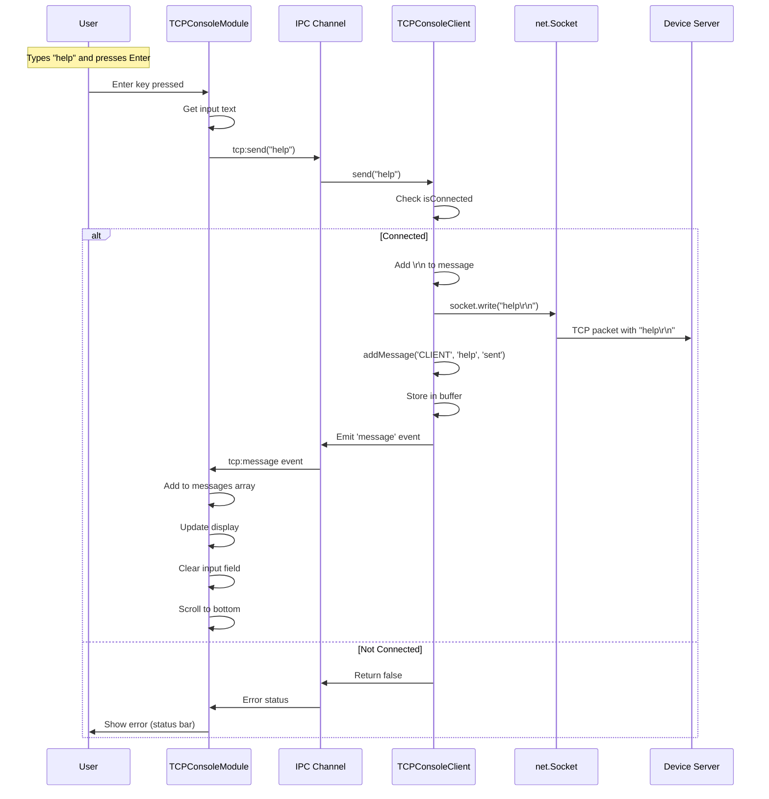
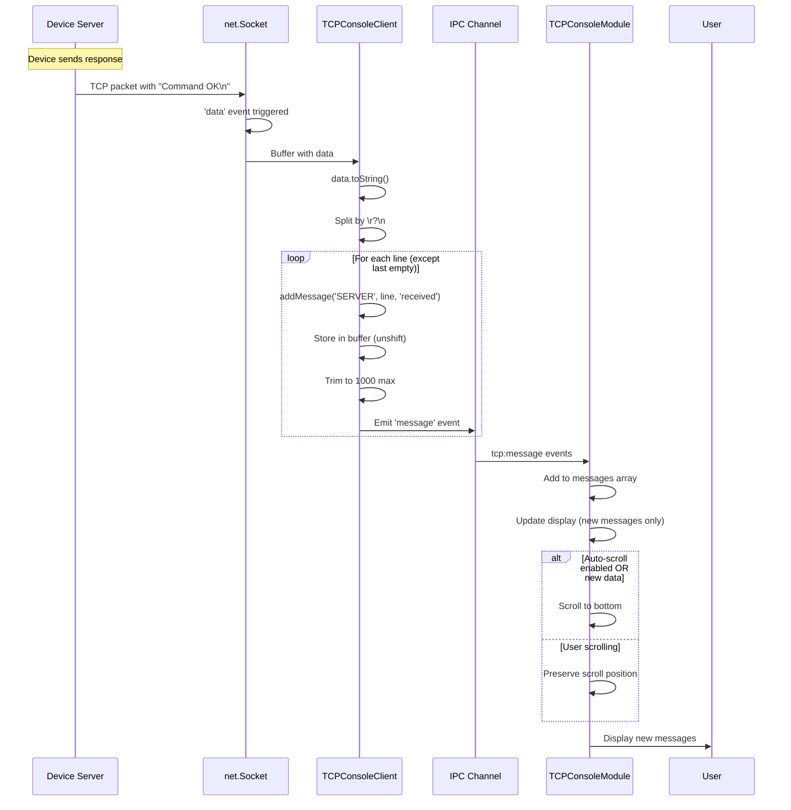
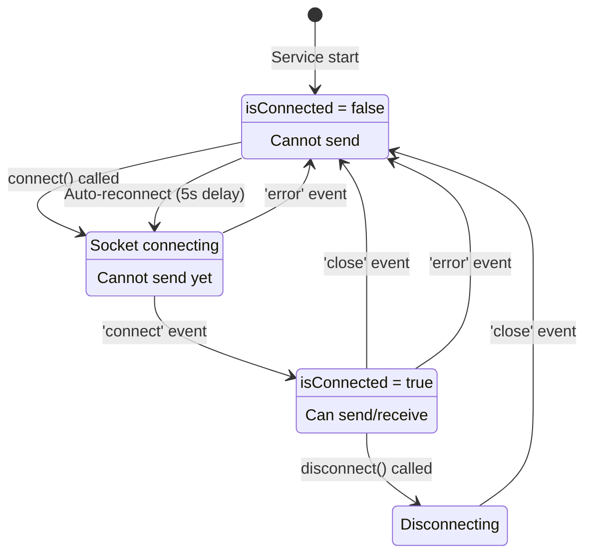
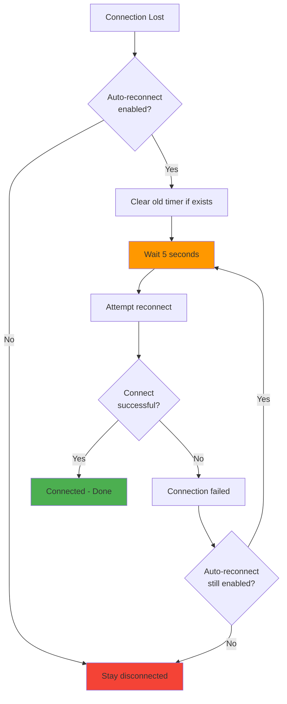

# TCP Console Feature - Technical Overview

**Feature:** TCP Client Console Communication  
**Component:** TCPConsoleModule + TCPConsoleClient Service  
**Status:** Production Ready  
**Last Updated:** December 9, 2025

---

## Table of Contents

1. [Introduction](#introduction)
2. [Architecture Overview](#architecture-overview)
3. [System Components](#system-components)
4. [TCP Protocol Details](#tcp-protocol-details)
5. [Data Flow](#data-flow)
6. [Connection Management](#connection-management)
7. [Auto-Reconnect System](#auto-reconnect-system)
8. [Message Handling](#message-handling)
9. [Performance Characteristics](#performance-characteristics)
10. [Network Configuration](#network-configuration)
11. [Integration Points](#integration-points)
12. [Technical Specifications](#technical-specifications)

---

## Introduction

The **TCP Console** feature provides a reliable TCP-based terminal interface for bidirectional communication with remote TCP servers. Unlike UDP (connectionless), TCP guarantees message delivery and maintains order, making it ideal for command-and-control scenarios and critical data transfer.

### Purpose

1. **Reliable Communication:** TCP ensures all messages are delivered
2. **Interactive Terminal:** Real-time command sending and response monitoring
3. **Device Control:** Send commands to remote devices and see responses
4. **Debugging:** Monitor device behavior through console output

### Use Cases

- **Device Shell Access:** Connect to device console servers
- **Command Execution:** Send configuration commands to devices
- **Log Monitoring:** Receive real-time device logs via TCP
- **API Testing:** Test TCP-based device APIs
- **Production Control:** Control devices in factory settings

---

## Architecture Overview

### High-Level Architecture



### Component Architecture



---

## System Components

### 1. TCPConsoleModule (Frontend)

**File:** `renderer/modules/TCPConsoleModule.js` (491 lines)

**Responsibilities:**
- Render console UI with connection controls
- Handle user input for host, port, and messages
- Display sent and received messages
- Manage UI state (connection status, auto-scroll)
- Implement efficient message rendering

**Key UI Elements:**

1. **Connection Settings Panel:**
   - Host input (IP address or hostname)
   - Port input (default: 56789)
   - Connect/Disconnect button
   - Auto-reconnect checkbox

2. **Status Display:**
   - Connection indicator (green=connected, red=disconnected)
   - Status message (error messages, connection info)
   - Message count

3. **Message Input:**
   - Text input field for typing commands
   - Send button
   - Enter key support

4. **Console Display:**
   - Scrollable message list (500px height)
   - Sent messages (black text, no prefix)
   - Received messages (raw output, no timestamp)
   - System messages (gray, with timestamp)
   - Clear button
   - Auto-scroll checkbox

**State Management:**
```javascript
{
  messages: [],           // Array of message objects
  status: {              // Connection status
    isConnected: false,
    host: '192.168.15.10',
    port: 56789,
    message: '',         // Status message
    error: ''            // Error message
  },
  autoScroll: false,     // Disabled by default
  autoReconnect: false,  // Auto-reconnect enabled
  messageInput: '',      // Current input text
  showConsole: false     // Module visibility
}
```

---

### 2. TCPConsoleClient (Backend)

**File:** `services/tcp-console.js` (253 lines)

**Responsibilities:**
- Create and manage TCP socket connections
- Send and receive data over TCP
- Buffer messages in memory (last 1000)
- Handle connection events (connect, disconnect, error)
- Implement auto-reconnect logic
- Parse received data and split into lines

**Class Structure:**
```javascript
class TCPConsoleClient extends EventEmitter {
  constructor()
  connect(host, port)
  disconnect()
  send(message)
  addMessage(from, message, type)
  scheduleReconnect()
  getStatus()
  getMessages()
  clearMessages()
  setAutoReconnect(enabled)
}
```

**Message Object Structure:**
```javascript
{
  timestamp: 1702123456789,  // Unix timestamp in ms
  from: 'SERVER',            // 'CLIENT', 'SERVER', 'SYSTEM'
  message: 'Hello World',    // Message text
  type: 'sent'               // 'sent', 'received', 'system', 'error'
}
```

---

### 3. net.Socket (Node.js)

**Library:** `net` (Node.js built-in)

**Configuration:**
```javascript
const net = require('net');
const client = new net.Socket();

// Connect to server
client.connect(port, host, () => {
  console.log('Connected');
});

// Receive data
client.on('data', (data) => {
  console.log('Received:', data.toString());
});

// Connection closed
client.on('close', () => {
  console.log('Connection closed');
});

// Handle errors
client.on('error', (err) => {
  console.error('Error:', err.message);
});
```

**Event Handlers:**
- `connect`: Connection established
- `data`: Data received from server
- `close`: Connection closed
- `error`: Error occurred
- `drain`: Write buffer empty

---

## TCP Protocol Details

### TCP vs UDP Comparison

| Feature | TCP | UDP | TCP Console Uses |
|---------|-----|-----|------------------|
| **Connection** | Connection-oriented | Connectionless | ✅ Maintains persistent connection |
| **Reliability** | Guaranteed delivery | No guarantee | ✅ Critical commands must arrive |
| **Overhead** | High (20+ bytes) | Low (8 bytes) | ⚠️ Acceptable for terminal use |
| **Speed** | Slower | Fast | ⚠️ Fast enough for terminal |
| **Order** | Guaranteed | Not guaranteed | ✅ Command order matters |
| **Flow Control** | Yes (windowing) | No | ✅ Prevents data loss |
| **Streaming** | Byte stream | Datagram | ✅ Perfect for console |

**Why TCP for Console?**

1. **Reliability:** Commands must arrive (no dropped messages)
2. **Order:** Command sequence matters (e.g., config then save)
3. **Streaming:** Console output is continuous stream
4. **Bidirectional:** Full-duplex communication
5. **Flow Control:** Prevents buffer overflow

---

### TCP 3-Way Handshake



**Handshake Steps:**
1. **SYN:** Client initiates connection
2. **SYN-ACK:** Server acknowledges and sends own SYN
3. **ACK:** Client acknowledges server's SYN

**Connection Established:** Both sides in ESTABLISHED state

---

### TCP Connection Teardown



---

### Packet Structure

**TCP Segment:**
```
┌────────────┬────────────┬────────────┬────────────┐
│Source Port │ Dest Port  │  Sequence  │   Ack Num  │
│ (2 bytes)  │ (2 bytes)  │ (4 bytes)  │ (4 bytes)  │
├────────────┼────────────┼────────────┼────────────┤
│Data Offset │  Flags     │   Window   │  Checksum  │
│ (4 bits)   │ (8 bits)   │ (2 bytes)  │ (2 bytes)  │
├────────────┴────────────┴────────────┴────────────┤
│            Options (variable)                      │
├───────────────────────────────────────────────────┤
│            Data Payload                            │
│         (Command or response text)                 │
└───────────────────────────────────────────────────┘
```

**Flags:**
- **SYN:** Synchronize sequence numbers (connection start)
- **ACK:** Acknowledgment field valid
- **FIN:** No more data (connection end)
- **RST:** Reset connection (error)
- **PSH:** Push data to application immediately

---

## Data Flow

### Message Send Flow



### Message Receive Flow



---

## Connection Management

### Connection State Machine



### Connection Lifecycle

**1. Initial State:**
```javascript
{
  client: null,
  isConnected: false,
  host: '192.168.15.10',
  port: 56789,
  messages: [],
  autoReconnect: false
}
```

**2. Connecting:**
```javascript
connect(host, port) {
  this.host = host;
  this.port = port;
  this.client = new net.Socket();
  
  this.client.connect(port, host, () => {
    this.isConnected = true;
    this.emit('status-change', { isConnected: true });
  });
  
  // Setup event handlers...
}
```

**3. Connected:**
```javascript
// Can now send messages
send(message) {
  if (this.isConnected) {
    this.client.write(message + '\r\n');
    return true;
  }
  return false;
}
```

**4. Disconnecting:**
```javascript
disconnect() {
  this.autoReconnect = false; // Disable auto-reconnect
  if (this.client) {
    this.client.removeAllListeners(); // Clean up
    this.client.destroy(); // Close socket
    this.client = null;
  }
  this.isConnected = false;
}
```

---

## Auto-Reconnect System

### How Auto-Reconnect Works



### Auto-Reconnect Implementation

**Enable Auto-Reconnect:**
```javascript
setAutoReconnect(enabled) {
  this.autoReconnect = enabled;
  if (!enabled && this.reconnectTimer) {
    clearTimeout(this.reconnectTimer);
    this.reconnectTimer = null;
  }
}
```

**Trigger Reconnect on Close:**
```javascript
this.client.on('close', () => {
  this.isConnected = false;
  
  if (this.autoReconnect) {
    this.scheduleReconnect(); // ← Auto-reconnect
  }
});
```

**Schedule Reconnect:**
```javascript
scheduleReconnect() {
  if (this.reconnectTimer) {
    clearTimeout(this.reconnectTimer);
  }
  
  this.reconnectTimer = setTimeout(() => {
    console.log('Attempting to reconnect...');
    this.connect(this.host, this.port);
  }, 5000); // 5 second delay
}
```

### Auto-Reconnect Use Cases

**Production Environment:**
- Device temporarily reboots
- Network glitch
- Server restart
- Cable reconnected

**Development:**
- Device firmware update
- Server code reload
- Network configuration change

**Best Practices:**
- Enable for unattended operation
- Disable for manual testing (avoid spam)
- 5-second delay prevents rapid retry spam

---

## Message Handling

### Message Types

**1. Sent Messages (Client → Server):**
```javascript
{
  timestamp: 1702123456789,
  from: 'CLIENT',
  message: 'config wifi ssid MyNetwork',
  type: 'sent'
}
```

**Display:** Black text, no prefix (shows raw command)

**2. Received Messages (Server → Client):**
```javascript
{
  timestamp: 1702123456790,
  from: 'SERVER',
  message: 'WiFi configured successfully',
  type: 'received'
}
```

**Display:** Black text, no prefix (shows raw server output)

**3. System Messages:**
```javascript
{
  timestamp: 1702123456791,
  from: 'SYSTEM',
  message: 'Connection closed',
  type: 'system'
}
```

**Display:** Gray text with timestamp and `[SYSTEM]` prefix

**4. Error Messages:**
```javascript
{
  timestamp: 1702123456792,
  from: 'SYSTEM',
  message: 'ECONNREFUSED: Connection refused',
  type: 'error'
}
```

**Display:** Red text with timestamp and `[ERROR]` prefix

---

### Message Buffer Management

**FIFO Buffer (First In, First Out):**
```javascript
addMessage(from, message, type) {
  const logEntry = {
    timestamp: Date.now(),
    from: from,
    message: message,
    type: type
  };
  
  // Add to front of array (newest first)
  this.messages.unshift(logEntry);
  
  // Trim to max 1000 messages
  if (this.messages.length > this.maxMessages) {
    this.messages.pop(); // Remove oldest
  }
  
  // Notify UI
  this.emit('message', logEntry);
}
```

**Why FIFO?**
- Constant memory usage (1000 × ~100 bytes = 100 KB)
- Newest messages always available
- Old messages naturally age out
- No manual cleanup needed

---

### Line Splitting

**Problem:** TCP is a byte stream, not message-based. Multiple lines may arrive in one `data` event, or a line may be split across multiple events.

**Solution:** Split by newline characters:
```javascript
this.client.on('data', (data) => {
  const message = data.toString();
  
  // Split by \n or \r\n
  const lines = message.split(/\r?\n/);
  
  lines.forEach((line, index) => {
    // Skip the last empty line from split
    if (index === lines.length - 1 && line === '') {
      return;
    }
    
    this.addMessage('SERVER', line, 'received');
  });
});
```

**Example:**
```
Input buffer: "Line 1\nLine 2\nLine 3\n"
After split:  ["Line 1", "Line 2", "Line 3", ""]
Messages:     ["Line 1", "Line 2", "Line 3"]  (skip last empty)
```

---

## Performance Characteristics

### Throughput

**Message Rate:**
- **Typical:** 10-100 messages/second (human typing)
- **Maximum:** 1,000 messages/second (automated)
- **Practical:** Limited by TCP buffering and network RTT

**Latency:**

| Stage | Time | Cumulative |
|-------|------|------------|
| User types Enter | 0ms | 0ms |
| IPC to main | 1ms | 1ms |
| TCP write | 1ms | 2ms |
| Network transmission | 1-10ms | 3-12ms |
| Server processing | 1-100ms | 4-112ms |
| TCP receive | 1-10ms | 5-122ms |
| IPC to renderer | 1ms | 6-123ms |
| UI update | 10ms | 16-133ms |

**Typical RTT (Round Trip Time):** 20-150ms

---

### Memory Usage

**Service Memory:**
```javascript
// Message buffer: 1000 messages × 100 bytes = 100 KB
// Socket buffer: ~16 KB
// Node.js overhead: ~5 MB
// Total: ~5.2 MB
```

**Per Connection:**
- One TCPConsoleClient instance
- One net.Socket instance
- One message buffer

**Multiple Connections:** Not supported (single connection only)

---

### TCP Buffering

**Write Buffer:**
- Node.js buffers outgoing data
- Automatic flushing when full or PSH flag
- `drain` event when buffer empty

**Read Buffer:**
- OS kernel buffers incoming data
- Node.js reads in chunks (typically 16 KB)
- `data` event for each chunk

**Flow Control:**
- TCP window size controls buffer
- Prevents sender from overwhelming receiver
- Automatic backpressure

---

## Network Configuration

### Connection Settings

**Default Configuration:**
```javascript
{
  host: '192.168.15.10',  // Device IP
  port: 56789,            // TCP server port
  autoReconnect: false    // Disabled by default
}
```

**Host Options:**
- IP address: `192.168.1.100`
- Hostname: `device.local`
- localhost: `127.0.0.1` or `localhost`

**Port Range:**
- Valid: 1-65535
- Privileged: 1-1023 (require root/admin)
- Registered: 1024-49151
- Dynamic: 49152-65535 (recommended)

---

### Server Examples

**Node.js TCP Server:**
```javascript
const net = require('net');

const server = net.createServer((socket) => {
  console.log('Client connected');
  
  socket.on('data', (data) => {
    const command = data.toString().trim();
    console.log('Received:', command);
    
    // Echo response
    socket.write(`Command: ${command}\n`);
    
    // Process command
    if (command === 'help') {
      socket.write('Available commands: help, status, reboot\n');
    }
  });
  
  socket.on('end', () => {
    console.log('Client disconnected');
  });
});

server.listen(56789, '0.0.0.0', () => {
  console.log('Server listening on port 56789');
});
```

**Python TCP Server:**
```python
import socket

server = socket.socket(socket.AF_INET, socket.SOCK_STREAM)
server.bind(('0.0.0.0', 56789))
server.listen(1)

print('Server listening on port 56789')

while True:
    client, addr = server.accept()
    print(f'Client connected: {addr}')
    
    while True:
        data = client.recv(1024)
        if not data:
            break
        
        command = data.decode().strip()
        print(f'Received: {command}')
        
        # Send response
        client.send(f'Command: {command}\n'.encode())
    
    client.close()
```

**ESP32 TCP Server (Arduino):**
```cpp
#include <WiFi.h>

WiFiServer server(56789);
WiFiClient client;

void setup() {
  WiFi.begin("SSID", "password");
  while (WiFi.status() != WL_CONNECTED) delay(500);
  
  server.begin();
  Serial.println("Server started on port 56789");
}

void loop() {
  if (!client.connected()) {
    client = server.available();
  }
  
  if (client.available()) {
    String command = client.readStringUntil('\n');
    Serial.println("Received: " + command);
    
    // Send response
    client.println("Command: " + command);
    
    // Process command
    if (command == "status") {
      client.println("Temperature: 25C");
      client.println("Uptime: 3600s");
    }
  }
}
```

---

### Firewall Configuration

**Windows:**
```powershell
# Allow outbound TCP connections (usually allowed by default)
New-NetFirewallRule -DisplayName "TCP Console Client" `
  -Direction Outbound `
  -Protocol TCP `
  -Action Allow

# If device is on same machine (server on localhost)
New-NetFirewallRule -DisplayName "TCP Console Server" `
  -Direction Inbound `
  -LocalPort 56789 `
  -Protocol TCP `
  -Action Allow
```

**Linux:**
```bash
# Allow outbound TCP (usually allowed by default)
sudo iptables -A OUTPUT -p tcp -j ACCEPT

# If server on localhost
sudo iptables -A INPUT -p tcp --dport 56789 -j ACCEPT
sudo ufw allow 56789/tcp  # Ubuntu/Debian
```

---

### Network Topology

**Direct Connection:**
```
┌─────────────────────┐
│   EOL Toolkit       │
│  (TCP Client)       │
│  192.168.1.100      │
└──────────┬──────────┘
           │
           │ TCP connection
           │ port 56789
           │
┌──────────┴──────────┐
│   Device            │
│  (TCP Server)       │
│  192.168.1.101:56789│
└─────────────────────┘
```

**Through Router:**
```
┌─────────────────┐
│  Router/Switch  │
│  192.168.1.1    │
└────────┬────────┘
         │
    ┌────┴─────┬─────────────┐
    │          │             │
┌───┴───┐  ┌───┴──────┐  ┌──┴─────────┐
│ Dev1  │  │ Dev2     │  │ Toolkit    │
│.101:  │  │.102:     │  │ .100       │
│56789  │  │56789     │  │ Client     │
└───────┘  └──────────┘  └────────────┘
    ↑                         │
    └─────────────────────────┘
     Connect to one device at a time
```

---

## Integration Points

### With Other Features

**Factory Testing:**
```javascript
// Send test commands via TCP
await factoryTest.connect('192.168.1.101', 56789);
await factoryTest.sendCommand('test led red');
const response = await factoryTest.waitForResponse();
```

**Serial Console:**
```javascript
// TCP console connects to device
// Serial console connects to same device via UART
// Both can be used simultaneously for different purposes
```

**Device Provisioning:**
```javascript
// After provisioning, connect via TCP to verify
await provision.complete();
await tcpConsole.connect(deviceIP, 56789);
await tcpConsole.send('status');
```

---

### IPC Channels

**Main → Renderer:**
- `tcp:message` - New message received
- `tcp:status-change` - Connection status changed
- `tcp:messages-cleared` - Messages cleared

**Renderer → Main:**
- `tcp:getStatus` - Get current status
- `tcp:getMessages` - Get message buffer
- `tcp:send` - Send message
- `tcp:connect` - Connect to server
- `tcp:disconnect` - Disconnect from server
- `tcp:clearMessages` - Clear message buffer
- `tcp:setAutoReconnect` - Enable/disable auto-reconnect

---

## Technical Specifications

### Supported Platforms

**Operating Systems:**
- ✅ Windows 10/11
- ✅ Linux (Ubuntu 20.04+)
- ✅ macOS 10.15+

**Node.js:**
- Minimum: Node.js 16.x
- Recommended: Node.js 18.x+
- net module: Built-in (no installation needed)

---

### Protocol Specifications

**TCP Protocol:** RFC 793
- Connection-oriented
- Reliable (ACK for every packet)
- Ordered (sequence numbers)
- Flow control (sliding window)
- 20-byte minimum header

**IP Protocol:** IPv4
- 20-byte header
- Maximum packet: 65,535 bytes
- MTU typical: 1500 bytes
- Fragmentation if needed

---

### Socket Options

**Default Options:**
```javascript
socket.setNoDelay(true);  // Disable Nagle's algorithm
socket.setKeepAlive(true, 30000);  // Keep-alive every 30s
socket.setTimeout(0);  // No timeout
```

**Nagle's Algorithm:**
- Normally enabled (batches small packets)
- Disabled for console (immediate send)
- Reduces latency for interactive use

**Keep-Alive:**
- Sends periodic probes
- Detects broken connections
- Prevents NAT timeout

---

### Error Handling

**Common Errors:**

| Error Code | Description | Solution |
|------------|-------------|----------|
| `ECONNREFUSED` | Connection refused | Check if server is running |
| `ETIMEDOUT` | Connection timeout | Check network/firewall |
| `ENOTFOUND` | Host not found | Check hostname/IP |
| `ECONNRESET` | Connection reset | Server closed connection |
| `EPIPE` | Broken pipe | Connection lost while writing |
| `EHOSTUNREACH` | Host unreachable | Check network routing |

**Error Recovery:**
```javascript
client.on('error', (err) => {
  console.error('TCP Error:', err.message);
  
  switch (err.code) {
    case 'ECONNREFUSED':
      // Server not running
      if (autoReconnect) scheduleReconnect();
      break;
    
    case 'ETIMEDOUT':
      // Network timeout
      if (autoReconnect) scheduleReconnect();
      break;
    
    case 'ENOTFOUND':
      // Invalid host - don't retry
      autoReconnect = false;
      break;
  }
});
```

---

## Security Considerations

### Connection Security

**Current Implementation:**
- ⚠️ Unencrypted TCP connection
- ⚠️ No authentication
- ⚠️ Plain text commands and responses

**Recommendations:**

**1. Use SSH Tunnel:**
```bash
# Create SSH tunnel to device
ssh -L 56789:localhost:56789 user@device.local

# Connect to localhost:56789 in toolkit
# Traffic encrypted through SSH
```

**2. VPN:**
- Use VPN for device network access
- All traffic encrypted at network layer

**3. TLS/SSL (Future Enhancement):**
```javascript
const tls = require('tls');
const client = tls.connect(56789, host, {
  ca: [fs.readFileSync('ca-cert.pem')],
  cert: fs.readFileSync('client-cert.pem'),
  key: fs.readFileSync('client-key.pem')
});
```

---

### Network Security

**Trusted Network Only:**
- Use on isolated factory/test networks
- Don't expose TCP port to internet
- Use firewall rules to restrict access

**Device Security:**
- Implement authentication on device server
- Validate all commands on device
- Limit command scope (whitelist)
- Log all commands for audit

---

## Comparison with Other Features

### TCP Console vs Serial Console

| Feature | TCP Console | Serial Console |
|---------|-------------|----------------|
| **Connection** | Network (WiFi/Ethernet) | Physical cable (UART) |
| **Range** | Unlimited (network) | ~5 meters |
| **Speed** | Network speed (1+ Mbps) | Baud rate (115200 bps typical) |
| **Multiple Devices** | One at a time | One at a time |
| **Reliability** | Network dependent | Very reliable |
| **Use Case** | Remote devices | Local development |

**When to Use TCP Console:**
- Device has network connectivity
- Remote access needed
- Higher bandwidth required
- Multiple operators share access

**When to Use Serial Console:**
- Device has UART port
- Network not available
- Debugging low-level firmware
- Boot-time access needed

---

## Advanced Features

### Message Filtering (Future)

**Filter by type:**
```javascript
// Show only received messages
messages.filter(m => m.type === 'received')

// Show only errors
messages.filter(m => m.type === 'error')

// Show last hour
const oneHourAgo = Date.now() - 3600000;
messages.filter(m => m.timestamp > oneHourAgo)
```

### Command History (Future)

**Store sent commands:**
```javascript
const commandHistory = [];
const historyIndex = 0;

// Up arrow: previous command
// Down arrow: next command
// Enter: send and add to history
```

### Scripting (Future)

**Send multiple commands:**
```javascript
const script = [
  'config wifi ssid MyNetwork',
  'config wifi password secret123',
  'save config',
  'reboot'
];

for (const command of script) {
  await tcpConsole.send(command);
  await sleep(1000); // Wait 1 second between commands
}
```

---

## Best Practices

### For Developers

1. **Always check connection status before sending**
2. **Enable auto-reconnect for production monitoring**
3. **Disable auto-reconnect for interactive testing**
4. **Use proper line endings (\r\n) for Windows devices**
5. **Implement timeout on device server (disconnect idle clients)**

### For Device Firmware

1. **Echo commands back for confirmation**
2. **Send clear response messages**
3. **Use consistent line endings**
4. **Implement command whitelist**
5. **Log all commands for security audit**

### For Operators

1. **Test connection to localhost first (127.0.0.1:56789)**
2. **Check firewall if connection fails**
3. **Use auto-scroll for continuous monitoring**
4. **Disable auto-scroll for reviewing old messages**
5. **Clear messages periodically to save memory**

---

## Troubleshooting Quick Reference

| Problem | Likely Cause | Solution |
|---------|--------------|----------|
| Connection refused | Server not running | Start server on device |
| Connection timeout | Firewall/network issue | Check firewall, ping device |
| Can't send messages | Not connected | Click Connect first |
| No response | Server not responding | Check server logs |
| Garbled output | Line ending issue | Check \n vs \r\n |
| Auto-reconnect spam | Rapid failures | Disable auto-reconnect |
| Scroll jumps | Auto-scroll enabled | Disable auto-scroll |

---

## Performance Optimization

### UI Rendering

**Problem:** Full re-render on every message causes flicker

**Solution:** Incremental rendering
```javascript
// Only render new messages
updateMessagesOnly() {
  const currentCount = container.children.length;
  const newCount = this.messages.length - currentCount;
  
  // Add only new messages
  for (let i = newCount - 1; i >= 0; i--) {
    const messageEl = this.createMessageElement(this.messages[i]);
    container.appendChild(messageEl);
  }
}
```

### Memory Management

**Problem:** Unbounded message buffer

**Solution:** Fixed-size FIFO buffer
```javascript
// Always maintain exactly 1000 messages
if (this.messages.length > 1000) {
  this.messages.pop(); // Remove oldest
}
```

---

## Revision History

| Version | Date | Changes | Author |
|---------|------|---------|--------|
| 1.0 | 2025-12-09 | Initial technical overview | Documentation Team |

---

## Related Documentation

- [README.md](./README.md) - Quick start guide
- [UserGuide.md](./UserGuide.md) - User procedures
- [SourceCode.md](./SourceCode.md) - Code documentation
- [Troubleshooting.md](./Troubleshooting.md) - Problem solving

---

**[← Back to README](./README.md)** | **[Next: User Guide →](./UserGuide.md)**
