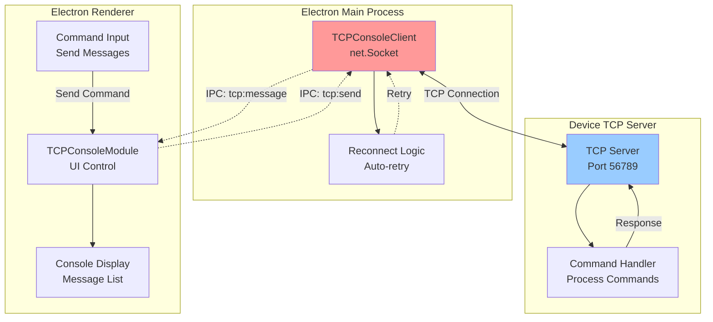
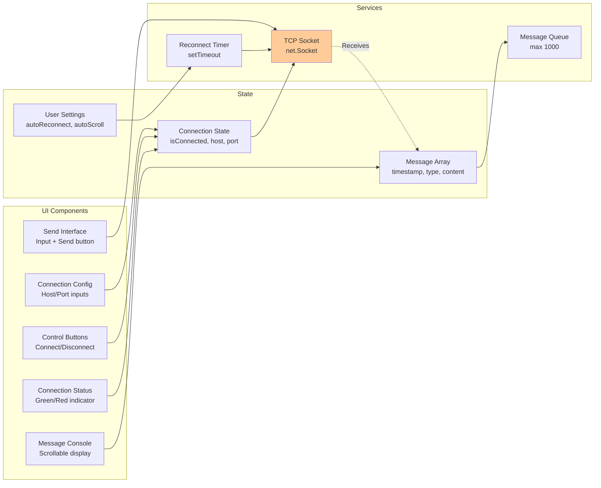

# TCP Console - TCP Terminal Interface

**Feature:** TCP Console (Developer Tool)  
**Purpose:** Reliable TCP-based terminal communication with devices  
**Status:** Core feature - Always enabled  
**Last Updated:** December 9, 2025

---

## 📋 Overview

The **TCP Console** provides a reliable TCP-based terminal interface for bidirectional communication with devices. Unlike UDP (which is unreliable), TCP guarantees message delivery, making it ideal for command-and-control scenarios and critical data transfer.

### Key Capabilities

- 🔌 **TCP Client Connection** - Connect to any TCP server
- 📡 **Bidirectional Communication** - Send and receive messages
- ✅ **Guaranteed Delivery** - TCP ensures message delivery
- 🔄 **Auto-Reconnect** - Automatic reconnection on disconnect
- 📝 **Message History** - Keep last 1000 messages
- 🎮 **Command Interface** - Interactive command sending
- 🌓 **Dark Mode Support** - Eye-friendly for long sessions

---

## 🚀 Quick Start

### 1. Configure Connection

**Settings:**
- **Host:** Device IP address (e.g., 192.168.15.10)
- **Port:** TCP server port (e.g., 56789)

### 2. Connect

1. Enter host and port
2. Click **Connect** button
3. Status indicator turns green
4. Messages appear in console

### 3. Send Commands

1. Type command in input field
2. Press **Enter** or click **Send**
3. Response appears in console
4. Auto-scrolls to latest message

---

## 🏗️ Architecture

### System Overview



### Component Diagram



---

## 🎮 Features

### TCP Connection Management

**Connection States:**
- 🔴 **Disconnected** - No connection
- 🟡 **Connecting** - Attempting connection
- 🟢 **Connected** - Active connection
- 🟠 **Reconnecting** - Auto-reconnect in progress

**Connection Configuration:**
- Host: IP address or hostname
- Port: 1-65535
- Persistent settings (localStorage)

### Auto-Reconnect

**Automatic Reconnection:**
- Toggleable via checkbox
- Retries every 3 seconds on failure
- Stops on manual disconnect
- Shows retry attempts

**Use Cases:**
- Device reboots
- Network interruptions
- Server restarts
- Development testing

### Message Display

**Message Types:**
- **SENT** - Commands sent to device (blue)
- **RECEIVED** - Responses from device (green)
- **SYSTEM** - Connection status messages (gray)

**Display Format:**
```
[HH:MM:SS] [TYPE] Message content
```

**Example:**
```
[14:23:45] [SYSTEM] Connected to 192.168.15.10:56789
[14:23:46] [SENT] AT+VERSION
[14:23:46] [RECEIVED] Firmware v2.1.0
[14:23:50] [SENT] AT+STATUS
[14:23:50] [RECEIVED] Status: OK
```

### Command Interface

**Sending Commands:**
1. Type in input field
2. Press **Enter** (instant)
3. Or click **Send** button
4. Command appears in console
5. Response appears below

**Command History:**
- Last 1000 messages kept
- Reverse chronological order (newest first)
- Persists in memory during session
- Clear via button

---

## 💻 User Interface

### Connection Panel

**Disconnected State:**
```
┌─────────────────────────────────────────┐
│ Host: [192.168.15.10]  Port: [56789]    │
│ ☐ Auto-reconnect       [Connect]        │
└─────────────────────────────────────────┘
```

**Connected State:**
```
┌─────────────────────────────────────────┐
│ ● Connected: 192.168.15.10:56789        │
│ ☑ Auto-reconnect       [Disconnect]     │
└─────────────────────────────────────────┘
```

### Console Display

```
┌─────────────────────────────────────────┐
│ TCP Console                [Clear]      │
├─────────────────────────────────────────┤
│ [14:23:50] [RECEIVED] Response message  │
│ [14:23:50] [SENT] Command sent          │
│ [14:23:46] [RECEIVED] Previous response │
│ [14:23:45] [SYSTEM] Connected           │
│                                         │
│ (Scrollable console area)               │
│                                         │
└─────────────────────────────────────────┘
```

### Command Input

```
┌─────────────────────────────────────────┐
│ [Type command here...]          [Send]  │
└─────────────────────────────────────────┘
```

---

## 🔧 Configuration

### Device-Side TCP Server

**ESP32 Example (ESP-IDF):**
```c
#include "lwip/sockets.h"

void tcp_server_task(void *pvParameters) {
    int listen_sock = socket(AF_INET, SOCK_STREAM, IPPROTO_IP);
    
    struct sockaddr_in server_addr;
    server_addr.sin_family = AF_INET;
    server_addr.sin_addr.s_addr = INADDR_ANY;
    server_addr.sin_port = htons(56789);
    
    bind(listen_sock, (struct sockaddr*)&server_addr, sizeof(server_addr));
    listen(listen_sock, 1);
    
    while (1) {
        struct sockaddr_in client_addr;
        socklen_t client_len = sizeof(client_addr);
        int client_sock = accept(listen_sock, 
                                 (struct sockaddr*)&client_addr, 
                                 &client_len);
        
        char buffer[128];
        while (1) {
            int len = recv(client_sock, buffer, sizeof(buffer)-1, 0);
            if (len > 0) {
                buffer[len] = 0;
                // Process command
                char* response = handle_command(buffer);
                send(client_sock, response, strlen(response), 0);
            } else {
                break;
            }
        }
        close(client_sock);
    }
}
```

**Python Example:**
```python
import socket

def tcp_server():
    server = socket.socket(socket.AF_INET, socket.SOCK_STREAM)
    server.bind(('0.0.0.0', 56789))
    server.listen(1)
    print("TCP server listening on port 56789")
    
    while True:
        client, addr = server.accept()
        print(f"Client connected: {addr}")
        
        while True:
            data = client.recv(1024)
            if not data:
                break
            
            command = data.decode().strip()
            response = handle_command(command)
            client.send(response.encode())
        
        client.close()

def handle_command(cmd):
    if cmd == "AT+VERSION":
        return "Firmware v1.0.0\n"
    elif cmd == "AT+STATUS":
        return "Status: OK\n"
    else:
        return f"Unknown command: {cmd}\n"

tcp_server()
```

---

## 🎯 Common Tasks

### Task 1: Connect to Device

**Setup:**
1. Ensure device TCP server is running
2. Find device IP (from device display or network scan)
3. Note TCP port (default: 56789)

**Connect:**
1. Open TCP Console in app
2. Enter Host: `192.168.15.10`
3. Enter Port: `56789`
4. Enable **Auto-reconnect** (recommended)
5. Click **Connect**
6. Wait for green status: "Connected"

**Expected Result:**
```
[14:23:45] [SYSTEM] Connected to 192.168.15.10:56789
```

---

### Task 2: Send AT Commands

**Scenario:** Query device firmware version

**Commands:**
1. Type: `AT+VERSION`
2. Press **Enter**
3. Device responds with version

**Console Output:**
```
[14:23:46] [SENT] AT+VERSION
[14:23:46] [RECEIVED] Firmware v2.1.0
[14:23:46] [RECEIVED] Build: Dec 9 2025
```

**Common AT Commands:**
- `AT` - Test connection
- `AT+VERSION` - Get firmware version
- `AT+STATUS` - Get device status
- `AT+RESET` - Reset device
- `AT+HELP` - List available commands

---

### Task 3: Debug Device Issues

**Scenario:** Device not responding correctly

**Steps:**
1. Connect via TCP Console
2. Send: `AT+STATUS`
3. Observe response
4. Send: `AT+LOGS`
5. Review error messages
6. Send: `AT+RESET` (if needed)

**Diagnostic Commands:**
```
AT+STATUS    → Check device state
AT+LOGS      → View device logs
AT+WIFI      → Check WiFi status
AT+SENSORS   → Check sensor readings
AT+DEBUG=1   → Enable verbose logging
```

---

### Task 4: Firmware Update via TCP

**Scenario:** Update device firmware remotely

**Steps:**
1. Connect to device
2. Send: `AT+UPDATE`
3. Device enters update mode
4. Follow device-specific update procedure
5. Device reboots automatically
6. Auto-reconnect restores connection

**Example Session:**
```
[14:30:00] [SENT] AT+UPDATE
[14:30:01] [RECEIVED] Entering update mode...
[14:30:02] [RECEIVED] Ready for firmware upload
[14:30:03] [SYSTEM] Connection closed
[14:32:00] [SYSTEM] Reconnecting... (auto-reconnect enabled)
[14:32:05] [SYSTEM] Connected to 192.168.15.10:56789
[14:32:06] [SENT] AT+VERSION
[14:32:06] [RECEIVED] Firmware v2.2.0
```

---

## 🐛 Troubleshooting

### Issue: Can't Connect to Device

**Symptoms:**
- Connection fails immediately
- Status stays "Disconnected"
- Error message appears

**Solutions:**

**1. Verify Device TCP Server**
```bash
# Test with telnet
telnet 192.168.15.10 56789
# Should connect if server is running
```

**2. Check Network Connectivity**
```powershell
# Ping device
ping 192.168.15.10
# Should respond if device is reachable
```

**3. Verify Port Number**
- Confirm device TCP server port
- Common ports: 56789, 23 (telnet), 8080
- Check device documentation

**4. Check Firewall**
```powershell
# Windows - Allow outbound TCP
New-NetFirewallRule -DisplayName "TCP Console" -Direction Outbound `
  -Protocol TCP -RemotePort 56789 -Action Allow
```

**5. Device Debugging**
- Check device UART logs
- Verify TCP server started
- Check for port conflicts

---

### Issue: Connection Drops Repeatedly

**Symptoms:**
- Connected, then disconnects after few seconds
- Auto-reconnect keeps cycling
- Messages partially transmitted

**Solutions:**

**1. Check Device Timeout**
- Some devices close idle connections
- Send periodic keepalive commands
- Adjust device timeout settings

**2. Network Stability**
- Check WiFi signal strength
- Test with Ethernet if available
- Reduce distance to router

**3. Device Resources**
- Device may be rebooting
- Check device memory/CPU
- Review device logs for crashes

**4. Multiple Clients**
- Some devices allow only 1 TCP connection
- Close other connections to device
- Check device for client limit

---

### Issue: Commands Not Working

**Symptoms:**
- Commands sent successfully
- No response from device
- Or "Unknown command" error

**Solutions:**

**1. Verify Command Syntax**
```
# Incorrect
at+version          ← Lowercase not supported

# Correct
AT+VERSION          ← Uppercase required
```

**2. Check Line Endings**
- Some devices need `\r\n` (CRLF)
- Others need `\n` (LF) only
- TCP Console sends text as-is

**3. Timing Issues**
- Device may need delay between commands
- Wait for response before next command
- Some devices queue commands

**4. Device State**
- Some commands only work in certain modes
- Check if device needs initialization
- Review device command documentation

---

### Issue: Messages Garbled/Corrupt

**Symptoms:**
- Text appears corrupted
- Strange characters
- Incomplete messages

**Solutions:**

**1. Encoding Issues**
- Ensure device sends UTF-8 or ASCII
- Check device configuration
- Some devices send binary data

**2. Buffer Overflow**
- Large messages split across packets
- TCP handles reassembly automatically
- Check device for message size limits

**3. ANSI Escape Codes**
- Device may send terminal colors
- Use UDP Logs (has ANSI stripping)
- Or add stripping to TCP Console

---

## 📚 Code References

**Main Files:**
- `renderer/modules/TCPConsoleModule.js` - UI control (491 lines)
- `services/tcp-console.js` - TCP client logic (253 lines)
- `main.js` - IPC handlers for TCP

**Key Methods:**
- `TCPConsoleClient.connect(host, port)` - Connect to server
- `TCPConsoleClient.disconnect()` - Close connection
- `TCPConsoleClient.send(message)` - Send command
- `TCPConsoleClient.scheduleReconnect()` - Auto-reconnect logic
- `TCPConsoleModule.render()` - UI rendering

**IPC Channels:**
- `tcp:connect` - Connect to server
- `tcp:disconnect` - Disconnect
- `tcp:send` - Send message
- `tcp:get-status` - Get connection state
- `tcp:get-messages` - Get message history
- `tcp:clear-messages` - Clear console
- `tcp:set-auto-reconnect` - Toggle auto-reconnect
- `tcp:message` - New message received (main → renderer)
- `tcp:status-change` - Connection state changed (main → renderer)

---

## 🔗 Related Features

- **UDP Logs** - Unreliable but faster logging
- **Serial Console** - Direct UART connection (wired)
- **Provisioning** - WiFi configuration (uses TCP internally)
- **Factory Testing** - Uses TCP for device control

---

## 📝 Best Practices

### For Users

1. **Enable auto-reconnect** for unstable connections
2. **Clear console regularly** to improve performance
3. **Use UDP for high-volume logs** (TCP is slower)
4. **Document command syntax** for team reference
5. **Save important sessions** (copy/paste from console)

### For Developers

1. **Implement TCP server properly** - Handle multiple commands
2. **Send clear responses** - Include status codes
3. **Add command help** - AT+HELP command
4. **Handle errors gracefully** - Don't crash on bad input
5. **Support keepalive** - Prevent timeout disconnects
6. **Log all commands** - Device-side logging helps debugging

### For Network Admins

1. **Allow TCP port in firewall** - Outbound port 56789
2. **Monitor connection counts** - Device limits
3. **Use VLANs for isolation** - Separate device network
4. **Document IP assignments** - Track devices

---

## 🎓 Learning Resources

**TCP Protocol:**
- [TCP Basics (Wikipedia)](https://en.wikipedia.org/wiki/Transmission_Control_Protocol)
- [TCP vs UDP](https://www.diffen.com/difference/TCP_vs_UDP)
- [Socket Programming](https://beej.us/guide/bgnet/)

**Related Documentation:**
- [Main Documentation Index](../../README.md)
- [UDP Logs](../udp-logs/README.md)
- [Serial Console](../serial-console/README.md)

---

## 📄 File Listing

**This Feature's Documentation:**
- [README.md](./README.md) - This file (overview)
- [TCPConsole-Overview.md](./TCPConsole-Overview.md) - Technical deep dive
- [TCPConsole-UserGuide.md](./TCPConsole-UserGuide.md) - Detailed procedures
- [TCPConsole-SourceCode.md](./TCPConsole-SourceCode.md) - Developer documentation
- [TCPConsole-Troubleshooting.md](./TCPConsole-Troubleshooting.md) - Problem solving

---

**Last Updated:** December 9, 2025  
**Status:** ✅ Core Feature - Always Available  
**Next:** Read [TCPConsole-UserGuide.md](./TCPConsole-UserGuide.md) for detailed instructions
