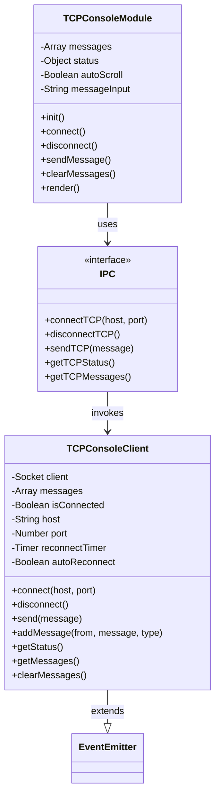
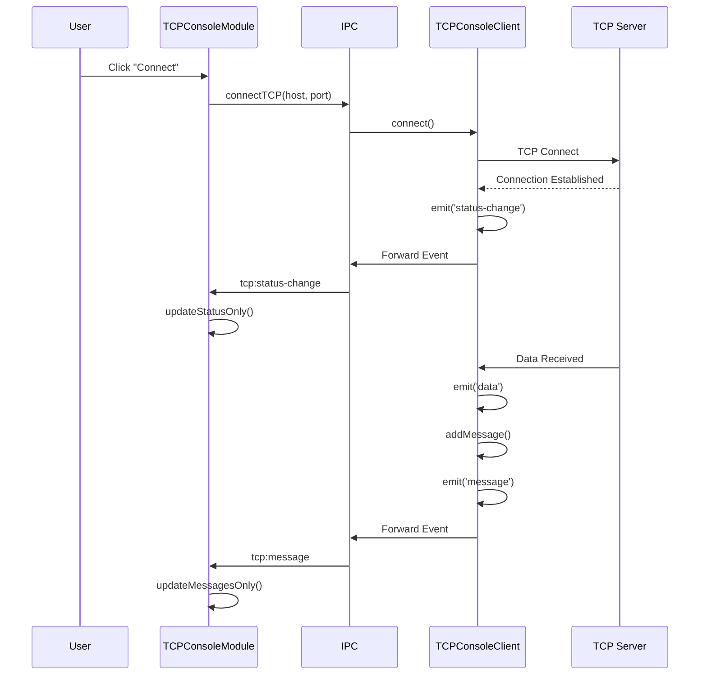
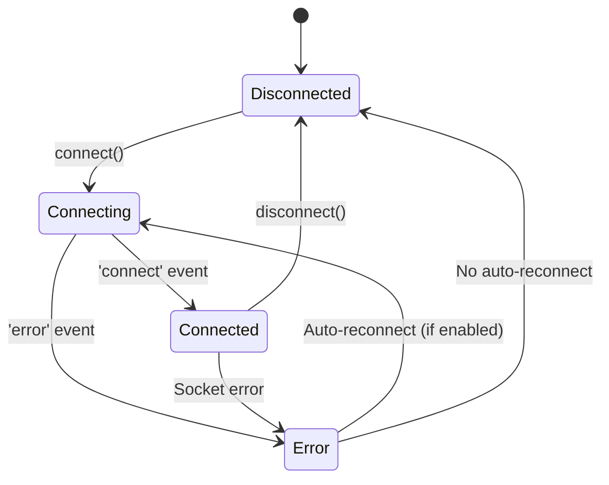
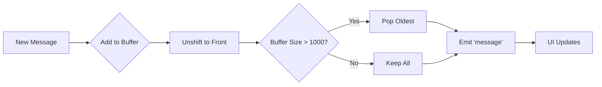

# TCP Console - Source Code Documentation

## Table of Contents
1. [Architecture Overview](#architecture-overview)
2. [TCPConsoleClient Class (Backend)](#tcpconsoleclient-class-backend)
3. [TCPConsoleModule Class (Frontend)](#tcpconsolemodule-class-frontend)
4. [IPC Communication](#ipc-communication)
5. [Event System](#event-system)
6. [Message Management](#message-management)
7. [Code Examples](#code-examples)
8. [Testing Guide](#testing-guide)

---

## Architecture Overview

The TCP Console feature implements a **client-server** architecture split between backend (Node.js) and frontend (Renderer process) components:



### Component Responsibilities

| Component | Layer | Responsibilities |
|-----------|-------|------------------|
| **TCPConsoleClient** | Backend (Main Process) | Socket management, TCP communication, event emission |
| **TCPConsoleModule** | Frontend (Renderer) | UI rendering, user interaction, message display |
| **IPC Bridge** | Communication | Method invocation, event forwarding, state synchronization |

---

## TCPConsoleClient Class (Backend)

**File:** `services/tcp-console.js`

### Class Structure

```javascript
const net = require('net');
const EventEmitter = require('events');

class TCPConsoleClient extends EventEmitter {
  constructor() {
    super();
    this.client = null;
    this.messages = [];
    this.isConnected = false;
    this.host = '192.168.15.10';
    this.port = 56789;
    this.maxMessages = 1000;
    this.reconnectTimer = null;
    this.autoReconnect = false;
    this.isDestroyed = false;
  }
}
```

### Properties Reference

| Property | Type | Default | Description |
|----------|------|---------|-------------|
| `client` | `net.Socket` | `null` | Node.js TCP socket instance |
| `messages` | `Array<Object>` | `[]` | Message history buffer (FIFO) |
| `isConnected` | `Boolean` | `false` | Current connection state |
| `host` | `String` | `'192.168.15.10'` | Target server hostname/IP |
| `port` | `Number` | `56789` | Target server port |
| `maxMessages` | `Number` | `1000` | Maximum messages to retain |
| `reconnectTimer` | `Timer` | `null` | Auto-reconnect timer handle |
| `autoReconnect` | `Boolean` | `false` | Auto-reconnect enabled flag |
| `isDestroyed` | `Boolean` | `false` | Cleanup state flag |

### Method: `connect(host, port)`

Establishes TCP connection to remote server.

**Signature:**
```javascript
connect(host = '192.168.15.10', port = 56789): void
```

**Parameters:**
- `host` (String): Server IP address or hostname
- `port` (Number): Server TCP port

**Behavior:**
1. Validates not already connected
2. Resets `isDestroyed` flag
3. Creates new `net.Socket` instance
4. Binds event handlers (data, close, error)
5. Initiates connection
6. Emits `status-change` event on success

**Events Emitted:**
- `status-change`: `{ isConnected: true, host, port, message }`

**Example:**
```javascript
const tcpClient = new TCPConsoleClient();

tcpClient.on('status-change', (status) => {
  console.log('Connection status:', status);
});

tcpClient.connect('192.168.1.100', 8080);
```

**Implementation Details:**
```javascript
connect(host = '192.168.15.10', port = 56789) {
  if (this.isConnected) {
    console.log('TCP Console Client: Already connected');
    return;
  }

  this.isDestroyed = false;
  this.host = host;
  this.port = port;

  this.client = new net.Socket();
  
  this.client.connect(port, host, () => {
    this.isConnected = true;
    this.emit('status-change', { 
      isConnected: true, 
      host: this.host, 
      port: this.port,
      message: 'Connected successfully'
    });
  });

  // Event handlers bound here...
}
```

---

### Method: `disconnect()`

Gracefully closes TCP connection and cleans up resources.

**Signature:**
```javascript
disconnect(): void
```

**Behavior:**
1. Checks if connection exists
2. Disables auto-reconnect
3. Clears reconnect timer
4. Removes all socket event listeners
5. Destroys socket
6. Emits final `status-change` event
7. Sets `isDestroyed` flag

**Events Emitted:**
- `status-change`: `{ isConnected: false, host, port, message: 'Disconnected' }`

**Example:**
```javascript
tcpClient.disconnect();
// No more events will be emitted after this call
```

**Implementation Details:**
```javascript
disconnect() {
  this.autoReconnect = false;
  
  if (this.reconnectTimer) {
    clearTimeout(this.reconnectTimer);
    this.reconnectTimer = null;
  }

  if (this.client) {
    this.client.removeAllListeners();
    this.client.destroy();
    this.client = null;
  }
  
  this.isConnected = false;
  
  if (!this.isDestroyed) {
    this.emit('status-change', { 
      isConnected: false, 
      host: this.host, 
      port: this.port,
      message: 'Disconnected'
    });
  }
  
  this.isDestroyed = true;
}
```

---

### Method: `send(message)`

Sends message to connected TCP server.

**Signature:**
```javascript
send(message: string): boolean
```

**Parameters:**
- `message` (String): Text message to send

**Returns:**
- `boolean`: `true` if sent successfully, `false` otherwise

**Behavior:**
1. Validates connection state
2. Appends `\r\n` line terminator
3. Writes to socket
4. Adds message to buffer with type `'sent'`
5. Emits `message` event

**Example:**
```javascript
const success = tcpClient.send('GET /status HTTP/1.1');
if (success) {
  console.log('Message sent');
} else {
  console.error('Failed to send (not connected)');
}
```

**Implementation Details:**
```javascript
send(message) {
  if (!this.isConnected || !this.client) {
    console.error('TCP Console Client: Not connected');
    return false;
  }

  try {
    this.client.write(message + '\r\n');
    this.addMessage('CLIENT', message, 'sent');
    console.log(`TCP Console Client: Sent: ${message}`);
    return true;
  } catch (err) {
    console.error(`TCP Console Client: Send error - ${err.message}`);
    return false;
  }
}
```

---

### Method: `addMessage(from, message, type)`

Adds message to internal buffer with metadata.

**Signature:**
```javascript
addMessage(from: string, message: string, type: string): void
```

**Parameters:**
- `from` (String): Message source (`'CLIENT'`, `'SERVER'`, `'SYSTEM'`)
- `message` (String): Message content
- `type` (String): Message type (`'sent'`, `'received'`, `'system'`, `'error'`)

**Behavior:**
1. Creates log entry object with timestamp
2. Adds to front of messages array (unshift)
3. Removes oldest message if exceeds `maxMessages`
4. Emits `message` event if not destroyed

**Message Object Structure:**
```javascript
{
  timestamp: 1703001234567,  // Unix timestamp (ms)
  from: 'SERVER',            // Source identifier
  message: 'Response data',  // Content
  type: 'received'           // Classification
}
```

**Events Emitted:**
- `message`: The created log entry object

**Example:**
```javascript
tcpClient.on('message', (msg) => {
  console.log(`[${msg.from}] ${msg.message}`);
});

tcpClient.addMessage('SYSTEM', 'Connection established', 'system');
```

---

### Method: `scheduleReconnect()`

Schedules automatic reconnection attempt after delay.

**Signature:**
```javascript
scheduleReconnect(): void
```

**Behavior:**
1. Clears existing reconnect timer
2. Sets 5-second timeout
3. Calls `connect()` with stored host/port

**Example:**
```javascript
// Called automatically on connection loss if autoReconnect is enabled
tcpClient.setAutoReconnect(true);
// Will now reconnect automatically after disconnections
```

**Implementation Details:**
```javascript
scheduleReconnect() {
  if (this.reconnectTimer) {
    clearTimeout(this.reconnectTimer);
  }
  
  this.reconnectTimer = setTimeout(() => {
    console.log('TCP Console Client: Attempting to reconnect...');
    this.connect(this.host, this.port);
  }, 5000);  // 5 second delay
}
```

---

### Method: `getStatus()`

Returns current client status snapshot.

**Signature:**
```javascript
getStatus(): Object
```

**Returns:**
```javascript
{
  isConnected: boolean,
  host: string,
  port: number,
  messageCount: number,
  autoReconnect: boolean
}
```

**Example:**
```javascript
const status = tcpClient.getStatus();
console.log(`Connected to ${status.host}:${status.port}`);
console.log(`Message count: ${status.messageCount}`);
```

---

### Method: `getMessages()`

Returns all buffered messages.

**Signature:**
```javascript
getMessages(): Array<Object>
```

**Returns:**
Array of message objects (newest first).

**Example:**
```javascript
const messages = tcpClient.getMessages();
messages.forEach(msg => {
  const time = new Date(msg.timestamp).toLocaleTimeString();
  console.log(`${time} [${msg.from}] ${msg.message}`);
});
```

---

### Method: `clearMessages()`

Clears all buffered messages.

**Signature:**
```javascript
clearMessages(): void
```

**Events Emitted:**
- `messages-cleared`: (no data)

**Example:**
```javascript
tcpClient.clearMessages();
console.log('Messages cleared');
```

---

### Method: `setAutoReconnect(enabled)`

Enables or disables automatic reconnection.

**Signature:**
```javascript
setAutoReconnect(enabled: boolean): void
```

**Parameters:**
- `enabled` (Boolean): Auto-reconnect state

**Example:**
```javascript
tcpClient.setAutoReconnect(true);
// Now reconnects automatically on connection loss
```

---

### Event Handlers (Internal)

The class binds several internal socket event handlers:

#### `client.on('data')`

**Trigger:** TCP data received from server

**Behavior:**
1. Converts buffer to string
2. Splits by line breaks (`\r?\n`)
3. Adds each non-empty line as `'received'` message
4. Emits `data` event

**Implementation:**
```javascript
this.client.on('data', (data) => {
  const message = data.toString();
  
  if (this.isDestroyed) return;
  
  const lines = message.split(/\r?\n/);
  lines.forEach((line, index) => {
    if (index === lines.length - 1 && line === '') return;
    this.addMessage('SERVER', line, 'received');
  });
  
  this.emit('data', message);
});
```

#### `client.on('close')`

**Trigger:** Socket connection closed

**Behavior:**
1. Sets `isConnected = false`
2. Emits `status-change` event
3. Schedules reconnect if `autoReconnect` enabled

**Implementation:**
```javascript
this.client.on('close', () => {
  this.isConnected = false;
  
  if (!this.isDestroyed) {
    this.emit('status-change', { 
      isConnected: false, 
      host: this.host, 
      port: this.port,
      message: 'Connection closed'
    });
    
    if (this.autoReconnect) {
      this.scheduleReconnect();
    }
  }
});
```

#### `client.on('error')`

**Trigger:** Socket error (connection refused, timeout, etc.)

**Behavior:**
1. Sets `isConnected = false`
2. Emits `status-change` with error details

**Implementation:**
```javascript
this.client.on('error', (err) => {
  this.isConnected = false;
  
  if (!this.isDestroyed) {
    this.emit('status-change', { 
      isConnected: false, 
      host: this.host, 
      port: this.port,
      error: err.message,
      message: `Error: ${err.message}`
    });
  }
});
```

---

## TCPConsoleModule Class (Frontend)

**File:** `renderer/modules/TCPConsoleModule.js`

### Class Structure

```javascript
class TCPConsoleModule {
  constructor() {
    this.messages = [];
    this.status = { isConnected: false, host: '192.168.15.10', port: 56789 };
    this.autoScroll = false;
    this.messageInput = '';
    this.showConsole = false;
    this.autoReconnect = false;
    this.host = '192.168.15.10';
    this.port = 56789;
    this.lastRenderedHtml = '';
    this.updatePending = false;
  }
}
```

### Properties Reference

| Property | Type | Default | Description |
|----------|------|---------|-------------|
| `messages` | `Array<Object>` | `[]` | Local message cache |
| `status` | `Object` | `{ isConnected: false, ... }` | Connection status |
| `autoScroll` | `Boolean` | `false` | Auto-scroll to bottom enabled |
| `messageInput` | `String` | `''` | Current input field value |
| `showConsole` | `Boolean` | `false` | Console visibility flag |
| `autoReconnect` | `Boolean` | `false` | Auto-reconnect checkbox state |
| `host` | `String` | `'192.168.15.10'` | Connection host input |
| `port` | `Number` | `56789` | Connection port input |
| `lastRenderedHtml` | `String` | `''` | Cached HTML to preserve focus |
| `updatePending` | `Boolean` | `false` | Throttle flag for updates |

---

### Method: `async init()`

Initializes module and sets up IPC listeners.

**Signature:**
```javascript
async init(): Promise<void>
```

**Behavior:**
1. Loads initial status from backend
2. Loads existing messages
3. Registers menu event listeners
4. Sets up `tcp:message` handler
5. Sets up `tcp:status-change` handler
6. Sets up `tcp:messages-cleared` handler

**Example:**
```javascript
const tcpConsole = new TCPConsoleModule();
await tcpConsole.init();
console.log('TCP Console initialized');
```

**Implementation Details:**
```javascript
async init() {
  // Load initial status
  try {
    this.status = await electronAPI.getTCPStatus();
    this.messages = await electronAPI.getTCPMessages();
    this.host = this.status.host || 'localhost';
    this.port = this.status.port || 56789;
  } catch (error) {
    console.error('Failed to load TCP Console status:', error);
  }

  // Listen for menu events
  electronAPI.onMenuEvent('menu:clear-tcp-console', async () => {
    await this.clearMessages();
  });

  electronAPI.onMenuEvent('tcp:message', (messageData) => {
    this.messages.unshift(messageData);
    if (this.messages.length > 1000) {
      this.messages.pop();
    }
    if (this.showConsole && !this.updatePending) {
      this.updatePending = true;
      requestAnimationFrame(() => {
        this.updateMessagesOnly();
        this.updatePending = false;
      });
    }
  });

  electronAPI.onMenuEvent('tcp:status-change', (statusData) => {
    this.status = { ...this.status, ...statusData };
    if (this.showConsole) {
      this.updateStatusOnly();
    }
  });

  electronAPI.onMenuEvent('tcp:messages-cleared', () => {
    this.messages = [];
    if (this.showConsole) {
      this.render();
    }
  });
}
```

---

### Method: `async connect()`

Initiates connection to TCP server via IPC.

**Signature:**
```javascript
async connect(): Promise<void>
```

**Behavior:**
1. Calls `electronAPI.connectTCP(host, port)`
2. Updates local status
3. Triggers re-render

**Example:**
```javascript
tcpConsole.host = '192.168.1.50';
tcpConsole.port = 9000;
await tcpConsole.connect();
```

**Implementation Details:**
```javascript
async connect() {
  try {
    await electronAPI.connectTCP(this.host, this.port);
    await this.updateStatus();
  } catch (error) {
    console.error('Failed to connect TCP:', error);
  }
}
```

---

### Method: `async disconnect()`

Disconnects from TCP server via IPC.

**Signature:**
```javascript
async disconnect(): Promise<void>
```

**Example:**
```javascript
await tcpConsole.disconnect();
console.log('Disconnected');
```

---

### Method: `async sendMessage()`

Sends message from input field to server.

**Signature:**
```javascript
async sendMessage(): Promise<void>
```

**Behavior:**
1. Validates input is not empty
2. Calls `electronAPI.sendTCP(message)`
3. Clears input field on success
4. Auto-scrolls console to bottom

**Example:**
```javascript
tcpConsole.messageInput = 'Hello Server';
await tcpConsole.sendMessage();
// Message sent, input cleared
```

**Implementation Details:**
```javascript
async sendMessage() {
  if (!this.messageInput.trim()) return;
  
  try {
    const success = await electronAPI.sendTCP(this.messageInput);
    if (success) {
      this.messageInput = '';
      const inputEl = document.getElementById('tcp-message-input');
      if (inputEl) {
        inputEl.value = '';
      }
      
      setTimeout(() => {
        const container = document.getElementById('tcp-messages-container');
        if (container) {
          container.scrollTop = container.scrollHeight;
        }
      }, 100);
    }
  } catch (error) {
    console.error('Failed to send TCP message:', error);
  }
}
```

---

### Method: `async toggleAutoReconnect()`

Toggles auto-reconnect setting.

**Signature:**
```javascript
async toggleAutoReconnect(): Promise<void>
```

**Example:**
```javascript
await tcpConsole.toggleAutoReconnect();
// Auto-reconnect toggled
```

---

### Method: `updateMessagesOnly()`

**Performance-optimized** method to add only new messages to DOM without full re-render.

**Signature:**
```javascript
updateMessagesOnly(): void
```

**Behavior:**
1. Calculates new message count since last update
2. Checks if user is at bottom of scroll
3. Creates document fragment for batch DOM insertion
4. Appends only new messages
5. Auto-scrolls if user was at bottom OR if received data

**Performance Optimization:**
- Uses `requestAnimationFrame` throttling
- Batches DOM operations with `DocumentFragment`
- Preserves input focus
- Only scrolls when necessary

**Implementation Details:**
```javascript
updateMessagesOnly() {
  const container = document.getElementById('tcp-messages-container');
  if (!container) return;

  const currentMessageCount = container.children.length;
  const newMessagesCount = this.messages.length - currentMessageCount;

  if (newMessagesCount > 0) {
    const scrollTop = container.scrollTop;
    const scrollHeight = container.scrollHeight;
    const isAtBottom = scrollHeight - scrollTop - container.clientHeight < 5;
    
    let hasReceivedData = false;
    for (let i = newMessagesCount - 1; i >= 0; i--) {
      if (this.messages[i].type === 'received') {
        hasReceivedData = true;
        break;
      }
    }
    
    // Create fragment for batch insertion
    const fragment = document.createDocumentFragment();
    for (let i = newMessagesCount - 1; i >= 0; i--) {
      const msg = this.messages[i];
      const messageEl = this.createMessageElement(msg);
      fragment.appendChild(messageEl);
    }
    
    container.appendChild(fragment);

    // Auto-scroll logic
    if ((this.autoScroll && isAtBottom) || hasReceivedData) {
      container.scrollTop = container.scrollHeight;
    }
  }
}
```

---

### Method: `updateStatusOnly()`

Updates connection status display without full re-render.

**Signature:**
```javascript
updateStatusOnly(): void
```

**Behavior:**
1. Checks if connection state changed
2. If state changed, triggers full render
3. Otherwise, updates only status indicator elements

**Example:**
```javascript
// Called automatically via IPC event
// Updates status dot color and text
```

---

### Method: `createMessageElement(msg)`

Creates DOM element for a single message.

**Signature:**
```javascript
createMessageElement(msg: Object): HTMLElement
```

**Parameters:**
- `msg` (Object): Message object with `timestamp`, `from`, `message`, `type`

**Returns:**
- `HTMLDivElement`: Formatted message element

**Message Display Rules:**

| Type | Display Format | Color |
|------|---------------|-------|
| `'sent'` | Message only (no prefix) | `#1f2937` (dark gray) |
| `'received'` | Message only (no prefix) | `#1f2937` (dark gray) |
| `'system'` | `[TIME] [SYSTEM] Message` | `#6b7280` (gray) |
| `'error'` | `[TIME] [ERROR] Message` | `#dc2626` (red) |

**Implementation Details:**
```javascript
createMessageElement(msg) {
  const messageEl = document.createElement('div');
  messageEl.style.fontFamily = 'Consolas, "Courier New", monospace';
  messageEl.style.fontSize = '13px';
  messageEl.style.padding = '2px 8px';
  messageEl.style.borderBottom = '1px solid #e5e7eb';
  messageEl.style.whiteSpace = 'pre-wrap';

  const time = new Date(msg.timestamp).toLocaleTimeString();
  
  if (msg.type === 'sent') {
    messageEl.innerHTML = `
      <span style="color: #1f2937; white-space: pre-wrap;">${this.escapeHtml(msg.message)}</span>
    `;
  } else if (msg.type === 'system') {
    messageEl.innerHTML = `
      <span style="color: #6b7280">${time}</span>
      <span style="color: #6b7280; margin-left: 12px; font-weight: 500">[SYSTEM]</span>
      <span style="color: #1f2937; margin-left: 12px;">${this.escapeHtml(msg.message)}</span>
    `;
  } else if (msg.type === 'error') {
    messageEl.innerHTML = `
      <span style="color: #6b7280">${time}</span>
      <span style="color: #dc2626; margin-left: 12px; font-weight: 500">[ERROR]</span>
      <span style="color: #1f2937; margin-left: 12px;">${this.escapeHtml(msg.message)}</span>
    `;
  } else {  // 'received'
    messageEl.innerHTML = `
      <span style="color: #1f2937; white-space: pre-wrap;">${this.escapeHtml(msg.message)}</span>
    `;
  }

  return messageEl;
}
```

---

### Method: `render()`

Generates complete HTML for console UI.

**Signature:**
```javascript
render(): string
```

**Returns:**
- `string`: Complete HTML markup

**Optimization:**
- Skips re-render if user is typing in input fields
- Caches last rendered HTML
- Preserves scroll position across renders

**Example:**
```javascript
const html = tcpConsole.render();
document.getElementById('app').innerHTML = html;
```

---

## IPC Communication

### IPC Methods (Main → Renderer)

The following methods are exposed via `electronAPI` preload:

#### `connectTCP(host, port)`

**Purpose:** Establish TCP connection

**Parameters:**
- `host` (String): Server hostname/IP
- `port` (Number): Server port

**Returns:** `Promise<void>`

**Main Process Handler:**
```javascript
ipcMain.handle('tcp:connect', async (event, host, port) => {
  tcpClient.connect(host, port);
});
```

#### `disconnectTCP()`

**Purpose:** Close TCP connection

**Returns:** `Promise<void>`

#### `sendTCP(message)`

**Purpose:** Send message to server

**Parameters:**
- `message` (String): Message to send

**Returns:** `Promise<boolean>` - Success flag

#### `getTCPStatus()`

**Purpose:** Get current connection status

**Returns:** `Promise<Object>` - Status object

#### `getTCPMessages()`

**Purpose:** Get all messages

**Returns:** `Promise<Array>` - Message array

#### `clearTCPMessages()`

**Purpose:** Clear message buffer

**Returns:** `Promise<void>`

#### `setTCPAutoReconnect(enabled)`

**Purpose:** Set auto-reconnect

**Parameters:**
- `enabled` (Boolean)

**Returns:** `Promise<void>`

---

### IPC Events (Renderer ← Main)

Events sent from main process to renderer:

#### `tcp:message`

**Trigger:** New message received/sent

**Payload:**
```javascript
{
  timestamp: number,
  from: string,
  message: string,
  type: string
}
```

**Handler:**
```javascript
electronAPI.onMenuEvent('tcp:message', (messageData) => {
  console.log('New message:', messageData);
});
```

#### `tcp:status-change`

**Trigger:** Connection status changed

**Payload:**
```javascript
{
  isConnected: boolean,
  host: string,
  port: number,
  message: string,
  error?: string
}
```

#### `tcp:messages-cleared`

**Trigger:** Message buffer cleared

**Payload:** None

---

## Event System

### Event Flow Diagram



### Event Lifecycle



---

## Message Management

### Message Buffer Architecture



### Message Flow

**Backend (TCPConsoleClient):**
1. Message arrives via socket `'data'` event
2. Parse into lines
3. Call `addMessage('SERVER', line, 'received')`
4. Emit `'message'` event
5. IPC forwards to renderer

**Frontend (TCPConsoleModule):**
1. Receive `tcp:message` event
2. Add to local `messages` array
3. Set `updatePending` flag
4. Use `requestAnimationFrame` to batch updates
5. Call `updateMessagesOnly()`
6. Create DOM elements only for new messages
7. Append to container

---

## Code Examples

### Example 1: Basic TCP Client Usage

```javascript
const TCPConsoleClient = require('./services/tcp-console');

const client = new TCPConsoleClient();

// Setup event listeners
client.on('status-change', (status) => {
  console.log('Status:', status.isConnected ? 'Connected' : 'Disconnected');
  if (status.error) {
    console.error('Error:', status.error);
  }
});

client.on('message', (msg) => {
  const time = new Date(msg.timestamp).toLocaleTimeString();
  console.log(`[${time}] ${msg.from}: ${msg.message}`);
});

client.on('data', (rawData) => {
  console.log('Raw data received:', rawData);
});

// Connect to server
client.connect('192.168.1.100', 8080);

// Send command after 2 seconds
setTimeout(() => {
  const sent = client.send('GET /status');
  if (sent) {
    console.log('Command sent successfully');
  }
}, 2000);

// Disconnect after 10 seconds
setTimeout(() => {
  client.disconnect();
}, 10000);
```

**Expected Output:**
```
Status: Connected
[14:23:45] SYSTEM: Connected to 192.168.1.100:8080
Command sent successfully
[14:23:47] CLIENT: GET /status
[14:23:47] SERVER: HTTP/1.1 200 OK
[14:23:47] SERVER: Content-Type: application/json
Status: Disconnected
```

---

### Example 2: Auto-Reconnect with Monitoring

```javascript
const client = new TCPConsoleClient();

// Enable auto-reconnect
client.setAutoReconnect(true);

let reconnectCount = 0;

client.on('status-change', (status) => {
  if (status.isConnected) {
    console.log(`✓ Connected to ${status.host}:${status.port}`);
    reconnectCount = 0;
  } else {
    reconnectCount++;
    console.log(`✗ Disconnected (attempt #${reconnectCount})`);
    if (status.error) {
      console.error(`  Error: ${status.error}`);
    }
  }
});

// Track received messages
let messageCount = 0;
client.on('message', (msg) => {
  if (msg.type === 'received') {
    messageCount++;
    console.log(`Received message #${messageCount}: ${msg.message.substring(0, 50)}`);
  }
});

client.connect('192.168.15.10', 56789);

// Monitor status every 5 seconds
setInterval(() => {
  const status = client.getStatus();
  console.log(`Status Check: ${status.isConnected ? 'Online' : 'Offline'}, Messages: ${status.messageCount}`);
}, 5000);
```

---

### Example 3: Message Filtering and Processing

```javascript
const client = new TCPConsoleClient();

// Filter for specific message patterns
client.on('message', (msg) => {
  if (msg.type !== 'received') return;

  // Parse JSON responses
  if (msg.message.startsWith('{')) {
    try {
      const data = JSON.parse(msg.message);
      console.log('JSON Response:', data);
      
      if (data.status === 'error') {
        console.error('Server Error:', data.message);
      }
    } catch (e) {
      console.log('Non-JSON message:', msg.message);
    }
  }
  
  // Detect specific keywords
  if (msg.message.includes('ALERT')) {
    console.warn('⚠️ Alert received:', msg.message);
  }
});

client.connect('192.168.1.50', 9000);

// Send periodic health checks
setInterval(() => {
  if (client.getStatus().isConnected) {
    client.send(JSON.stringify({ command: 'ping', timestamp: Date.now() }));
  }
}, 10000);
```

---

### Example 4: Frontend Integration

```javascript
// In renderer process
const tcpConsole = new TCPConsoleModule();

// Initialize with custom event handling
await tcpConsole.init();

// Custom message handler
electronAPI.onMenuEvent('tcp:message', (msg) => {
  if (msg.type === 'received') {
    // Update custom UI component
    updateStatusBar(`Last received: ${new Date(msg.timestamp).toLocaleTimeString()}`);
  }
});

// Connect with validation
async function connectToServer() {
  const host = document.getElementById('host-input').value;
  const port = parseInt(document.getElementById('port-input').value);

  if (!host || !port) {
    alert('Please enter host and port');
    return;
  }

  tcpConsole.host = host;
  tcpConsole.port = port;

  try {
    await tcpConsole.connect();
    console.log('Connection initiated');
  } catch (error) {
    alert(`Connection failed: ${error.message}`);
  }
}

// Send with enter key
document.getElementById('message-input').addEventListener('keypress', async (e) => {
  if (e.key === 'Enter') {
    tcpConsole.messageInput = e.target.value;
    await tcpConsole.sendMessage();
  }
});
```

---

### Example 5: Testing TCP Communication

```javascript
// Test script: test-tcp-console.js
const TCPConsoleClient = require('./services/tcp-console');
const net = require('net');

// Create mock server
const mockServer = net.createServer((socket) => {
  console.log('Client connected to mock server');
  
  socket.on('data', (data) => {
    const cmd = data.toString().trim();
    console.log('Server received:', cmd);
    
    // Echo back with prefix
    socket.write(`ECHO: ${cmd}\r\n`);
    
    // Send test response
    if (cmd === 'GET /test') {
      socket.write('HTTP/1.1 200 OK\r\n');
      socket.write('Content-Type: text/plain\r\n');
      socket.write('\r\n');
      socket.write('Test response body\r\n');
    }
  });
});

mockServer.listen(9999, '127.0.0.1', () => {
  console.log('Mock server listening on 127.0.0.1:9999');
  
  // Create client and test
  const client = new TCPConsoleClient();
  
  client.on('status-change', (status) => {
    console.log('Client status:', status.isConnected ? 'Connected' : 'Disconnected');
  });
  
  client.on('message', (msg) => {
    console.log(`[${msg.type}] ${msg.message}`);
  });
  
  // Connect
  client.connect('127.0.0.1', 9999);
  
  // Test commands
  setTimeout(() => client.send('Hello Server'), 1000);
  setTimeout(() => client.send('GET /test'), 2000);
  setTimeout(() => {
    console.log('Message count:', client.getMessages().length);
    client.disconnect();
    mockServer.close();
    console.log('Test completed');
  }, 3000);
});
```

**Run test:**
```bash
node test-tcp-console.js
```

**Expected Output:**
```
Mock server listening on 127.0.0.1:9999
Client status: Connected
Client connected to mock server
[sent] Hello Server
Server received: Hello Server
[received] ECHO: Hello Server
[sent] GET /test
Server received: GET /test
[received] HTTP/1.1 200 OK
[received] Content-Type: text/plain
[received] 
[received] Test response body
Message count: 8
Client status: Disconnected
Test completed
```

---

## Testing Guide

### Unit Tests

**File:** `tests/tcp-console.test.js`

```javascript
const assert = require('assert');
const TCPConsoleClient = require('../services/tcp-console');
const net = require('net');

describe('TCPConsoleClient', () => {
  let client;
  let mockServer;

  beforeEach((done) => {
    client = new TCPConsoleClient();
    
    // Setup mock server
    mockServer = net.createServer((socket) => {
      socket.on('data', (data) => {
        socket.write(`ECHO: ${data}`);
      });
    });
    
    mockServer.listen(9998, '127.0.0.1', done);
  });

  afterEach((done) => {
    if (client) {
      client.disconnect();
    }
    if (mockServer) {
      mockServer.close(done);
    } else {
      done();
    }
  });

  it('should connect to server', (done) => {
    client.on('status-change', (status) => {
      if (status.isConnected) {
        assert.strictEqual(status.isConnected, true);
        assert.strictEqual(status.host, '127.0.0.1');
        assert.strictEqual(status.port, 9998);
        done();
      }
    });

    client.connect('127.0.0.1', 9998);
  });

  it('should send and receive messages', (done) => {
    let receivedCount = 0;
    
    client.on('message', (msg) => {
      if (msg.type === 'received') {
        receivedCount++;
        assert.ok(msg.message.startsWith('ECHO:'));
        if (receivedCount === 1) {
          done();
        }
      }
    });

    client.on('status-change', (status) => {
      if (status.isConnected) {
        client.send('Test message');
      }
    });

    client.connect('127.0.0.1', 9998);
  });

  it('should handle disconnection', (done) => {
    let connectedOnce = false;
    
    client.on('status-change', (status) => {
      if (status.isConnected) {
        connectedOnce = true;
        client.disconnect();
      } else if (connectedOnce) {
        assert.strictEqual(status.isConnected, false);
        done();
      }
    });

    client.connect('127.0.0.1', 9998);
  });

  it('should buffer messages with limit', () => {
    for (let i = 0; i < 1500; i++) {
      client.addMessage('TEST', `Message ${i}`, 'test');
    }
    
    const messages = client.getMessages();
    assert.strictEqual(messages.length, 1000);
    assert.strictEqual(messages[0].message, 'Message 1499'); // Newest first
  });

  it('should clear messages', () => {
    client.addMessage('TEST', 'Message 1', 'test');
    client.addMessage('TEST', 'Message 2', 'test');
    
    assert.strictEqual(client.getMessages().length, 2);
    
    client.clearMessages();
    
    assert.strictEqual(client.getMessages().length, 0);
  });

  it('should handle connection errors', (done) => {
    client.on('status-change', (status) => {
      if (status.error) {
        assert.ok(status.error.includes('ECONNREFUSED'));
        done();
      }
    });

    // Connect to non-existent server
    client.connect('127.0.0.1', 9999);
  });
});
```

### Integration Tests

**File:** `tests/tcp-console-integration.test.js`

```javascript
const assert = require('assert');
const { app, BrowserWindow, ipcMain } = require('electron');
const TCPConsoleClient = require('../services/tcp-console');

describe('TCP Console Integration', () => {
  let mainWindow;
  let tcpClient;

  before(async () => {
    await app.whenReady();
    mainWindow = new BrowserWindow({
      show: false,
      webPreferences: {
        nodeIntegration: true,
        contextIsolation: false
      }
    });
  });

  after(() => {
    if (mainWindow) {
      mainWindow.close();
    }
    app.quit();
  });

  it('should handle IPC connect request', (done) => {
    tcpClient = new TCPConsoleClient();
    
    ipcMain.handle('tcp:connect', async (event, host, port) => {
      tcpClient.connect(host, port);
      return { success: true };
    });

    tcpClient.on('status-change', (status) => {
      if (status.isConnected) {
        assert.strictEqual(status.isConnected, true);
        done();
      }
    });

    // Simulate renderer calling IPC
    mainWindow.webContents.executeJavaScript(`
      require('electron').ipcRenderer.invoke('tcp:connect', '127.0.0.1', 9998)
    `);
  });
});
```

### Performance Tests

```javascript
const TCPConsoleClient = require('../services/tcp-console');

describe('TCP Console Performance', () => {
  it('should handle high message volume', (done) => {
    const client = new TCPConsoleClient();
    const startTime = Date.now();
    const messageCount = 10000;

    for (let i = 0; i < messageCount; i++) {
      client.addMessage('TEST', `Message ${i}`, 'test');
    }

    const elapsed = Date.now() - startTime;
    const messagesPerSecond = (messageCount / elapsed) * 1000;

    console.log(`Performance: ${messagesPerSecond.toFixed(0)} messages/sec`);
    assert.ok(messagesPerSecond > 50000, 'Should handle >50k messages/sec');
    
    done();
  });
});
```

### Run Tests

```bash
# Install test dependencies
npm install --save-dev mocha

# Run all tests
npm test

# Run specific test file
npx mocha tests/tcp-console.test.js

# Run with coverage
npx nyc mocha tests/**/*.test.js
```

---

## Summary

This source code documentation covers:

✅ **Complete Class References** - All methods, properties, and behaviors documented  
✅ **Architecture Diagrams** - Class, component, sequence, state, and flowchart diagrams  
✅ **Event System** - Comprehensive event flow and lifecycle documentation  
✅ **Code Examples** - 5 practical examples covering common use cases  
✅ **Testing Guide** - Unit tests, integration tests, and performance tests  
✅ **IPC Communication** - Complete API reference for renderer↔main communication  
✅ **Performance Optimization** - Throttling, batching, and efficiency techniques  

**Key Takeaways:**
- TCP Console uses Node.js `net.Socket` for raw TCP communication
- Event-driven architecture with `EventEmitter` pattern
- Performance-optimized UI updates with `requestAnimationFrame` and `DocumentFragment`
- Auto-reconnect capability with 5-second retry interval
- Message buffer limited to 1,000 messages (FIFO)
- Complete IPC bridge between main and renderer processes
