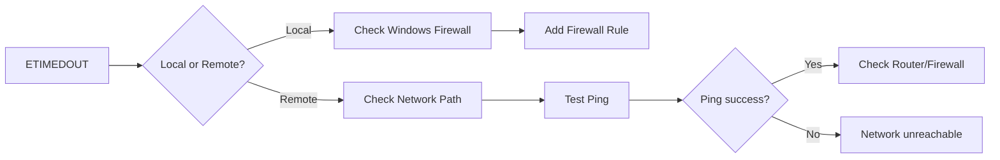
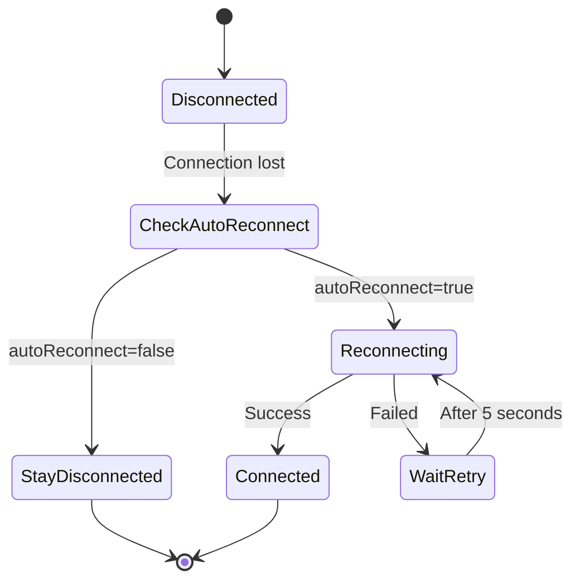
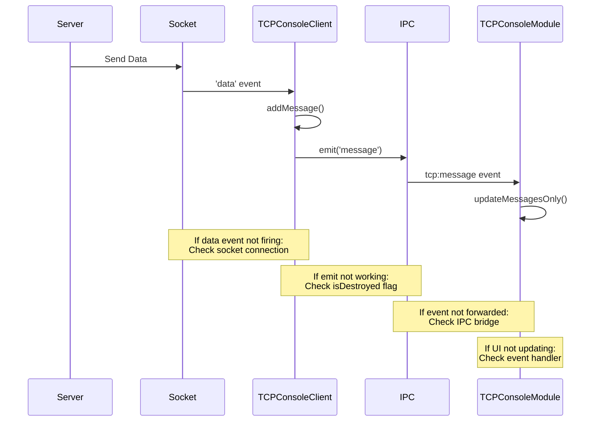
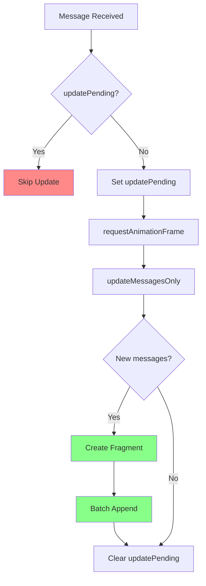
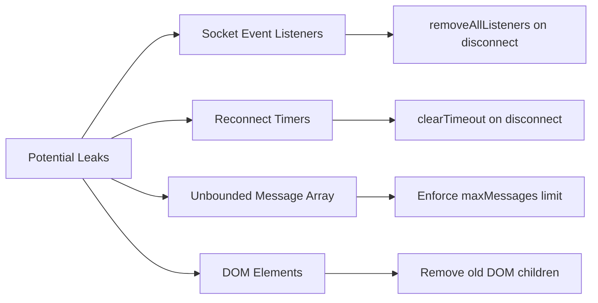
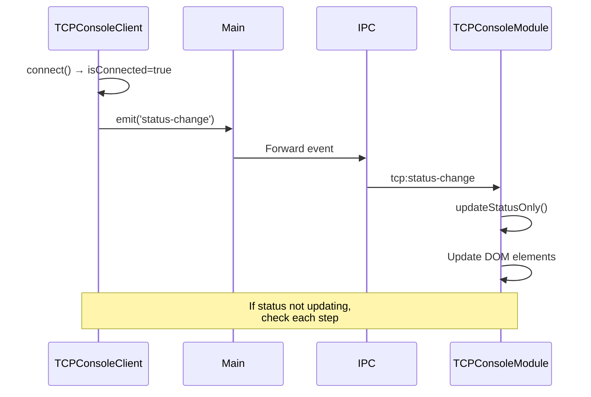
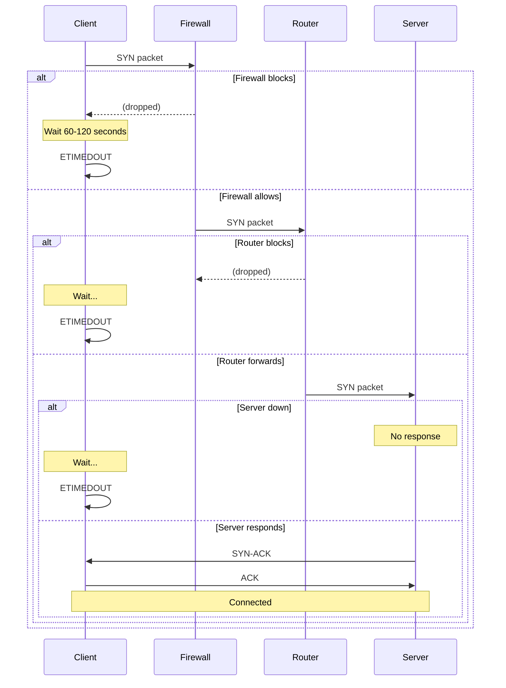

# TCP Console - Troubleshooting Guide

## Table of Contents
1. [Diagnostic Flowchart](#diagnostic-flowchart)
2. [Connection Issues](#connection-issues)
3. [Communication Errors](#communication-errors)
4. [Performance Problems](#performance-problems)
5. [UI/Display Issues](#uidisplay-issues)
6. [Network Troubleshooting](#network-troubleshooting)
7. [Common Error Messages](#common-error-messages)
8. [Advanced Diagnostics](#advanced-diagnostics)
9. [FAQ](#faq)

---

## Diagnostic Flowchart

```mermaid
flowchart TD
    A[TCP Console Issue] --> B{Can connect?}
    B -->|No| C{Error message?}
    B -->|Yes| D{Can send?}
    
    C -->|ECONNREFUSED| E[Check server running]
    C -->|ETIMEDOUT| F[Check firewall/network]
    C -->|EHOSTUNREACH| G[Check IP address]
    C -->|Other| H[Check logs]
    
    D -->|No| I{Connection active?}
    D -->|Yes| J{Receiving data?}
    
    I -->|No| K[Reconnect]
    I -->|Yes| L[Check socket state]
    
    J -->|No| M[Check server sending]
    J -->|Yes| N{UI updating?}
    
    N -->|No| O[Check renderer events]
    N -->|Yes| P[Working correctly]
    
    E --> Q[Start server]
    F --> R[Configure firewall]
    G --> S[Verify network config]
    H --> T[Review error logs]
    K --> B
    L --> U[Check send() return value]
    M --> V[Test with netcat]
    O --> W[Check IPC handlers]
```

---

## Connection Issues

### Issue: Cannot Connect (ECONNREFUSED)

**Symptom:**
```
Error: ECONNREFUSED - connect ECONNREFUSED 192.168.15.10:56789
```

**Cause:** Target server is not running or not accepting connections.

**Solutions:**

| Step | Action | Command/Check |
|------|--------|---------------|
| 1 | Verify server is running | `netstat -an \| Select-String "56789"` |
| 2 | Check server IP address | Ensure IP matches actual server |
| 3 | Test with netcat | `nc -zv 192.168.15.10 56789` |
| 4 | Restart server | Stop and restart target service |
| 5 | Check server logs | Review server error logs for binding issues |

**Example Fix:**

```powershell
# Windows: Check if port is listening
netstat -an | Select-String "56789" | Select-String "LISTENING"

# If nothing found, start your TCP server:
# (Example: Node.js server)
node your-server.js

# Test connection:
Test-NetConnection -ComputerName 192.168.15.10 -Port 56789
```

**Expected Result:**
```
ComputerName     : 192.168.15.10
RemoteAddress    : 192.168.15.10
RemotePort       : 56789
TcpTestSucceeded : True
```

---

### Issue: Connection Timeout (ETIMEDOUT)

**Symptom:**
```
Error: ETIMEDOUT - connect ETIMEDOUT
```

**Cause:** Network firewall blocking connection, or server unreachable.

**Solutions:**



**Windows Firewall Check:**

```powershell
# Check if Electron app is allowed
Get-NetFirewallApplicationFilter | Where-Object {$_.Program -like "*electron*"}

# Add firewall rule if needed
New-NetFirewallRule -DisplayName "EOL Toolkit TCP" `
  -Direction Outbound -Program "C:\path\to\electron.exe" `
  -Action Allow -Protocol TCP
```

**Network Diagnostics:**

```powershell
# Test connectivity
ping 192.168.15.10

# Trace route
tracert 192.168.15.10

# Test specific port
Test-NetConnection -ComputerName 192.168.15.10 -Port 56789
```

---

### Issue: Host Unreachable (EHOSTUNREACH)

**Symptom:**
```
Error: EHOSTUNREACH - No route to host
```

**Cause:** IP address incorrect or network not reachable.

**Solutions:**

| Check | Command | Expected Result |
|-------|---------|-----------------|
| IP format | Validate format | `192.168.x.x` or hostname |
| Network interface | `ipconfig` | Verify local IP in same subnet |
| Routing table | `route print` | Check gateway routes |
| DNS resolution | `nslookup hostname` | Resolves to correct IP |

**Example:**

```powershell
# Check local network config
ipconfig

# Expected output should show:
#   IPv4 Address: 192.168.15.x  (same subnet as server)
#   Default Gateway: 192.168.15.1

# If different subnet, cannot reach 192.168.15.10 directly
```

**Fix for Wrong Subnet:**

Option 1: Change server IP to match your subnet  
Option 2: Add route if gateway supports it  
Option 3: Connect via VPN if remote network  

---

### Issue: Auto-Reconnect Not Working

**Symptom:**  
Connection drops but does not automatically reconnect.

**Cause:** Auto-reconnect disabled or reconnect timer cancelled.

**Diagnostic State Check:**



**Check Auto-Reconnect Status:**

```javascript
// In browser console
const status = await electronAPI.getTCPStatus();
console.log('Auto-reconnect:', status.autoReconnect);
```

**Solution:**

1. **Enable Auto-Reconnect:**
   - Check the "Auto-reconnect on connection loss" checkbox in UI
   - Or programmatically:
   ```javascript
   await electronAPI.setTCPAutoReconnect(true);
   ```

2. **Verify Reconnect Logic:**
   ```javascript
   // In tcp-console.js, check scheduleReconnect method:
   scheduleReconnect() {
     if (this.reconnectTimer) {
       clearTimeout(this.reconnectTimer);
     }
     
     this.reconnectTimer = setTimeout(() => {
       console.log('TCP Console Client: Attempting to reconnect...');
       this.connect(this.host, this.port);
     }, 5000);  // Should reconnect after 5 seconds
   }
   ```

3. **Check Event Handlers:**
   ```javascript
   // Ensure close handler calls scheduleReconnect
   this.client.on('close', () => {
     this.isConnected = false;
     if (this.autoReconnect && !this.isDestroyed) {
       this.scheduleReconnect();
     }
   });
   ```

---

## Communication Errors

### Issue: Messages Not Sending

**Symptom:**  
Input field contains message but clicking "Send" does nothing.

**Diagnostic Table:**

| Check | Verification | Fix |
|-------|-------------|-----|
| Connection status | Must show "Connected" | Reconnect first |
| Input field empty | Message must have text | Type message |
| Console errors | Check browser DevTools | Review error message |
| IPC handler | `tcp:send` registered | Restart app |
| Socket writable | `socket.writable === true` | Reconnect socket |

**Debug in Console:**

```javascript
// Check connection
const status = await electronAPI.getTCPStatus();
console.log('Connected:', status.isConnected);

// Try sending
const result = await electronAPI.sendTCP('Test message');
console.log('Send result:', result);  // Should be true
```

**Common Causes:**

1. **Not Connected:**
   ```javascript
   // In TCPConsoleClient.send():
   if (!this.isConnected || !this.client) {
     console.error('TCP Console Client: Not connected');
     return false;  // ← Returns false
   }
   ```
   **Fix:** Ensure connection established before sending.

2. **Socket Write Error:**
   ```javascript
   try {
     this.client.write(message + '\r\n');
   } catch (err) {
     console.error('Send error:', err.message);
     return false;
   }
   ```
   **Fix:** Check socket state, may need to reconnect.

3. **Empty Message:**
   ```javascript
   // In TCPConsoleModule.sendMessage():
   if (!this.messageInput.trim()) return;  // ← Silently returns
   ```
   **Fix:** Ensure message contains non-whitespace characters.

---

### Issue: Not Receiving Data

**Symptom:**  
Connected to server, can send, but no data appears in console.

**Diagnostic Sequence:**



**Verification Steps:**

1. **Server Is Sending:**
   ```powershell
   # Use netcat to verify server sends data
   nc 192.168.15.10 56789
   # Type something and press Enter
   # Should see response from server
   ```

2. **Socket Receiving:**
   ```javascript
   // Add debug logging in tcp-console.js
   this.client.on('data', (data) => {
     console.log('RAW DATA RECEIVED:', data.toString());
     // ... rest of handler
   });
   ```

3. **Event Emitting:**
   ```javascript
   // Check isDestroyed flag
   this.client.on('data', (data) => {
     if (this.isDestroyed) {
       console.warn('Data received but client destroyed!');
       return;
     }
     // ...
   });
   ```

4. **IPC Forwarding:**
   ```javascript
   // In main.js, ensure event forwarding:
   tcpClient.on('message', (msgData) => {
     mainWindow.webContents.send('tcp:message', msgData);
   });
   ```

5. **UI Event Handler:**
   ```javascript
   // In TCPConsoleModule.init():
   electronAPI.onMenuEvent('tcp:message', (messageData) => {
     console.log('Received message event:', messageData);
     this.messages.unshift(messageData);
     // ... update UI
   });
   ```

---

### Issue: Garbled or Corrupted Messages

**Symptom:**  
Messages appear with strange characters or cut off mid-sentence.

**Cause:** Character encoding issues or incomplete line parsing.

**Solutions:**

1. **Check Encoding:**
   ```javascript
   // In tcp-console.js
   this.client.on('data', (data) => {
     const message = data.toString('utf8');  // ← Specify encoding
     // ...
   });
   ```

2. **Handle Partial Messages:**
   ```javascript
   // Option: Use a buffering approach
   let buffer = '';
   
   this.client.on('data', (data) => {
     buffer += data.toString();
     
     let lines = buffer.split('\n');
     buffer = lines.pop();  // Keep incomplete line in buffer
     
     lines.forEach(line => {
       if (line.trim()) {
         this.addMessage('SERVER', line.trim(), 'received');
       }
     });
   });
   ```

3. **Binary Data Handling:**
   ```javascript
   // If server sends binary data
   this.client.on('data', (data) => {
     // Log as hex for debugging
     console.log('Hex:', data.toString('hex'));
     
     // Or as base64
     console.log('Base64:', data.toString('base64'));
   });
   ```

---

## Performance Problems

### Issue: UI Lag When Many Messages

**Symptom:**  
Console becomes sluggish after hundreds of messages.

**Cause:** Excessive DOM manipulation or re-rendering.

**Performance Bottlenecks:**



**Optimizations Implemented:**

| Technique | Purpose | Code Location |
|-----------|---------|---------------|
| Throttling | Prevent rapid updates | `updatePending` flag |
| requestAnimationFrame | Sync with browser refresh | `updateMessagesOnly()` |
| DocumentFragment | Batch DOM operations | `createDocumentFragment()` |
| Incremental Updates | Only add new messages | Calculate delta |
| Message Limit | Cap at 1000 messages | `maxMessages` property |

**Verify Performance:**

```javascript
// Browser console
console.time('render');
tcpConsole.updateMessagesOnly();
console.timeEnd('render');
// Should be < 50ms for 1000 messages
```

**If Still Slow:**

1. **Check Message Count:**
   ```javascript
   const status = await electronAPI.getTCPStatus();
   console.log('Message count:', status.messageCount);
   
   // If > 1000, something is wrong with buffer limit
   ```

2. **Clear Messages:**
   ```javascript
   await electronAPI.clearTCPMessages();
   // Should improve performance immediately
   ```

3. **Disable Auto-Scroll:**
   - Uncheck "Auto-scroll" checkbox
   - Reduces scroll calculations

4. **Increase Update Threshold:**
   ```javascript
   // In TCPConsoleModule.init(), throttle more aggressively:
   electronAPI.onMenuEvent('tcp:message', (messageData) => {
     this.messages.unshift(messageData);
     
     if (!this.updatePending) {
       this.updatePending = true;
       
       // Delay update to batch multiple messages
       setTimeout(() => {
         requestAnimationFrame(() => {
           this.updateMessagesOnly();
           this.updatePending = false;
         });
       }, 100);  // ← Batch messages arriving within 100ms
     }
   });
   ```

---

### Issue: Memory Leak

**Symptom:**  
Application memory usage grows continuously over time.

**Cause:** Event listeners not removed or message buffer not capped.

**Memory Leak Sources:**



**Diagnostic:**

```javascript
// Monitor memory usage in Chrome DevTools:
// 1. Open DevTools (F12)
// 2. Go to "Memory" tab
// 3. Take heap snapshot
// 4. Let app run for 10 minutes
// 5. Take another snapshot
// 6. Compare "Comparison" view

// Look for:
// - Growing Arrays
// - Detached DOM nodes
// - Event listeners count
```

**Fixes:**

1. **Ensure Cleanup on Disconnect:**
   ```javascript
   disconnect() {
     // Clear timer
     if (this.reconnectTimer) {
       clearTimeout(this.reconnectTimer);
       this.reconnectTimer = null;
     }
     
     // Remove listeners
     if (this.client) {
       this.client.removeAllListeners();  // ← Critical!
       this.client.destroy();
       this.client = null;
     }
     
     this.isDestroyed = true;
   }
   ```

2. **Cap Message Buffer:**
   ```javascript
   addMessage(from, message, type) {
     // ... create logEntry ...
     
     this.messages.unshift(logEntry);
     
     // Enforce limit
     if (this.messages.length > this.maxMessages) {
       this.messages.pop();  // ← Remove oldest
     }
   }
   ```

3. **Limit DOM Children:**
   ```javascript
   updateMessagesOnly() {
     // ... add new messages ...
     
     // Keep only last 1000 in DOM
     while (container.children.length > 1000) {
       container.removeChild(container.firstChild);
     }
   }
   ```

---

## UI/Display Issues

### Issue: Input Field Loses Focus

**Symptom:**  
Typing in message input, but focus jumps away during rendering.

**Cause:** Full re-render while user is typing.

**Solution (Implemented):**

```javascript
render() {
  // Skip re-render if user is typing in any TCP console input field
  const activeElement = document.activeElement;
  if (activeElement && 
      (activeElement.id === 'tcp-host-input' || 
       activeElement.id === 'tcp-port-input' || 
       activeElement.id === 'tcp-message-input')) {
    return this.lastRenderedHtml || this.renderConsole();
  }
  
  // ... proceed with render ...
}
```

**If Still Losing Focus:**

1. **Use `updateMessagesOnly()` Instead:**
   - Never calls full `render()` for new messages
   - Only manipulates message container DOM

2. **Check Event Handlers:**
   ```javascript
   // Avoid:
   oninput="tcpConsole.render()"  // ❌ Causes re-render
   
   // Use:
   oninput="tcpConsole.messageInput = this.value"  // ✅ No render
   ```

3. **Preserve Input Value:**
   ```javascript
   // Store value before render
   const inputValue = document.getElementById('tcp-message-input')?.value;
   
   // Render
   this.render();
   
   // Restore value after render
   const input = document.getElementById('tcp-message-input');
   if (input && inputValue) {
     input.value = inputValue;
     input.focus();
   }
   ```

---

### Issue: Scroll Position Jumps

**Symptom:**  
Scrolled up to read old messages, but auto-scrolls to bottom unexpectedly.

**Cause:** Auto-scroll triggering when not desired.

**Current Auto-Scroll Logic:**

```javascript
updateMessagesOnly() {
  const scrollTop = container.scrollTop;
  const scrollHeight = container.scrollHeight;
  const isAtBottom = scrollHeight - scrollTop - container.clientHeight < 5;
  
  // Check if new messages are received data
  let hasReceivedData = false;
  for (let i = newMessagesCount - 1; i >= 0; i--) {
    if (this.messages[i].type === 'received') {
      hasReceivedData = true;
      break;
    }
  }
  
  // Auto-scroll if:
  // 1. Auto-scroll enabled AND user was at bottom, OR
  // 2. New received data arrived (always scroll to see response)
  if ((this.autoScroll && isAtBottom) || hasReceivedData) {
    container.scrollTop = container.scrollHeight;
  }
}
```

**Solutions:**

1. **Disable Auto-Scroll Checkbox:**
   - Uncheck "Auto-scroll" in UI

2. **Modify Received Data Behavior:**
   ```javascript
   // Change to only scroll if user is near bottom
   if (hasReceivedData && isAtBottom) {
     container.scrollTop = container.scrollHeight;
   }
   ```

3. **Add Manual Scroll Lock:**
   ```javascript
   let scrollLocked = false;
   
   container.addEventListener('wheel', () => {
     scrollLocked = true;
     
     // Auto-unlock after 5 seconds of no scrolling
     clearTimeout(container.scrollLockTimer);
     container.scrollLockTimer = setTimeout(() => {
       scrollLocked = false;
     }, 5000);
   });
   
   // In updateMessagesOnly():
   if (!scrollLocked && ((this.autoScroll && isAtBottom) || hasReceivedData)) {
     container.scrollTop = container.scrollHeight;
   }
   ```

---

### Issue: Status Not Updating

**Symptom:**  
Connection established but status still shows "Disconnected".

**Cause:** Status indicator not synchronized with backend.

**Check Status Flow:**



**Debugging:**

```javascript
// 1. Backend emitting?
// In tcp-console.js:
this.emit('status-change', { 
  isConnected: true, 
  host: this.host, 
  port: this.port,
  message: 'Connected successfully'
});
console.log('Emitted status-change:', this.isConnected);

// 2. IPC forwarding?
// In main.js:
tcpClient.on('status-change', (statusData) => {
  console.log('Forwarding status-change:', statusData);
  mainWindow.webContents.send('tcp:status-change', statusData);
});

// 3. Renderer receiving?
// In TCPConsoleModule.init():
electronAPI.onMenuEvent('tcp:status-change', (statusData) => {
  console.log('Renderer received status-change:', statusData);
  this.status = { ...this.status, ...statusData };
  // ...
});
```

**Force Sync:**

```javascript
// Manually query status
const status = await electronAPI.getTCPStatus();
console.log('Current status:', status);

// Update UI manually
tcpConsole.status = status;
tcpConsole.render();
```

---

## Network Troubleshooting

### Tools for Network Diagnostics

**Windows PowerShell Commands:**

```powershell
# 1. Test TCP port
Test-NetConnection -ComputerName 192.168.15.10 -Port 56789

# 2. List listening ports
netstat -an | Select-String "LISTENING"

# 3. Show active connections
netstat -an | Select-String "ESTABLISHED"

# 4. Trace network route
tracert 192.168.15.10

# 5. DNS lookup
nslookup hostname.domain.com

# 6. Ping test
ping 192.168.15.10 -t  # Continuous ping

# 7. Check firewall status
Get-NetFirewallProfile | Select-Object Name, Enabled

# 8. Show firewall rules
Get-NetFirewallRule | Where-Object {$_.DisplayName -like "*TCP*"}
```

**Using Netcat for Testing:**

```powershell
# Install netcat (ncat) from nmap.org

# Test connection
nc -zv 192.168.15.10 56789

# Connect and interact
nc 192.168.15.10 56789
# Type messages and press Enter

# Create test TCP server
nc -l -p 56789
# Now connect from TCP Console
```

---

### Wireshark Packet Capture

**Setup:**

1. Download Wireshark: https://www.wireshark.org/
2. Install and run as Administrator
3. Select network interface (Ethernet or WiFi)
4. Start capture

**Filter TCP Traffic:**

```
tcp.port == 56789
```

**Analyze:**

| Packet | Direction | Info | What to Look For |
|--------|-----------|------|------------------|
| SYN | Client→Server | Connection request | Should see SYN packet |
| SYN-ACK | Server→Client | Acceptance | Server acknowledging |
| ACK | Client→Server | Confirmation | 3-way handshake complete |
| PSH-ACK | Either | Data transfer | Your messages |
| FIN-ACK | Either | Close request | Graceful close |
| RST | Either | Reset | Abrupt close (error) |

**Example Capture:**

```
1  0.000000  192.168.15.5 → 192.168.15.10  TCP  SYN
2  0.001234  192.168.15.10 → 192.168.15.5  TCP  SYN-ACK
3  0.001456  192.168.15.5 → 192.168.15.10  TCP  ACK
4  0.050000  192.168.15.5 → 192.168.15.10  TCP  PSH-ACK [Data: "Hello"]
5  0.051000  192.168.15.10 → 192.168.15.5  TCP  PSH-ACK [Data: "Welcome"]
```

**If Missing Packets:**

- SYN not reaching server → Firewall blocking
- SYN-ACK not returning → Server not responding
- Data packets dropped → Network congestion

---

## Common Error Messages

### Error Reference Table

| Error Code | Message | Meaning | Solution |
|------------|---------|---------|----------|
| **ECONNREFUSED** | Connection refused | Server not listening | Start server application |
| **ETIMEDOUT** | Connection timeout | Network unreachable or firewall | Check firewall rules and network |
| **EHOSTUNREACH** | No route to host | IP address unreachable | Verify IP address and routing |
| **ENETUNREACH** | Network unreachable | Network layer problem | Check network configuration |
| **ECONNRESET** | Connection reset by peer | Server forcibly closed connection | Check server logs for errors |
| **EPIPE** | Broken pipe | Wrote to closed socket | Check connection state before send |
| **ENOTFOUND** | Domain not found | DNS lookup failed | Use IP address or fix DNS |
| **EADDRINUSE** | Address in use | Port already bound (server side) | Change port or kill process |

---

### ECONNREFUSED Details

**Full Error:**
```
Error: connect ECONNREFUSED 192.168.15.10:56789
    at TCPConnectWrap.afterConnect [as oncomplete] (net.js:1144:16) {
  errno: -4078,
  code: 'ECONNREFUSED',
  syscall: 'connect',
  address: '192.168.15.10',
  port: 56789
}
```

**Diagnostic Script:**

```powershell
# test-connection.ps1
$host = "192.168.15.10"
$port = 56789

Write-Host "Testing connection to ${host}:${port}..."

# Test 1: Ping
Write-Host "`n1. Ping test:"
ping -n 4 $host

# Test 2: Port test
Write-Host "`n2. Port test:"
Test-NetConnection -ComputerName $host -Port $port

# Test 3: Check if server is listening
Write-Host "`n3. Checking if server is listening:"
netstat -an | Select-String ":$port" | Select-String "LISTENING"

Write-Host "`nDiagnostics complete."
```

**Run:**
```powershell
.\test-connection.ps1
```

---

### ETIMEDOUT Details

**Timeout Scenarios:**



**Fix Firewall (Windows):**

```powershell
# Allow outbound TCP connections
New-NetFirewallRule -DisplayName "EOL Toolkit TCP Outbound" `
  -Direction Outbound -Action Allow -Protocol TCP `
  -LocalPort Any -RemotePort 56789

# If still blocked, check enterprise policies
Get-NetFirewallProfile | Select-Object Name, Enabled
# If "Domain" profile blocking, contact IT admin
```

---

## Advanced Diagnostics

### Enable Debug Logging

**Backend (tcp-console.js):**

```javascript
class TCPConsoleClient extends EventEmitter {
  constructor() {
    super();
    this.debug = true;  // ← Enable debug mode
    // ...
  }

  log(message) {
    if (this.debug) {
      console.log(`[TCP Debug] ${new Date().toISOString()} - ${message}`);
    }
  }

  connect(host, port) {
    this.log(`Attempting connection to ${host}:${port}`);
    // ... rest of method
  }

  send(message) {
    this.log(`Sending: ${message.substring(0, 100)}`);
    // ... rest of method
  }
}
```

**Frontend (TCPConsoleModule.js):**

```javascript
class TCPConsoleModule {
  constructor() {
    this.debug = true;  // ← Enable debug mode
    // ...
  }

  async init() {
    if (this.debug) {
      console.log('[TCP UI] Initializing...');
    }
    // ...
  }

  async sendMessage() {
    if (this.debug) {
      console.log('[TCP UI] Sending message:', this.messageInput);
    }
    // ...
  }
}
```

---

### Logging to File

**Create Logger Service:**

```javascript
// services/tcp-logger.js
const fs = require('fs');
const path = require('path');
const { app } = require('electron');

class TCPLogger {
  constructor() {
    const logDir = path.join(app.getPath('userData'), 'logs');
    if (!fs.existsSync(logDir)) {
      fs.mkdirSync(logDir, { recursive: true });
    }
    
    this.logFile = path.join(logDir, `tcp-console-${Date.now()}.log`);
    console.log('TCP logs:', this.logFile);
  }

  log(level, message) {
    const timestamp = new Date().toISOString();
    const logLine = `${timestamp} [${level}] ${message}\n`;
    
    fs.appendFileSync(this.logFile, logLine);
    console.log(logLine.trim());
  }

  info(message) { this.log('INFO', message); }
  warn(message) { this.log('WARN', message); }
  error(message) { this.log('ERROR', message); }
  debug(message) { this.log('DEBUG', message); }
}

module.exports = new TCPLogger();
```

**Use in tcp-console.js:**

```javascript
const logger = require('./tcp-logger');

class TCPConsoleClient extends EventEmitter {
  connect(host, port) {
    logger.info(`Connecting to ${host}:${port}`);
    // ...
  }

  send(message) {
    logger.debug(`Sending: ${message}`);
    // ...
  }
}
```

**View Logs:**

```powershell
# Logs location
$logDir = "$env:APPDATA\nube-eol-toolkit\logs"
Get-Content "$logDir\tcp-console-*.log" -Tail 50
```

---

### Monitoring Socket State

**Real-time Socket Inspector:**

```javascript
// In tcp-console.js
getSocketInfo() {
  if (!this.client) {
    return { state: 'NO_SOCKET' };
  }

  return {
    state: this.client.readyState,  // 'open', 'opening', 'closed'
    connecting: this.client.connecting,
    readable: this.client.readable,
    writable: this.client.writable,
    destroyed: this.client.destroyed,
    bytesRead: this.client.bytesRead,
    bytesWritten: this.client.bytesWritten,
    localAddress: this.client.localAddress,
    localPort: this.client.localPort,
    remoteAddress: this.client.remoteAddress,
    remotePort: this.client.remotePort
  };
}
```

**Expose via IPC:**

```javascript
// In main.js
ipcMain.handle('tcp:socket-info', async () => {
  return tcpClient.getSocketInfo();
});
```

**Check from UI:**

```javascript
// Browser console
const info = await electronAPI.invoke('tcp:socket-info');
console.table(info);
```

**Example Output:**

```
┌──────────────────┬────────────────┐
│     (index)      │     Values     │
├──────────────────┼────────────────┤
│      state       │    'open'      │
│   connecting     │     false      │
│    readable      │     true       │
│    writable      │     true       │
│   destroyed      │     false      │
│   bytesRead      │     1024       │
│  bytesWritten    │     512        │
│  localAddress    │ '192.168.15.5' │
│   localPort      │    54321       │
│  remoteAddress   │'192.168.15.10' │
│   remotePort     │    56789       │
└──────────────────┴────────────────┘
```

---

## FAQ

### Q: Can I connect to multiple TCP servers simultaneously?

**A:** Not with current implementation. TCP Console manages a single connection. To support multiple:

```javascript
// Modified architecture needed:
class TCPConsoleManager {
  constructor() {
    this.connections = new Map();  // connectionId -> TCPConsoleClient
  }

  createConnection(id, host, port) {
    const client = new TCPConsoleClient();
    client.connect(host, port);
    this.connections.set(id, client);
    return id;
  }

  send(connectionId, message) {
    const client = this.connections.get(connectionId);
    return client ? client.send(message) : false;
  }
}
```

---

### Q: How do I change the default host/port?

**A:** Modify defaults in `tcp-console.js`:

```javascript
class TCPConsoleClient extends EventEmitter {
  constructor() {
    super();
    this.host = '192.168.1.100';  // ← Change default
    this.port = 9000;              // ← Change default
    // ...
  }
}
```

And in `TCPConsoleModule.js`:

```javascript
class TCPConsoleModule {
  constructor() {
    this.host = '192.168.1.100';  // ← Change default
    this.port = 9000;              // ← Change default
    // ...
  }
}
```

---

### Q: Can I use TCP Console with SSL/TLS?

**A:** Not directly. Current implementation uses raw TCP (`net.Socket`). For TLS, use `tls.connect()`:

```javascript
const tls = require('tls');

connect(host, port) {
  this.client = tls.connect({
    host: host,
    port: port,
    rejectUnauthorized: false  // For self-signed certs
  }, () => {
    console.log('TLS connection established');
    this.isConnected = true;
  });
  
  // ... rest of event handlers same
}
```

---

### Q: How do I send binary data?

**A:** Convert to Buffer:

```javascript
send(data, encoding = 'utf8') {
  if (!this.isConnected) return false;

  try {
    const buffer = Buffer.isBuffer(data) 
      ? data 
      : Buffer.from(data, encoding);
    
    this.client.write(buffer);
    return true;
  } catch (err) {
    console.error('Send error:', err);
    return false;
  }
}

// Usage:
client.send(Buffer.from([0x01, 0x02, 0x03, 0x04]));  // Binary
client.send('Hello', 'hex');                         // Hex string
```

---

### Q: Why does reconnect stop after a while?

**A:** Check if `autoReconnect` flag persists:

```javascript
// In tcp-console.js close handler:
this.client.on('close', () => {
  this.isConnected = false;
  
  if (!this.isDestroyed) {
    // Only reconnect if autoReconnect still enabled
    if (this.autoReconnect) {
      this.scheduleReconnect();
    }
  }
});

// Ensure disconnect() doesn't disable autoReconnect unintentionally
disconnect() {
  this.autoReconnect = false;  // ← This disables reconnect
  // ...
}
```

If user clicks "Disconnect", `autoReconnect` is disabled. Must re-enable after reconnecting.

---

### Q: How do I test without a real TCP server?

**A:** Use the mock server script from the testing section:

```javascript
// mock-tcp-server.js
const net = require('net');

const server = net.createServer((socket) => {
  console.log('Client connected');
  
  socket.on('data', (data) => {
    const message = data.toString().trim();
    console.log('Received:', message);
    
    // Echo back
    socket.write(`ECHO: ${message}\r\n`);
    
    // Send welcome
    socket.write('Welcome to mock server!\r\n');
  });
  
  socket.on('end', () => {
    console.log('Client disconnected');
  });
});

server.listen(56789, '0.0.0.0', () => {
  console.log('Mock server listening on port 56789');
});
```

**Run:**
```bash
node mock-tcp-server.js
```

Then connect TCP Console to `localhost:56789`.

---

## Summary

This troubleshooting guide covers:

✅ **Diagnostic Flowcharts** - Visual problem resolution paths  
✅ **Connection Issues** - ECONNREFUSED, ETIMEDOUT, EHOSTUNREACH  
✅ **Communication Errors** - Send failures, receive problems, data corruption  
✅ **Performance Problems** - UI lag, memory leaks, optimization  
✅ **UI Issues** - Focus loss, scroll jumping, status sync  
✅ **Network Diagnostics** - PowerShell commands, Wireshark, netcat  
✅ **Error Reference** - Complete error code table with solutions  
✅ **Advanced Diagnostics** - Debug logging, socket monitoring, file logging  
✅ **FAQ** - Common questions with detailed answers  

**Quick Reference:**

| Problem | First Check | Quick Fix |
|---------|-------------|-----------|
| Can't connect | Server running? | `netstat -an \| Select-String "56789"` |
| Timeout | Firewall? | `Test-NetConnection -Port 56789` |
| No data | Socket receiving? | Add debug logging |
| UI lag | Message count? | Clear messages |
| Focus lost | Re-rendering? | Use `updateMessagesOnly()` |

**Need More Help?**  
Check application logs in: `%APPDATA%\nube-eol-toolkit\logs\`
