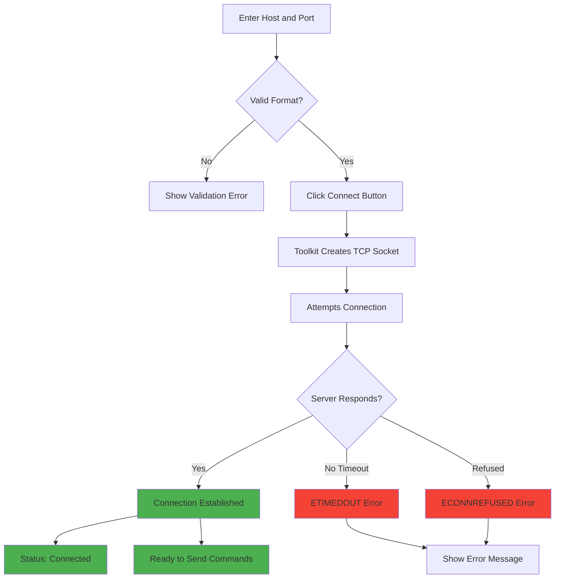
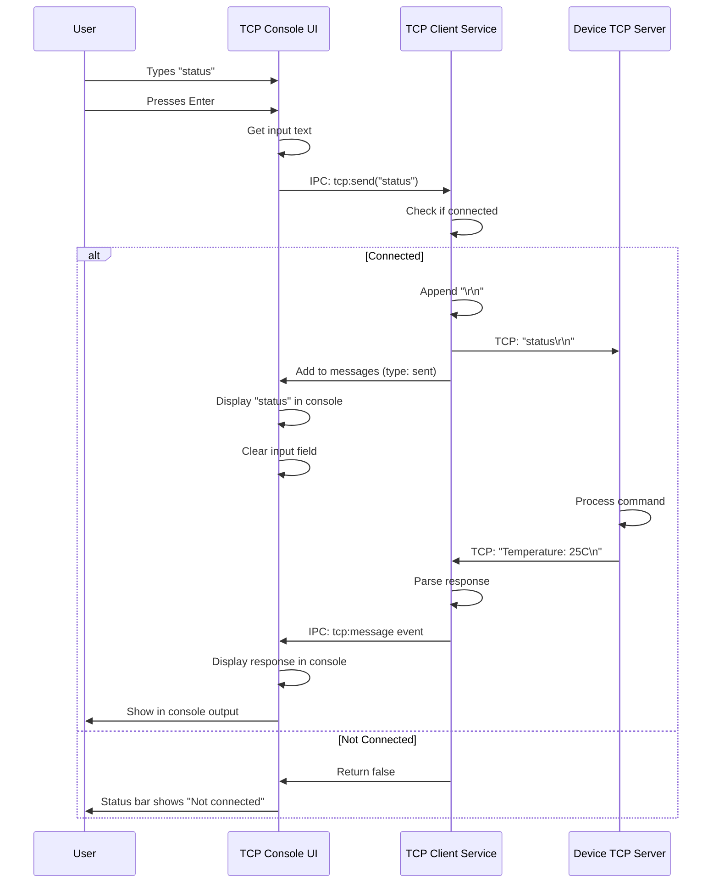
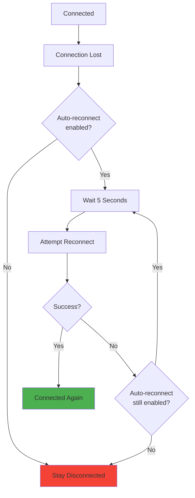

# TCP Console Feature - User Guide

**Feature:** TCP Client Console Communication  
**Audience:** Test Operators, Firmware Developers, System Administrators  
**Last Updated:** December 9, 2025

---

## Table of Contents

1. [Introduction](#introduction)
2. [Getting Started](#getting-started)
3. [Connecting to a Device](#connecting-to-a-device)
4. [Sending Commands](#sending-commands)
5. [Viewing Responses](#viewing-responses)
6. [Managing Messages](#managing-messages)
7. [Auto-Reconnect Feature](#auto-reconnect-feature)
8. [Common Workflows](#common-workflows)
9. [Best Practices](#best-practices)
10. [Troubleshooting](#troubleshooting)
11. [FAQ](#faq)

---

## Introduction

The **TCP Console** feature provides a reliable way to communicate with devices that run TCP server software. Unlike UDP (which doesn't guarantee delivery), TCP ensures every command you send arrives at the device and maintains the correct order.

### What You'll Learn

- How to connect to a TCP server on a device
- How to send commands and view responses
- How to use auto-reconnect for unreliable connections
- How to manage the message history
- Common use cases and workflows

### Prerequisites

- ✅ EOL Toolkit installed and running
- ✅ Device running a TCP server (e.g., port 56789)
- ✅ Network connectivity between toolkit and device
- ✅ Device IP address known

---

## Getting Started

### Opening the TCP Console

1. Launch the **NubeIO EOL Toolkit**
2. In the main navigation menu, click **"Developer Tools"**
3. Select **"TCP Console"** from the submenu
4. The TCP Console interface appears

### Understanding the Interface

```
┌────────────────────────────────────────────────────────────────┐
│  TCP Console Client                      Status: ○ Disconnected│
├────────────────────────────────────────────────────────────────┤
│                                                                 │
│  Connection Settings                                           │
│  ┌──────────────────────────────────────────────────────────┐ │
│  │ Host: [192.168.15.10____________] Port: [56789]          │ │
│  │ □ Auto-reconnect on connection loss    [Connect]         │ │
│  └──────────────────────────────────────────────────────────┘ │
│                                                                 │
│  Console Output (0 messages)              □ Auto-scroll [Clear]│
│  ┌──────────────────────────────────────────────────────────┐ │
│  │                                                           │ │
│  │  No messages yet                                         │ │
│  │  Connect to a server to start communication             │ │
│  │                                                           │ │
│  │                                                           │ │
│  │                                                           │ │
│  └──────────────────────────────────────────────────────────┘ │
└────────────────────────────────────────────────────────────────┘
```

---

## Connecting to a Device

### Step-by-Step Connection

**Step 1: Enter Device Details**

1. In the **Host** field, enter the device IP address or hostname:
   - IP address: `192.168.15.10`
   - Hostname: `device.local`
   - Localhost: `127.0.0.1` or `localhost`

2. In the **Port** field, enter the TCP server port:
   - Default: `56789`
   - Common: `23` (Telnet), `5000`, `8080`

**Step 2: Click Connect**

1. Click the **"Connect"** button
2. The status indicator changes:
   - **Connecting...** (yellow)
   - **● Connected** (green) if successful
   - **○ Disconnected** (red) if failed

**Step 3: Verify Connection**

✅ **Success indicators:**
- Green status dot: **● Connected**
- Button changes to **"Disconnect"**
- Host and port inputs become disabled (gray)
- Status message: "Connected successfully"

❌ **Failure indicators:**
- Red status dot remains: **○ Disconnected**
- Error message appears (e.g., "ECONNREFUSED: Connection refused")
- Host and port inputs remain enabled

---

### Connection Flow



---

### Common Connection Issues

**"Connection refused" (ECONNREFUSED):**
- Device TCP server is not running
- Wrong port number
- Solution: Start server on device, verify port

**"Connection timeout" (ETIMEDOUT):**
- Device is unreachable
- Firewall blocking connection
- Solution: Check network, ping device, check firewall

**"Host not found" (ENOTFOUND):**
- Invalid hostname or IP address
- DNS resolution failed
- Solution: Use IP address instead, check hostname

---

## Sending Commands

### Basic Command Sending

**Step 1: Ensure Connected**

Verify the status shows **● Connected** (green).

**Step 2: Type Command**

1. Locate the message input field (appears when connected)
2. Click inside the input field
3. Type your command (e.g., `help`, `status`, `config wifi`)

**Step 3: Send Command**

Two ways to send:
- **Press Enter key** (quick)
- **Click "Send" button** (explicit)

**Step 4: See Response**

The command appears in the console output:
```
help
```

The device response appears below:
```
Available commands: help, status, config, reboot
```

---

### Command Examples

**Device Help:**
```
Command: help
Response: Available commands: help, status, config, reboot
```

**Device Status:**
```
Command: status
Response: 
Temperature: 24.5°C
Humidity: 60%
Uptime: 3600 seconds
```

**Configuration:**
```
Command: config wifi ssid MyNetwork
Response: WiFi SSID set to: MyNetwork
```

**Device Control:**
```
Command: led red on
Response: LED red turned ON
```

---

### Command Syntax

Commands are sent **exactly as typed** with `\r\n` (carriage return + line feed) appended automatically.

**What you type:**
```
help
```

**What is sent:**
```
help\r\n
```

**Multiple commands:** Send them one at a time
```
1. Send: config mode auto
   Wait for response
2. Send: save config
   Wait for response
3. Send: reboot
```

---

### Command Flow



---

## Viewing Responses

### Response Display

Responses from the device appear in the console output area:

**Sent command (your input):**
```
help
```
- Black text, no prefix
- Shows exactly what you typed

**Received response (device output):**
```
Available commands: help, status, reboot
Temperature: 24.5C
Uptime: 3600s
```
- Black text, no prefix
- Raw output from device
- Multiple lines if device sends multiple lines

**System message:**
```
[10:15:30] [SYSTEM] Connection closed
```
- Gray text with timestamp
- `[SYSTEM]` prefix
- Internal toolkit messages

**Error message:**
```
[10:15:45] [ERROR] ECONNREFUSED: Connection refused
```
- Red text with timestamp
- `[ERROR]` prefix
- Connection or send errors

---

### Console Scrolling

**Auto-Scroll (Disabled by Default):**
- Console does NOT automatically scroll to newest messages
- You control scrolling manually
- Useful when reviewing old responses

**Enable Auto-Scroll:**
1. Check the **"Auto-scroll"** checkbox
2. Console now automatically scrolls to show latest messages
3. Useful for continuous monitoring

**Manual Scrolling:**
1. Click and drag scrollbar
2. Use mouse wheel to scroll
3. Scroll to bottom to see newest messages

**Scroll Behavior After Sending:**
- After you send a command, console **always** scrolls to bottom
- This ensures you see the device response
- Works regardless of auto-scroll setting

---

### Message Count

The console header shows the total message count:
```
Console Output (247 messages)
```

**Buffer Limit:** 1,000 messages maximum
- Oldest messages automatically removed
- Keeps memory usage constant
- Save messages if you need long-term history

---

## Managing Messages

### Clearing Messages

**When to Clear:**
- Starting a new test session
- Console is cluttered with old messages
- Want to see only new responses
- Freeing memory

**How to Clear:**
1. Click the **"Clear"** button (top-right of console)
2. Confirmation: All messages disappear
3. Console shows "No messages yet"
4. Message count resets to 0

**Note:** Clearing is permanent - messages cannot be recovered unless you saved them first.

---

### Saving Messages (Future Feature)

Currently, TCP Console messages are **not** saved to file. To preserve logs:

**Option 1: Copy-Paste**
1. Select text in console (Ctrl+A)
2. Copy (Ctrl+C)
3. Paste into Notepad or text editor
4. Save file

**Option 2: Use Device Logging**
- Configure device to log to UDP instead
- Use UDP Logs feature for file saving
- More suitable for long-term logging

**Option 3: Screenshot**
- Take screenshot of console (Windows: Win+Shift+S)
- Save image for documentation

---

## Auto-Reconnect Feature

### What is Auto-Reconnect?

Auto-reconnect automatically attempts to reconnect if the connection is lost unexpectedly. This is useful for:
- Unreliable network connections
- Device reboots during testing
- Long-running monitoring sessions

### Enabling Auto-Reconnect

**Step 1: Check the Checkbox**

Before or after connecting, check the **"Auto-reconnect on connection loss"** checkbox.

**Step 2: Connect**

Connection behavior is now:
- Initial connection: Same as without auto-reconnect
- If connection lost: Automatic reconnect attempt after 5 seconds
- Reconnect loop: Keeps trying every 5 seconds until successful

---

### Auto-Reconnect Behavior

**Connection Lost Scenario:**
```
[10:15:00] ● Connected to 192.168.15.10:56789
[10:15:30] Command sent: status
[10:15:31] Response: Temperature: 25C
[10:15:45] ○ Connection closed
[10:15:50] ○ Attempting to reconnect... (5s delay)
[10:15:50] ○ Connection failed: ECONNREFUSED
[10:15:55] ○ Attempting to reconnect... (5s delay)
[10:15:56] ● Connected to 192.168.15.10:56789
[10:15:56] ✓ Reconnected successfully
```

**Flow:**


---

### When to Use Auto-Reconnect

**✅ Use Auto-Reconnect:**
- Long-running monitoring sessions
- Production environment with occasional glitches
- Device that reboots periodically
- Unattended operation

**❌ Don't Use Auto-Reconnect:**
- Interactive testing (prevents manual control)
- Device is permanently offline (endless retry spam)
- Debugging connection issues (hides the real problem)
- Short test sessions

---

### Disabling Auto-Reconnect

**Step 1: Uncheck Checkbox**

Uncheck the **"Auto-reconnect on connection loss"** checkbox.

**Step 2: Effect**

- If currently reconnecting: Stops attempting
- If connected: Stays connected until disconnected
- If disconnected: Stays disconnected (no auto-retry)

---

## Common Workflows

### Workflow 1: Quick Device Test

**Scenario:** Verify device is responding correctly

**Steps:**
1. Open TCP Console
2. Enter device IP and port
3. Click **Connect**
4. Send `status` command
5. Verify response is correct
6. Send `test` command (if applicable)
7. Verify test passes
8. Click **Disconnect**
9. Close TCP Console

**Time:** 1-2 minutes

---

### Workflow 2: Interactive Configuration

**Scenario:** Configure device settings interactively

**Steps:**
1. Open TCP Console
2. Connect to device
3. Send `help` to see available commands
4. Send configuration commands one by one:
   ```
   config wifi ssid MyNetwork
   config wifi password secret123
   config server url https://api.example.com
   save config
   ```
5. Verify each response
6. Send `reboot` to apply changes
7. Wait for device to reboot
8. Enable **Auto-reconnect** (device will reconnect automatically)
9. Verify new configuration with `status`
10. Disconnect when done

**Time:** 5-10 minutes

---

### Workflow 3: Continuous Monitoring

**Scenario:** Monitor device behavior over time

**Steps:**
1. Open TCP Console
2. Connect to device
3. Enable **Auto-reconnect** checkbox
4. Enable **Auto-scroll** checkbox
5. Position window to see console output
6. Device sends periodic status updates
7. Watch for errors or anomalies
8. Leave running for hours/days
9. Review messages as needed
10. Clear messages periodically to save memory

**Time:** Continuous (hours/days)

---

### Workflow 4: Firmware Debug Session

**Scenario:** Debug firmware issue with device console

**Steps:**
1. Flash new firmware to device
2. Open TCP Console
3. Connect to device (enable auto-reconnect)
4. Clear messages (start fresh)
5. Send commands to reproduce issue:
   ```
   init
   start test
   run 1000
   ```
6. Watch console for error messages
7. Note error timestamp and message
8. Copy error messages for documentation
9. Send `dump logs` to get detailed logs
10. Disconnect and analyze

**Time:** 30 minutes - 2 hours

---

### Workflow 5: Multi-Device Testing

**Scenario:** Test multiple devices one at a time

**Steps:**
1. Prepare list of device IPs:
   - Device 1: 192.168.1.101
   - Device 2: 192.168.1.102
   - Device 3: 192.168.1.103

2. For each device:
   a. Enter device IP
   b. Click Connect
   c. Send test commands
   d. Record results
   e. Click Disconnect
   f. Clear messages
   g. Next device

3. Compare results across devices

**Time:** 5-10 minutes per device

---

## Best Practices

### For Operators

**Connection:**
1. ✅ Always verify IP and port before connecting
2. ✅ Test localhost (127.0.0.1) first if device is on same machine
3. ✅ Ping device before connecting to verify network
4. ✅ Use auto-reconnect for long monitoring sessions
5. ❌ Don't leave auto-reconnect on during interactive debugging

**Commands:**
1. ✅ Send `help` first to learn available commands
2. ✅ Wait for response before sending next command
3. ✅ Double-check command syntax before sending
4. ❌ Don't send multiple commands rapidly (may overflow device buffer)
5. ❌ Don't send dangerous commands (e.g., `erase flash`) without confirmation

**Messages:**
1. ✅ Clear messages before starting new test
2. ✅ Copy-paste important messages for documentation
3. ✅ Review error messages carefully
4. ❌ Don't let message buffer fill to 1000 (clear periodically)

---

### For Device Firmware Developers

**TCP Server Implementation:**
1. ✅ Echo commands back for confirmation
2. ✅ Send clear response messages (not just OK)
3. ✅ Use consistent line endings (\n or \r\n)
4. ✅ Implement `help` command
5. ✅ Log all commands for security audit

**Command Parsing:**
1. ✅ Validate commands before executing
2. ✅ Return error messages for invalid commands
3. ✅ Implement timeout for idle connections (5-10 minutes)
4. ✅ Support multiple concurrent clients if needed
5. ❌ Don't trust client input (validate everything)

**Response Format:**
```
Command received: [command]
Status: [success/failure]
Result: [data or error message]
```

**Example:**
```
Command received: status
Status: success
Temperature: 24.5C
Humidity: 60%
Uptime: 3600s
```

---

### For System Administrators

**Network Configuration:**
1. ✅ Use static IP for devices (easier to remember)
2. ✅ Document device IPs and ports
3. ✅ Keep devices on isolated test network
4. ✅ Configure firewall to allow TCP traffic
5. ❌ Don't expose TCP ports to internet (security risk)

**Security:**
1. ✅ Use VPN or SSH tunnel for remote access
2. ✅ Implement authentication on device server
3. ✅ Use TLS/SSL for encrypted communication (if supported)
4. ✅ Log all commands for audit trail
5. ❌ Don't use TCP console on untrusted networks

---

## Troubleshooting

### Problem: Can't Connect to Device

**Symptom:** "ECONNREFUSED: Connection refused"

**Possible Causes:**
1. Device TCP server not running
2. Wrong port number
3. Device not on network

**Solutions:**
1. Verify device is powered on
2. Check device TCP server is running
3. Ping device: `ping 192.168.15.10`
4. Try different port numbers
5. Check device firewall settings

---

### Problem: Connection Times Out

**Symptom:** "ETIMEDOUT: Connection timeout"

**Possible Causes:**
1. Device unreachable on network
2. Firewall blocking connection
3. Wrong IP address

**Solutions:**
1. Ping device: `ping 192.168.15.10`
2. Check network connectivity
3. Verify IP address is correct
4. Check Windows firewall (allow outbound TCP)
5. Try localhost if device is on same machine

---

### Problem: No Response After Sending Command

**Symptom:** Command sent but no response appears

**Possible Causes:**
1. Device server not responding
2. Device processing command slowly
3. Connection lost

**Solutions:**
1. Wait 5-10 seconds (device may be busy)
2. Check connection status (should be green)
3. Send another command (e.g., `ping`)
4. Disconnect and reconnect
5. Check device logs for errors

---

### Problem: Garbled or Incomplete Output

**Symptom:** Response text looks wrong or cut off

**Possible Causes:**
1. Line ending mismatch (\n vs \r\n)
2. Binary data in stream
3. Encoding issue

**Solutions:**
1. Check device uses text output (not binary)
2. Verify device sends \n or \r\n after each line
3. Test with simple command (e.g., `help`)
4. Check device encoding (should be UTF-8 or ASCII)

---

### Problem: Auto-Reconnect Keeps Failing

**Symptom:** Endless reconnect attempts, never succeeds

**Possible Causes:**
1. Device is offline
2. Device server crashed
3. Network issue

**Solutions:**
1. Disable auto-reconnect (uncheck checkbox)
2. Fix device issue first (restart server)
3. Manually reconnect once device is ready
4. Check network connectivity

---

### Problem: Console Not Scrolling

**Symptom:** New messages appear but scroll position doesn't change

**Possible Causes:**
1. Auto-scroll disabled
2. User manually scrolled up

**Solutions:**
1. Enable auto-scroll checkbox
2. Scroll to bottom manually (drag scrollbar down)
3. Send a command (forces scroll to bottom)

---

### Problem: Message Buffer Full (1000 Messages)

**Symptom:** Old messages disappearing, message count stays at 1000

**Possible Causes:**
1. Too many messages received
2. Long monitoring session
3. Forgot to clear messages

**Solutions:**
1. Click "Clear" button to clear messages
2. Copy-paste important messages before clearing
3. Clear messages periodically during long sessions

---

## FAQ

### General Questions

**Q: What's the difference between TCP Console and Serial Console?**

A: 
- **TCP Console:** Network-based, connects via WiFi/Ethernet, unlimited range
- **Serial Console:** Cable-based, connects via USB/UART, ~5 meter range

Use TCP Console for remote devices, Serial Console for local development.

---

**Q: Can I connect to multiple devices at once?**

A: No, TCP Console supports only one connection at a time. To test multiple devices:
1. Connect to Device 1
2. Run tests
3. Disconnect
4. Connect to Device 2
5. Run tests
6. Repeat...

---

**Q: Are messages saved to file?**

A: No, TCP Console messages are only stored in memory (1000 max). To save:
- Copy-paste messages to text editor
- Or use UDP Logs feature if device supports UDP logging

---

**Q: Can I send binary data?**

A: No, TCP Console sends text only. Commands are sent as strings with `\r\n` appended. For binary protocols, use a different tool (e.g., Python script).

---

**Q: What's the maximum command length?**

A: No hard limit, but device may have limitations. Keep commands under 256 characters for best compatibility.

---

### Connection Questions

**Q: What port should I use?**

A: Use whatever port your device TCP server listens on:
- **56789** - Common for custom servers
- **23** - Telnet standard
- **5000-9000** - Common development ports

Check your device documentation.

---

**Q: Can I use hostname instead of IP address?**

A: Yes, enter hostname in the Host field (e.g., `device.local`). DNS resolution must work on your network.

---

**Q: How long does connection timeout take?**

A: Typically 10-30 seconds. If device doesn't respond, you'll see "ETIMEDOUT" error after timeout period.

---

**Q: Does TCP Console support SSL/TLS?**

A: No, currently only unencrypted TCP. For secure connections:
- Use SSH tunnel
- Or use VPN for network encryption

---

### Auto-Reconnect Questions

**Q: How long is the reconnect delay?**

A: 5 seconds between reconnect attempts. This prevents rapid retry spam.

---

**Q: Will auto-reconnect keep trying forever?**

A: Yes, until:
- Connection succeeds
- You disable auto-reconnect
- You close TCP Console

---

**Q: Does auto-reconnect work if device reboots?**

A: Yes, perfect use case! Device reboots, TCP server restarts, auto-reconnect establishes new connection automatically.

---

### Message Questions

**Q: What's the maximum message buffer size?**

A: 1,000 messages. When full, oldest messages are automatically removed.

---

**Q: How much memory does message buffer use?**

A: Approximately 100 KB (1,000 messages × ~100 bytes each). Very memory efficient.

---

**Q: Can I search messages?**

A: Not directly in TCP Console. To search:
1. Copy-paste messages to text editor
2. Use Ctrl+F to search
3. Or use grep if saved to file

---

**Q: Why are sent and received messages different colors?**

A: They're not - all messages are black. Only system messages (gray) and errors (red) are colored.

---

### Advanced Questions

**Q: Can I script commands?**

A: Not directly in TCP Console. To script:
- Write Python/Node.js script with TCP socket
- Or send commands via curl/netcat
- Or batch commands in text file and copy-paste

---

**Q: Can I log commands to file?**

A: Not currently. Feature may be added in future. For now:
- Copy-paste messages to text editor
- Or redirect device logs to UDP Logs feature

---

**Q: Does TCP Console support bidirectional streaming?**

A: Yes, TCP is full-duplex. You can send commands while receiving responses simultaneously.

---

**Q: Can I change the line ending?**

A: No, TCP Console always sends `\r\n`. If your device expects only `\n`, device firmware must handle both.

---

## Tips and Tricks

### Productivity Tips

**1. Keyboard Shortcuts:**
- **Enter** - Send command (cursor in input field)
- **Ctrl+A** - Select all messages (for copy)
- **Ctrl+C** - Copy selected text

**2. Quick Reconnect:**
If connection lost:
1. Click Disconnect (if still showing as connected)
2. Click Connect again
(Or enable auto-reconnect beforehand)

**3. Message Search:**
```
1. Ctrl+A to select all messages
2. Ctrl+C to copy
3. Paste into Notepad
4. Ctrl+F to search
```

**4. Multiple Toolkit Instances:**
Open multiple toolkit windows to connect to multiple devices:
```powershell
# Start second instance
cd "C:\Program Files\NubeIO EOL Toolkit"
start NubeIO-EOL-Toolkit.exe
```

---

### Testing Tips

**1. Test Locally First:**
Before testing remote devices, test on localhost:
1. Run simple TCP server on localhost:56789
2. Connect TCP Console to 127.0.0.1:56789
3. Verify communication works

**2. Create Test Script:**
Save common commands in text file:
```
test_commands.txt:
help
status
config mode auto
test sensors
```
Copy-paste commands one at a time.

**3. Document Device IPs:**
Keep a list of device IPs and ports:
```
Device 1 (Dev board): 192.168.1.101:56789
Device 2 (Prod unit): 192.168.1.102:56789
Device 3 (Test rig): 192.168.1.103:56789
```

---

### Debugging Tips

**1. Check Connection Status:**
Always verify status indicator before sending:
- **● Connected** (green) - OK to send
- **○ Disconnected** (red) - Click Connect first

**2. Use Help Command:**
When connecting to unknown device:
```
First command: help
Read available commands
Then proceed with testing
```

**3. Enable Auto-Scroll for Debugging:**
When debugging continuous output:
1. Enable Auto-scroll
2. Watch for errors scrolling by
3. Disable auto-scroll to review errors

**4. Clear Messages Between Tests:**
Start each test with clean console:
1. Click Clear
2. Run test
3. Review messages
4. Click Clear again for next test

---

## Related Documentation

- [Overview.md](./Overview.md) - Technical architecture
- [SourceCode.md](./SourceCode.md) - Code documentation
- [Troubleshooting.md](./Troubleshooting.md) - Detailed problem solving
- [README.md](./README.md) - Quick reference

---

**[← Back to README](./README.md)** | **[Next: Source Code →](./SourceCode.md)**
