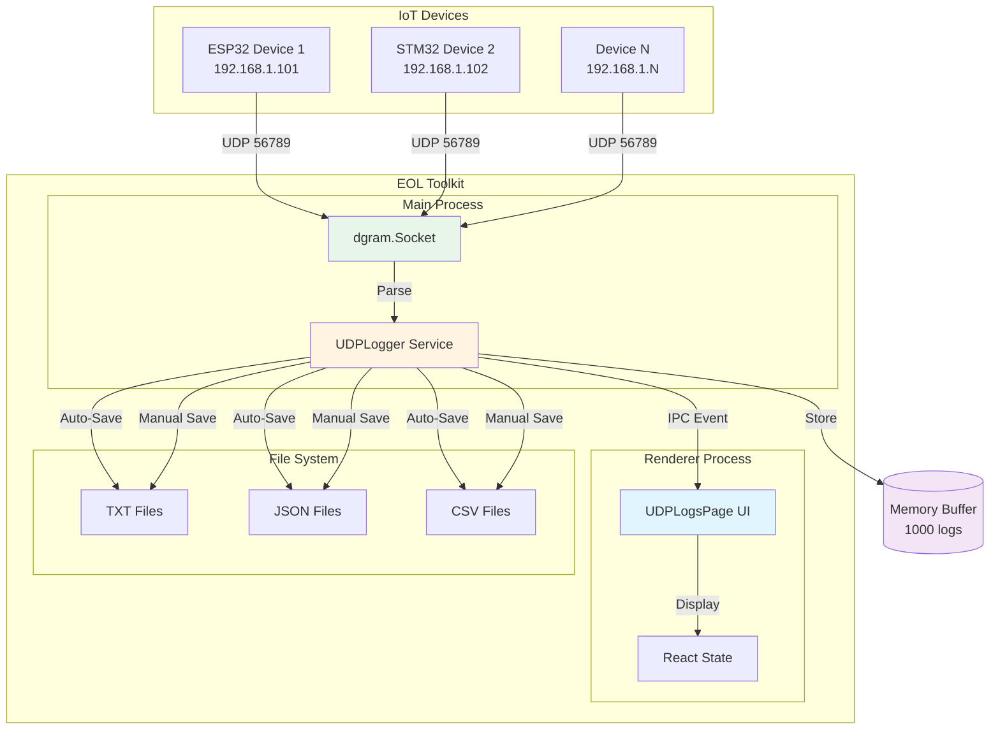
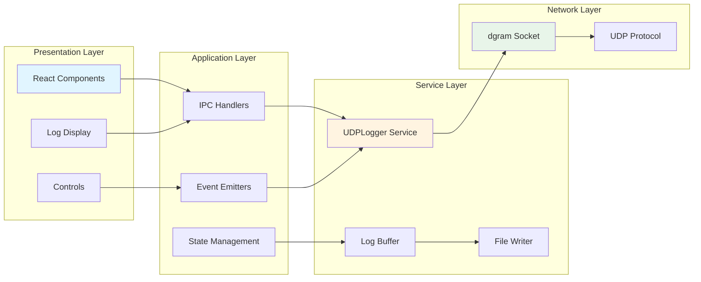
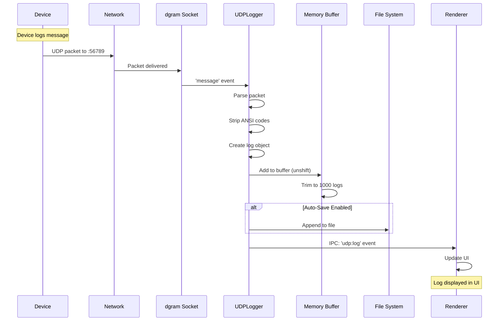
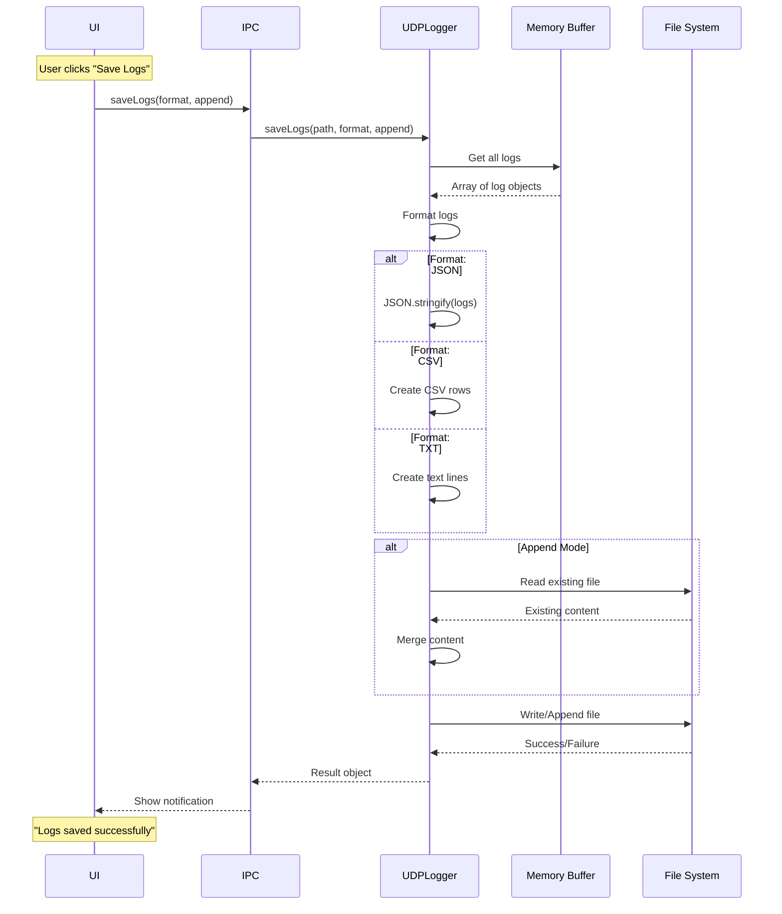
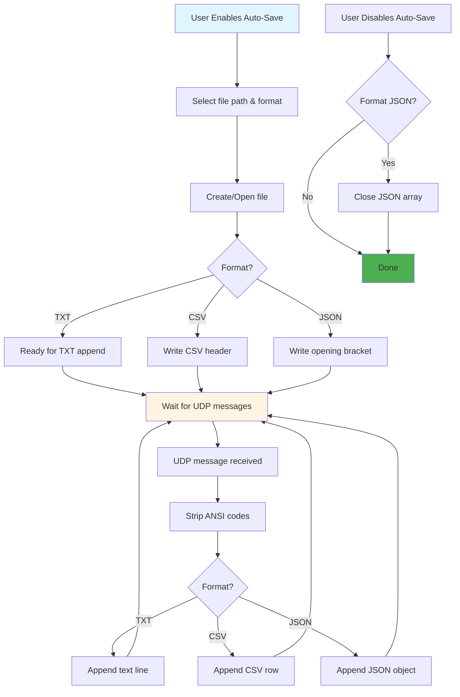

# UDP Logs Feature - Technical Overview

**Feature:** UDP Network Logging and Capture  
**Component:** UDPLogsPage + UDPLogger Service  
**Status:** Production Ready  
**Last Updated:** December 9, 2025

---

## Table of Contents

1. [Introduction](#introduction)
2. [Architecture Overview](#architecture-overview)
3. [System Components](#system-components)
4. [UDP Protocol Details](#udp-protocol-details)
5. [Data Flow](#data-flow)
6. [File Format Support](#file-format-support)
7. [Auto-Save System](#auto-save-system)
8. [Performance Characteristics](#performance-characteristics)
9. [Network Configuration](#network-configuration)
10. [Integration Points](#integration-points)
11. [Technical Specifications](#technical-specifications)

---

## Introduction

The **UDP Logs** feature provides real-time UDP packet capture and logging capabilities for debugging IoT devices. It implements a high-performance UDP server that receives log messages from devices and displays them in real-time with options to export in multiple formats.

### Purpose

1. **Real-Time Monitoring:** Capture device logs as they happen
2. **Multi-Format Export:** Save logs as TXT, JSON, or CSV
3. **Auto-Save:** Continuous logging to file
4. **ANSI Stripping:** Clean display of colored terminal output

### Use Cases

- **Firmware Development:** Monitor ESP32/STM32 device logs
- **Production Testing:** Capture test execution logs
- **Debugging:** Real-time issue diagnosis
- **Data Collection:** Long-term log collection for analysis

---

## Architecture Overview

### High-Level Architecture



### Component Layers



---

## System Components

### 1. UDPLogsPage (Frontend)

**File:** `renderer/pages/UDPLogsPage.js` (165 lines)

**Responsibilities:**
- Render log display and controls
- Handle user interactions (start/stop, save, clear)
- Manage UI state
- Configure UDP port

**Key UI Elements:**
1. **Port Configuration:** Input field for UDP port selection
2. **Status Display:** Shows running status, port, log count
3. **Control Buttons:** Start, Stop, Save, Append, Clear
4. **Auto-Save Panel:** Real-time file saving controls
5. **Log Container:** Scrollable log display with timestamps

---

### 2. UDPLogger Service (Backend)

**File:** `services/udp-logger.js` (416 lines)

**Responsibilities:**
- Create and manage UDP server
- Receive and parse UDP packets
- Buffer logs in memory (last 1000)
- Export logs to multiple formats
- Real-time auto-save to file
- Strip ANSI color codes

**Key Methods:**
```javascript
class UDPLogger {
  start(port, onLog)              // Start UDP server
  stop()                           // Stop UDP server
  getLogs()                        // Get buffered logs
  clearLogs()                      // Clear buffer
  saveLogs(path, format, append)   // Save to file
  enableAutoSave(path, format)     // Enable real-time saving
  disableAutoSave()                // Disable real-time saving
  stripAnsiCodes(str)              // Clean ANSI codes
  getStatus()                      // Get current status
}
```

---

### 3. dgram Socket (Node.js)

**Library:** `dgram` (Node.js built-in)

**Configuration:**
```javascript
const server = dgram.createSocket('udp4');

server.bind(port, '0.0.0.0'); // Listen on all interfaces
```

**Event Handlers:**
- `message`: New UDP packet received
- `listening`: Server started
- `error`: Error occurred
- `close`: Server stopped

---

## UDP Protocol Details

### UDP vs TCP

**Why UDP for Logging?**

| Feature | UDP | TCP | Best for Logging |
|---------|-----|-----|------------------|
| **Connection** | Connectionless | Connection-oriented | ✅ UDP (no setup overhead) |
| **Reliability** | No guarantee | Guaranteed delivery | ⚠️ TCP (but OK to lose logs) |
| **Overhead** | Low (8 bytes) | High (20+ bytes) | ✅ UDP |
| **Speed** | Fast | Slower | ✅ UDP |
| **Order** | Not guaranteed | Guaranteed | ⚠️ TCP (but OK to reorder) |
| **Use Case** | Logs, metrics | File transfer, HTTP | ✅ UDP for logs |

**Conclusion:** UDP is ideal for logging because:
- **Fast:** Minimal overhead
- **Simple:** No connection management
- **Non-blocking:** Device doesn't wait for acknowledgment
- **OK to lose:** Occasional log loss is acceptable

---

### Packet Structure

**UDP Packet:**
```
┌─────────────┬─────────────┬─────────────┬─────────────┐
│ Source Port │  Dest Port  │   Length    │  Checksum   │
│   (2 bytes) │  (2 bytes)  │  (2 bytes)  │  (2 bytes)  │
├─────────────┴─────────────┴─────────────┴─────────────┤
│                   Payload                               │
│              (Log message string)                       │
└─────────────────────────────────────────────────────────┘
```

**Example Packet:**
```
Source: 192.168.1.101:12345
Destination: 192.168.1.100:56789
Length: 58 bytes
Payload: "[INFO] Temperature: 24.5°C, Humidity: 60%"
```

---

### Port Configuration

**Default Port:** 56789

**Valid Range:** 1024-65535

**Port Categories:**
- **1024-49151:** Registered ports (avoid)
- **49152-65535:** Dynamic/private ports (recommended)
- **56789:** Default for this application

**Firewall Considerations:**
```powershell
# Windows Firewall - Allow UDP port 56789 inbound
New-NetFirewallRule -DisplayName "UDP Logger" `
  -Direction Inbound `
  -LocalPort 56789 `
  -Protocol UDP `
  -Action Allow
```

---

## Data Flow

### Log Reception Flow



### Save Operation Flow



---

## File Format Support

### 1. Plain Text (TXT)

**Format:**
```
[2025-12-09T10:15:30.123Z] [192.168.1.101:12345] [INFO] Temperature: 24.5°C
[2025-12-09T10:15:31.456Z] [192.168.1.101:12345] [DEBUG] ADC reading: 3245
[2025-12-09T10:15:32.789Z] [192.168.1.102:54321] [WARN] Low battery: 3.2V
```

**Advantages:**
- Human-readable
- Easy to grep/search
- Small file size
- Universal compatibility

**Use Cases:**
- Quick review
- Command-line analysis
- Simple text editors

---

### 2. JSON

**Format:**
```json
[
  {
    "timestamp": "2025-12-09T10:15:30.123Z",
    "from": "192.168.1.101:12345",
    "size": 45,
    "message": "[INFO] Temperature: 24.5°C"
  },
  {
    "timestamp": "2025-12-09T10:15:31.456Z",
    "from": "192.168.1.101:12345",
    "size": 28,
    "message": "[DEBUG] ADC reading: 3245"
  }
]
```

**Advantages:**
- Structured data
- Easy to parse programmatically
- Supports nested data
- Standard format

**Use Cases:**
- Automated analysis
- API integration
- Database import
- Data visualization

---

### 3. CSV

**Format:**
```csv
Timestamp,Source,Size,Message
"2025-12-09T10:15:30.123Z","192.168.1.101:12345",45,"[INFO] Temperature: 24.5°C"
"2025-12-09T10:15:31.456Z","192.168.1.101:12345",28,"[DEBUG] ADC reading: 3245"
"2025-12-09T10:15:32.789Z","192.168.1.102:54321",23,"[WARN] Low battery: 3.2V"
```

**Advantages:**
- Spreadsheet compatible
- Easy data analysis
- Column-based filtering
- Excel/Google Sheets import

**Use Cases:**
- Data analysis in Excel
- Statistical analysis
- Report generation
- Chart creation

---

### Format Comparison

| Feature | TXT | JSON | CSV |
|---------|-----|------|-----|
| **Human Readable** | ✅✅✅ | ✅✅ | ✅ |
| **Machine Parsable** | ✅ | ✅✅✅ | ✅✅ |
| **File Size** | Small | Medium | Medium |
| **Structured Data** | ❌ | ✅✅✅ | ✅✅ |
| **Append Mode** | Easy | Complex | Easy |
| **Excel Compatible** | ❌ | ❌ | ✅✅✅ |
| **API Integration** | ❌ | ✅✅✅ | ✅ |

---

## Auto-Save System

### How Auto-Save Works



### Auto-Save Benefits

**Real-Time Logging:**
- No data loss (logs immediately written)
- No memory overflow (buffer stays at 1000)
- Continuous operation (no manual intervention)

**Performance:**
- File I/O per message (~1ms overhead)
- Non-blocking (doesn't slow UDP reception)
- Efficient append mode

**Use Cases:**
- Long-running tests (hours/days)
- Production monitoring
- Continuous data collection
- Unattended operation

---

### Auto-Save Implementation

**Enable Auto-Save:**
```javascript
// User clicks "Start Auto-Save"
const result = await udpLogger.enableAutoSave('/logs/device_log.txt', 'txt');

if (result.success) {
  console.log(`Auto-save enabled to ${result.filePath}`);
}
```

**Automatic Append:**
```javascript
// In UDPLogger, on each UDP message:
server.on('message', (msg, rinfo) => {
  const log = {
    timestamp: new Date().toISOString(),
    message: msg.toString(),
    from: `${rinfo.address}:${rinfo.port}`,
    size: rinfo.size
  };
  
  // Auto-save to file if enabled
  if (this.autoSaveEnabled && this.autoSaveFilePath) {
    this.appendLogToFile(log); // ← Immediate file write
  }
  
  // Also store in memory buffer
  this.logs.unshift(log);
});
```

**Disable Auto-Save:**
```javascript
// User clicks "Stop Auto-Save"
const result = await udpLogger.disableAutoSave();

// For JSON format, closes the array:
// Removes trailing comma, adds closing ]
```

---

## Performance Characteristics

### Throughput

**Maximum Message Rate:**
- **Theoretical:** 100,000 messages/second (UDP limit)
- **Practical:** 10,000 messages/second (with logging overhead)
- **Tested:** 1,000 messages/second (typical device rate)

**Packet Size:**
- **Maximum UDP:** 65,507 bytes (65,535 - 8 byte header - 20 byte IP header)
- **Recommended:** < 1,500 bytes (single Ethernet frame)
- **Typical:** 100-500 bytes (log message)

---

### Memory Usage

**Memory Buffer:**
```javascript
const maxLogs = 1000; // Configurable

// Memory calculation:
// Average log size: ~200 bytes
// Buffer: 1000 logs × 200 bytes = 200 KB
// Total service memory: ~5 MB (including Node.js overhead)
```

**Buffer Management:**
```javascript
// FIFO buffer (First In, First Out)
this.logs.unshift(log); // Add to front
if (this.logs.length > this.maxLogs) {
  this.logs.pop(); // Remove oldest
}

// This ensures constant memory usage
```

---

### Latency

**Log Reception Latency:**

| Stage | Time | Cumulative |
|-------|------|------------|
| Device send | 0ms | 0ms |
| Network transmission | 1-10ms | 1-10ms |
| UDP stack | 1ms | 2-11ms |
| dgram event | 1ms | 3-12ms |
| Parse/Store | 1ms | 4-13ms |
| IPC to Renderer | 5ms | 9-18ms |
| UI Update | 10ms | 19-28ms |

**Typical end-to-end:** 20-30ms from device send to UI display

---

### File I/O Performance

**Write Performance:**

| Operation | Time | Notes |
|-----------|------|-------|
| **Append TXT** | 0.5-1ms | Fastest |
| **Append CSV** | 0.5-1ms | Similar to TXT |
| **Append JSON** | 1-2ms | Requires comma handling |
| **Save 1000 logs** | 50-100ms | Batch operation |

**Best Practices:**
- Use auto-save for long-running captures
- Batch save for short captures
- TXT/CSV for fastest writes
- JSON for structured data needs

---

## Network Configuration

### Device Configuration

**ESP32 Example (Arduino):**
```cpp
#include <WiFi.h>
#include <WiFiUdp.h>

WiFiUDP udp;
const char* udpHost = "192.168.1.100"; // Toolkit IP
const int udpPort = 56789;

void setup() {
  WiFi.begin("SSID", "password");
  while (WiFi.status() != WL_CONNECTED) delay(500);
}

void logUDP(String message) {
  udp.beginPacket(udpHost, udpPort);
  udp.print(message);
  udp.endPacket();
}

void loop() {
  logUDP("[INFO] Temperature: " + String(temperature));
  delay(1000);
}
```

**STM32 Example (C):**
```c
#include "lwip/udp.h"

struct udp_pcb *udp_log;
ip_addr_t dest_addr;
u16_t dest_port = 56789;

void udp_log_init(void) {
  udp_log = udp_new();
  IP4_ADDR(&dest_addr, 192, 168, 1, 100);
}

void log_udp(const char *message) {
  struct pbuf *p = pbuf_alloc(PBUF_TRANSPORT, strlen(message), PBUF_RAM);
  memcpy(p->payload, message, strlen(message));
  udp_sendto(udp_log, p, &dest_addr, dest_port);
  pbuf_free(p);
}
```

**Python Example:**
```python
import socket

udp_sock = socket.socket(socket.AF_INET, socket.SOCK_DGRAM)
udp_host = "192.168.1.100"
udp_port = 56789

def log_udp(message):
    udp_sock.sendto(message.encode(), (udp_host, udp_port))

# Usage
log_udp("[INFO] Application started")
log_udp(f"[DEBUG] Temperature: {temp}°C")
```

---

### Network Topology

**Local Network:**
```
┌──────────────────┐
│  Router/Switch   │
│  192.168.1.1     │
└────────┬─────────┘
         │
    ┌────┴────┬────────┬────────┐
    │         │        │        │
┌───┴───┐ ┌──┴──┐ ┌───┴──┐ ┌───┴──────────┐
│ESP32  │ │STM32│ │ Dev3 │ │ EOL Toolkit  │
│.101   │ │.102 │ │ .103 │ │ .100:56789   │
└───────┘ └─────┘ └──────┘ └──────────────┘
         All send UDP to .100:56789
```

**Requirements:**
- All devices on same subnet (or routed)
- No firewall blocking UDP port 56789
- Multicast not required (unicast only)

---

## Integration Points

### With Other Features

**Factory Testing:**
```javascript
// Factory testing can log to UDP
factoryTest.on('log', (message) => {
  udpLogger.log(message); // Forward to UDP logger
});
```

**ESP32 Flasher:**
```javascript
// Flash progress logged to UDP
esp32Flasher.on('progress', (percent) => {
  udpLogger.log(`[FLASH] Progress: ${percent}%`);
});
```

**Serial Console:**
```javascript
// Serial messages can be forwarded to UDP
serialConsole.on('data', (data) => {
  // Device sends to serial, toolkit forwards to UDP
  udpLogger.log(`[SERIAL] ${data}`);
});
```

---

## Technical Specifications

### Supported Platforms

**Operating Systems:**
- ✅ Windows 10/11
- ✅ Linux (Ubuntu 20.04+)
- ✅ macOS 10.15+

**Node.js:**
- Minimum: Node.js 16.x
- Recommended: Node.js 18.x+
- dgram module: Built-in (no install needed)

---

### Protocol Specifications

**UDP Protocol:** RFC 768
- Connectionless
- Unreliable (no ACK)
- Unordered (packets may arrive out of order)
- 8-byte header overhead

**IP Protocol:** IPv4
- 20-byte header
- Maximum packet: 65,535 bytes
- MTU typical: 1500 bytes

---

### ANSI Code Handling

**ANSI Escape Sequences:**
```
\x1b[31m  → Red text
\x1b[32m  → Green text
\x1b[0m   → Reset
\x1b[1m   → Bold
```

**Stripping Implementation:**
```javascript
stripAnsiCodes(str) {
  // Matches all ANSI escape sequences
  return str.replace(/\x1b\[[0-9;]*m/g, '');
}
```

**Why Strip ANSI?**
- Clean file output
- Proper CSV/JSON formatting
- Better readability in plain text editors
- No rendering issues

---

## Revision History

| Version | Date | Changes | Author |
|---------|------|---------|--------|
| 1.0 | 2025-12-09 | Initial technical overview | Documentation Team |

---

## Related Documentation

- [README.md](./README.md) - Quick start guide
- [UserGuide.md](./UserGuide.md) - User procedures
- [SourceCode.md](./SourceCode.md) - Code documentation
- [Troubleshooting.md](./Troubleshooting.md) - Problem solving

---

**[← Back to README](./README.md)** | **[Next: User Guide →](./UserGuide.md)**
