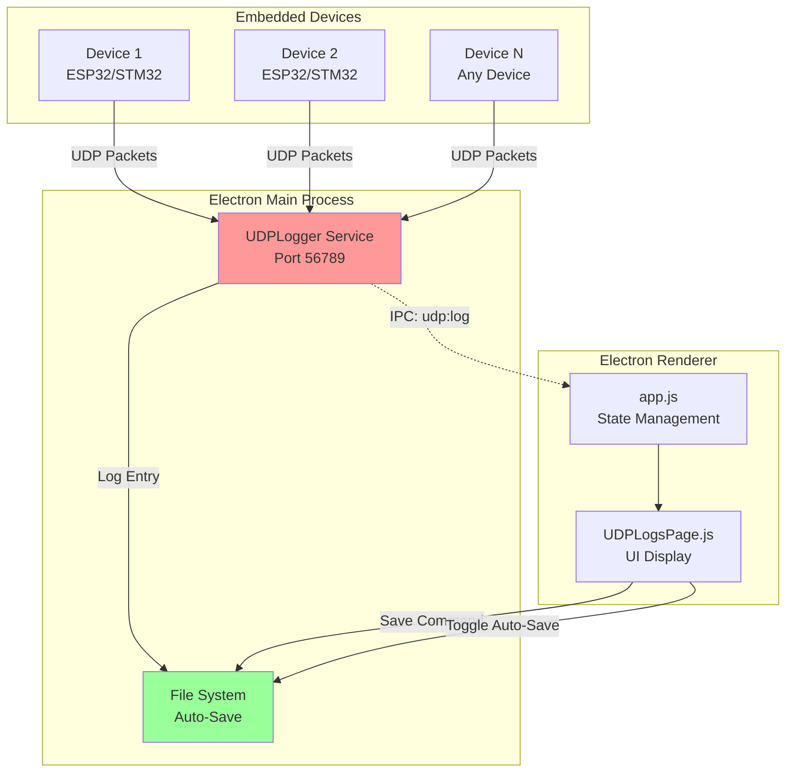
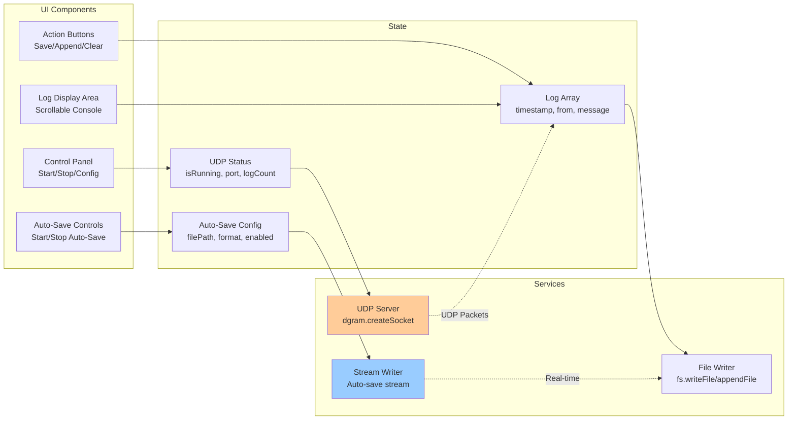

# UDP Logs - Network Logging Viewer

**Feature:** UDP Logs (Debug Logging)  
**Purpose:** Real-time UDP packet logging and analysis  
**Status:** Core feature - Always enabled  
**Last Updated:** December 9, 2025

---

## 📋 Overview

The **UDP Logs** feature provides real-time monitoring of UDP packets sent by devices over the network. This is essential for debugging device firmware, monitoring system events, and capturing diagnostic information from embedded devices.

### Key Capabilities

- 📡 **UDP Packet Capture** - Listen on configurable UDP ports
- 📝 **Real-Time Logging** - Display messages as they arrive
- 💾 **Multi-Format Export** - Save logs in TXT, JSON, or CSV formats
- ➕ **Append Mode** - Add new logs to existing files
- 🔄 **Auto-Save** - Real-time continuous logging to file
- 🧹 **ANSI Color Stripping** - Clean display of colored terminal output
- 📊 **Log Management** - Clear, filter, and organize logs

---

## 🚀 Quick Start

### 1. Start UDP Logger

1. Navigate to **UDP Logs** tab
2. Configure port (default: 56789)
3. Click **▶️ Start UDP Logger**
4. Status indicator turns green

### 2. Monitor Device Logs

**Device Configuration:**
- Configure device to send UDP logs to your PC's IP
- Use port 56789 (or your configured port)
- Logs appear automatically in real-time

### 3. Save Logs

**Save Current Session:**
- Click **💾 Save Logs** - Creates new file
- Click **➕ Append Logs** - Adds to existing file
- Choose format: TXT, JSON, or CSV

**Auto-Save Mode:**
- Click **🚀 Start Auto-Save**
- Choose filename and format once
- All future logs automatically written to file
- No interruption to logging

---

## 🏗️ Architecture

### System Overview



### Component Diagram



---

## 🎮 Features

### UDP Server Configuration

**Port Selection:**
- Default: 56789
- Range: 1024-65535
- Configurable when stopped
- Persists across app restarts

**Listening Address:**
- Binds to `0.0.0.0` (all interfaces)
- Receives from any network device
- Works with WiFi, Ethernet, localhost

### Real-Time Log Display

**Message Format:**
```
[HH:MM:SS] [Source IP:Port] Log Message
```

**Example:**
```
[14:23:45] [192.168.1.100:51234] [INFO] System started
[14:23:46] [192.168.1.100:51234] [DEBUG] WiFi connected, IP: 192.168.1.100
[14:23:47] [192.168.1.100:51234] [ERROR] Sensor timeout
```

**Display Features:**
- Most recent logs at top (reverse chronological)
- Auto-scrolling (optional)
- ANSI color code stripping
- HTML entity escaping (security)
- Monospace font for alignment
- Dark mode support

### Log Management

**Statistics:**
- Total log count displayed
- Updates in real-time
- Tracks unique sources

**Actions:**
- **Clear Logs** - Remove all from memory (file preserved)
- **Save Logs** - Export to file (new file)
- **Append Logs** - Add to existing file

### Export Formats

**1. Text Format (.txt)**
```
[2025-12-09T14:23:45.123Z] [192.168.1.100:51234] System started
[2025-12-09T14:23:46.456Z] [192.168.1.100:51234] WiFi connected
```

**2. JSON Format (.json)**
```json
[
  {
    "timestamp": "2025-12-09T14:23:45.123Z",
    "from": "192.168.1.100:51234",
    "size": 32,
    "message": "System started"
  }
]
```

**3. CSV Format (.csv)**
```csv
Timestamp,From,Size,Message
2025-12-09T14:23:45.123Z,192.168.1.100:51234,32,System started
2025-12-09T14:23:46.456Z,192.168.1.100:51234,45,WiFi connected
```

### Auto-Save Feature

**Continuous Logging:**
- Real-time file writing (no memory buffering)
- No data loss on crash
- Efficient append-only mode
- Supports all formats (TXT, JSON, CSV)

**Workflow:**
1. Click **🚀 Start Auto-Save**
2. Choose filename and format once
3. File created immediately
4. Every new log written to file instantly
5. Click **⏸️ Stop Auto-Save** to finish

**Use Cases:**
- Long-term device monitoring
- Production testing (hours/days)
- Unattended operation
- Critical data capture

---

## 💻 User Interface

### Control Panel

**When Stopped:**
```
┌─────────────────────────────────────────┐
│ UDP Port: [56789]  Port range: 1024-65535 │
│               [▶️ Start UDP Logger]        │
└─────────────────────────────────────────┘
```

**When Running:**
```
┌─────────────────────────────────────────┐
│ UDP Logger  ● Port 56789 | 125 logs     │
│ [⏹️ Stop] [💾 Save] [➕ Append] [🗑️ Clear] │
└─────────────────────────────────────────┘
```

### Auto-Save Panel

**Disabled:**
```
┌─────────────────────────────────────────┐
│ ○ Real-Time Auto-Save [🚀 Start Auto-Save] │
└─────────────────────────────────────────┘
```

**Enabled:**
```
┌─────────────────────────────────────────┐
│ ● Real-Time Auto-Save                   │
│ 📁 device_logs_20251209_142345.txt (TXT) │
│                     [⏸️ Stop Auto-Save]  │
└─────────────────────────────────────────┘
```

### Log Display

```
┌─────────────────────────────────────────┐
│ 14:23:47 192.168.1.100:51234 [ERROR]... │
│ 14:23:46 192.168.1.100:51234 [DEBUG]... │
│ 14:23:45 192.168.1.100:51234 [INFO]...  │
│                                         │
│ (Scrollable console area)               │
│                                         │
└─────────────────────────────────────────┘
```

---

## 🔧 Configuration

### Device-Side Configuration

**ESP32 Example (ESP-IDF):**
```c
#include "esp_log.h"

// Configure UDP logging
void init_udp_logging() {
    esp_log_set_vprintf(udp_log_vprintf);
}

int udp_log_vprintf(const char *fmt, va_list args) {
    char buffer[256];
    int len = vsnprintf(buffer, sizeof(buffer), fmt, args);
    
    // Send to PC via UDP
    struct sockaddr_in dest_addr;
    dest_addr.sin_addr.s_addr = inet_addr("192.168.1.50"); // PC IP
    dest_addr.sin_family = AF_INET;
    dest_addr.sin_port = htons(56789);
    
    int sock = socket(AF_INET, SOCK_DGRAM, IPPROTO_IP);
    sendto(sock, buffer, len, 0, 
           (struct sockaddr *)&dest_addr, sizeof(dest_addr));
    close(sock);
    
    return len;
}
```

**STM32 Example:**
```c
// Use existing UART/printf redirection
// Add UDP send in printf handler
void udp_send_log(const char* message) {
    // Your UDP implementation
}
```

**Python Example:**
```python
import socket

def send_udp_log(message, host='192.168.1.50', port=56789):
    sock = socket.socket(socket.AF_INET, socket.SOCK_DGRAM)
    sock.sendto(message.encode(), (host, port))
    sock.close()

send_udp_log("[INFO] Python application started")
```

### PC-Side Configuration

**Find Your PC IP:**
```powershell
# Windows
ipconfig
# Look for IPv4 Address: 192.168.x.x

# Linux/macOS
ifconfig
# or
ip addr show
```

**Configure Firewall:**
```powershell
# Windows Firewall (allow inbound UDP)
New-NetFirewallRule -DisplayName "UDP Logger" -Direction Inbound `
  -Protocol UDP -LocalPort 56789 -Action Allow
```

---

## 🎯 Common Tasks

### Task 1: Monitor ESP32 Device Logs

**Setup:**
1. Find PC IP: `ipconfig` → e.g., 192.168.1.50
2. Configure ESP32 to send UDP to 192.168.1.50:56789
3. Flash firmware to ESP32

**Monitor:**
1. Open NubeIO EOL Toolkit
2. Go to UDP Logs tab
3. Start UDP Logger on port 56789
4. Power on ESP32
5. Logs appear automatically

**Expected Logs:**
```
[14:23:45] [192.168.1.100:51234] [INFO] ESP32 boot
[14:23:46] [192.168.1.100:51234] [INFO] WiFi connecting...
[14:23:47] [192.168.1.100:51234] [INFO] WiFi connected, IP: 192.168.1.100
```

---

### Task 2: Save Logs for Debugging

**Scenario:** Device crashes, need logs for analysis

**Steps:**
1. Start UDP Logger before testing
2. Reproduce issue
3. Click **💾 Save Logs**
4. Choose format: **JSON** (for analysis)
5. Save to: `crash_logs_20251209.json`
6. Send to developer

**Analysis:**
- Open JSON in text editor
- Search for ERROR/WARN messages
- Check timestamp sequence
- Correlate with device behavior

---

### Task 3: Long-Term Monitoring with Auto-Save

**Scenario:** 24-hour soak test

**Setup:**
1. Start UDP Logger
2. Click **🚀 Start Auto-Save**
3. Choose filename: `soak_test_24h.txt`
4. Choose format: **TXT**
5. Leave running overnight

**Results:**
- File continuously updated
- No memory limits
- No data loss
- Review file next day

**Stop:**
- Click **⏸️ Stop Auto-Save**
- File ready for analysis

---

### Task 4: Compare Multiple Test Runs

**Scenario:** Before/after firmware comparison

**Test 1 (Old Firmware):**
1. Start UDP Logger
2. Run test sequence
3. Click **💾 Save Logs**
4. Save as: `firmware_v1_0.txt`

**Test 2 (New Firmware):**
1. Clear Logs (🗑️)
2. Flash new firmware
3. Run same test sequence
4. Click **💾 Save Logs**
5. Save as: `firmware_v2_0.txt`

**Analysis:**
```powershell
# Windows - Compare files
fc firmware_v1_0.txt firmware_v2_0.txt

# Or use Beyond Compare, WinMerge, etc.
```

---

## 🐛 Troubleshooting

### Issue: No Logs Received

**Symptoms:**
- UDP Logger running (green indicator)
- Device powered on
- No logs appearing

**Solutions:**

**1. Check Network Connectivity**
```powershell
# Ping device
ping 192.168.1.100
```

**2. Verify Port Configuration**
- Device sending to correct port? (56789)
- App listening on same port?
- Port not blocked by firewall?

**3. Test with netcat**
```bash
# Send test UDP packet from command line
echo "Test message" | nc -u 192.168.1.50 56789
# Should appear in logs
```

**4. Check Firewall**
```powershell
# Temporarily disable to test
Set-NetFirewallProfile -Profile Domain,Public,Private -Enabled False
# Re-enable after test!
```

**5. Verify Device IP Configuration**
- Device on same subnet?
- Device has valid IP?
- Check device UART logs

---

### Issue: Port Already in Use

**Symptoms:**
- Can't start UDP Logger
- Error: "Port already in use"

**Solutions:**

**1. Find Process Using Port**
```powershell
# Windows
netstat -ano | findstr :56789
# Shows PID of process using port

# Kill process (if safe)
taskkill /PID <pid> /F
```

**2. Use Different Port**
- Change port to 56790 or similar
- Update device configuration to match

---

### Issue: Logs Missing/Corrupted

**Symptoms:**
- Some logs not appearing
- Messages truncated
- Garbled text

**Possible Causes:**

**1. UDP Packet Loss (Normal)**
- UDP is unreliable protocol
- Packets can be lost on network
- Solution: Use TCP Console for critical logs

**2. Buffer Overflow**
- Messages too large (>65KB UDP limit)
- Solution: Split large messages device-side

**3. ANSI Color Codes**
- Terminal colors showing as garbage
- Solution: Already handled (ANSI stripping)
- Check stripAnsiCodes() function

**4. Encoding Issues**
- Non-ASCII characters
- Solution: Ensure UTF-8 encoding device-side

---

### Issue: Auto-Save Not Working

**Symptoms:**
- Auto-Save enabled
- No file created/updated

**Solutions:**

**1. Check File Path**
- Verify file location is writable
- Check disk space

**2. Check File Locks**
- Close file if open in another program
- Some programs lock files (Excel with CSV)

**3. Restart Auto-Save**
- Stop Auto-Save
- Start Auto-Save with new file
- Monitor for errors in console

---

## 📚 Code References

**Main Files:**
- `renderer/pages/UDPLogsPage.js` - UI rendering (165 lines)
- `services/udp-logger.js` - UDP server logic (416 lines)
- `main.js` - IPC handlers for UDP

**Key Methods:**
- `UDPLogger.start(port, callback)` - Start UDP server
- `UDPLogger.stop()` - Stop server
- `UDPLogger.saveLogs(path, format, append)` - Export logs
- `UDPLogger.enableAutoSave(path, format)` - Start auto-save
- `UDPLogger.disableAutoSave()` - Stop auto-save
- `UDPLogger.stripAnsiCodes(str)` - Clean ANSI colors

**IPC Channels:**
- `udp:start` - Start UDP logger
- `udp:stop` - Stop UDP logger
- `udp:get-logs` - Get current logs
- `udp:clear-logs` - Clear logs
- `udp:save-logs` - Save to file
- `udp:log` - New log received (main → renderer)
- `udp:toggle-auto-save` - Enable/disable auto-save

---

## 🔗 Related Features

- **Serial Console** - UART-based logging (wired connection)
- **TCP Console** - Reliable TCP logging (alternative to UDP)
- **Factory Testing** - Uses UDP logs for device diagnostics
- **Fleet Monitoring** - Aggregate logs from multiple devices

---

## 📝 Best Practices

### For Users

1. **Start logger before testing** - Don't miss initial logs
2. **Use auto-save for long tests** - Prevent data loss
3. **Clear logs between tests** - Keep data organized
4. **Use JSON for analysis** - Structured data easier to parse
5. **Use TXT for reading** - Human-readable format

### For Developers

1. **Add timestamps device-side** - Helps correlation
2. **Use log levels** [INFO], [DEBUG], [ERROR]
3. **Keep messages concise** - UDP has size limits
4. **Batch non-critical logs** - Reduce network traffic
5. **Consider TCP for critical data** - Guaranteed delivery

### For Network Admins

1. **Open UDP port in firewall** - Port 56789
2. **Use VLANs for production** - Isolate device traffic
3. **Monitor network bandwidth** - Excessive logging can saturate
4. **Document IP assignments** - Track device locations

---

## 🎓 Learning Resources

**UDP Protocol:**
- [UDP Basics (Wikipedia)](https://en.wikipedia.org/wiki/User_Datagram_Protocol)
- [UDP vs TCP](https://www.diffen.com/difference/TCP_vs_UDP)

**Related Documentation:**
- [Main Documentation Index](../../README.md)
- [Serial Console](../serial-console/README.md)
- [TCP Console](../tcp-console/README.md)

---

## 📄 File Listing

**This Feature's Documentation:**
- [README.md](./README.md) - This file (overview)
- [UDPLogs-Overview.md](./UDPLogs-Overview.md) - Technical deep dive
- [UDPLogs-UserGuide.md](./UDPLogs-UserGuide.md) - Detailed procedures
- [UDPLogs-SourceCode.md](./UDPLogs-SourceCode.md) - Developer documentation
- [UDPLogs-Troubleshooting.md](./UDPLogs-Troubleshooting.md) - Problem solving

---

**Last Updated:** December 9, 2025  
**Status:** ✅ Core Feature - Always Available  
**Next:** Read [UDPLogs-UserGuide.md](./UDPLogs-UserGuide.md) for detailed instructions
