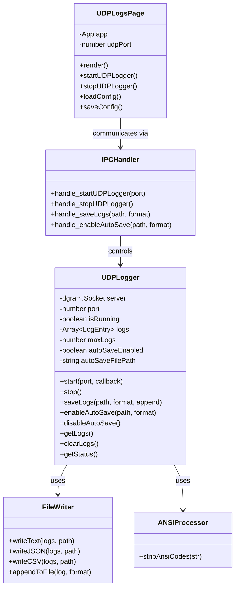
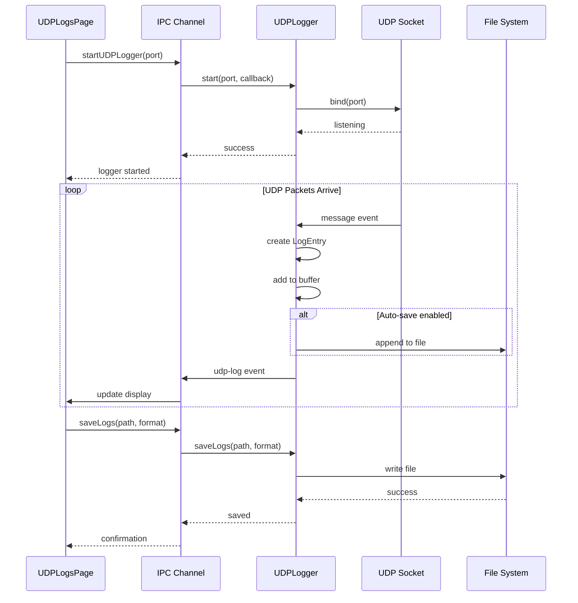
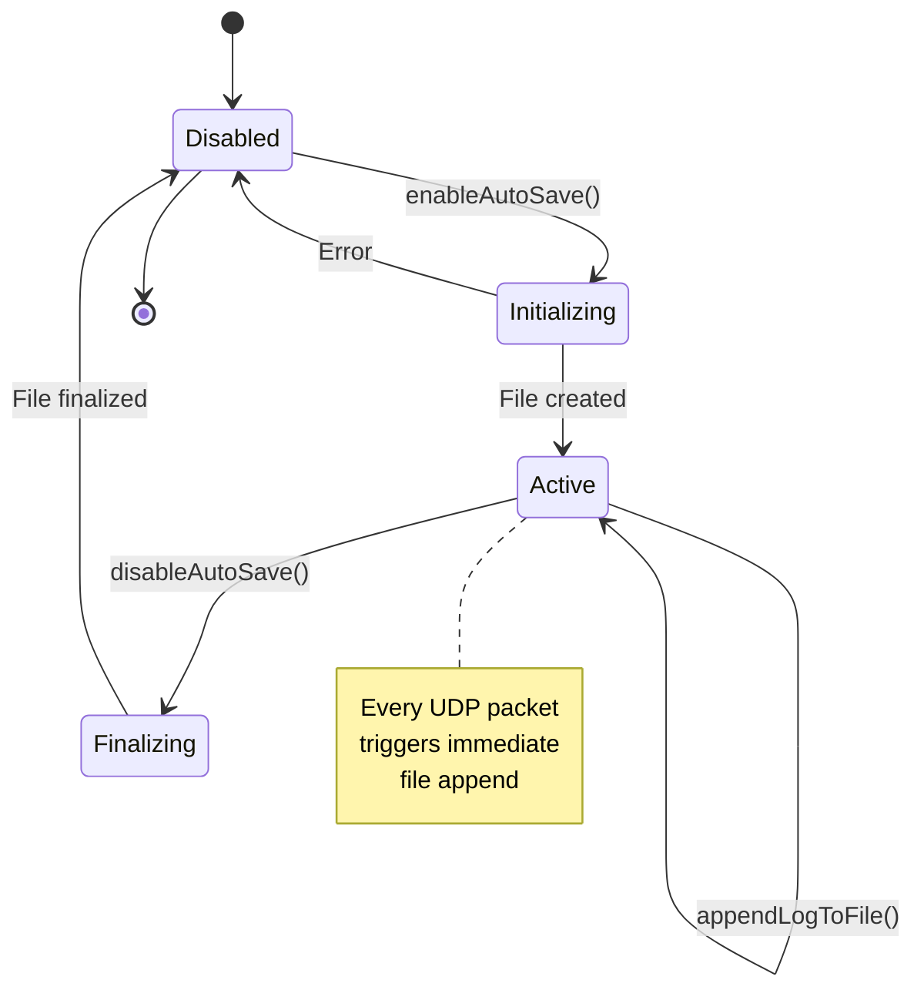

# UDP Logs Feature - Source Code Documentation

**Feature:** UDP Network Logging and Capture  
**Audience:** Software Developers, System Integrators  
**Last Updated:** December 9, 2025

---

## Table of Contents

1. [Architecture Overview](#architecture-overview)
2. [Class: UDPLogger (Service)](#class-udplogger-service)
3. [Class: UDPLogsPage (UI)](#class-udplogspage-ui)
4. [Data Structures](#data-structures)
5. [IPC Communication](#ipc-communication)
6. [File Format Implementation](#file-format-implementation)
7. [Auto-Save System](#auto-save-system)
8. [ANSI Code Handling](#ansi-code-handling)
9. [Code Examples](#code-examples)
10. [Testing](#testing)
11. [Performance Optimization](#performance-optimization)
12. [Adding New Features](#adding-new-features)

---

## Architecture Overview

### System Architecture



### Component Interaction



---

## Class: UDPLogger (Service)

**File:** `services/udp-logger.js`

### Class Overview

The `UDPLogger` class manages UDP socket creation, log buffering, file I/O, and auto-save functionality.

**Key Responsibilities:**
- Create and manage UDP socket (dgram)
- Buffer incoming log messages (max 1,000)
- Export logs in multiple formats (TXT, JSON, CSV)
- Provide real-time auto-save capability
- Strip ANSI escape codes for clean output

---

### Constructor

```javascript
constructor()
```

**Description:** Initializes the UDP logger with default configuration.

**Initial State:**
- `server`: `null` (no socket created)
- `port`: `56789` (default port)
- `isRunning`: `false`
- `onLogCallback`: `null`
- `logs`: `[]` (empty array)
- `maxLogs`: `1000` (buffer size)
- `autoSaveEnabled`: `false`
- `autoSaveFilePath`: `null`
- `autoSaveFormat`: `'txt'`
- `autoSaveStream`: `null`

**Example:**
```javascript
const UDPLogger = require('./services/udp-logger');
const logger = new UDPLogger();
```

---

### Method: start()

```javascript
start(port = 56789, onLog)
```

**Description:** Starts the UDP server and begins listening for packets.

**Parameters:**
- `port` (number): Port to bind to (1024-65535)
- `onLog` (function): Callback function for each log entry
  - Signature: `(logEntry: string) => void`

**Returns:** `void`

**Side Effects:**
- Creates `dgram.Socket`
- Binds to specified port
- Sets `isRunning` to `true`
- Begins buffering logs

**Events:**
- `'message'`: Fired when UDP packet received
- `'listening'`: Fired when socket bound successfully
- `'error'`: Fired on socket errors

**Example:**
```javascript
const logger = new UDPLogger();

logger.start(56789, (logEntry) => {
  console.log('New log:', logEntry);
  // Send to UI via IPC
  mainWindow.webContents.send('udp-log', logEntry);
});
```

**Implementation Details:**
```javascript
start(port = 56789, onLog) {
  if (this.isRunning) {
    console.log('UDP Logger already running');
    return;
  }

  this.port = port;
  this.onLogCallback = onLog;
  this.server = dgram.createSocket('udp4');

  // Error handling
  this.server.on('error', (err) => {
    console.error('UDP Logger error:', err);
    this.stop();
  });

  // Message handling
  this.server.on('message', (msg, rinfo) => {
    const log = {
      timestamp: new Date().toISOString(),
      message: msg.toString(),
      from: `${rinfo.address}:${rinfo.port}`,
      size: rinfo.size
    };
    
    // Add to buffer (FIFO)
    this.logs.unshift(log);
    if (this.logs.length > this.maxLogs) {
      this.logs.pop(); // Remove oldest
    }
    
    // Auto-save if enabled
    if (this.autoSaveEnabled && this.autoSaveFilePath) {
      this.appendLogToFile(log);
    }
    
    // Callback
    if (this.onLogCallback) {
      const logEntry = `UDP [${log.from}]: ${log.message}`;
      this.onLogCallback(logEntry);
    }
  });

  // Listening event
  this.server.on('listening', () => {
    const address = this.server.address();
    console.log(`UDP Logger listening on ${address.address}:${address.port}`);
    this.isRunning = true;
  });

  // Bind to port (0.0.0.0 = all interfaces)
  this.server.bind(this.port, '0.0.0.0');
}
```

---

### Method: stop()

```javascript
stop()
```

**Description:** Stops the UDP server and releases the port.

**Parameters:** None

**Returns:** `void`

**Side Effects:**
- Closes socket
- Sets `isRunning` to `false`
- Sets `server` to `null`

**Example:**
```javascript
logger.stop();
console.log('UDP logger stopped');
```

**Implementation:**
```javascript
stop() {
  if (this.server) {
    this.server.close(() => {
      console.log('UDP Logger stopped');
      this.isRunning = false;
      this.server = null;
    });
  }
}
```

---

### Method: getLogs()

```javascript
getLogs()
```

**Description:** Returns all buffered log entries.

**Parameters:** None

**Returns:** `Array<LogEntry>` - Array of log objects (max 1,000)

**Log Entry Structure:**
```javascript
{
  timestamp: "2025-12-09T10:15:30.123Z",  // ISO 8601 timestamp
  message: "[INFO] Temperature: 24.5°C",  // Original message
  from: "192.168.1.101:12345",            // Source IP:port
  size: 45                                // Packet size in bytes
}
```

**Example:**
```javascript
const logs = logger.getLogs();
console.log(`Total logs: ${logs.length}`);

logs.forEach(log => {
  console.log(`[${log.timestamp}] ${log.from}: ${log.message}`);
});
```

---

### Method: clearLogs()

```javascript
clearLogs()
```

**Description:** Clears all buffered logs from memory.

**Parameters:** None

**Returns:** `void`

**Side Effects:**
- Sets `logs` array to `[]`
- Does not affect auto-save file

**Example:**
```javascript
logger.clearLogs();
console.log('Logs cleared');
```

---

### Method: saveLogs()

```javascript
async saveLogs(filePath, format = 'txt', append = false)
```

**Description:** Saves all buffered logs to a file in the specified format.

**Parameters:**
- `filePath` (string): Full path to save file
- `format` (string): Output format - `'txt'`, `'json'`, or `'csv'`
- `append` (boolean): `true` to append, `false` to overwrite

**Returns:** `Promise<SaveResult>`

**SaveResult Structure:**
```javascript
{
  success: true,                           // Operation success
  message: "Logs saved successfully...",   // Human-readable message
  logCount: 247,                           // Number of logs saved
  filePath: "C:\\logs\\device_log.txt",   // Full file path
  mode: "overwrite"                        // "overwrite" or "append"
}
```

**Error Result:**
```javascript
{
  success: false,
  message: "Failed to save logs: ...",
  error: "EACCES: permission denied"
}
```

**Examples:**

**Save as Text:**
```javascript
const result = await logger.saveLogs(
  'C:\\logs\\device_log.txt',
  'txt',
  false
);

if (result.success) {
  console.log(`Saved ${result.logCount} logs to ${result.filePath}`);
} else {
  console.error(`Error: ${result.message}`);
}
```

**Append as CSV:**
```javascript
const result = await logger.saveLogs(
  'C:\\logs\\continuous_log.csv',
  'csv',
  true  // Append mode
);
```

**Save as JSON:**
```javascript
const result = await logger.saveLogs(
  'C:\\logs\\structured_log.json',
  'json',
  false
);
```

---

### Method: stripAnsiCodes()

```javascript
stripAnsiCodes(str)
```

**Description:** Removes ANSI escape sequences (color codes) from strings.

**Parameters:**
- `str` (string): String potentially containing ANSI codes

**Returns:** `string` - Clean string without ANSI codes

**ANSI Code Examples:**
```javascript
// Before:
"\x1b[31mERROR\x1b[0m: Connection failed"
"\x1b[32mINFO\x1b[0m: Device connected"
"\x1b[33;1mWARN\x1b[0m: Low battery"

// After:
"ERROR: Connection failed"
"INFO: Device connected"
"WARN: Low battery"
```

**Implementation:**
```javascript
stripAnsiCodes(str) {
  // Regex matches ANSI escape sequences
  // \x1b is ESC character
  // \[[0-9;]*m is control sequence
  return str.replace(/\x1b\[[0-9;]*m/g, '');
}
```

**Example:**
```javascript
const rawLog = "\x1b[31mERROR\x1b[0m: Connection timeout";
const cleanLog = logger.stripAnsiCodes(rawLog);
console.log(cleanLog);  // "ERROR: Connection timeout"
```

---

### Method: enableAutoSave()

```javascript
enableAutoSave(filePath, format = 'txt')
```

**Description:** Enables real-time auto-save - logs are written immediately as they arrive.

**Parameters:**
- `filePath` (string): Full path to auto-save file
- `format` (string): Format - `'txt'`, `'json'`, or `'csv'`

**Returns:** `object` - Result object

**Result Structure:**
```javascript
{
  success: true,
  message: "Auto-save enabled to C:\\logs\\auto.txt",
  filePath: "C:\\logs\\auto.txt",
  format: "txt"
}
```

**Side Effects:**
- Sets `autoSaveEnabled` to `true`
- Creates file with header (CSV) or opening bracket (JSON)
- All future logs appended in real-time

**Example:**
```javascript
const result = logger.enableAutoSave(
  'C:\\logs\\realtime_log.txt',
  'txt'
);

if (result.success) {
  console.log('Auto-save active');
} else {
  console.error('Failed:', result.message);
}

// Now all incoming logs automatically written to file
```

**Format-Specific Initialization:**

**TXT:**
- No header written
- Logs appended as: `[timestamp] [source] message\n`

**CSV:**
- Header written: `Timestamp,Source,Size,Message\n`
- Logs appended as: `"timestamp","source",size,"message"\n`

**JSON:**
- Opening bracket written: `[\n`
- Logs appended as: `  {...},\n`
- Array closed when auto-save disabled

---

### Method: disableAutoSave()

```javascript
disableAutoSave()
```

**Description:** Disables real-time auto-save and finalizes the file.

**Parameters:** None

**Returns:** `object` - Result object

**Result Structure:**
```javascript
{
  success: true,
  message: "Auto-save disabled",
  filePath: "C:\\logs\\auto.txt"
}
```

**Side Effects:**
- Sets `autoSaveEnabled` to `false`
- For JSON: Closes array by adding `]`
- Future logs no longer written to file

**Example:**
```javascript
const result = logger.disableAutoSave();

if (result.success) {
  console.log('Auto-save stopped');
  console.log('File:', result.filePath);
}
```

**JSON Finalization:**
```javascript
// Before disable:
[
  {"timestamp": "...", "message": "Log 1"},
  {"timestamp": "...", "message": "Log 2"},

// After disable:
[
  {"timestamp": "...", "message": "Log 1"},
  {"timestamp": "...", "message": "Log 2"}
]
```

---

### Method: appendLogToFile()

```javascript
appendLogToFile(log)
```

**Description:** Internal method - appends a single log to the auto-save file immediately.

**Parameters:**
- `log` (LogEntry): Log entry object

**Returns:** `void`

**Called by:** `start()` method when auto-save enabled

**Implementation Logic:**

**For TXT format:**
```javascript
const content = `[${log.timestamp}] [${log.from}] ${cleanMessage}\n`;
fs.appendFileSync(filePath, content, 'utf8');
```

**For CSV format:**
```javascript
const escapedMessage = cleanMessage.replace(/"/g, '""');
const content = `"${log.timestamp}","${log.from}",${log.size},"${escapedMessage}"\n`;
fs.appendFileSync(filePath, content, 'utf8');
```

**For JSON format:**
```javascript
const needsComma = /* check if first entry */;
const cleanLog = {
  timestamp: log.timestamp,
  from: log.from,
  size: log.size,
  message: cleanMessage
};
const content = (needsComma ? ',\n' : '') + '  ' + JSON.stringify(cleanLog);
fs.appendFileSync(filePath, content, 'utf8');
```

**Error Handling:**
- Errors logged but don't stop auto-save
- UDP logger continues even if file write fails

---

### Method: getStatus()

```javascript
getStatus()
```

**Description:** Returns current logger status and configuration.

**Parameters:** None

**Returns:** `object` - Status object

**Status Structure:**
```javascript
{
  isRunning: true,
  port: 56789,
  logCount: 247,
  autoSaveEnabled: true,
  autoSaveFilePath: "C:\\logs\\auto.txt",
  autoSaveFormat: "txt"
}
```

**Example:**
```javascript
const status = logger.getStatus();

if (status.isRunning) {
  console.log(`Listening on port ${status.port}`);
  console.log(`Buffer: ${status.logCount} logs`);
  
  if (status.autoSaveEnabled) {
    console.log(`Auto-saving to: ${status.autoSaveFilePath}`);
  }
}
```

---

## Class: UDPLogsPage (UI)

**File:** `renderer/pages/UDPLogsPage.js`

### Class Overview

The `UDPLogsPage` class renders the UDP Logs UI and handles user interactions.

**Key Responsibilities:**
- Render port configuration UI
- Display real-time log stream
- Handle start/stop controls
- Manage auto-save UI
- Persist port configuration to localStorage

---

### Constructor

```javascript
constructor(app)
```

**Description:** Initializes the page with reference to main app.

**Parameters:**
- `app` (App): Reference to main application instance

**Side Effects:**
- Loads saved port configuration from localStorage

**Example:**
```javascript
const udpLogsPage = new UDPLogsPage(app);
```

---

### Method: loadConfig()

```javascript
loadConfig()
```

**Description:** Loads saved UDP port configuration from localStorage.

**Parameters:** None

**Returns:** `void`

**LocalStorage Key:** `'udpLoggerConfig'`

**Storage Format:**
```json
{
  "port": 56789
}
```

**Example:**
```javascript
udpLogsPage.loadConfig();
console.log('Loaded port:', udpLogsPage.udpPort);
```

---

### Method: saveConfig()

```javascript
saveConfig()
```

**Description:** Saves current port configuration to localStorage.

**Parameters:** None

**Returns:** `void`

**Example:**
```javascript
udpLogsPage.udpPort = 51000;
udpLogsPage.saveConfig();
// Port 51000 saved for next session
```

---

### Method: startUDPLogger()

```javascript
async startUDPLogger()
```

**Description:** Starts the UDP logger with configured port.

**Parameters:** None

**Returns:** `Promise<void>`

**Process:**
1. Read port from input field
2. Save port configuration
3. Call IPC: `window.electronAPI.startUDPLogger(port)`
4. Reload status
5. Re-render UI

**Example:**
```javascript
await udpLogsPage.startUDPLogger();
// UDP logger now listening
```

---

### Method: stopUDPLogger()

```javascript
async stopUDPLogger()
```

**Description:** Stops the UDP logger.

**Parameters:** None

**Returns:** `Promise<void>`

**Process:**
1. Call IPC: `window.electronAPI.stopUDPLogger()`
2. Reload status
3. Re-render UI

**Example:**
```javascript
await udpLogsPage.stopUDPLogger();
// UDP logger stopped
```

---

### Method: render()

```javascript
render()
```

**Description:** Renders the complete UDP Logs page HTML.

**Parameters:** None

**Returns:** `string` - HTML content

**UI Components:**
1. **Port Configuration** (when stopped)
2. **Status Bar** (running/stopped, log count)
3. **Control Buttons** (Start/Stop, Save, Append, Clear)
4. **Auto-Save Section** (Start/Stop auto-save)
5. **Log Display Area** (scrolling log viewer)

**Rendered Structure:**
```html
<div class="bg-white dark:bg-gray-800 rounded-2xl shadow-lg p-6">
  <!-- Port Configuration (conditional) -->
  <div class="bg-blue-50 ...">
    <input type="number" id="udp-port-input" value="56789" />
    <button onclick="startUDPLogger()">Start UDP Logger</button>
  </div>

  <!-- Status and Controls -->
  <div class="flex items-center justify-between">
    <div class="status-indicator">Port 56789 | 247 logs</div>
    <div class="buttons">
      <button>Stop Logger</button>
      <button>Save Logs</button>
      <button>Append Logs</button>
      <button>Clear Logs</button>
    </div>
  </div>

  <!-- Auto-Save Section -->
  <div class="auto-save-section">
    <span>Real-Time Auto-Save: ENABLED</span>
    <button>Stop Auto-Save</button>
  </div>

  <!-- Log Display -->
  <div id="udp-log-container">
    <div>[10:15:30] 192.168.1.101:12345 [INFO] Temperature: 24.5°C</div>
    <div>[10:15:31] 192.168.1.101:12345 [DEBUG] ADC reading: 3245</div>
    ...
  </div>
</div>
```

---

## Data Structures

### LogEntry

**Description:** Represents a single UDP log entry.

**Structure:**
```javascript
{
  timestamp: string,    // ISO 8601 format: "2025-12-09T10:15:30.123Z"
  message: string,      // Original message from device
  from: string,         // Source address: "192.168.1.101:12345"
  size: number          // Packet size in bytes
}
```

**Example:**
```javascript
const logEntry = {
  timestamp: "2025-12-09T10:15:30.123Z",
  message: "[INFO] Temperature: 24.5°C, Humidity: 65%",
  from: "192.168.1.101:12345",
  size: 48
};
```

---

### SaveResult

**Description:** Result object returned from save operations.

**Success Structure:**
```javascript
{
  success: true,
  message: string,      // "Logs saved successfully to ..."
  logCount: number,     // Number of logs saved
  filePath: string,     // Full path to saved file
  mode: string          // "overwrite" or "append"
}
```

**Error Structure:**
```javascript
{
  success: false,
  message: string,      // "Failed to save logs: ..."
  error: string         // Error details
}
```

---

### Status

**Description:** Current logger status.

**Structure:**
```javascript
{
  isRunning: boolean,           // Logger active?
  port: number,                 // Current port (if running)
  logCount: number,             // Logs in buffer
  autoSaveEnabled: boolean,     // Auto-save active?
  autoSaveFilePath: string,     // Auto-save file path
  autoSaveFormat: string        // Auto-save format: txt/json/csv
}
```

---

## IPC Communication

### Main → Renderer Events

**Event:** `'udp-log'`

**Description:** Sends new log entry to renderer for display.

**Payload:** `string` - Formatted log message

**Example:**
```javascript
// main.js
logger.start(56789, (logEntry) => {
  mainWindow.webContents.send('udp-log', logEntry);
});

// renderer (app.js)
window.electronAPI.onUDPLog((logEntry) => {
  // Add to logs array
  app.udpLogs.unshift(logEntry);
  // Update UI
  app.render();
});
```

---

### Renderer → Main Handlers

**Handler:** `'start-udp-logger'`

**Description:** Starts UDP logger on specified port.

**Request:**
```javascript
ipcRenderer.invoke('start-udp-logger', 56789)
```

**Response:**
```javascript
{
  success: true,
  port: 56789,
  message: "UDP Logger started on port 56789"
}
```

**Implementation:**
```javascript
// main.js
ipcMain.handle('start-udp-logger', async (event, port) => {
  try {
    udpLogger.start(port, (logEntry) => {
      event.sender.send('udp-log', logEntry);
    });
    return { success: true, port, message: `Started on port ${port}` };
  } catch (error) {
    return { success: false, error: error.message };
  }
});
```

---

**Handler:** `'stop-udp-logger'`

**Description:** Stops UDP logger.

**Request:**
```javascript
ipcRenderer.invoke('stop-udp-logger')
```

**Response:**
```javascript
{
  success: true,
  message: "UDP Logger stopped"
}
```

---

**Handler:** `'get-udp-status'`

**Description:** Gets current logger status.

**Request:**
```javascript
ipcRenderer.invoke('get-udp-status')
```

**Response:** Status object (see [Status](#status))

---

**Handler:** `'save-udp-logs'`

**Description:** Saves buffered logs to file.

**Request:**
```javascript
ipcRenderer.invoke('save-udp-logs', {
  filePath: 'C:\\logs\\device_log.txt',
  format: 'txt',
  append: false
})
```

**Response:** SaveResult object (see [SaveResult](#saveresult))

---

**Handler:** `'enable-auto-save'`

**Description:** Enables real-time auto-save.

**Request:**
```javascript
ipcRenderer.invoke('enable-auto-save', {
  filePath: 'C:\\logs\\auto.txt',
  format: 'txt'
})
```

**Response:**
```javascript
{
  success: true,
  message: "Auto-save enabled",
  filePath: "C:\\logs\\auto.txt",
  format: "txt"
}
```

---

**Handler:** `'disable-auto-save'`

**Description:** Disables auto-save.

**Request:**
```javascript
ipcRenderer.invoke('disable-auto-save')
```

**Response:**
```javascript
{
  success: true,
  message: "Auto-save disabled",
  filePath: "C:\\logs\\auto.txt"
}
```

---

**Handler:** `'clear-udp-logs'`

**Description:** Clears buffered logs.

**Request:**
```javascript
ipcRenderer.invoke('clear-udp-logs')
```

**Response:**
```javascript
{
  success: true,
  message: "Logs cleared"
}
```

---

## File Format Implementation

### Text Format (.txt)

**Format:**
```
[2025-12-09T10:15:30.123Z] [192.168.1.101:12345] [INFO] Temperature: 24.5°C
[2025-12-09T10:15:31.456Z] [192.168.1.101:12345] [DEBUG] ADC reading: 3245
```

**Implementation:**
```javascript
// Format: [timestamp] [source] message
this.logs.forEach(log => {
  const cleanMessage = this.stripAnsiCodes(log.message);
  content += `[${log.timestamp}] [${log.from}] ${cleanMessage}\n`;
});

fs.writeFileSync(filePath, content, 'utf8');
```

**Advantages:**
- Simple, human-readable
- Fast to write
- Easy to grep/search
- Works with any text editor

**Best for:** Quick debugging, grep analysis, continuous logging

---

### JSON Format (.json)

**Format:**
```json
[
  {
    "timestamp": "2025-12-09T10:15:30.123Z",
    "from": "192.168.1.101:12345",
    "size": 45,
    "message": "[INFO] Temperature: 24.5°C"
  },
  {
    "timestamp": "2025-12-09T10:15:31.456Z",
    "from": "192.168.1.101:12345",
    "size": 28,
    "message": "[DEBUG] ADC reading: 3245"
  }
]
```

**Implementation:**
```javascript
const cleanLogs = this.logs.map(log => ({
  timestamp: log.timestamp,
  from: log.from,
  size: log.size,
  message: this.stripAnsiCodes(log.message)
}));

const content = JSON.stringify(cleanLogs, null, 2);
fs.writeFileSync(filePath, content, 'utf8');
```

**Advantages:**
- Structured data
- Easy programmatic parsing
- Good for API integration
- Preserves metadata (size, source)

**Best for:** Automated analysis, API integration, structured queries

---

### CSV Format (.csv)

**Format:**
```csv
Timestamp,Source,Size,Message
"2025-12-09T10:15:30.123Z","192.168.1.101:12345",45,"[INFO] Temperature: 24.5°C"
"2025-12-09T10:15:31.456Z","192.168.1.101:12345",28,"[DEBUG] ADC reading: 3245"
```

**Implementation:**
```javascript
// Header
content = 'Timestamp,Source,Size,Message\n';

// Rows
this.logs.forEach(log => {
  const cleanMessage = this.stripAnsiCodes(log.message);
  const escapedMessage = cleanMessage.replace(/"/g, '""'); // Escape quotes
  content += `"${log.timestamp}","${log.from}",${log.size},"${escapedMessage}"\n`;
});

fs.writeFileSync(filePath, content, 'utf8');
```

**Quote Escaping:**
```javascript
// Input:  Say "Hello"
// Output: Say ""Hello""

message.replace(/"/g, '""');
```

**Advantages:**
- Opens in Excel/Google Sheets
- Easy sorting/filtering
- Good for statistical analysis
- Visual charts possible

**Best for:** Excel analysis, data visualization, reporting

---

## Auto-Save System

### Auto-Save Flow



### Implementation Details

**Initialization:**
```javascript
enableAutoSave(filePath, format = 'txt') {
  this.autoSaveFilePath = filePath;
  this.autoSaveFormat = format.toLowerCase();
  this.autoSaveEnabled = true;

  // Ensure directory exists
  const dir = path.dirname(filePath);
  if (!fs.existsSync(dir)) {
    fs.mkdirSync(dir, { recursive: true });
  }

  // Write header/opening
  if (!fs.existsSync(filePath)) {
    if (format === 'csv') {
      fs.writeFileSync(filePath, 'Timestamp,Source,Size,Message\n', 'utf8');
    } else if (format === 'json') {
      fs.writeFileSync(filePath, '[\n', 'utf8');
    }
    // TXT format: no header needed
  }
}
```

**Real-Time Append:**
```javascript
// In message event handler:
this.server.on('message', (msg, rinfo) => {
  const log = { /* create log entry */ };
  
  // Add to buffer
  this.logs.unshift(log);
  
  // Auto-save if enabled
  if (this.autoSaveEnabled && this.autoSaveFilePath) {
    this.appendLogToFile(log);  // <-- Write immediately
  }
  
  // Notify UI
  if (this.onLogCallback) {
    this.onLogCallback(logEntry);
  }
});
```

**Finalization:**
```javascript
disableAutoSave() {
  // Close JSON array
  if (this.autoSaveFormat === 'json' && this.autoSaveFilePath) {
    if (fs.existsSync(this.autoSaveFilePath)) {
      const content = fs.readFileSync(this.autoSaveFilePath, 'utf8');
      
      // Remove trailing comma and close array
      if (content.trim().endsWith(',')) {
        const newContent = content.trim().slice(0, -1) + '\n]';
        fs.writeFileSync(this.autoSaveFilePath, newContent, 'utf8');
      } else if (!content.trim().endsWith(']')) {
        fs.appendFileSync(this.autoSaveFilePath, '\n]', 'utf8');
      }
    }
  }

  this.autoSaveEnabled = false;
  this.autoSaveFilePath = null;
}
```

---

## ANSI Code Handling

### ANSI Escape Sequences

**Common ANSI Codes:**
```
\x1b[0m    - Reset all attributes
\x1b[1m    - Bold
\x1b[31m   - Red
\x1b[32m   - Green
\x1b[33m   - Yellow
\x1b[34m   - Blue
\x1b[35m   - Magenta
\x1b[36m   - Cyan
\x1b[37m   - White
\x1b[91m   - Bright red
```

**Example Device Output:**
```cpp
// ESP32 code
Serial.println("\x1b[31mERROR\x1b[0m: Connection failed");
Serial.println("\x1b[32mINFO\x1b[0m: Device ready");
```

**Received UDP Packet:**
```
[ESC][31mERROR[ESC][0m: Connection failed
```

### Stripping Implementation

```javascript
stripAnsiCodes(str) {
  // Regular expression breakdown:
  // \x1b       - ESC character (hex 1b)
  // \[         - Literal '[' character
  // [0-9;]*    - Zero or more digits or semicolons
  // m          - Literal 'm' character
  // g          - Global flag (replace all)
  
  return str.replace(/\x1b\[[0-9;]*m/g, '');
}
```

**Test Cases:**
```javascript
// Test 1: Simple color
const input1 = "\x1b[31mERROR\x1b[0m";
const output1 = stripAnsiCodes(input1);
console.assert(output1 === "ERROR");

// Test 2: Multiple codes
const input2 = "\x1b[1m\x1b[31mBold Red\x1b[0m Normal";
const output2 = stripAnsiCodes(input2);
console.assert(output2 === "Bold Red Normal");

// Test 3: No codes
const input3 = "Plain text";
const output3 = stripAnsiCodes(input3);
console.assert(output3 === "Plain text");

// Test 4: Complex sequence
const input4 = "\x1b[33;1mWARN\x1b[0m: Low battery";
const output4 = stripAnsiCodes(input4);
console.assert(output4 === "WARN: Low battery");
```

---

## Code Examples

### Complete Example: UDP Logger Setup

```javascript
// main.js - Electron main process

const { app, BrowserWindow, ipcMain, dialog } = require('electron');
const UDPLogger = require('./services/udp-logger');

let mainWindow;
let udpLogger;

function createWindow() {
  mainWindow = new BrowserWindow({
    width: 1200,
    height: 800,
    webPreferences: {
      preload: path.join(__dirname, 'preload.js'),
      contextIsolation: true
    }
  });

  mainWindow.loadFile('index.html');
  udpLogger = new UDPLogger();
}

// IPC Handlers

ipcMain.handle('start-udp-logger', async (event, port) => {
  try {
    udpLogger.start(port, (logEntry) => {
      // Forward logs to renderer
      event.sender.send('udp-log', logEntry);
    });

    return {
      success: true,
      port: port,
      message: `UDP Logger started on port ${port}`
    };
  } catch (error) {
    return {
      success: false,
      error: error.message
    };
  }
});

ipcMain.handle('stop-udp-logger', async () => {
  udpLogger.stop();
  return { success: true };
});

ipcMain.handle('get-udp-status', async () => {
  return udpLogger.getStatus();
});

ipcMain.handle('save-udp-logs', async (event, options) => {
  const result = await dialog.showSaveDialog(mainWindow, {
    title: 'Save UDP Logs',
    defaultPath: 'udp_logs.txt',
    filters: [
      { name: 'Text Files', extensions: ['txt'] },
      { name: 'JSON Files', extensions: ['json'] },
      { name: 'CSV Files', extensions: ['csv'] }
    ]
  });

  if (!result.canceled) {
    const format = path.extname(result.filePath).slice(1);
    return await udpLogger.saveLogs(
      result.filePath,
      format,
      options.append
    );
  }

  return { success: false, message: 'Save cancelled' };
});

ipcMain.handle('enable-auto-save', async (event, options) => {
  return udpLogger.enableAutoSave(options.filePath, options.format);
});

ipcMain.handle('disable-auto-save', async () => {
  return udpLogger.disableAutoSave();
});

ipcMain.handle('clear-udp-logs', async () => {
  udpLogger.clearLogs();
  return { success: true };
});

app.whenReady().then(createWindow);
```

---

### Example: Device Simulator

```javascript
// test-udp-device.js - Simulates device sending logs

const dgram = require('dgram');

const client = dgram.createSocket('udp4');
const TOOLKIT_IP = '192.168.1.100';
const UDP_PORT = 56789;

function sendLog(message) {
  const buffer = Buffer.from(message);
  client.send(buffer, 0, buffer.length, UDP_PORT, TOOLKIT_IP, (err) => {
    if (err) console.error('Send error:', err);
    else console.log(`Sent: ${message}`);
  });
}

// Simulate device logging
setInterval(() => {
  const temp = (20 + Math.random() * 10).toFixed(1);
  const humidity = (40 + Math.random() * 30).toFixed(0);
  
  sendLog(`[INFO] Temperature: ${temp}°C, Humidity: ${humidity}%`);
}, 1000);

// Occasionally send warnings
setInterval(() => {
  sendLog('[WARN] Memory usage: 85%');
}, 5000);

// Occasionally send errors
setInterval(() => {
  if (Math.random() > 0.9) {
    sendLog('[ERROR] Connection timeout to cloud');
  }
}, 10000);

console.log(`Simulating device sending to ${TOOLKIT_IP}:${UDP_PORT}`);
```

**Run simulator:**
```bash
node test-udp-device.js
```

---

### Example: Log Analysis Script

```javascript
// analyze-logs.js - Analyze saved JSON logs

const fs = require('fs');

function analyzeLogs(jsonFilePath) {
  const logs = JSON.parse(fs.readFileSync(jsonFilePath, 'utf8'));
  
  const stats = {
    total: logs.length,
    errors: 0,
    warnings: 0,
    info: 0,
    byDevice: {},
    avgSize: 0
  };
  
  let totalSize = 0;
  
  logs.forEach(log => {
    // Count by level
    if (log.message.includes('ERROR')) stats.errors++;
    else if (log.message.includes('WARN')) stats.warnings++;
    else if (log.message.includes('INFO')) stats.info++;
    
    // Count by device
    const device = log.from.split(':')[0];
    stats.byDevice[device] = (stats.byDevice[device] || 0) + 1;
    
    // Size
    totalSize += log.size;
  });
  
  stats.avgSize = (totalSize / logs.length).toFixed(2);
  
  return stats;
}

// Usage
const stats = analyzeLogs('device_log.json');

console.log('=== Log Analysis ===');
console.log(`Total logs: ${stats.total}`);
console.log(`Errors: ${stats.errors}`);
console.log(`Warnings: ${stats.warnings}`);
console.log(`Info: ${stats.info}`);
console.log(`Average size: ${stats.avgSize} bytes`);
console.log('\nLogs per device:');
for (const [device, count] of Object.entries(stats.byDevice)) {
  console.log(`  ${device}: ${count} logs`);
}
```

---

## Testing

### Unit Tests

**File:** `tests/udp-logger.test.js`

```javascript
const UDPLogger = require('../services/udp-logger');
const dgram = require('dgram');
const fs = require('fs');
const path = require('path');

describe('UDPLogger', () => {
  let logger;
  
  beforeEach(() => {
    logger = new UDPLogger();
  });
  
  afterEach(() => {
    if (logger.isRunning) {
      logger.stop();
    }
  });
  
  test('should initialize with default values', () => {
    expect(logger.port).toBe(56789);
    expect(logger.isRunning).toBe(false);
    expect(logger.logs).toEqual([]);
  });
  
  test('should start on specified port', (done) => {
    logger.start(51000, (logEntry) => {});
    
    setTimeout(() => {
      expect(logger.isRunning).toBe(true);
      expect(logger.port).toBe(51000);
      done();
    }, 100);
  });
  
  test('should receive UDP packets', (done) => {
    const testMessage = 'Test log message';
    
    logger.start(51001, (logEntry) => {
      expect(logEntry).toContain(testMessage);
      done();
    });
    
    setTimeout(() => {
      // Send test packet
      const client = dgram.createSocket('udp4');
      const buffer = Buffer.from(testMessage);
      client.send(buffer, 0, buffer.length, 51001, 'localhost');
      client.close();
    }, 100);
  });
  
  test('should buffer logs with FIFO', () => {
    logger.maxLogs = 3;
    
    logger.logs = [
      { timestamp: '2025-12-09T10:00:00Z', message: 'Log 1' },
      { timestamp: '2025-12-09T10:00:01Z', message: 'Log 2' },
      { timestamp: '2025-12-09T10:00:02Z', message: 'Log 3' }
    ];
    
    // Add 4th log (should remove oldest)
    logger.logs.unshift({ 
      timestamp: '2025-12-09T10:00:03Z', 
      message: 'Log 4' 
    });
    if (logger.logs.length > logger.maxLogs) {
      logger.logs.pop();
    }
    
    expect(logger.logs.length).toBe(3);
    expect(logger.logs[0].message).toBe('Log 4');
    expect(logger.logs[2].message).toBe('Log 2'); // Log 1 removed
  });
  
  test('should strip ANSI codes', () => {
    const input = '\x1b[31mERROR\x1b[0m: Test';
    const output = logger.stripAnsiCodes(input);
    expect(output).toBe('ERROR: Test');
  });
  
  test('should save logs as text', async () => {
    const testFile = path.join(__dirname, 'test_log.txt');
    
    logger.logs = [
      { 
        timestamp: '2025-12-09T10:00:00Z',
        from: '192.168.1.101:12345',
        size: 20,
        message: 'Test message 1'
      },
      {
        timestamp: '2025-12-09T10:00:01Z',
        from: '192.168.1.102:54321',
        size: 20,
        message: 'Test message 2'
      }
    ];
    
    const result = await logger.saveLogs(testFile, 'txt', false);
    
    expect(result.success).toBe(true);
    expect(fs.existsSync(testFile)).toBe(true);
    
    const content = fs.readFileSync(testFile, 'utf8');
    expect(content).toContain('Test message 1');
    expect(content).toContain('192.168.1.101:12345');
    
    // Cleanup
    fs.unlinkSync(testFile);
  });
  
  test('should enable and disable auto-save', () => {
    const testFile = path.join(__dirname, 'auto_save.txt');
    
    const enableResult = logger.enableAutoSave(testFile, 'txt');
    expect(enableResult.success).toBe(true);
    expect(logger.autoSaveEnabled).toBe(true);
    
    const disableResult = logger.disableAutoSave();
    expect(disableResult.success).toBe(true);
    expect(logger.autoSaveEnabled).toBe(false);
    
    // Cleanup
    if (fs.existsSync(testFile)) {
      fs.unlinkSync(testFile);
    }
  });
});
```

**Run tests:**
```bash
npm test -- udp-logger.test.js
```

---

## Performance Optimization

### Buffer Management

**Current Implementation:**
```javascript
// FIFO buffer with max 1,000 logs
this.logs.unshift(log);  // Add to beginning (O(n))
if (this.logs.length > this.maxLogs) {
  this.logs.pop();  // Remove from end (O(1))
}
```

**Optimization for High Rate:**
```javascript
// Use circular buffer for O(1) operations
class CircularBuffer {
  constructor(size) {
    this.buffer = new Array(size);
    this.head = 0;
    this.tail = 0;
    this.count = 0;
    this.size = size;
  }
  
  push(item) {
    this.buffer[this.head] = item;
    this.head = (this.head + 1) % this.size;
    
    if (this.count < this.size) {
      this.count++;
    } else {
      this.tail = (this.tail + 1) % this.size;
    }
  }
  
  toArray() {
    const result = [];
    let index = this.tail;
    for (let i = 0; i < this.count; i++) {
      result.push(this.buffer[index]);
      index = (index + 1) % this.size;
    }
    return result;
  }
}
```

---

### File I/O Optimization

**Auto-Save Batching:**
```javascript
// Instead of writing every packet immediately:
// Batch writes every 100ms

constructor() {
  // ...
  this.pendingLogs = [];
  this.batchInterval = null;
}

enableAutoSave(filePath, format) {
  // ...
  
  // Start batch writer
  this.batchInterval = setInterval(() => {
    this.flushPendingLogs();
  }, 100);  // Flush every 100ms
}

appendLogToFile(log) {
  this.pendingLogs.push(log);
  
  // Flush if batch size reaches threshold
  if (this.pendingLogs.length >= 10) {
    this.flushPendingLogs();
  }
}

flushPendingLogs() {
  if (this.pendingLogs.length === 0) return;
  
  const content = this.pendingLogs.map(log => {
    // Format log
    const cleanMessage = this.stripAnsiCodes(log.message);
    return `[${log.timestamp}] [${log.from}] ${cleanMessage}\n`;
  }).join('');
  
  fs.appendFileSync(this.autoSaveFilePath, content, 'utf8');
  this.pendingLogs = [];
}

disableAutoSave() {
  // Flush remaining logs
  this.flushPendingLogs();
  
  // Stop batch writer
  if (this.batchInterval) {
    clearInterval(this.batchInterval);
    this.batchInterval = null;
  }
  
  // ...
}
```

**Benefits:**
- Reduces file system calls by 10x
- Better performance at high log rates (>100 logs/sec)
- Tradeoff: Slight delay (max 100ms) before logs written

---

## Adding New Features

### Feature: Log Filtering

**Goal:** Allow filtering logs by source IP or message content in UI.

**Implementation:**

**1. Add filter state to UDPLogsPage:**
```javascript
constructor(app) {
  this.app = app;
  this.udpPort = 56789;
  this.filterText = '';      // New
  this.filterSource = '';    // New
}
```

**2. Add filter UI:**
```javascript
render() {
  return `
    <!-- ... existing UI ... -->
    
    <!-- Filter Section -->
    <div class="filter-section">
      <input 
        type="text" 
        placeholder="Filter message..."
        value="${this.filterText}"
        oninput="window.udpLogsPage.filterText = this.value; app.render();"
      />
      <input 
        type="text" 
        placeholder="Filter source IP..."
        value="${this.filterSource}"
        oninput="window.udpLogsPage.filterSource = this.value; app.render();"
      />
    </div>
    
    <!-- Log Display with Filtering -->
    ${this.getFilteredLogs().map(log => `
      <div>${log.timestamp} ${log.from} ${log.message}</div>
    `).join('')}
  `;
}
```

**3. Add filter logic:**
```javascript
getFilteredLogs() {
  return this.app.udpLogs.filter(log => {
    // Filter by message
    if (this.filterText && !log.message.toLowerCase().includes(this.filterText.toLowerCase())) {
      return false;
    }
    
    // Filter by source
    if (this.filterSource && !log.from.includes(this.filterSource)) {
      return false;
    }
    
    return true;
  });
}
```

---

### Feature: Export with Date Range

**Goal:** Export only logs within a specific time range.

**Implementation:**

**1. Add method to UDPLogger:**
```javascript
async saveLogsWithDateRange(filePath, format, startDate, endDate) {
  const filteredLogs = this.logs.filter(log => {
    const logDate = new Date(log.timestamp);
    return logDate >= startDate && logDate <= endDate;
  });
  
  if (filteredLogs.length === 0) {
    return {
      success: false,
      message: 'No logs in specified date range'
    };
  }
  
  // Use existing save logic with filtered logs
  const originalLogs = this.logs;
  this.logs = filteredLogs;
  
  const result = await this.saveLogs(filePath, format, false);
  
  this.logs = originalLogs;
  return result;
}
```

**2. Add IPC handler:**
```javascript
ipcMain.handle('save-udp-logs-date-range', async (event, options) => {
  return await udpLogger.saveLogsWithDateRange(
    options.filePath,
    options.format,
    new Date(options.startDate),
    new Date(options.endDate)
  );
});
```

---

## Related Documentation

- [README.md](./README.md) - Quick start guide
- [Overview.md](./Overview.md) - Technical architecture
- [UserGuide.md](./UserGuide.md) - User procedures
- [Troubleshooting.md](./Troubleshooting.md) - Detailed diagnostics

---

**[← Back to User Guide](./UserGuide.md)** | **[Next: Troubleshooting →](./Troubleshooting.md)**
