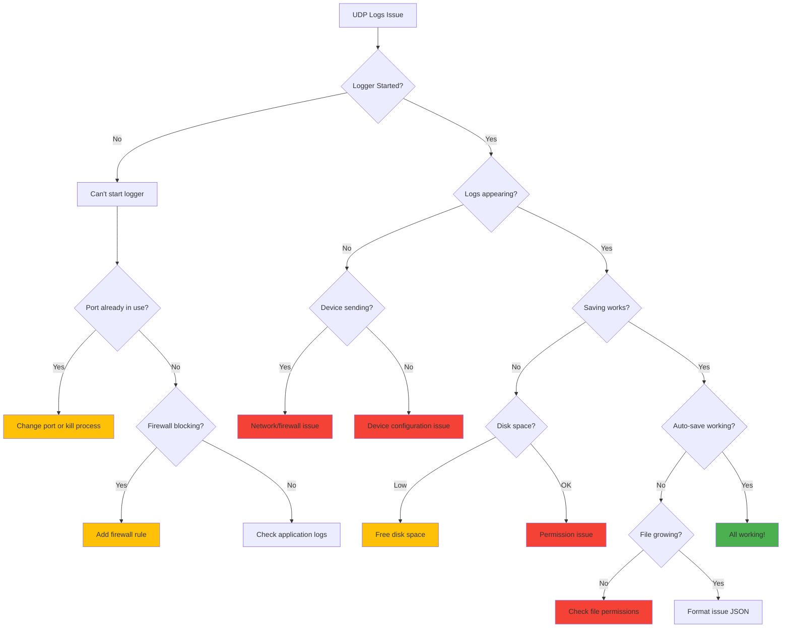

# UDP Logs Feature - Troubleshooting Guide

**Feature:** UDP Network Logging and Capture  
**Audience:** Test Operators, Support Engineers, Developers  
**Last Updated:** December 9, 2025

---

## Table of Contents

1. [Quick Diagnosis](#quick-diagnosis)
2. [Connection Issues](#connection-issues)
3. [Log Reception Problems](#log-reception-problems)
4. [File Save Errors](#file-save-errors)
5. [Auto-Save Issues](#auto-save-issues)
6. [Performance Problems](#performance-problems)
7. [Network Configuration](#network-configuration)
8. [Device-Specific Issues](#device-specific-issues)
9. [Diagnostic Tools](#diagnostic-tools)
10. [FAQ](#faq)

---

## Quick Diagnosis

### Diagnostic Flowchart



---

## Connection Issues

### Issue: Can't Start UDP Logger

**Symptom:** Click "Start UDP Logger" but get error or nothing happens.

#### Cause 1: Port Already in Use

**Error Message:** `Port 56789 already in use` or `EADDRINUSE`

**Diagnosis:**
```powershell
# Windows: Check what's using the port
netstat -ano | findstr :56789

# Output example:
# UDP    0.0.0.0:56789    *:*     1234
#                                  └─ Process ID (PID)

# Find the process:
Get-Process -Id 1234

# Output:
# ProcessName: node.exe
# StartTime: 10:15:30 AM
```

**Solutions:**

**Option 1: Close other application**
```powershell
# Kill the process
Stop-Process -Id 1234 -Force

# Or close application manually
```

**Option 2: Use different port**
1. Change port in UDP Logs page: `51000` instead of `56789`
2. Update device configuration to match new port
3. Click "Start UDP Logger"

**Option 3: Restart EOL Toolkit**
- Sometimes a zombie process holds the port
- Close and reopen toolkit
- Try again

---

#### Cause 2: Firewall Blocking

**Error Message:** Silent failure, or logs later show no packets received

**Diagnosis:**
```powershell
# Check Windows Firewall rules
Get-NetFirewallRule | Where-Object {$_.LocalPort -eq 56789}

# If no rules shown, firewall may be blocking
```

**Solution: Add Firewall Rule**

**Windows Firewall (GUI):**
1. Open **Windows Defender Firewall**
2. Click **Advanced settings**
3. Click **Inbound Rules** → **New Rule**
4. Select **Port** → Next
5. Select **UDP**, specific port **56789** → Next
6. Select **Allow the connection** → Next
7. Select all profiles (Domain, Private, Public) → Next
8. Name: **"EOL Toolkit UDP Logger"** → Finish

**Windows Firewall (PowerShell):**
```powershell
New-NetFirewallRule `
  -DisplayName "EOL Toolkit UDP Logger" `
  -Direction Inbound `
  -LocalPort 56789 `
  -Protocol UDP `
  -Action Allow `
  -Profile Any
```

**Verify:**
```powershell
Get-NetFirewallRule -DisplayName "EOL Toolkit UDP Logger"

# Should show: Enabled=True, Action=Allow
```

---

#### Cause 3: Invalid Port Number

**Error Message:** Validation error or silent failure

**Valid Port Range:** 1024 - 65535

**Reserved Ports (avoid):**
- 0-1023: System/well-known ports
- 53: DNS
- 80, 443: HTTP/HTTPS
- 3389: RDP

**Recommended Ports:**
- **56789**: Default (safe choice)
- **49152-65535**: Dynamic/private port range

**Solution:**
- Use port in valid range
- Avoid ports used by other services
- Default 56789 is usually safe

---

### Issue: UDP Logger Starts Then Immediately Stops

**Symptom:** Logger shows "Running" briefly, then stops

**Diagnosis:**

**Check Console:**
```javascript
// Open DevTools (F12)
// Look for errors like:
"UDP Logger error: Error: bind EADDRINUSE"
"UDP Logger error: Error: bind EACCES"
```

**Common Causes:**
1. **Port conflict** - Another app grabs port after start
2. **Permission denied** - Port <1024 requires admin (don't use these)
3. **Socket error** - Network adapter issue

**Solutions:**
1. Use port >1024 (e.g., 56789)
2. Check no other app starts using the port
3. Restart network adapter:
   ```powershell
   # Restart network
   ipconfig /release
   ipconfig /renew
   ```
4. Restart toolkit

---

## Log Reception Problems

### Issue: No Logs Received

**Symptom:** UDP logger running, but no logs appear in UI. Counter stays at "0 logs".

#### Diagnosis Checklist

```
✓ UDP logger started (green indicator)
✓ Correct port shown (e.g., "Port 56789")
✓ Device powered on
✓ Device connected to network
✓ Device configured with correct IP/port
✓ Firewall allows UDP traffic
✓ Network connectivity OK
```

---

#### Step 1: Verify Device is Sending

**On Device (if accessible):**
```cpp
// ESP32 example - Add debug output
void sendUDPLog(String message) {
  Serial.println("Sending UDP: " + message);  // Debug
  
  udp.beginPacket(udpHost, udpPort);
  int bytes = udp.print(message);
  int result = udp.endPacket();
  
  Serial.printf("Sent %d bytes, result: %d\n", bytes, result);
}
```

**Expected Output:**
```
Sending UDP: [INFO] Temperature: 24.5°C
Sent 30 bytes, result: 1
```

If device shows "result: 0" or error, device-side issue.

---

#### Step 2: Test with netcat/nc

**Send test packet from toolkit machine:**

**Windows PowerShell:**
```powershell
# Send UDP test packet
$udpClient = New-Object System.Net.Sockets.UdpClient
$bytes = [Text.Encoding]::ASCII.GetBytes("TEST MESSAGE")
$udpClient.Send($bytes, $bytes.Length, "localhost", 56789) | Out-Null
$udpClient.Close()
```

**Expected:** "TEST MESSAGE" appears in UDP logger

**If test works:** Device isn't sending or network issue  
**If test fails:** Toolkit/firewall issue

---

#### Step 3: Check Network Connectivity

**Ping test:**
```powershell
# From toolkit, ping device
ping 192.168.1.101

# From device, ping toolkit
ping 192.168.1.100
```

**Expected:** Replies from device/toolkit

**If ping fails:**
- Check WiFi connection
- Check network subnet (must be same)
- Check router/switch

---

#### Step 4: Verify IP and Port Configuration

**Common Configuration Mistakes:**

| Incorrect ❌ | Correct ✓ |
|---|---|
| IP: `192.168.1.100` (device IP) | IP: `192.168.1.100` (toolkit IP) |
| Port: `56789` (as string) | Port: `56789` (as number) |
| Protocol: TCP | Protocol: UDP |
| IP: `127.0.0.1` (localhost from device) | IP: `192.168.1.100` (actual toolkit IP) |

**Find Toolkit IP:**
```powershell
# Windows
ipconfig | findstr IPv4

# Look for line like:
# IPv4 Address. . . . . . . . . . . : 192.168.1.100
```

**Update Device:**
```cpp
// ESP32 - Use correct IP
const char* udpHost = "192.168.1.100";  // <-- Toolkit's IP, not device IP!
const int udpPort = 56789;              // <-- Number, not string
```

---

#### Step 5: Check Firewall (Again)

**Test firewall temporarily disabled:**
```powershell
# Windows: Temporarily disable firewall (TESTING ONLY!)
Set-NetFirewallProfile -Profile Domain,Public,Private -Enabled False

# Try receiving logs

# Re-enable firewall:
Set-NetFirewallProfile -Profile Domain,Public,Private -Enabled True
```

**If logs work with firewall off:**
- Firewall is blocking
- Add proper UDP rule (see [Cause 2: Firewall Blocking](#cause-2-firewall-blocking))

---

### Issue: Only Some Logs Received

**Symptom:** Logs appear occasionally but many are missing.

#### Cause 1: Packet Loss (UDP)

UDP is **unreliable** - packets can be dropped, especially:
- On WiFi networks
- During high network traffic
- With many devices

**Diagnosis:**
```cpp
// Device - Add sequence numbers
int logSequence = 0;

void sendLog(String message) {
  String fullMessage = String(logSequence++) + ": " + message;
  sendUDP(fullMessage);
}

// Output:
// 0: [INFO] Temperature: 24.5°C
// 1: [DEBUG] ADC: 3245
// 2: [INFO] Temperature: 24.6°C
// ...

// In toolkit, check for gaps:
// 0, 1, 2, 4, 5 (missing 3!)
```

**Solutions:**
1. **Use wired Ethernet** (more reliable than WiFi)
2. **Reduce log rate** (fewer packets = less congestion)
3. **Increase log priority** (QoS settings on router)
4. **Use TCP** instead (reliable, but more complex)

**Calculate Packet Loss:**
```
Sent: 1000 logs (from device counter)
Received: 987 logs (in toolkit)
Loss: 13 logs = 1.3% loss

Acceptable: <1% loss
Poor: >5% loss
```

---

#### Cause 2: Buffer Overflow

Toolkit buffer holds max **1,000 logs**. If logging very fast, old logs removed.

**Diagnosis:**
- Log counter stuck at 1,000
- Oldest logs disappear

**Solutions:**
1. **Enable auto-save** - Logs written to disk immediately
2. **Save logs regularly** - Don't let buffer fill
3. **Clear logs after saving** - Keeps buffer manageable
4. **Reduce log rate on device** - Less data to buffer

---

#### Cause 3: Large Packets Fragmented

**UDP Maximum Practical Size:** ~1,400 bytes

If log messages >1,400 bytes, packet may be fragmented or dropped.

**Diagnosis:**
- Very long messages not appearing
- Shorter messages work fine

**Solution:**
```cpp
// Device - Limit message length
void sendLog(String message) {
  if (message.length() > 1000) {
    message = message.substring(0, 997) + "...";
  }
  sendUDP(message);
}
```

---

## File Save Errors

### Issue: Can't Save Logs

**Symptom:** Click "Save Logs" but file not created or error shown.

#### Cause 1: No Logs to Save

**Error:** "No logs to save"

**Solution:** Wait for logs to accumulate first.

---

#### Cause 2: Permission Denied

**Error:** `EACCES: permission denied, open 'C:\logs\file.txt'`

**Causes:**
- Folder doesn't exist
- No write permission
- File open in another program

**Solutions:**

**Create folder first:**
```powershell
# Create logs directory
New-Item -ItemType Directory -Path "C:\logs" -Force
```

**Check permissions:**
```powershell
# Check folder permissions
Get-Acl "C:\logs" | Format-List

# Should show your user with Write access
```

**Try different location:**
- Desktop: `C:\Users\YourName\Desktop\device_log.txt`
- Documents: `C:\Users\YourName\Documents\logs\device_log.txt`
- Temp: `C:\Temp\device_log.txt`

**Close file if open:**
- Close Excel, Notepad, VS Code
- File can't be open when saving (overwrite mode)

---

#### Cause 3: Disk Full

**Error:** `ENOSPC: no space left on device`

**Diagnosis:**
```powershell
# Check free space
Get-PSDrive C | Select-Object Used,Free

# Output:
# Used               Free
# ----               ----
# 245000000000       5000000000  (5 GB free - OK)
# 245000000000       100000      (100 KB free - FULL!)
```

**Solutions:**
1. Free up disk space
2. Save to different drive (D:, E:, etc.)
3. Delete old log files

---

#### Cause 4: Invalid File Path

**Error:** `ENOENT: no such file or directory`

**Common Mistakes:**
```
❌ C:\logs\file.txt  (folder C:\logs doesn't exist)
❌ C:/logs/file.txt  (forward slashes on Windows)
❌ logs\file.txt     (relative path - unpredictable)

✓ C:\Users\YourName\Desktop\file.txt
✓ C:\Temp\file.txt
✓ D:\logs\file.txt
```

**Solution:** Use valid, absolute path to existing folder.

---

### Issue: Saved File is Empty or Corrupted

**Symptom:** File created but empty, or can't be opened.

#### Cause 1: No Logs in Buffer

**Diagnosis:**
```javascript
// Check log count before saving
console.log('Logs in buffer:', udpLogger.getLogs().length);
```

**Solution:** Ensure logs exist before saving.

---

#### Cause 2: Format Mismatch

**Issue:** Saved as .txt but selected JSON format, etc.

**Solution:** Ensure file extension matches format:
- **TXT format** → `.txt` extension
- **JSON format** → `.json` extension
- **CSV format** → `.csv` extension

---

#### Cause 3: JSON Auto-Save Not Finalized

**Issue:** JSON file ends with comma, not closed bracket:
```json
[
  {"timestamp": "...", "message": "Log 1"},
  {"timestamp": "...", "message": "Log 2"},
```

**Cause:** Auto-save was not properly stopped.

**Solution:**
1. Stop auto-save properly (click "Stop Auto-Save" button)
2. Or manually fix JSON:
   ```json
   [
     {"timestamp": "...", "message": "Log 1"},
     {"timestamp": "...", "message": "Log 2"}
   ]
   ```

---

## Auto-Save Issues

### Issue: Auto-Save Not Working

**Symptom:** Auto-save shows "Active" but file not growing.

#### Diagnosis Checklist

```
✓ Auto-save shows green pulsing indicator
✓ Filename displayed
✓ UDP logger running
✓ Logs appearing in UI
✓ File exists on disk
✓ File has write permissions
```

---

#### Step 1: Verify File Exists

```powershell
# Check if file exists
Test-Path "C:\logs\auto_save.txt"

# Should output: True
```

**If False:** File not created, check permissions/path.

---

#### Step 2: Monitor File Size

```powershell
# Watch file size in real-time
while ($true) {
  $file = Get-Item "C:\logs\auto_save.txt"
  Write-Host "$(Get-Date -Format 'HH:mm:ss') - Size: $($file.Length) bytes"
  Start-Sleep -Seconds 2
}

# Expected output:
# 10:15:30 - Size: 1250 bytes
# 10:15:32 - Size: 1380 bytes  (growing!)
# 10:15:34 - Size: 1520 bytes
```

**If size not growing:**
- Logs not arriving (check reception)
- Auto-save failed silently (check console)

---

#### Step 3: Check Console Errors

```javascript
// Open DevTools (F12) → Console
// Look for errors:
"Error appending log to file: EACCES: permission denied"
"Error appending log to file: ENOSPC: no space left"
```

**Solutions based on error:**
- **EACCES:** Close file if open, check permissions
- **ENOSPC:** Free disk space
- **Other:** Restart auto-save with new file

---

### Issue: Auto-Save File Grows Too Fast

**Symptom:** Auto-save file becomes very large (GB+), fills disk.

**Cause:** High log rate over long time.

**Calculation:**
```
Log rate: 10 logs/second
Average log: 100 bytes
File growth: 10 × 100 = 1,000 bytes/second = 1 KB/s

Per minute: 1 KB/s × 60 = 60 KB/min
Per hour: 60 KB × 60 = 3.6 MB/hour
Per day: 3.6 MB × 24 = 86 MB/day
Per week: 86 MB × 7 = 602 MB/week
```

**Solutions:**

**1. Rotate files periodically:**
```javascript
// Stop auto-save every hour, start new file
setInterval(() => {
  const timestamp = new Date().toISOString().replace(/:/g, '-');
  const newFile = `C:\\logs\\auto_save_${timestamp}.txt`;
  
  // Stop current
  window.electronAPI.disableAutoSave();
  
  // Start new
  window.electronAPI.enableAutoSave(newFile, 'txt');
}, 3600000);  // Every hour
```

**2. Reduce log rate on device:**
```cpp
// Log only every 5 seconds instead of every second
void loop() {
  static unsigned long lastLog = 0;
  
  if (millis() - lastLog >= 5000) {  // 5 seconds
    sendLog("[INFO] Temperature: " + String(getTemp()));
    lastLog = millis();
  }
}
```

**3. Filter logs on device (send only important):**
```cpp
// Only send warnings and errors, skip info/debug
void logUDP(String level, String message) {
  if (level == "ERROR" || level == "WARN") {
    sendUDP("[" + level + "] " + message);
  }
  // Skip INFO and DEBUG
}
```

---

### Issue: Auto-Save JSON File Invalid

**Symptom:** JSON file can't be parsed, syntax errors.

**Cause:** Application crashed before `disableAutoSave()` called.

**JSON Issue:**
```json
[
  {"timestamp": "...", "message": "Log 1"},
  {"timestamp": "...", "message": "Log 2"},
  // Missing closing bracket!
```

**Manual Fix:**
1. Open file in text editor
2. Remove trailing comma (if present)
3. Add closing bracket: `]`
4. Save file

**Fixed:**
```json
[
  {"timestamp": "...", "message": "Log 1"},
  {"timestamp": "...", "message": "Log 2"}
]
```

**Prevention:**
- Always click "Stop Auto-Save" before closing toolkit
- Or use TXT/CSV format (more fault-tolerant)

---

## Performance Problems

### Issue: UI Freezing/Lagging

**Symptom:** UI becomes slow or unresponsive when many logs.

**Causes:**
1. **Too many logs in buffer** (>1,000)
2. **High log rate** (>50 logs/second)
3. **Re-rendering entire log list** every update

#### Solution 1: Clear Logs Regularly

```javascript
// Clear logs every 1,000 entries
if (app.udpLogs.length >= 1000) {
  // Save first if needed
  await app.saveUDPLogs(false);
  
  // Clear
  await app.clearUDPLogs();
}
```

---

#### Solution 2: Use Auto-Save + Clear

```javascript
// Enable auto-save for long-term retention
await app.toggleAutoSave();

// Clear UI buffer every minute
setInterval(() => {
  app.clearUDPLogs();
}, 60000);

// Logs saved to file, UI stays responsive
```

---

#### Solution 3: Optimize Rendering (Developer)

**Current (slow):**
```javascript
// Re-renders ALL logs every time
render() {
  return `
    ${this.app.udpLogs.map(log => `<div>${log}</div>`).join('')}
  `;
}
```

**Optimized (fast):**
```javascript
// Only append new logs
window.electronAPI.onUDPLog((logEntry) => {
  const container = document.getElementById('udp-log-container');
  const newDiv = document.createElement('div');
  newDiv.textContent = logEntry;
  container.insertBefore(newDiv, container.firstChild);
  
  // Limit displayed logs
  while (container.children.length > 1000) {
    container.removeChild(container.lastChild);
  }
});
```

---

### Issue: High Memory Usage

**Symptom:** Toolkit uses GB+ of RAM after running for hours.

**Cause:** Log buffer growing beyond limit, or memory leak.

**Diagnosis:**
```javascript
// Check buffer size
console.log('Logs in memory:', udpLogger.getLogs().length);
console.log('Max logs:', udpLogger.maxLogs);  // Should be 1000

// If >1000, buffer limit not enforced
```

**Solution:**
1. Ensure buffer limit enforced (1,000 logs)
2. Use auto-save + clear logs
3. Restart toolkit periodically for long-running tests

---

## Network Configuration

### Issue: Can't Receive Logs from Different Subnet

**Scenario:** Toolkit on `192.168.1.100`, device on `192.168.2.101`

**Problem:** Different subnets can't communicate without routing.

**Solutions:**

**Option 1: Use Same Subnet**
- Move device to same subnet (e.g., `192.168.1.101`)
- Or move toolkit to device subnet

**Option 2: Configure Routing**
```powershell
# Add route (advanced)
route ADD 192.168.2.0 MASK 255.255.255.0 192.168.1.1
```

**Option 3: Use Router**
- Ensure router bridges subnets
- Check router firewall allows UDP

---

### Issue: WiFi vs Ethernet Reliability

**Observation:** Logs reliable on Ethernet, dropped on WiFi.

**Explanation:**
- **Ethernet:** Low latency (~1ms), no packet loss
- **WiFi:** Higher latency (5-50ms), 1-5% packet loss

**UDP on WiFi Challenges:**
- Signal interference
- Distance from AP
- Many devices on network
- WiFi power saving

**Solutions:**

**1. Improve WiFi signal:**
- Move device closer to AP
- Use 5GHz band (less congestion)
- Use better antenna on device

**2. Adjust device WiFi settings:**
```cpp
// ESP32 - Disable power saving
WiFi.setSleep(false);

// Increase TX power
WiFi.setTxPower(WIFI_POWER_19_5dBm);  // Max power
```

**3. Use Ethernet:**
- Best reliability
- Consistent low latency
- No packet loss

---

## Device-Specific Issues

### ESP32 Issues

#### Issue: ESP32 UDP Send Returns 0

**Code:**
```cpp
int result = udp.endPacket();
Serial.println(result);  // Prints 0 (failure)
```

**Causes:**
1. **Not connected to WiFi**
2. **Invalid IP address**
3. **UDP not initialized**

**Solution:**
```cpp
#include <WiFi.h>
#include <WiFiUdp.h>

WiFiUDP udp;
const char* udpHost = "192.168.1.100";
const int udpPort = 56789;

void setup() {
  Serial.begin(115200);
  
  // Connect to WiFi
  WiFi.begin("SSID", "password");
  while (WiFi.status() != WL_CONNECTED) {
    delay(500);
    Serial.print(".");
  }
  Serial.println("\nWiFi connected");
  Serial.println(WiFi.localIP());  // Show device IP
}

void sendLog(String message) {
  // Check WiFi still connected
  if (WiFi.status() != WL_CONNECTED) {
    Serial.println("WiFi disconnected!");
    return;
  }
  
  udp.beginPacket(udpHost, udpPort);
  udp.print(message);
  int result = udp.endPacket();
  
  if (result == 1) {
    Serial.println("UDP sent OK");
  } else {
    Serial.println("UDP send FAILED");
  }
}
```

---

### STM32 Issues

#### Issue: lwIP UDP Not Sending

**Symptom:** `udp_sendto()` called but no packets received.

**Causes:**
1. **lwIP not initialized**
2. **Ethernet link down**
3. **IP not configured**

**Solution:**
```c
// Verify lwIP initialized
extern struct netif gnetif;

void checkNetwork() {
  if (gnetif.ip_addr.addr == 0) {
    printf("ERROR: No IP address assigned\n");
    return;
  }
  
  if (!netif_is_link_up(&gnetif)) {
    printf("ERROR: Ethernet link down\n");
    return;
  }
  
  if (!netif_is_up(&gnetif)) {
    printf("ERROR: Network interface not up\n");
    return;
  }
  
  printf("Network OK: IP = %s\n", ip4addr_ntoa(&gnetif.ip_addr));
}

// Call before sending
void sendUDPLog(const char* message) {
  checkNetwork();
  
  // ... send UDP ...
}
```

---

## Diagnostic Tools

### Tool 1: Wireshark

**Purpose:** Capture and analyze UDP packets on network.

**Usage:**

1. **Install Wireshark**
   - Download: https://www.wireshark.org/

2. **Start Capture**
   - Select network interface (WiFi or Ethernet)
   - Click "Start capturing packets"

3. **Filter UDP Traffic**
   ```
   udp.port == 56789
   ```

4. **Analyze Packets**
   - Check if packets arriving
   - View source IP
   - Inspect payload (log message)

**What to Look For:**
- ✅ Packets show device IP → toolkit IP
- ✅ Destination port 56789
- ✅ Payload contains log message
- ❌ No packets = device not sending or network issue
- ❌ Wrong destination = device misconfigured

---

### Tool 2: netcat / nc

**Purpose:** Send test UDP packets manually.

**Windows (PowerShell):**
```powershell
# Send test packet
$udpClient = New-Object System.Net.Sockets.UdpClient
$bytes = [Text.Encoding]::ASCII.GetBytes("Test log message")
$udpClient.Send($bytes, $bytes.Length, "localhost", 56789) | Out-Null
$udpClient.Close()
```

**Linux/Mac:**
```bash
# Send test packet
echo "Test log message" | nc -u localhost 56789
```

**Expected:** Message appears in UDP Logger UI.

---

### Tool 3: SocketTest

**Purpose:** GUI tool for sending/receiving UDP.

**Download:** https://sourceforge.net/projects/sockettest/

**Usage:**
1. Launch SocketTest
2. Select **UDP**
3. Set **Remote Host:** `localhost`
4. Set **Remote Port:** `56789`
5. Type message, click **Send**
6. Check UDP Logger for message

---

### Tool 4: Chrome DevTools

**Purpose:** View toolkit application logs and errors.

**Usage:**
1. In toolkit, press **F12**
2. Click **Console** tab
3. Look for errors or warnings

**Useful Commands:**
```javascript
// Check UDP status
await window.electronAPI.getUDPStatus()

// Output:
// {isRunning: true, port: 56789, logCount: 247, ...}

// Send test IPC call
await window.electronAPI.startUDPLogger(56789)

// Check for errors in response
```

---

## FAQ

### Q: Why use UDP instead of TCP for logging?

**A:** UDP advantages:
- **Simpler:** No connection setup
- **Lower overhead:** No ACKs, retransmits
- **Non-blocking:** Device doesn't wait for response
- **Fire and forget:** Won't block if toolkit offline

**Disadvantages:**
- **Unreliable:** Packets can be lost
- **No ordering:** Packets may arrive out of order

**Use UDP when:** Real-time logging, packet loss acceptable  
**Use TCP when:** Every log must be received, order critical

---

### Q: What's the maximum UDP packet size?

**A:** 
- **Theoretical:** 65,507 bytes (65,535 - 8 byte UDP header - 20 byte IP header)
- **Practical (Ethernet):** ~1,472 bytes (1,500 MTU - 28 byte headers)
- **Recommended:** <1,000 bytes (avoid fragmentation)

**Fragmentation Risk:**
- Packets >MTU split into fragments
- If one fragment lost, entire packet lost
- Keep messages small

---

### Q: Can I use the same port for multiple toolkits?

**A:** No. Each toolkit instance needs a unique port.

**Example:**
- **Toolkit 1:** Port 56789
- **Toolkit 2:** Port 56790
- **Toolkit 3:** Port 56791

Configure each device to send to the appropriate port.

---

### Q: How do I log binary data over UDP?

**A:** Current implementation expects text. For binary:

**Option 1: Encode as hex string (device-side):**
```cpp
// Device: Encode binary as hex
uint8_t data[] = {0x01, 0x02, 0xAB, 0xCD};
String hex = "";
for (int i = 0; i < 4; i++) {
  char buf[3];
  sprintf(buf, "%02X", data[i]);
  hex += buf;
}
sendUDP(hex);  // "0102ABCD"
```

**Option 2: Base64 encode:**
```cpp
// Device: Base64 encode
#include <base64.h>
String encoded = base64::encode(data, dataLen);
sendUDP(encoded);
```

**Decode in analysis script later.**

---

### Q: Can I filter logs by severity level (ERROR, WARN, INFO)?

**A:** Not built-in currently. Workarounds:

**Option 1: Export and filter:**
```bash
# Save as TXT, grep for errors
grep "ERROR" device_log.txt

# Or save as CSV, filter in Excel
```

**Option 2: Implement UI filter (see [Adding New Features](./SourceCode.md#feature-log-filtering))**

---

### Q: What happens if I close toolkit while auto-save is active?

**A:** 
- **TXT/CSV:** File remains valid, last log(s) may be incomplete
- **JSON:** File may be invalid (missing closing bracket)

**Best Practice:** Always click "Stop Auto-Save" before closing toolkit.

**Recovery (JSON):**
```javascript
// Manually close JSON array
// Add this to end of file:
]
```

---

### Q: How can I synchronize device time with toolkit time?

**A:** Device includes its own timestamp in message:

**Device:**
```cpp
void sendLog(String message) {
  unsigned long uptime = millis() / 1000;
  String msg = "[" + String(uptime) + "s] " + message;
  sendUDP(msg);
}

// Output: [123s] [INFO] Temperature: 24.5°C
```

**Toolkit:** Adds reception timestamp automatically.

**Log:**
```
[2025-12-09T10:15:30.123Z] [192.168.1.101:12345] [123s] [INFO] Temperature: 24.5°C
└─────────┬───────────────┘ └─────────┬──────────┘ └─┬─┘
     Toolkit time            Source IP     Device uptime
```

**For absolute time:** Use NTP on device (if available).

---

## Related Documentation

- [README.md](./README.md) - Quick start guide
- [Overview.md](./Overview.md) - Technical architecture
- [UserGuide.md](./UserGuide.md) - User procedures
- [SourceCode.md](./SourceCode.md) - Code documentation

---

**[← Back to Source Code](./SourceCode.md)** | **[Home](./README.md)**
