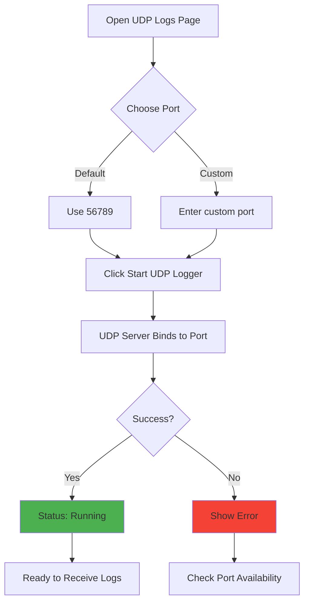

# UDP Logs Feature - User Guide

**Feature:** UDP Network Logging and Capture  
**Audience:** Test Operators, Firmware Developers, System Administrators  
**Last Updated:** December 9, 2025

---

## Table of Contents

1. [Introduction](#introduction)
2. [Getting Started](#getting-started)
3. [Starting the UDP Logger](#starting-the-udp-logger)
4. [Viewing Logs](#viewing-logs)
5. [Saving Logs](#saving-logs)
6. [Auto-Save Feature](#auto-save-feature)
7. [Configuring Devices](#configuring-devices)
8. [Common Workflows](#common-workflows)
9. [Best Practices](#best-practices)
10. [Troubleshooting](#troubleshooting)
11. [FAQ](#faq)

---

## Introduction

The **UDP Logs** feature allows you to capture real-time log messages from IoT devices over UDP. This is essential for debugging firmware, monitoring device behavior, and collecting diagnostic data.

### What You'll Learn

- How to start the UDP logger on a specific port
- How to view and interpret device logs
- How to save logs in multiple formats (TXT, JSON, CSV)
- How to use auto-save for continuous logging
- How to configure devices to send logs

### Prerequisites

- ✅ EOL Toolkit installed and running
- ✅ Devices configured to send UDP logs
- ✅ Network connectivity between toolkit and devices
- ✅ Firewall allows UDP traffic on configured port

---

## Getting Started

### Opening the UDP Logs Page

1. Launch the **NubeIO EOL Toolkit**
2. Click **"UDP Logs"** in the left sidebar
3. You'll see the UDP Logs page with:
   - Port configuration section (when stopped)
   - Control buttons
   - Log display area

### Understanding the Interface

```
┌─────────────────────────────────────────────────────────┐
│  UDP Logger                                             │
├─────────────────────────────────────────────────────────┤
│                                                          │
│  Port Configuration (shown when stopped)                │
│  ┌────────────────────────────────────────────────────┐ │
│  │ UDP Port: [56789] Port range: 1024-65535          │ │
│  │                              [▶️ Start UDP Logger] │ │
│  └────────────────────────────────────────────────────┘ │
│                                                          │
│  Status: ● Stopped | 0 logs                            │
│  [💾 Save Logs] [➕ Append Logs] [🗑️ Clear Logs]       │
│                                                          │
│  Real-Time Auto-Save: ○ Disabled                       │
│  [🚀 Start Auto-Save]                                   │
│                                                          │
│  ┌────────────────────────────────────────────────────┐ │
│  │ Log Display Area                                   │ │
│  │                                                     │ │
│  │ No UDP messages received yet                       │ │
│  │                                                     │ │
│  └────────────────────────────────────────────────────┘ │
└─────────────────────────────────────────────────────────┘
```

---

## Starting the UDP Logger

### Step-by-Step Instructions

**Step 1: Configure Port (Optional)**

The default port is **56789**. To use a different port:

1. Locate the "UDP Port" input field
2. Enter a port number (1024-65535)
3. Recommended range: 49152-65535 (dynamic ports)

**Common Ports:**
- **56789** - Default (recommended)
- **51000** - Alternative
- **55555** - Common debug port

**Step 2: Start Logger**

1. Click **"▶️ Start UDP Logger"** button
2. The logger starts immediately
3. Status changes to **"● Port 56789"** (green indicator)

**Step 3: Verify Running**

✅ **Success indicators:**
- Green status indicator: ● Port 56789
- Start button changes to "⏹️ Stop Logger"
- Port configuration hidden
- "Listening on UDP port 56789" appears

**Step 4: Configure Your Device**

Now configure your device to send logs to:
- **IP Address:** Toolkit machine IP (e.g., 192.168.1.100)
- **Port:** The port you configured (e.g., 56789)
- **Protocol:** UDP

---

### Starting Flow



---

## Viewing Logs

### Log Display Format

Each log entry shows:
```
[10:15:30] 192.168.1.101:12345 [INFO] Temperature: 24.5°C
└──┬───┘ └────────┬──────────┘ └──────────┬─────────────┘
   │              │                        │
   Time         Source IP:Port           Message
```

**Components:**
- **Timestamp:** Time log received (HH:MM:SS)
- **Source:** Device IP address and port
- **Message:** Log message from device

### Log Colors

Logs are color-coded in the UI:
- **Time:** Gray
- **Source:** Blue
- **Message:** Green

### Auto-Scroll

The log display **auto-scrolls** to show newest logs at the top.

**To review old logs:**
1. Scroll up in the log container
2. Auto-scroll pauses while scrolling
3. Scroll to bottom to resume auto-scroll

---

### Log Count

The log counter shows how many logs are currently buffered:
```
Status: ● Port 56789 | 247 logs
                      └─┬──┘
                        │
                  Current count
```

**Maximum Buffer:** 1,000 logs
- Older logs automatically removed when limit reached
- This prevents memory overflow
- Save logs regularly for long-term storage

---

## Saving Logs

### Manual Save

**Step 1: Accumulate Logs**

Wait for logs to accumulate, or perform actions that generate logs.

**Step 2: Choose Save Method**

Two save options:
1. **💾 Save Logs** - Create new file (overwrites if exists)
2. **➕ Append Logs** - Add to existing file

**Step 3: Save Process**

1. Click **"💾 Save Logs"** or **"➕ Append Logs"**
2. File dialog opens
3. Choose location and filename
4. Select format from dropdown:
   - **Text Files (*.txt)** - Plain text format
   - **JSON Files (*.json)** - Structured JSON
   - **CSV Files (*.csv)** - Spreadsheet format
5. Click **"Save"**
6. Confirmation message appears

---

### Save Formats

#### 1. Plain Text (.txt)

**Best for:** Quick review, grep searching, simple viewing

**Example:**
```
[2025-12-09T10:15:30.123Z] [192.168.1.101:12345] [INFO] Temperature: 24.5°C
[2025-12-09T10:15:31.456Z] [192.168.1.101:12345] [DEBUG] ADC reading: 3245
[2025-12-09T10:15:32.789Z] [192.168.1.102:54321] [WARN] Low battery: 3.2V
```

**How to use:**
- Open in Notepad, VS Code, etc.
- Search with Ctrl+F
- Command line: `grep ERROR device_log.txt`

---

#### 2. JSON (.json)

**Best for:** Programmatic analysis, API integration, structured data

**Example:**
```json
[
  {
    "timestamp": "2025-12-09T10:15:30.123Z",
    "from": "192.168.1.101:12345",
    "size": 45,
    "message": "[INFO] Temperature: 24.5°C"
  },
  {
    "timestamp": "2025-12-09T10:15:31.456Z",
    "from": "192.168.1.101:12345",
    "size": 28,
    "message": "[DEBUG] ADC reading: 3245"
  }
]
```

**How to use:**
```python
# Python example
import json

with open('device_log.json') as f:
    logs = json.load(f)
    
for log in logs:
    if 'ERROR' in log['message']:
        print(f"{log['timestamp']}: {log['message']}")
```

---

#### 3. CSV (.csv)

**Best for:** Excel analysis, data visualization, statistical analysis

**Example:**
```csv
Timestamp,Source,Size,Message
"2025-12-09T10:15:30.123Z","192.168.1.101:12345",45,"[INFO] Temperature: 24.5°C"
"2025-12-09T10:15:31.456Z","192.168.1.101:12345",28,"[DEBUG] ADC reading: 3245"
```

**How to use:**
1. Open in Excel or Google Sheets
2. Sort by timestamp, source, or message
3. Filter to show only errors
4. Create charts/graphs
5. Statistical analysis

---

### Save vs Append

**Save Logs (Overwrite):**
- Creates new file
- Overwrites if file exists
- Use for: New test runs, separate sessions

**Append Logs (Add to existing):**
- Adds to end of existing file
- Creates file if doesn't exist
- Use for: Continuous testing, long-running captures

**Example Workflow:**
```
Test Run 1: Save Logs → device_log_session1.txt
Test Run 2: Save Logs → device_log_session2.txt
Test Run 3: Append Logs → device_log_session2.txt (adds to existing)
```

---

## Auto-Save Feature

### What is Auto-Save?

Auto-save writes logs to a file **in real-time** as they arrive. No need to manually save - logs are continuously written to disk.

**Benefits:**
- **No data loss** - Logs written immediately
- **Continuous operation** - Works 24/7 unattended
- **Memory efficient** - Buffer stays at 1,000 logs
- **Long-term capture** - Perfect for overnight tests

---

### Using Auto-Save

**Step 1: Start Auto-Save**

1. Ensure UDP logger is running
2. Click **"🚀 Start Auto-Save"** button
3. File dialog opens

**Step 2: Configure Auto-Save**

1. Choose file location (e.g., `C:\logs\device_auto.txt`)
2. Select format (TXT, JSON, or CSV)
3. Click **"Save"**
4. Auto-save starts immediately

**Step 3: Verify Auto-Save Active**

✅ **Active indicators:**
- Status shows: ● Real-Time Auto-Save
- Green pulsing indicator
- Filename displayed: 📁 device_auto.txt (TXT)

**Step 4: Monitor File Growth**

While auto-save is active, the file grows in real-time:
```powershell
# Windows PowerShell - Watch file size
while ($true) {
    $size = (Get-Item "C:\logs\device_auto.txt").Length
    Write-Host "File size: $size bytes"
    Start-Sleep -Seconds 5
}
```

**Step 5: Stop Auto-Save**

1. Click **"⏸️ Stop Auto-Save"** button
2. Auto-save stops
3. File is finalized (for JSON, closes array)
4. File remains on disk

---

### Auto-Save Best Practices

**File Naming:**
```
device_log_2025-12-09_10-15-30.txt    ✓ Good (timestamp)
test_run_001.txt                       ✓ Good (sequential)
device.txt                             ✗ Bad (will overwrite)
```

**Format Selection:**
- **TXT:** Fastest, best for long captures
- **CSV:** Good for later Excel analysis
- **JSON:** If you need structured data

**Storage Space:**
```
Log rate: 10 logs/second
Average log size: 100 bytes
Storage per hour: 10 × 60 × 60 × 100 = 3.6 MB/hour
Storage per day: 3.6 MB × 24 = 86 MB/day
```

Plan storage accordingly for long-running tests!

---

## Configuring Devices

### Device Requirements

Your device must:
1. Be connected to the network
2. Know the toolkit's IP address
3. Send UDP packets to the configured port
4. Format messages as strings

---

### ESP32 Configuration

**Arduino/ESP-IDF:**
```cpp
#include <WiFi.h>
#include <WiFiUdp.h>

// Configuration
const char* udpHost = "192.168.1.100";  // Toolkit IP
const int udpPort = 56789;              // UDP port

WiFiUDP udp;

void setup() {
  // Connect to WiFi
  WiFi.begin("YourSSID", "YourPassword");
  while (WiFi.status() != WL_CONNECTED) {
    delay(500);
  }
}

// Function to send log via UDP
void logUDP(String message) {
  udp.beginPacket(udpHost, udpPort);
  udp.print(message);
  udp.endPacket();
}

void loop() {
  // Example: Log temperature
  float temp = readTemperature();
  logUDP("[INFO] Temperature: " + String(temp) + "°C");
  delay(1000);
}
```

---

### STM32 Configuration

**Using lwIP:**
```c
#include "lwip/udp.h"

struct udp_pcb *udp_log_pcb;
ip_addr_t dest_addr;
u16_t dest_port = 56789;

// Initialize UDP logging
void udp_log_init(void) {
  udp_log_pcb = udp_new();
  IP4_ADDR(&dest_addr, 192, 168, 1, 100);  // Toolkit IP
}

// Send log message
void log_udp(const char *message) {
  struct pbuf *p = pbuf_alloc(PBUF_TRANSPORT, 
                               strlen(message), 
                               PBUF_RAM);
  memcpy(p->payload, message, strlen(message));
  udp_sendto(udp_log_pcb, p, &dest_addr, dest_port);
  pbuf_free(p);
}

// Usage
void main(void) {
  udp_log_init();
  
  while (1) {
    float temp = read_temperature();
    char msg[64];
    sprintf(msg, "[INFO] Temperature: %.1f°C", temp);
    log_udp(msg);
    
    HAL_Delay(1000);
  }
}
```

---

### Python Configuration

**For testing or simulation:**
```python
import socket
import time

# Configuration
UDP_IP = "192.168.1.100"  # Toolkit IP
UDP_PORT = 56789

sock = socket.socket(socket.AF_INET, socket.SOCK_DGRAM)

def log_udp(message):
    sock.sendto(message.encode(), (UDP_IP, UDP_PORT))

# Usage
log_udp("[INFO] Application started")

while True:
    temp = read_temperature()
    log_udp(f"[DEBUG] Temperature: {temp}°C")
    time.sleep(1)
```

---

### Finding Toolkit IP Address

**Windows:**
```powershell
# Get IP address
ipconfig

# Look for:
# IPv4 Address. . . . . . . . . . . : 192.168.1.100
```

**Linux:**
```bash
# Get IP address
ip addr show

# Or
hostname -I
```

**In Toolkit:**
The toolkit's IP is shown in the window title or status bar (feature dependent).

---

## Common Workflows

### Workflow 1: Quick Debug Session

**Goal:** Capture logs for a quick test

**Steps:**

1. **Start logger**
   - Open UDP Logs page
   - Click "Start UDP Logger"
   - Default port 56789 is fine

2. **Configure device**
   - Set device to send UDP logs to toolkit IP:56789
   - Power on device or restart application

3. **Perform test**
   - Execute test procedure
   - Watch logs appear in real-time
   - Look for errors or unexpected behavior

4. **Save logs**
   - Click "Save Logs"
   - Choose TXT format
   - Save as `debug_session_[date].txt`

5. **Review later**
   - Open file in text editor
   - Search for ERROR, WARN keywords
   - Share with team if needed

---

### Workflow 2: Overnight Stability Test

**Goal:** Capture logs for 8+ hours unattended

**Steps:**

1. **Start logger**
   - Open UDP Logs page
   - Click "Start UDP Logger"

2. **Enable auto-save**
   - Click "Start Auto-Save"
   - Choose location: `C:\logs\stability_test_[date].txt`
   - Format: TXT (most efficient)
   - Click Save

3. **Verify auto-save active**
   - Check green pulsing indicator
   - See filename displayed

4. **Start test**
   - Configure device to send logs
   - Start your stability test
   - Leave running overnight

5. **Next morning**
   - Check file size (should be growing)
   - Click "Stop Auto-Save"
   - Open file to review
   - Look for any errors overnight

6. **Analysis**
   - Search for "ERROR" or "CRASH"
   - Check timestamp of any issues
   - Correlate with test events

---

### Workflow 3: Multi-Device Monitoring

**Goal:** Monitor logs from 5+ devices simultaneously

**Steps:**

1. **Start logger**
   - Open UDP Logs page
   - Click "Start UDP Logger"
   - Port 56789

2. **Enable auto-save** (optional but recommended)
   - Format: CSV (good for multi-device analysis)
   - Filename: `multi_device_[date].csv`

3. **Configure all devices**
   - Set each device to send to toolkit IP:56789
   - Each device will show different source IP

4. **Monitor in real-time**
   - Logs from all devices appear
   - Identify by source IP:
     ```
     192.168.1.101:12345 → Device 1
     192.168.1.102:23456 → Device 2
     192.168.1.103:34567 → Device 3
     ```

5. **Filter in Excel** (after saving CSV)
   - Open CSV in Excel
   - Filter "Source" column
   - View logs per device
   - Create charts comparing devices

---

### Workflow 4: Production Line Testing

**Goal:** Test 100+ units, save logs per unit

**Steps:**

1. **Prepare workspace**
   ```
   C:\production_logs\
   ├── unit_001\
   ├── unit_002\
   ├── unit_003\
   └── ...
   ```

2. **For each unit:**

   a. Start UDP logger (if not already running)
   
   b. Enable auto-save:
      - Filename: `C:\production_logs\unit_[XXX]\test_log.txt`
      - Format: TXT
   
   c. Connect device to power/network
   
   d. Device boots, sends logs
   
   e. Verify logs appearing
   
   f. Run test procedure (1-5 minutes)
   
   g. Stop auto-save
   
   h. **Pass/Fail decision:**
      - Search file for "ERROR" → FAIL
      - No errors → PASS
   
   i. Disconnect device
   
   j. Repeat for next unit

3. **End of day:**
   - Review failed units
   - Analyze error patterns
   - Generate summary report

---

## Best Practices

### Performance

**✅ Do:**
- Use default port 56789 (well-tested)
- Enable auto-save for long captures
- Clear logs periodically (keep buffer small)
- Save in TXT format for speed
- Use CSV for later analysis only

**❌ Don't:**
- Let buffer fill to 1,000 repeatedly (save regularly)
- Use JSON auto-save for high-rate logging (slower)
- Save very frequently (causes disk I/O overhead)

---

### Reliability

**✅ Do:**
- Test UDP connectivity before production
- Use wired Ethernet if possible (more reliable)
- Monitor file size during auto-save
- Verify logs arriving before walking away

**❌ Don't:**
- Rely on WiFi for critical logging
- Assume logs are being captured (verify!)
- Fill disk completely (monitor space)

---

### Organization

**✅ Do:**
- Use descriptive filenames:
  ```
  device_test_2025-12-09_10-30.txt  ✓
  stability_run_001.txt              ✓
  production_unit_042.txt            ✓
  ```

- Create folder structure:
  ```
  logs/
  ├── 2025-12-09/
  │   ├── morning_tests/
  │   └── afternoon_tests/
  └── 2025-12-10/
  ```

- Include metadata in log directory:
  ```
  unit_042/
  ├── test_log.txt
  ├── test_config.json
  └── README.txt  (notes about test)
  ```

**❌ Don't:**
- Use generic names (log.txt, test.txt)
- Save everything to Desktop
- Forget to backup important logs

---

## Troubleshooting

### No Logs Received

**Symptom:** UDP logger running but no logs appear

**Diagnosis:**

1. **Check device is sending**
   - Add serial debug: `Serial.println("Sending UDP: " + message);`
   - Verify device WiFi connected
   - Check device has correct IP/port

2. **Check network connectivity**
   ```powershell
   # Ping device from toolkit
   ping 192.168.1.101
   
   # If fails, network issue
   ```

3. **Check firewall**
   ```powershell
   # Windows: Check UDP port allowed
   Get-NetFirewallRule | Where-Object {$_.LocalPort -eq 56789}
   
   # If no rule, add one:
   New-NetFirewallRule -DisplayName "UDP Logger" `
     -Direction Inbound -LocalPort 56789 -Protocol UDP -Action Allow
   ```

4. **Test with another tool**
   ```bash
   # Linux/Mac: Send test UDP packet
   echo "Test message" | nc -u 192.168.1.100 56789
   
   # Windows PowerShell:
   $client = New-Object System.Net.Sockets.UdpClient
   $bytes = [Text.Encoding]::ASCII.GetBytes("Test message")
   $client.Send($bytes, $bytes.Length, "192.168.1.100", 56789)
   ```

---

### Port Already in Use

**Symptom:** Error starting logger: "Port already in use"

**Cause:** Another application is using the port

**Solutions:**

1. **Find what's using the port**
   ```powershell
   # Windows
   netstat -ano | findstr :56789
   
   # Shows: UDP 0.0.0.0:56789 *:* 1234
   #                                 └─ Process ID
   
   # Find process name:
   Get-Process -Id 1234
   ```

2. **Options:**
   - Close the other application
   - Use a different port (e.g., 51000)
   - Restart toolkit (kills zombie processes)

---

### Logs Not Saving

**Symptom:** Click "Save Logs" but file not created or empty

**Diagnosis:**

1. **Check log count**
   - If "0 logs", nothing to save
   - Accumulate logs first

2. **Check file permissions**
   - Ensure folder exists
   - Ensure write permission
   - Try saving to Desktop first

3. **Check disk space**
   ```powershell
   # Check free space
   Get-PSDrive C | Select-Object Used,Free
   ```

4. **Check console for errors**
   - Open DevTools (F12)
   - Look for errors in Console tab

---

### Auto-Save Not Working

**Symptom:** Auto-save enabled but file not growing

**Diagnosis:**

1. **Verify auto-save active**
   - Green pulsing indicator
   - Filename displayed

2. **Check file exists**
   - Navigate to file location
   - Verify file created

3. **Check logs arriving**
   - Logs should appear in UI
   - If no logs in UI, device not sending

4. **Check file size**
   ```powershell
   # Monitor file size
   Get-Item "C:\logs\auto_save.txt" | Select-Object Length
   
   # Should grow as logs arrive
   ```

5. **Restart auto-save**
   - Stop auto-save
   - Start auto-save again
   - Choose new filename

---

## FAQ

### Q: What's the maximum UDP packet size?

**A:** Theoretical maximum is 65,507 bytes, but practical limit is ~1,400 bytes to avoid fragmentation. Keep log messages under 1,000 bytes for best reliability.

---

### Q: Can I filter logs in real-time?

**A:** Not currently. Save logs and use external tools:
- **Text editor:** Search (Ctrl+F)
- **Command line:** `grep ERROR logfile.txt`
- **Excel:** Filter CSV columns

---

### Q: What happens when buffer fills (1,000 logs)?

**A:** Oldest logs are automatically removed. The buffer maintains the most recent 1,000 logs. Use auto-save for long-term retention.

---

### Q: Can multiple devices send to the same port?

**A:** Yes! All devices send to the same port (56789). They're identified by source IP:port in the logs.

---

### Q: How do I capture logs from multiple tests without mixing them?

**A:** Use auto-save with unique filenames per test:
```
test_001_device_log.txt
test_002_device_log.txt
test_003_device_log.txt
```

Or clear logs between tests:
```
Test 1 → Auto-save → Stop → Clear logs
Test 2 → Auto-save → Stop → Clear logs
```

---

### Q: Can I capture logs and monitor MQTT simultaneously?

**A:** Yes! UDP Logs and other features run independently. You can have UDP logger and MQTT connected at the same time.

---

### Q: How do I parse log timestamps in Excel?

**A:** CSV format includes ISO timestamps:
```
"2025-12-09T10:15:30.123Z"
```

In Excel:
1. Select timestamp column
2. Format → Custom → `yyyy-mm-dd hh:mm:ss`
3. Use for charts/graphs

---

## Related Documentation

- [README.md](./README.md) - Quick start guide
- [Overview.md](./Overview.md) - Technical architecture
- [SourceCode.md](./SourceCode.md) - Code documentation
- [Troubleshooting.md](./Troubleshooting.md) - Detailed diagnostics

---

**[← Back to Overview](./Overview.md)** | **[Next: Source Code →](./SourceCode.md)**
