# System Architecture - Brother PT-P900W Printer Module

## Table of Contents

1. [Overview](#overview)
2. [System Components](#system-components)
3. [Architecture Diagrams](#architecture-diagrams)
4. [Component Details](#component-details)
5. [Data Flow](#data-flow)
6. [Integration Points](#integration-points)

## Overview

The Brother PT-P900W printer module is a standalone component that integrates with the Nube iO Toolkit Electron application to provide automated label printing for factory testing workflows.

### Design Principles

- **Standalone Operation**: Executable works without Python installation
- **USB Communication**: Direct USB protocol for reliability
- **Minimal Dependencies**: Self-contained with bundled libraries
- **Cross-Process**: IPC integration with Electron main process
- **Error Resilient**: Comprehensive error handling and recovery

## System Components

### High-Level Architecture

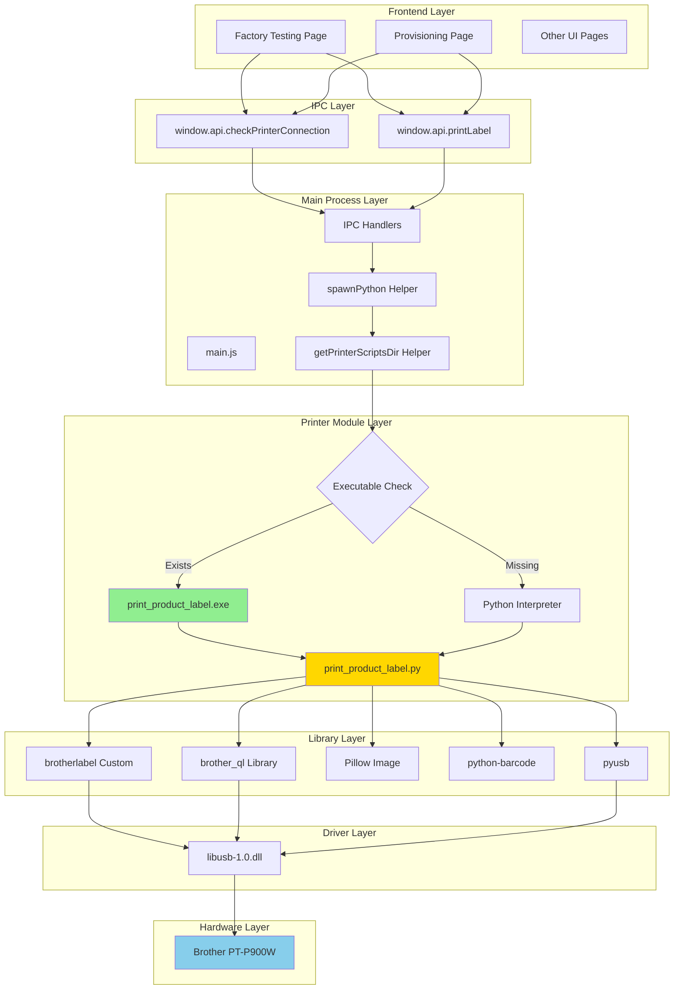

### Component Layers

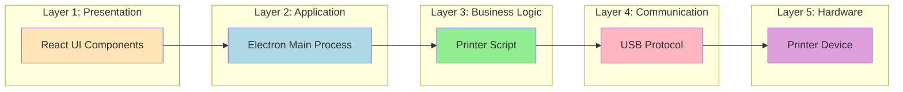

## Architecture Diagrams

### Component Diagram

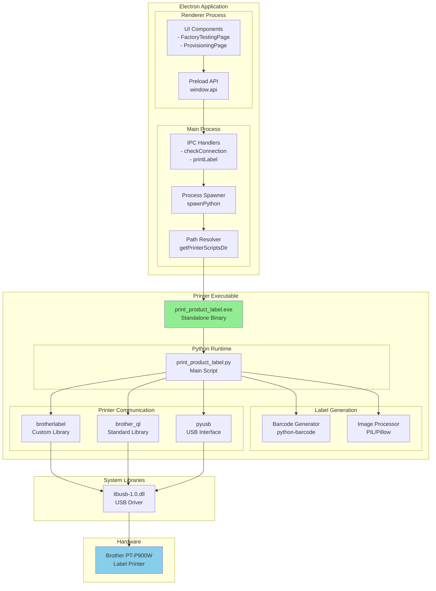

### Deployment Architecture

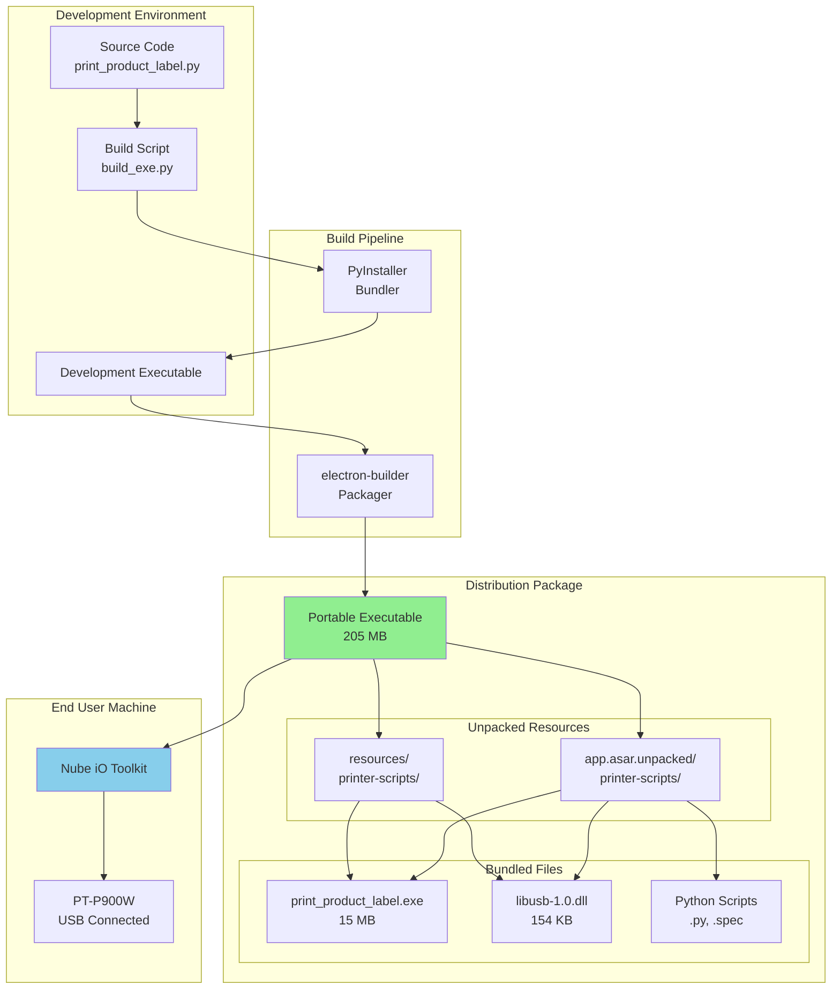

## Component Details

### 1. Electron Main Process (main.js)

**Purpose**: Bridge between UI and printer executable

**Key Functions**:

```javascript
// Path resolution for ASAR unpacking
function getPrinterScriptsDir() {
    const isDev = !app.isPackaged;
    if (isDev) {
        return path.join(__dirname, 'embedded', 'printer-scripts');
    }
    
    // Check ASAR unpacked first
    const asarPath = path.join(
        process.resourcesPath,
        'app.asar.unpacked',
        'embedded',
        'printer-scripts'
    );
    
    if (fs.existsSync(asarPath)) {
        return asarPath;
    }
    
    // Fallback to extraResources
    return path.join(
        process.resourcesPath,
        'embedded',
        'printer-scripts'
    );
}

// Process spawner with executable detection
function spawnPython(scriptPath, args) {
    const exePath = scriptPath.replace('.py', '.exe');
    
    if (fs.existsSync(exePath)) {
        // Use standalone executable
        return spawn(exePath, args);
    }
    
    // Fallback to Python
    return spawn('python', [scriptPath, ...args]);
}
```

**IPC Handlers**:

```javascript
ipcMain.handle('printer:checkConnection', async () => {
    const scriptPath = path.join(
        getPrinterScriptsDir(),
        'print_product_label.py'
    );
    
    return new Promise((resolve) => {
        const process = spawnPython(scriptPath, ['--check']);
        let output = '';
        
        process.stdout.on('data', (data) => {
            output += data.toString();
        });
        
        process.on('close', (code) => {
            resolve({
                connected: code === 0,
                output: output
            });
        });
    });
});

ipcMain.handle('printer:printLabel', async (event, data) => {
    const scriptPath = path.join(
        getPrinterScriptsDir(),
        'print_product_label.py'
    );
    
    const args = [
        data.barcode,
        data.mn,
        data.firmware,
        data.batchId,
        data.uid,
        data.date
    ];
    
    return new Promise((resolve) => {
        const process = spawnPython(scriptPath, args);
        let output = '';
        
        process.stdout.on('data', (data) => {
            output += data.toString();
        });
        
        process.on('close', (code) => {
            resolve({
                success: code === 0,
                output: output
            });
        });
    });
});
```

### 2. Printer Script (print_product_label.py)

**Purpose**: Core printing logic and USB communication

**Architecture**:

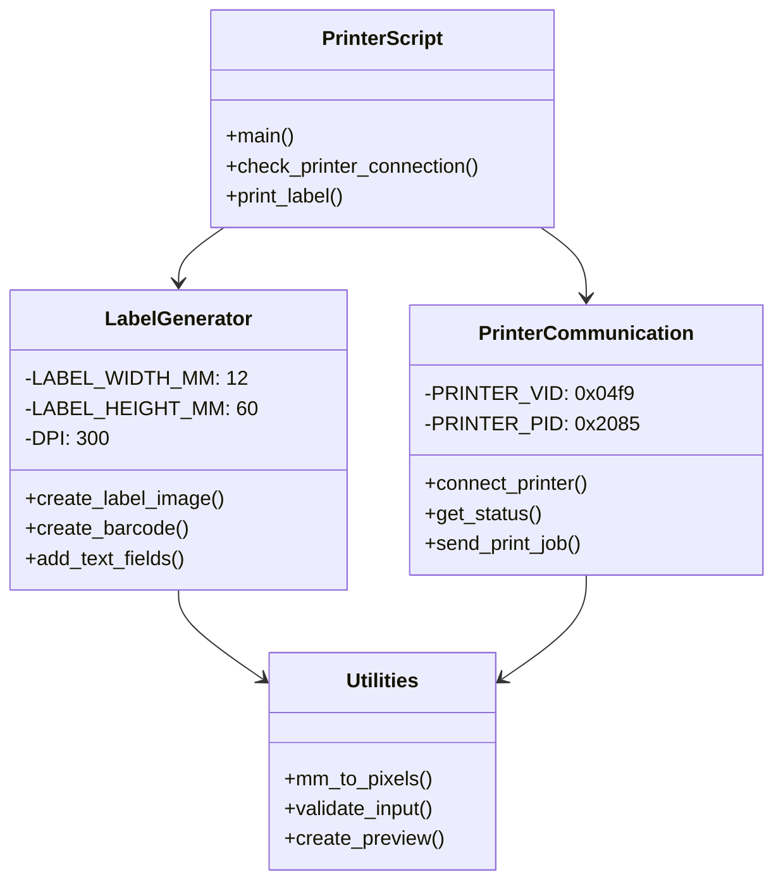

### 3. brotherlabel Library

**Purpose**: USB protocol implementation for P-touch series

**Features**:
- Direct USB communication
- P-touch template mode support
- Raster image conversion
- Status monitoring

**Protocol Flow**:

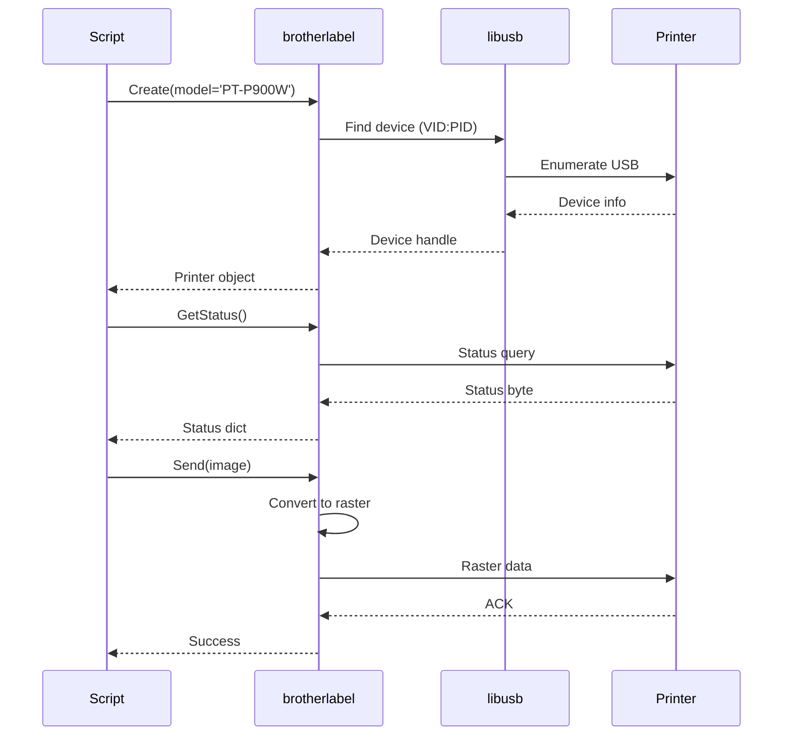

### 4. PyInstaller Executable

**Purpose**: Bundle Python script into standalone executable

**Build Configuration**:

```python
# build_exe.py
PyInstaller.__main__.run([
    'print_product_label.py',
    '--onefile',
    '--console',
    '--name=print_product_label',
    f'--paths={os.path.join(script_dir, "py-brotherlabel")}',
    '--hidden-import=PIL',
    '--hidden-import=barcode',
    '--hidden-import=brotherlabel',
    '--hidden-import=brother_ql',
    '--hidden-import=usb',
    '--add-binary=libusb-1.0.dll;.',
    '--distpath=dist',
    '--workpath=build',
    '--specpath=.'
])
```

**Executable Structure**:

```
print_product_label.exe (15 MB)
├── Python Runtime (8 MB)
├── Standard Library (3 MB)
├── Dependencies (3 MB)
│   ├── PIL/Pillow
│   ├── python-barcode
│   ├── brother_ql
│   ├── pyusb
│   └── brotherlabel (custom)
├── libusb-1.0.dll (154 KB)
└── Script Code (1 MB)
```

## Data Flow

### Check Connection Flow

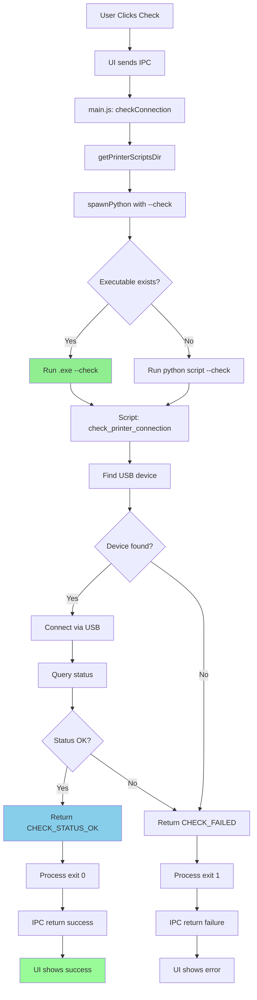

### Print Label Flow

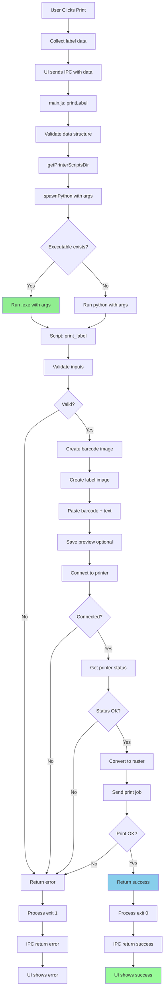

### Label Generation Flow

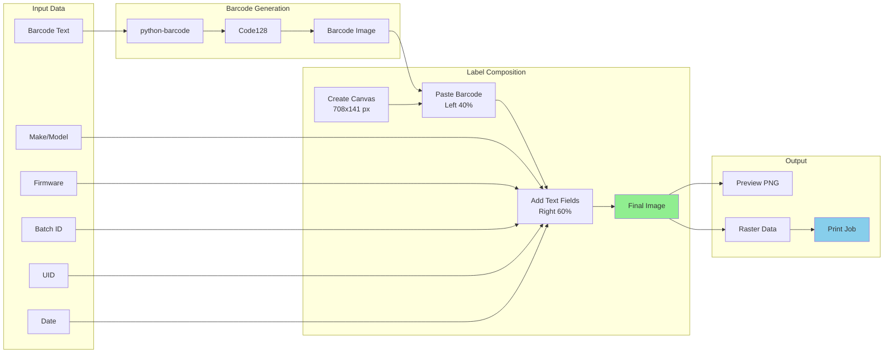

## Integration Points

### Electron Integration

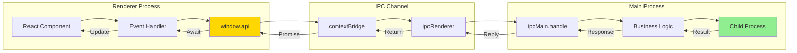

### File System Integration

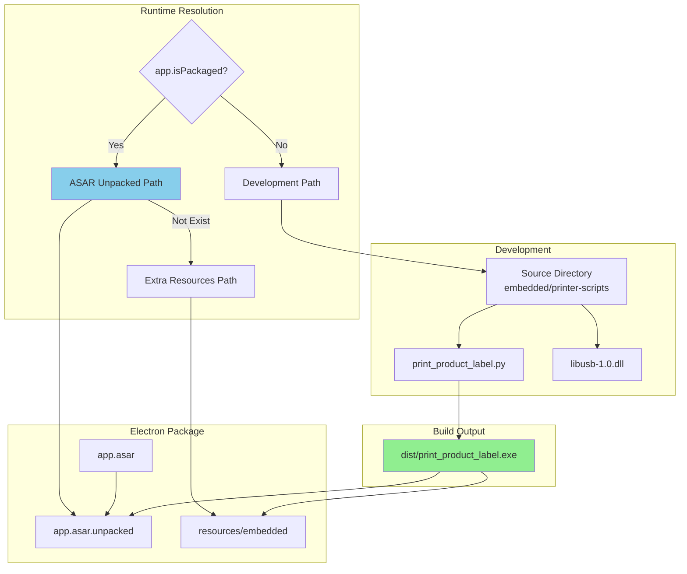

### USB Communication Stack

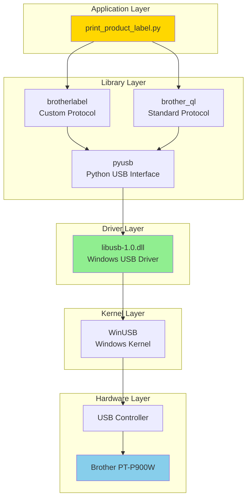

## Performance Characteristics

### Latency Analysis

```mermaid
gantt
    title Print Job Timeline
    dateFormat X
    axisFormat %L ms
    
    section Connection
    Find USB Device: 0, 200
    Connect: 200, 300
    
    section Label Generation
    Create Barcode: 300, 500
    Build Image: 500, 800
    
    section Printing
    Get Status: 800, 1000
    Convert Raster: 1000, 1200
    Send Data: 1200, 2800
    
    section Completion
    Confirm Print: 2800, 3000
```

### Resource Usage

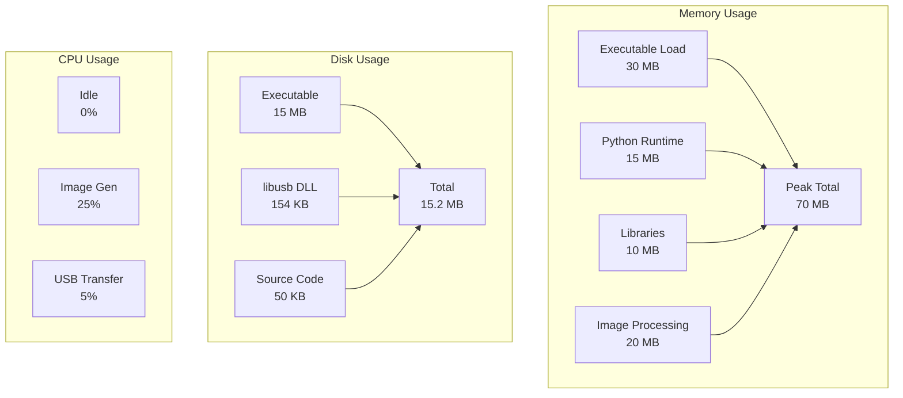

## Security Considerations

### USB Security

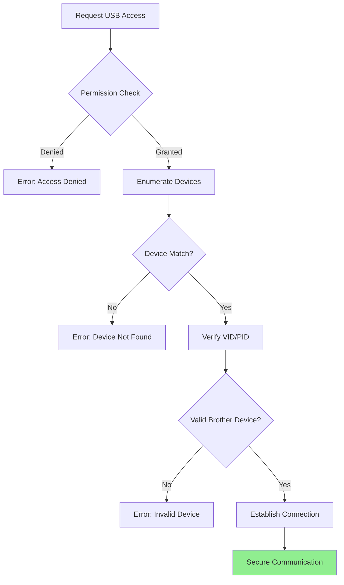

### Input Validation

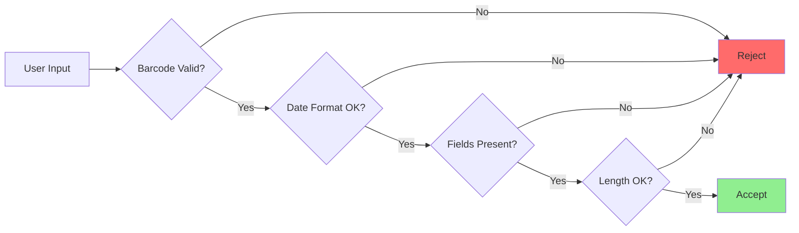

## Troubleshooting Architecture

### Error Detection Flow

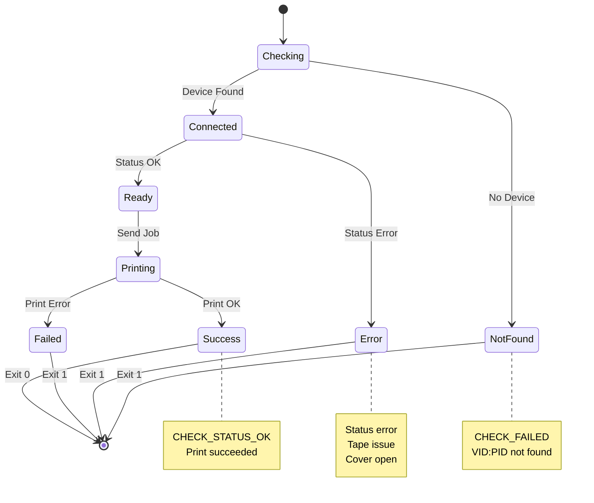

## Future Enhancements

### Planned Architecture Changes

1. **Network Printing**
   ```mermaid
   graph LR
       A[Printer Module] --> B{Connection Type}
       B -->|USB| C[USB Protocol]
       B -->|Network| D[TCP/IP Protocol]
       C --> E[Local Printer]
       D --> F[Network Printer]
   ```

2. **Batch Processing**
   ```mermaid
   graph TB
       A[Batch Queue] --> B[Job Scheduler]
       B --> C[Worker Pool]
       C --> D[Printer 1]
       C --> E[Printer 2]
       C --> F[Printer N]
   ```

3. **Cloud Integration**
   ```mermaid
   graph LR
       A[Local App] --> B[Cloud API]
       B --> C[Print Service]
       C --> D[Remote Printer]
       B --> E[Job Database]
       B --> F[Analytics]
   ```
