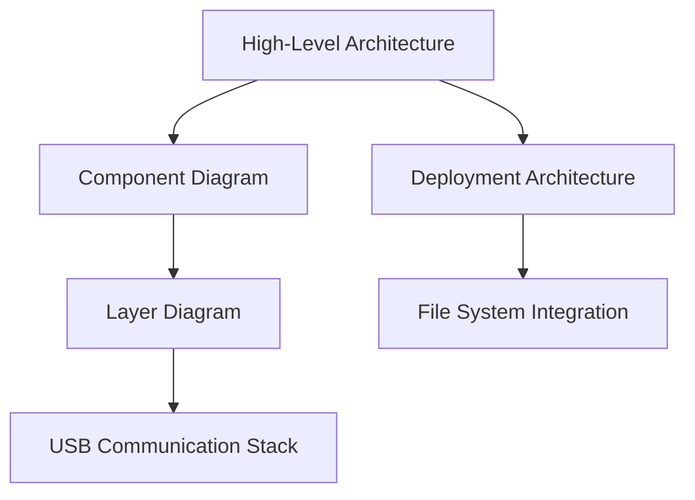
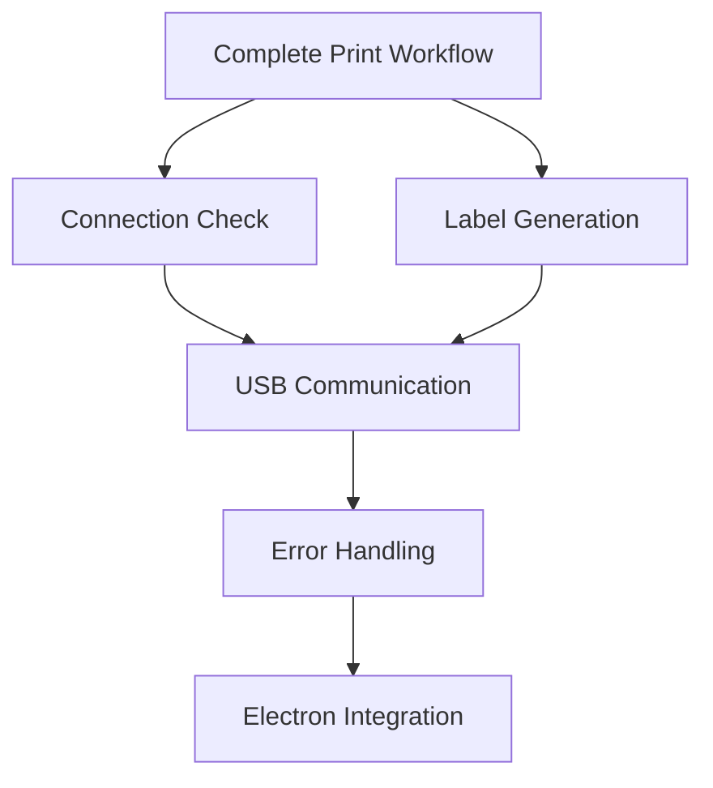
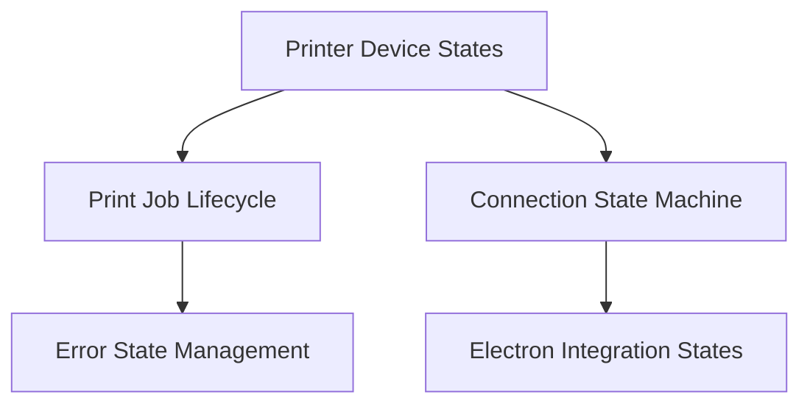
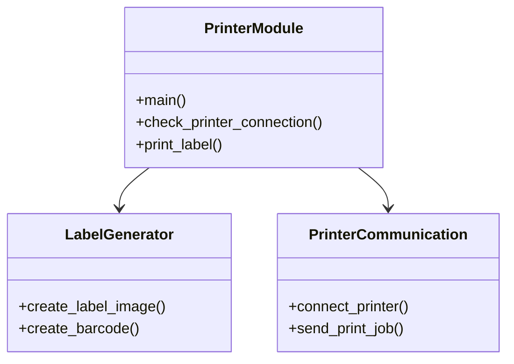

# Documentation Index

Complete documentation for Brother PT-P900W Label Printer Integration with Nube iO Toolkit.

---

## 📚 Documentation Structure

### 1. **[README.md](./README.md)** - Start Here
**Overview and quick start guide**

- ✅ Features and capabilities
- ✅ Quick start instructions
- ✅ File structure overview
- ✅ Basic usage examples
- ✅ Integration overview
- ✅ Troubleshooting basics

**Best for:** New users, quick reference, initial setup

---

### 2. **[SOFTWARE_MANUAL.md](./SOFTWARE_MANUAL.md)** - Complete User Guide
**Comprehensive user and developer manual**

- ✅ Detailed installation steps (end users & developers)
- ✅ Usage guide with examples
- ✅ API reference (CLI arguments, exit codes)
- ✅ Configuration options
- ✅ Troubleshooting guide
- ✅ Performance optimization
- ✅ Best practices
- ✅ Advanced usage patterns

**Best for:** Users needing detailed instructions, configuration, troubleshooting

---

### 3. **[CLASS_REFERENCE.md](./CLASS_REFERENCE.md)** - API Documentation
**Detailed class, method, and function reference**

- ✅ Module overview with class diagram
- ✅ Core functions documentation
  - `main()`, `check_printer_connection()`, `print_label()`
- ✅ Label generation functions
  - `create_label_image()`, `create_barcode()`, `add_text_fields()`
- ✅ Printer communication functions
  - `connect_printer()`, `get_printer_status()`, `send_print_job()`
- ✅ Utility functions
  - `mm_to_pixels()`, `validate_input()`, `create_preview()`
- ✅ Constants and configuration
- ✅ Error handling reference
- ✅ Usage patterns and examples
- ✅ Performance considerations

**Best for:** Developers extending functionality, API integration, code reference

---

### 4. **[ARCHITECTURE.md](./ARCHITECTURE.md)** - System Design
**System architecture and component documentation**

- ✅ High-level architecture overview
- ✅ Component diagrams (Mermaid)
  - System layers
  - Component relationships
  - Deployment architecture
- ✅ Component details
  - Electron main process
  - Printer script
  - brotherlabel library
  - PyInstaller executable
- ✅ Data flow documentation
- ✅ Integration points
  - Electron integration
  - File system integration
  - USB communication stack
- ✅ Performance characteristics
- ✅ Security considerations
- ✅ Future enhancements

**Best for:** System architects, understanding overall design, integration planning

---

### 5. **[SEQUENCE_DIAGRAMS.md](./SEQUENCE_DIAGRAMS.md)** - Interaction Flows
**Detailed sequence diagrams for all workflows**

- ✅ Complete print workflow (end-to-end)
- ✅ Printer connection check
- ✅ Label generation process
  - Image creation workflow
  - Barcode generation detail
- ✅ USB communication
  - Print job transmission
  - Status query flow
- ✅ Error handling flows
  - Connection error recovery
  - Print job error handling
- ✅ Electron integration
  - IPC communication flow
  - Process spawning detail
  - Error propagation chain

**Best for:** Understanding process flows, debugging, implementation details

---

### 6. **[STATE_DIAGRAMS.md](./STATE_DIAGRAMS.md)** - State Machines
**State machine documentation for all components**

- ✅ Printer device states
  - Main printer state machine
  - Detailed status states
- ✅ Print job lifecycle
  - Complete job state machine
  - Label generation states
- ✅ Connection state machine
  - USB connection states
  - Connection retry logic
- ✅ Error state management
  - Error handling state machine
  - Error recovery strategies
- ✅ Electron integration states
  - IPC request lifecycle
  - Application state machine
  - Process state monitoring
- ✅ State transition tables
- ✅ State guards documentation

**Best for:** Understanding state transitions, error handling logic, lifecycle management

---

### 7. **[BUILD_EXE.md](./BUILD_EXE.md)** - Build Guide
**Build and deployment documentation**

- ✅ Build process overview
- ✅ Prerequisites and dependencies
- ✅ Step-by-step build instructions
- ✅ PyInstaller configuration
- ✅ Testing procedures
- ✅ Electron integration steps
- ✅ Distribution package creation
- ✅ Troubleshooting build issues

**Best for:** Building executable, deployment preparation, CI/CD setup

---

## 🎯 Quick Navigation

### By User Type

#### **End Users**
1. Start with [README.md](./README.md) - Quick start
2. Refer to [SOFTWARE_MANUAL.md](./SOFTWARE_MANUAL.md) - Usage guide
3. Check [SOFTWARE_MANUAL.md](./SOFTWARE_MANUAL.md#troubleshooting) - Troubleshooting

#### **Developers**
1. Read [README.md](./README.md) - Overview
2. Study [CLASS_REFERENCE.md](./CLASS_REFERENCE.md) - API reference
3. Review [ARCHITECTURE.md](./ARCHITECTURE.md) - System design
4. Examine [SEQUENCE_DIAGRAMS.md](./SEQUENCE_DIAGRAMS.md) - Process flows

#### **System Architects**
1. Review [ARCHITECTURE.md](./ARCHITECTURE.md) - Overall design
2. Study [SEQUENCE_DIAGRAMS.md](./SEQUENCE_DIAGRAMS.md) - Interactions
3. Analyze [STATE_DIAGRAMS.md](./STATE_DIAGRAMS.md) - State machines
4. Check [CLASS_REFERENCE.md](./CLASS_REFERENCE.md) - Component details

#### **DevOps / Build Engineers**
1. Follow [BUILD_EXE.md](./BUILD_EXE.md) - Build process
2. Review [ARCHITECTURE.md](./ARCHITECTURE.md#deployment-architecture) - Deployment
3. Check [SOFTWARE_MANUAL.md](./SOFTWARE_MANUAL.md#installation) - Installation

---

## 📊 Diagram Overview

### Architecture Diagrams

**Location:** [ARCHITECTURE.md](./ARCHITECTURE.md)

---

### Sequence Diagrams

**Location:** [SEQUENCE_DIAGRAMS.md](./SEQUENCE_DIAGRAMS.md)

---

### State Diagrams

**Location:** [STATE_DIAGRAMS.md](./STATE_DIAGRAMS.md)

---

### Class Diagrams

**Location:** [CLASS_REFERENCE.md](./CLASS_REFERENCE.md)

---

## 🔍 Find Information By Topic

### Connection & Setup
- **Initial Setup:** [SOFTWARE_MANUAL.md#installation](./SOFTWARE_MANUAL.md#installation)
- **Connection Flow:** [SEQUENCE_DIAGRAMS.md#printer-connection-check](./SEQUENCE_DIAGRAMS.md#printer-connection-check)
- **Connection States:** [STATE_DIAGRAMS.md#connection-state-machine](./STATE_DIAGRAMS.md#connection-state-machine)
- **USB Architecture:** [ARCHITECTURE.md#usb-communication-stack](./ARCHITECTURE.md#usb-communication-stack)

### Printing Operations
- **Print Usage:** [SOFTWARE_MANUAL.md#print-label](./SOFTWARE_MANUAL.md#print-label)
- **Print API:** [CLASS_REFERENCE.md#print_label](./CLASS_REFERENCE.md#print_label)
- **Print Flow:** [SEQUENCE_DIAGRAMS.md#complete-print-workflow](./SEQUENCE_DIAGRAMS.md#complete-print-workflow)
- **Print States:** [STATE_DIAGRAMS.md#print-job-lifecycle](./STATE_DIAGRAMS.md#print-job-lifecycle)

### Label Generation
- **Label Format:** [README.md#label-format](./README.md#label-format)
- **Generation API:** [CLASS_REFERENCE.md#create_label_image](./CLASS_REFERENCE.md#create_label_image)
- **Generation Flow:** [SEQUENCE_DIAGRAMS.md#label-generation-process](./SEQUENCE_DIAGRAMS.md#label-generation-process)
- **Generation States:** [STATE_DIAGRAMS.md#label-generation-states](./STATE_DIAGRAMS.md#label-generation-states)

### Error Handling
- **Troubleshooting:** [SOFTWARE_MANUAL.md#troubleshooting](./SOFTWARE_MANUAL.md#troubleshooting)
- **Error Reference:** [CLASS_REFERENCE.md#error-handling](./CLASS_REFERENCE.md#error-handling)
- **Error Flows:** [SEQUENCE_DIAGRAMS.md#error-handling-flows](./SEQUENCE_DIAGRAMS.md#error-handling-flows)
- **Error States:** [STATE_DIAGRAMS.md#error-state-management](./STATE_DIAGRAMS.md#error-state-management)

### Electron Integration
- **Integration Overview:** [README.md#integration-with-electron](./README.md#integration-with-electron)
- **IPC Details:** [ARCHITECTURE.md#electron-integration](./ARCHITECTURE.md#electron-integration)
- **IPC Flow:** [SEQUENCE_DIAGRAMS.md#electron-integration](./SEQUENCE_DIAGRAMS.md#electron-integration)
- **IPC States:** [STATE_DIAGRAMS.md#electron-integration-states](./STATE_DIAGRAMS.md#electron-integration-states)

### Building & Deployment
- **Build Guide:** [BUILD_EXE.md](./BUILD_EXE.md)
- **Build Architecture:** [ARCHITECTURE.md#deployment-architecture](./ARCHITECTURE.md#deployment-architecture)
- **Build Process:** [SOFTWARE_MANUAL.md#building-the-executable](./SOFTWARE_MANUAL.md#building-the-executable)

---

## 📖 Documentation Standards

### Diagram Types Used

1. **Mermaid Diagrams** - All diagrams use Mermaid.js syntax
   - ✅ Class Diagrams - Structure and inheritance
   - ✅ Sequence Diagrams - Interaction flows
   - ✅ State Diagrams - State machines
   - ✅ Flowcharts - Process flows
   - ✅ Component Diagrams - System architecture
   - ✅ Gantt Charts - Timeline analysis

2. **Code Examples** - Syntax-highlighted snippets
   - Python, JavaScript, PowerShell
   - Inline and block formats

3. **Tables** - Structured data presentation
   - Parameter tables
   - Status codes
   - Constants
   - Performance metrics

---

## 🔧 Technical Specifications

### System Overview

| Component | Version | Purpose |
|-----------|---------|---------|
| Python | 3.13+ | Development runtime |
| PyInstaller | 6.17.0 | Executable bundler |
| Electron | 28.0.0 | Application framework |
| Brother PT-P900W | - | Target printer |
| libusb | 1.0.26 | USB communication |

### File Sizes

| File | Size | Location |
|------|------|----------|
| print_product_label.exe | 15.05 MB | dist/ |
| libusb-1.0.dll | 154 KB | embedded/printer-scripts/ |
| Portable App | 205.74 MB | dist/Nube_iO_Toolkit-*.exe |

### Performance Metrics

| Metric | Value |
|--------|-------|
| Connection Check | ~500ms |
| Label Generation | ~800ms |
| Print Transmission | ~1500ms |
| **Total Print Time** | **~3 seconds** |
| Memory Usage | ~50 MB |

---

## 🎓 Learning Path

### Beginner Path
1. ✅ [README.md](./README.md) - Get started (10 min)
2. ✅ [SOFTWARE_MANUAL.md](./SOFTWARE_MANUAL.md) - Learn usage (30 min)
3. ✅ [BUILD_EXE.md](./BUILD_EXE.md) - Build first executable (20 min)

### Intermediate Path
1. ✅ [CLASS_REFERENCE.md](./CLASS_REFERENCE.md) - Study API (45 min)
2. ✅ [ARCHITECTURE.md](./ARCHITECTURE.md) - Understand design (30 min)
3. ✅ [SEQUENCE_DIAGRAMS.md](./SEQUENCE_DIAGRAMS.md) - Follow flows (30 min)

### Advanced Path
1. ✅ [STATE_DIAGRAMS.md](./STATE_DIAGRAMS.md) - Master state machines (45 min)
2. ✅ [ARCHITECTURE.md](./ARCHITECTURE.md) - Deep dive architecture (60 min)
3. ✅ Extend functionality with custom features

---

## 📝 Document Maintenance

### Last Updated
- **Date:** December 8, 2025
- **Version:** 1.0.0
- **Status:** Complete ✅

### Update History
| Date | Document | Changes |
|------|----------|---------|
| 2025-12-08 | All | Initial comprehensive documentation |
| 2025-12-08 | README.md | Updated with new structure |
| 2025-12-08 | SOFTWARE_MANUAL.md | Complete user guide |
| 2025-12-08 | CLASS_REFERENCE.md | Full API documentation |
| 2025-12-08 | ARCHITECTURE.md | System architecture |
| 2025-12-08 | SEQUENCE_DIAGRAMS.md | Interaction flows |
| 2025-12-08 | STATE_DIAGRAMS.md | State machines |

---

## 🆘 Getting Help

### Documentation Issues
- Missing information? Check the [Learning Path](#learning-path)
- Need clarification? Review related [Sequence Diagrams](./SEQUENCE_DIAGRAMS.md)
- Understanding architecture? See [ARCHITECTURE.md](./ARCHITECTURE.md)

### Technical Issues
- Printer problems? See [SOFTWARE_MANUAL.md#troubleshooting](./SOFTWARE_MANUAL.md#troubleshooting)
- Build errors? Check [BUILD_EXE.md](./BUILD_EXE.md)
- API questions? Review [CLASS_REFERENCE.md](./CLASS_REFERENCE.md)

### Contact & Support
- **GitHub:** https://github.com/NubeIO/NubeiO-Eol-Toolkit
- **Issues:** https://github.com/NubeIO/NubeiO-Eol-Toolkit/issues
- **Email:** info@nube-io.com

---

## ✅ Documentation Checklist

### Completeness
- ✅ Software manual with usage examples
- ✅ Class and method reference
- ✅ Architecture diagrams (Component, Deployment, USB Stack)
- ✅ Sequence diagrams (6 major workflows)
- ✅ State diagrams (5 state machines)
- ✅ Flowcharts (Connection, Print, Error handling)
- ✅ Class diagrams (Module structure)
- ✅ Error handling documentation
- ✅ Performance metrics
- ✅ Build and deployment guide

### Coverage
- ✅ End user documentation
- ✅ Developer API reference
- ✅ System architecture
- ✅ Integration guides
- ✅ Troubleshooting
- ✅ Best practices
- ✅ Examples and patterns

### Quality
- ✅ Clear navigation structure
- ✅ Comprehensive diagrams
- ✅ Code examples
- ✅ Cross-references
- ✅ Search-friendly topics
- ✅ Multiple learning paths

---

## 🎯 Next Steps

1. **For New Users:**
   - Read [README.md](./README.md)
   - Try basic commands
   - Review troubleshooting if needed

2. **For Developers:**
   - Study [CLASS_REFERENCE.md](./CLASS_REFERENCE.md)
   - Examine [SEQUENCE_DIAGRAMS.md](./SEQUENCE_DIAGRAMS.md)
   - Experiment with API

3. **For Architects:**
   - Review all architecture docs
   - Plan integrations
   - Design extensions

4. **For Maintainers:**
   - Keep docs updated
   - Add new diagrams as needed
   - Document changes

---

**Documentation Complete** ✅

All aspects of the Brother PT-P900W printer module are thoroughly documented with:
- 📚 6 comprehensive documents
- 📊 25+ Mermaid diagrams
- 💻 Dozens of code examples
- 🔍 Complete API reference
- 🏗️ Full architecture coverage
- 🔄 Detailed workflow documentation
- ⚙️ State machine specifications
