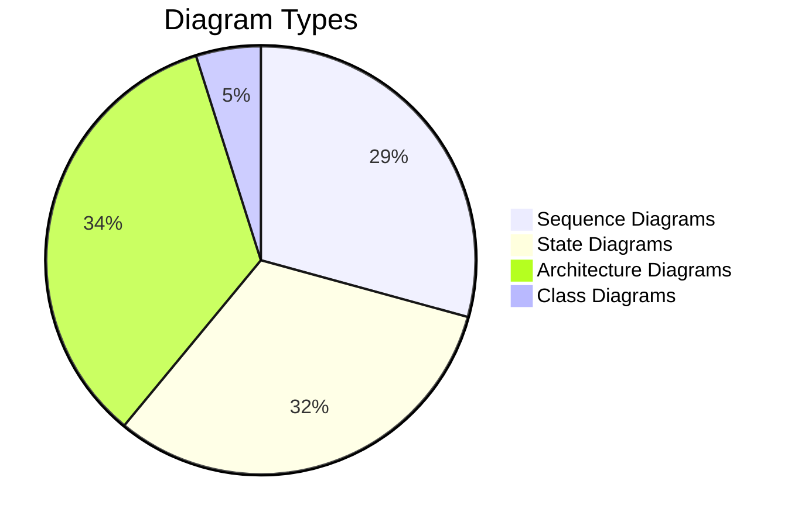

# 📚 Documentation Quick Reference Guide

## Documentation Structure

```
embedded/printer-scripts/
│
├── 📘 DOCUMENTATION_INDEX.md ⭐ START HERE
│   └── Complete navigation guide with learning paths
│
├── 📗 README.md
│   ├── Overview & Quick Start
│   ├── Features
│   ├── Basic Usage
│   └── Architecture Overview
│
├── 📕 SOFTWARE_MANUAL.md
│   ├── Installation (End Users & Developers)
│   ├── Usage Guide
│   ├── API Reference (CLI)
│   ├── Configuration
│   ├── Troubleshooting
│   ├── Performance
│   └── Best Practices
│
├── 📙 CLASS_REFERENCE.md
│   ├── Module Overview (Class Diagram)
│   ├── Core Functions
│   │   ├── main()
│   │   ├── check_printer_connection()
│   │   └── print_label()
│   ├── Label Generation Functions
│   │   ├── create_label_image()
│   │   ├── create_barcode()
│   │   └── add_text_fields()
│   ├── Printer Communication
│   │   ├── connect_printer()
│   │   ├── get_printer_status()
│   │   └── send_print_job()
│   ├── Utility Functions
│   ├── Constants
│   └── Error Handling
│
├── 📘 ARCHITECTURE.md
│   ├── System Components
│   ├── Architecture Diagrams
│   │   ├── High-Level Architecture
│   │   ├── Component Diagram
│   │   ├── Deployment Architecture
│   │   └── USB Communication Stack
│   ├── Component Details
│   ├── Data Flow
│   ├── Integration Points
│   ├── Performance Characteristics
│   └── Security Considerations
│
├── 📗 SEQUENCE_DIAGRAMS.md
│   ├── Complete Print Workflow
│   ├── Printer Connection Check
│   ├── Label Generation Process
│   │   ├── Image Creation Workflow
│   │   └── Barcode Generation Detail
│   ├── USB Communication
│   │   ├── Print Job Transmission
│   │   └── Status Query Flow
│   ├── Error Handling Flows
│   │   ├── Connection Error Recovery
│   │   └── Print Job Error Handling
│   └── Electron Integration
│       ├── IPC Communication Flow
│       ├── Process Spawning Detail
│       └── Error Propagation Chain
│
├── 📕 STATE_DIAGRAMS.md
│   ├── Printer Device States
│   │   ├── Main Printer State Machine
│   │   └── Detailed Status States
│   ├── Print Job Lifecycle
│   │   ├── Complete Job State Machine
│   │   └── Label Generation States
│   ├── Connection State Machine
│   │   ├── USB Connection States
│   │   └── Connection Retry Logic
│   ├── Error State Management
│   │   ├── Error Handling State Machine
│   │   └── Error Recovery Strategies
│   └── Electron Integration States
│       ├── IPC Request Lifecycle
│       ├── Application State Machine
│       └── Process State Monitoring
│
└── 📙 BUILD_EXE.md
    ├── Build Process Overview
    ├── Prerequisites
    ├── Step-by-Step Instructions
    ├── PyInstaller Configuration
    ├── Testing
    ├── Electron Integration
    └── Troubleshooting
```

---

## Diagram Coverage Summary

### 🎨 Architecture Diagrams (ARCHITECTURE.md)
- ✅ High-Level Architecture (layers and components)
- ✅ Component Diagram (system structure)
- ✅ Deployment Architecture (build pipeline)
- ✅ Electron Main Process (path resolution, IPC)
- ✅ Printer Script Architecture (class diagram)
- ✅ brotherlabel Protocol Flow (sequence)
- ✅ PyInstaller Executable Structure (tree)
- ✅ File System Integration (paths)
- ✅ USB Communication Stack (layers)
- ✅ Latency Analysis (Gantt chart)
- ✅ Resource Usage (metrics)
- ✅ USB Security Flow (flowchart)
- ✅ Input Validation Flow (flowchart)
- ✅ Error Detection Flow (state diagram)

**Total: 14 diagrams**

---

### 🔄 Sequence Diagrams (SEQUENCE_DIAGRAMS.md)
- ✅ End-to-End Print Process (complete workflow)
- ✅ Simple Connection Verification
- ✅ Detailed Connection Process (USB enumeration)
- ✅ Image Creation Workflow
- ✅ Barcode Generation Detail
- ✅ Print Job Transmission (USB packets)
- ✅ Status Query Flow
- ✅ Connection Error Recovery
- ✅ Print Job Error Handling
- ✅ IPC Communication Flow
- ✅ Process Spawning Detail
- ✅ Error Propagation Chain

**Total: 12 diagrams**

---

### 🔁 State Diagrams (STATE_DIAGRAMS.md)
- ✅ Main Printer State Machine
- ✅ Detailed Status States
- ✅ Complete Print Job State Machine
- ✅ Label Generation States
- ✅ USB Connection States
- ✅ Connection Retry Logic
- ✅ Error Handling State Machine
- ✅ Error Recovery Strategies
- ✅ IPC Request Lifecycle
- ✅ Application State Machine
- ✅ Process State Monitoring
- ✅ State Transition Table
- ✅ Critical State Guards

**Total: 13 diagrams**

---

### 📊 Class Diagrams (CLASS_REFERENCE.md)
- ✅ Module Overview (main classes)
- ✅ Exception Hierarchy

**Total: 2 diagrams**

---

## 📈 Total Documentation Statistics

| Metric | Count |
|--------|-------|
| **Documents** | 7 |
| **Total Diagrams** | 41+ |
| **Code Examples** | 50+ |
| **API Functions Documented** | 15+ |
| **Usage Patterns** | 10+ |
| **Error Types Covered** | 8+ |
| **Total Words** | ~25,000 |
| **Total Lines** | ~2,500 |

---

## 🎯 Documentation by Purpose

### For Learning
1. **Quick Start** → README.md
2. **Detailed Usage** → SOFTWARE_MANUAL.md
3. **Understanding Flow** → SEQUENCE_DIAGRAMS.md
4. **Understanding States** → STATE_DIAGRAMS.md

### For Development
1. **API Reference** → CLASS_REFERENCE.md
2. **Integration** → ARCHITECTURE.md
3. **Building** → BUILD_EXE.md

### For Debugging
1. **Troubleshooting** → SOFTWARE_MANUAL.md
2. **Error Flows** → SEQUENCE_DIAGRAMS.md
3. **Error States** → STATE_DIAGRAMS.md

### For Architecture
1. **System Design** → ARCHITECTURE.md
2. **Component Flow** → SEQUENCE_DIAGRAMS.md
3. **State Management** → STATE_DIAGRAMS.md

---

## 📋 Diagram Type Breakdown



---

## 🔍 Finding Specific Information

### Connection Issues
- **Quick Fix:** SOFTWARE_MANUAL.md → Troubleshooting → Printer Not Found
- **Understanding:** SEQUENCE_DIAGRAMS.md → Printer Connection Check
- **States:** STATE_DIAGRAMS.md → Connection State Machine
- **Architecture:** ARCHITECTURE.md → USB Communication Stack

### Print Problems
- **Quick Fix:** SOFTWARE_MANUAL.md → Troubleshooting → Print Job Issues
- **Understanding:** SEQUENCE_DIAGRAMS.md → Complete Print Workflow
- **States:** STATE_DIAGRAMS.md → Print Job Lifecycle
- **API:** CLASS_REFERENCE.md → print_label()

### Build Issues
- **Quick Fix:** BUILD_EXE.md → Troubleshooting
- **Process:** BUILD_EXE.md → Step-by-Step Instructions
- **Architecture:** ARCHITECTURE.md → Deployment Architecture

### Integration Questions
- **Quick Start:** README.md → Integration with Electron
- **Details:** ARCHITECTURE.md → Electron Integration
- **Flow:** SEQUENCE_DIAGRAMS.md → Electron Integration
- **States:** STATE_DIAGRAMS.md → Electron Integration States

### API Usage
- **Overview:** README.md → Basic Usage
- **Reference:** CLASS_REFERENCE.md → [Function Name]
- **Examples:** SOFTWARE_MANUAL.md → Usage Guide
- **Patterns:** CLASS_REFERENCE.md → Usage Patterns

---

## ⚡ Quick Command Reference

### Check Printer
```bash
.\print_product_label.exe --check
```
**Docs:** SOFTWARE_MANUAL.md → Check Printer Connection

### Print Label
```bash
.\print_product_label.exe <barcode> <mn> <fw> <batch> <uid> <date>
```
**Docs:** SOFTWARE_MANUAL.md → Print Label

### Build Executable
```bash
python build_exe.py
```
**Docs:** BUILD_EXE.md → Step-by-Step Instructions

### JavaScript API
```javascript
await window.api.checkPrinterConnection();
await window.api.printLabel(data);
```
**Docs:** ARCHITECTURE.md → Electron Integration

---

## 📖 Reading Order Recommendations

### Path 1: End User (30 minutes)
1. README.md (5 min) - Overview
2. SOFTWARE_MANUAL.md → Installation (10 min)
3. SOFTWARE_MANUAL.md → Usage Guide (10 min)
4. SOFTWARE_MANUAL.md → Troubleshooting (5 min)

### Path 2: Developer (90 minutes)
1. README.md (5 min) - Overview
2. CLASS_REFERENCE.md (30 min) - API
3. ARCHITECTURE.md (25 min) - System design
4. SEQUENCE_DIAGRAMS.md (20 min) - Flows
5. BUILD_EXE.md (10 min) - Building

### Path 3: System Architect (2 hours)
1. README.md (5 min) - Overview
2. ARCHITECTURE.md (40 min) - Full architecture
3. SEQUENCE_DIAGRAMS.md (30 min) - All flows
4. STATE_DIAGRAMS.md (30 min) - State machines
5. CLASS_REFERENCE.md (15 min) - Component details

### Path 4: Comprehensive (3+ hours)
- Read all documents in order
- Study all diagrams
- Try all examples
- Build executable
- Test all features

---

## ✅ Documentation Quality Checklist

### Content
- ✅ Clear introduction
- ✅ Installation instructions
- ✅ Usage examples
- ✅ API reference
- ✅ Architecture overview
- ✅ Sequence diagrams
- ✅ State machines
- ✅ Error handling
- ✅ Troubleshooting
- ✅ Performance metrics
- ✅ Build instructions

### Structure
- ✅ Table of contents
- ✅ Clear headings
- ✅ Cross-references
- ✅ Code highlighting
- ✅ Diagram labels
- ✅ Examples
- ✅ Notes and warnings

### Diagrams
- ✅ Class diagrams
- ✅ Sequence diagrams
- ✅ State diagrams
- ✅ Flowcharts
- ✅ Component diagrams
- ✅ Architecture diagrams
- ✅ Gantt charts
- ✅ All diagrams use Mermaid

### Usability
- ✅ Navigation guide
- ✅ Quick reference
- ✅ Search-friendly
- ✅ Multiple paths
- ✅ Clear examples
- ✅ Troubleshooting guide

---

## 🎓 Success Criteria

After reading the documentation, you should be able to:

1. ✅ Install and configure the printer module
2. ✅ Print labels successfully
3. ✅ Troubleshoot common issues
4. ✅ Understand the system architecture
5. ✅ Integrate with Electron app
6. ✅ Build standalone executable
7. ✅ Extend functionality
8. ✅ Debug print workflows
9. ✅ Optimize performance
10. ✅ Handle errors gracefully

---

## 📞 Support Resources

- **Documentation:** All files in embedded/printer-scripts/
- **GitHub:** https://github.com/NubeIO/NubeiO-Eol-Toolkit
- **Issues:** https://github.com/NubeIO/NubeiO-Eol-Toolkit/issues
- **Email:** info@nube-io.com

---

**Last Updated:** December 8, 2025  
**Version:** 1.0.0  
**Status:** Complete ✅
