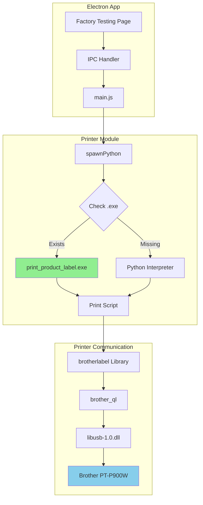

# Brother PT-P900W Label Printer Integration

Complete documentation for the Brother PT-P900W USB label printer integration with the Nube iO Toolkit.

## Overview

This module provides standalone label printing capabilities for the Brother PT-P900W label printer via USB connection. It generates product labels with barcodes, device information, and metadata for factory testing workflows.

## Features

- ✅ Direct USB communication with Brother PT-P900W
- ✅ Code128 barcode generation
- ✅ Customizable label templates (12mm tape)
- ✅ Standalone executable (no Python required on end-user machines)
- ✅ Cross-platform support (Windows focus)
- ✅ Integration with Electron main process via IPC

## Quick Start

### Prerequisites

**Development:**
- Python 3.13+
- Brother PT-P900W printer connected via USB
- libusb-1.0.dll (included)

**End Users:**
- No prerequisites - standalone executable included

### Basic Usage

```bash
# Check printer connection
.\print_product_label.exe --check

# Print a label
.\print_product_label.exe <barcode> <mn> <firmware> <batchId> <uid> <date>

# Example
.\print_product_label.exe F8AC119F ME-0005 3 4 F8AC119F 2025/12/08
```

## Documentation Index

1. **[SOFTWARE_MANUAL.md](./SOFTWARE_MANUAL.md)** - Complete user guide and API reference
2. **[CLASS_REFERENCE.md](./CLASS_REFERENCE.md)** - Detailed class and method documentation
3. **[ARCHITECTURE.md](./ARCHITECTURE.md)** - System architecture with diagrams
4. **[SEQUENCE_DIAGRAMS.md](./SEQUENCE_DIAGRAMS.md)** - Detailed flow diagrams
5. **[STATE_DIAGRAMS.md](./STATE_DIAGRAMS.md)** - State machine documentation
6. **[BUILD_EXE.md](./BUILD_EXE.md)** - Build and deployment guide

## File Structure

```
printer-scripts/
├── print_product_label.py      # Main Python script
├── print_product_label.exe     # Standalone executable (15MB)
├── libusb-1.0.dll              # USB driver
├── build_exe.py                # PyInstaller build script
├── py-brotherlabel/            # Custom Brother label library
├── docs/                       # Full documentation
│   ├── SOFTWARE_MANUAL.md
│   ├── CLASS_REFERENCE.md
│   ├── ARCHITECTURE.md
│   ├── SEQUENCE_DIAGRAMS.md
│   └── STATE_DIAGRAMS.md
├── BUILD_EXE.md                # Build guide
└── README.md                   # This file
```

## Architecture Overview



## Integration with Electron

The printer module integrates seamlessly with the Electron app:

```javascript
// Check printer connection
const result = await window.api.checkPrinterConnection();

// Print label
const result = await window.api.printLabel({
    barcode: 'F8AC119F',
    mn: 'ME-0005',
    firmware: '3',
    batchId: '4',
    uid: 'F8AC119F',
    date: '2025/12/08'
});
```

## Development

### Building the Executable

```bash
# Install dependencies
pip install pyinstaller pillow python-barcode brother_ql pyusb

# Build standalone executable
python build_exe.py

# Output: dist/print_product_label.exe
```

### Testing

```bash
# Test printer connection
python print_product_label.py --check

# Test printing
python print_product_label.py TEST001 ME-0005 3 4 TEST001 2025/12/08
```

## Label Format

- **Barcode**: Code128 barcode on left side (40% width)
- **Info Fields** (60% width):
  - MN: Make + Model
  - FW: Firmware version
  - BA: Batch ID
  - UID: Device unique ID
  - Date: Print date (YYYY/MM/DD)
- **Layout**: Horizontal barcode with text, optimized for 12mm TZe tape
- **Dimensions**: 60mm x 12mm at 300 DPI

## Troubleshooting

### Printer Not Found
- Ensure Brother PT-P900W is connected via USB
- Check Windows Device Manager for USB devices
- Verify printer is powered on

### libusb Error
- Ensure `libusb-1.0.dll` is in the same directory as the executable
- Check USB driver installation

### Print Job Sent but Nothing Prints
- Verify correct tape size (12mm) is loaded
- Check printer settings in Windows
- Ensure printer is not in error state (check LCD display)

## Performance

- **Executable Size**: 15.05 MB
- **Print Time**: ~2-3 seconds per label
- **Memory Usage**: ~50 MB during execution
- **Startup Time**: <1 second

## License

MIT License - Part of Nube iO Toolkit

## Support

For issues and questions:
- GitHub: https://github.com/NubeIO/NubeiO-Eol-Toolkit
- Documentation: See docs/ folder for detailed guides
