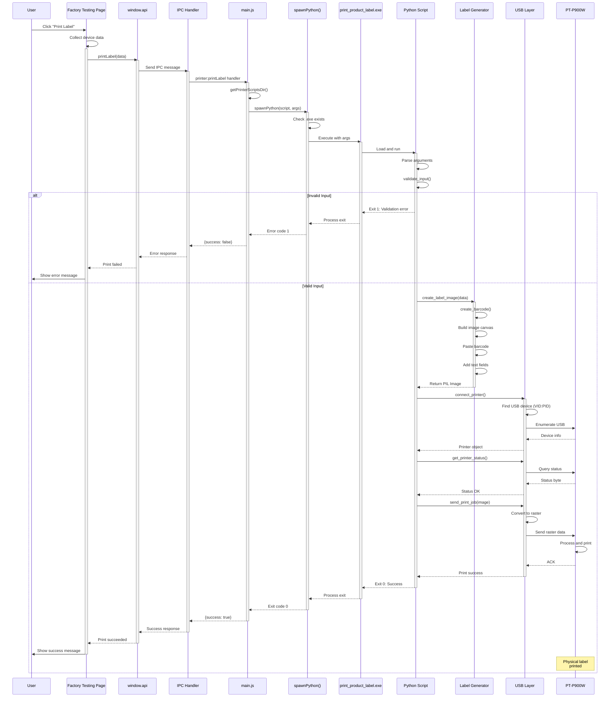
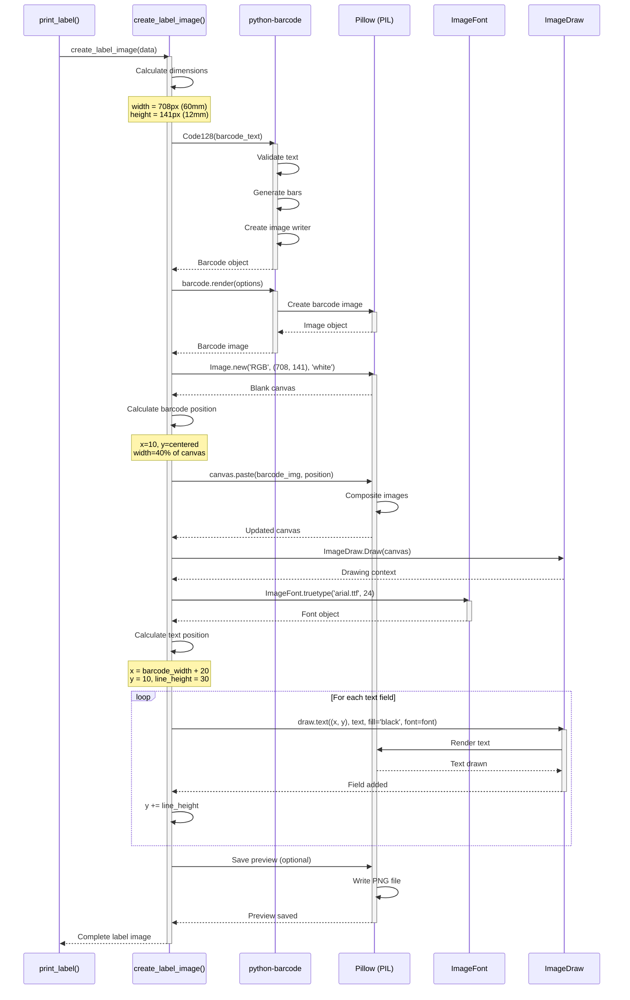
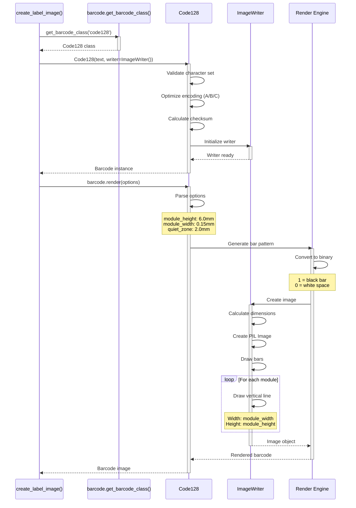
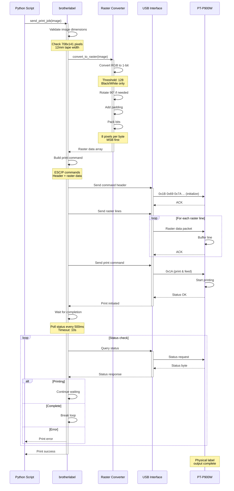
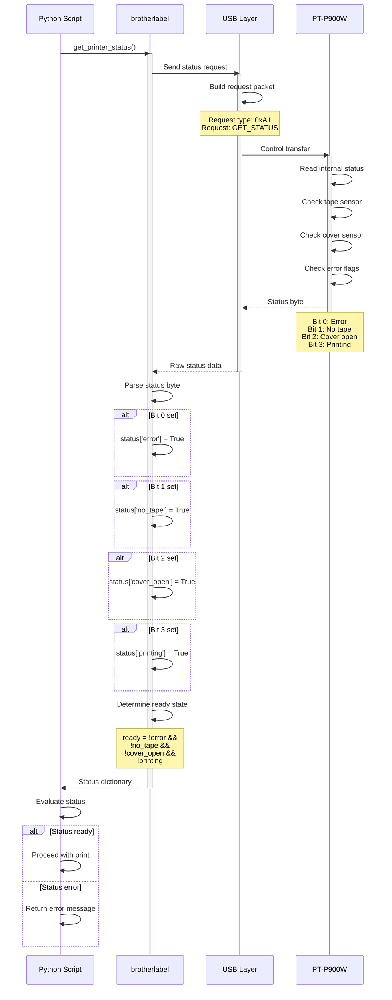
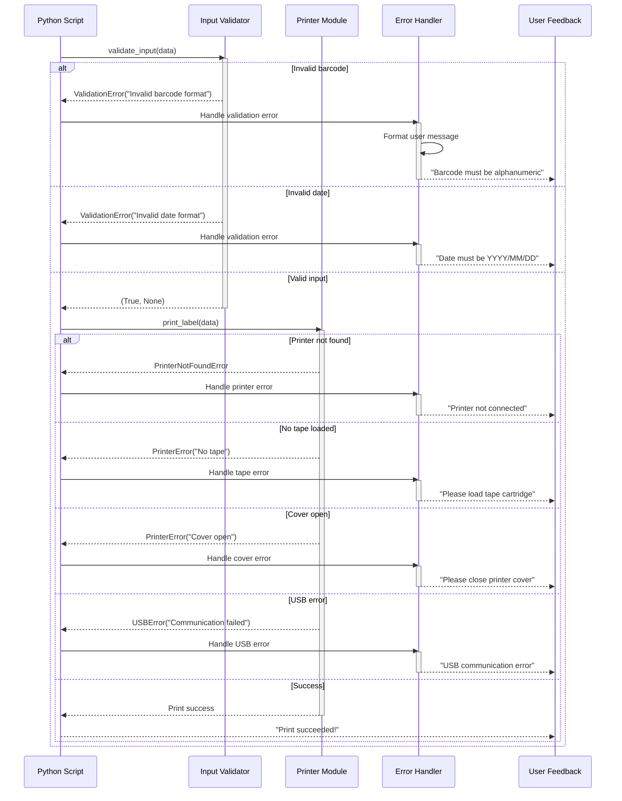
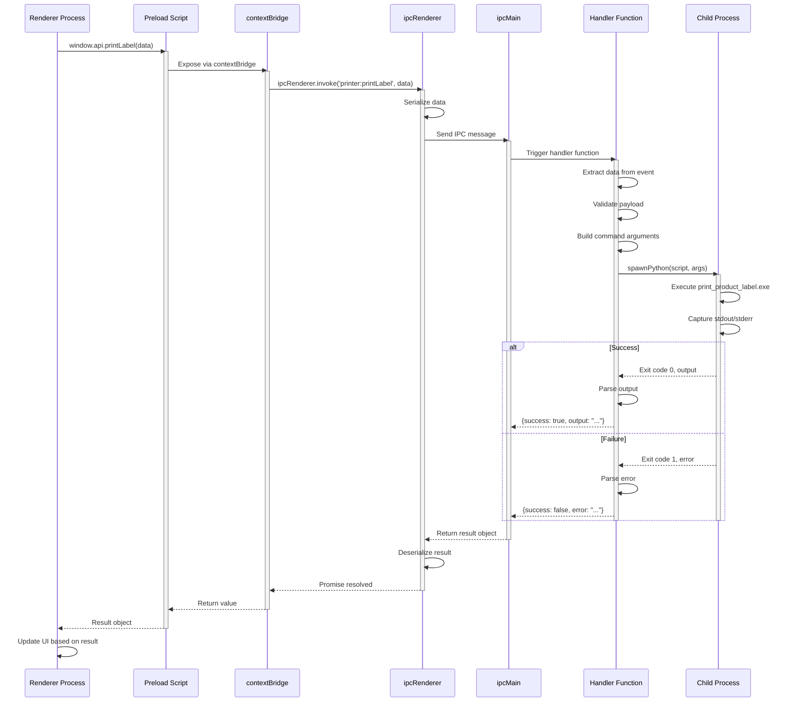
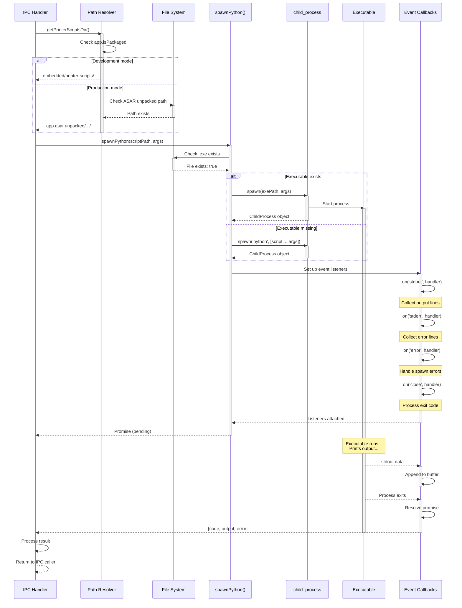
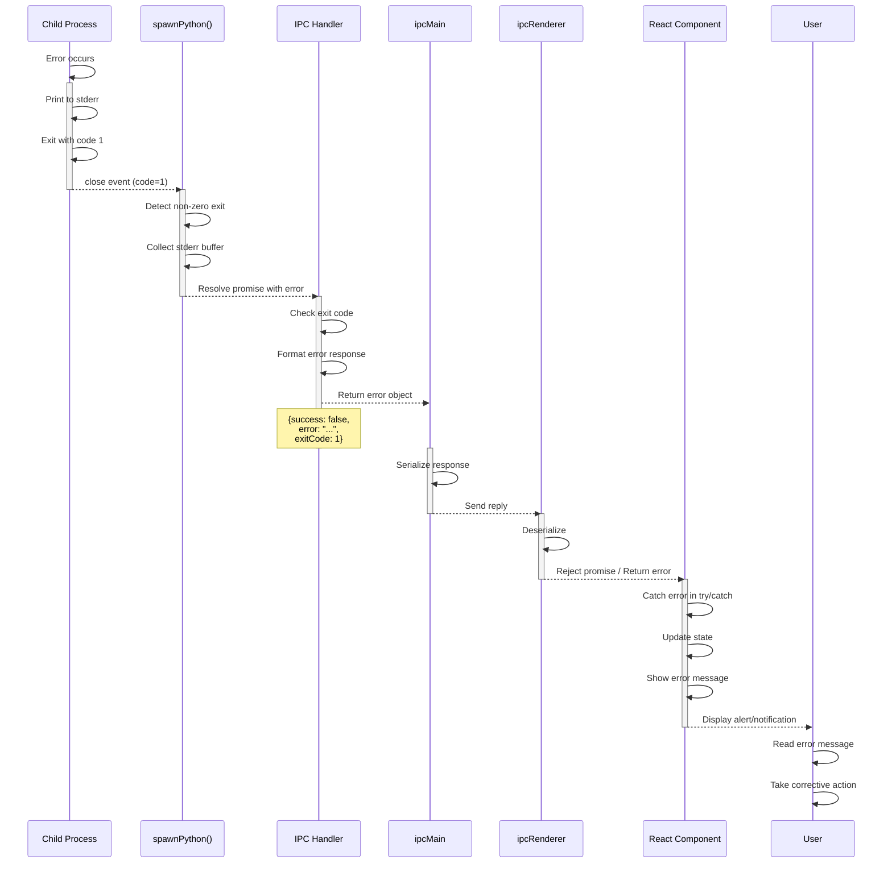

# Sequence Diagrams - Printer Module Workflows

Detailed interaction flows for all major operations in the Brother PT-P900W printer module.

## Table of Contents

1. [Complete Print Workflow](#complete-print-workflow)
2. [Printer Connection Check](#printer-connection-check)
3. [Label Generation Process](#label-generation-process)
4. [USB Communication](#usb-communication)
5. [Error Handling Flows](#error-handling-flows)
6. [Electron Integration](#electron-integration)

## Complete Print Workflow

### End-to-End Print Process



## Printer Connection Check

### Simple Connection Verification

```mermaid
sequenceDiagram
    participant U as User
    participant UI as UI Component
    participant API as window.api
    participant Main as main.js
    participant Exe as Executable
    participant USB as USB Interface
    participant Printer as PT-P900W
    
    U->>UI: Click "Check Printer"
    activate UI
    UI->>API: checkPrinterConnection()
    activate API
    API->>Main: IPC: printer:checkConnection
    activate Main
    Main->>Main: getPrinterScriptsDir()
    Main->>Main: spawnPython(script, ['--check'])
    Main->>Exe: Execute --check
    activate Exe
    
    Exe->>Exe: Parse --check flag
    Exe->>USB: Find device (VID:0x04f9, PID:0x2085)
    activate USB
    
    alt Device Found
        USB->>Printer: Connect via USB
        activate Printer
        Printer-->>USB: Connection established
        USB->>Printer: Request status
        Printer-->>USB: Status response
        deactivate Printer
        USB-->>Exe: Device OK
        deactivate USB
        Exe->>Exe: Print "CHECK_STATUS_OK"
        Exe-->>Main: Exit 0
        deactivate Exe
        Main-->>API: {connected: true, output: "...OK"}
        deactivate Main
        API-->>UI: Connection success
        deactivate API
        UI->>U: Show "✓ Printer Connected"
        deactivate UI
    else Device Not Found
        USB-->>Exe: Device not found
        deactivate USB
        Exe->>Exe: Print "CHECK_FAILED"
        Exe-->>Main: Exit 1
        deactivate Exe
        Main-->>API: {connected: false, output: "...FAILED"}
        deactivate Main
        API-->>UI: Connection failed
        deactivate API
        UI->>U: Show "✗ Printer Not Found"
        deactivate UI
    end
```

### Detailed Connection Process

```mermaid
sequenceDiagram
    participant Script as Python Script
    participant USBCore as usb.core
    participant USBUtil as usb.util
    participant LibUSB as libusb-1.0.dll
    participant WinUSB as Windows USB Driver
    participant Device as PT-P900W
    
    Script->>USBCore: usb.core.find(idVendor=0x04f9, idProduct=0x2085)
    activate USBCore
    USBCore->>LibUSB: Enumerate devices
    activate LibUSB
    LibUSB->>WinUSB: Get device list
    activate WinUSB
    WinUSB->>WinUSB: Scan USB ports
    WinUSB-->>LibUSB: Device list
    deactivate WinUSB
    LibUSB->>LibUSB: Filter by VID:PID
    
    alt Device Found
        LibUSB-->>USBCore: Device handle
        deactivate LibUSB
        USBCore-->>Script: Device object
        deactivate USBCore
        
        Script->>USBUtil: dev.set_configuration()
        activate USBUtil
        USBUtil->>Device: Set USB configuration
        activate Device
        Device-->>USBUtil: Configuration set
        deactivate Device
        USBUtil-->>Script: Configuration OK
        deactivate USBUtil
        
        Script->>USBCore: Get active configuration
        activate USBCore
        USBCore->>Device: Read configuration descriptor
        activate Device
        Device-->>USBCore: Configuration data
        deactivate Device
        USBCore-->>Script: Configuration info
        deactivate USBCore
        
        Script->>Script: Connection successful
    else Device Not Found
        LibUSB-->>USBCore: None
        deactivate LibUSB
        USBCore-->>Script: None
        deactivate USBCore
        Script->>Script: Raise ValueError
    end
```

## Label Generation Process

### Image Creation Workflow



### Barcode Generation Detail



## USB Communication

### Print Job Transmission



### Status Query Flow



## Error Handling Flows

### Connection Error Recovery

```mermaid
sequenceDiagram
    participant User as User Action
    participant Script as Python Script
    participant USB as USB Layer
    participant Retry as Retry Logic
    participant Log as Error Logger
    
    User->>Script: Attempt print
    activate Script
    
    Script->>USB: connect_printer()
    activate USB
    USB->>USB: Find device
    USB-->>Script: DeviceNotFound error
    deactivate USB
    
    Script->>Log: Log error details
    activate Log
    Log->>Log: Write to stderr
    Log-->>Script: Logged
    deactivate Log
    
    Script->>Retry: Check retry count
    activate Retry
    
    alt Retries remaining
        Retry->>Retry: Increment count
        Retry->>Retry: Wait 2 seconds
        Retry-->>Script: Retry
        deactivate Retry
        
        Script->>USB: connect_printer() (retry)
        activate USB
        
        alt Success
            USB-->>Script: Device object
            deactivate USB
            Script->>Script: Proceed with print
        else Still failed
            USB-->>Script: Error
            deactivate USB
            Script->>Retry: Check retry count
            activate Retry
            Note over Retry: Loop continues...
            deactivate Retry
        end
        
    else Max retries exceeded
        Retry-->>Script: Give up
        deactivate Retry
        Script->>Log: Log final error
        activate Log
        Log-->>Script: Logged
        deactivate Log
        Script-->>User: Return error
        deactivate Script
    end
```

### Print Job Error Handling



## Electron Integration

### IPC Communication Flow



### Process Spawning Detail



### Error Propagation Chain


