# State Diagrams - Printer Module State Machines

State machine documentation for the Brother PT-P900W printer module, covering printer states, print job lifecycle, and connection management.

## Table of Contents

1. [Printer Device States](#printer-device-states)
2. [Print Job Lifecycle](#print-job-lifecycle)
3. [Connection State Machine](#connection-state-machine)
4. [Error State Management](#error-state-management)
5. [Electron Integration States](#electron-integration-states)

## Printer Device States

### Main Printer State Machine

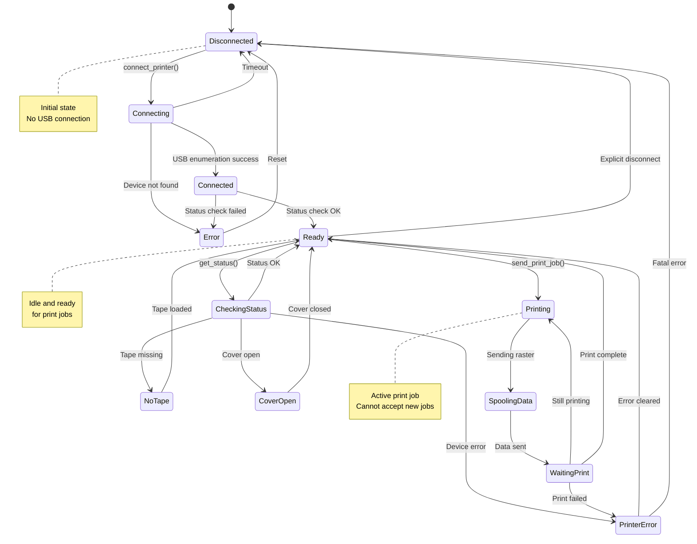

### Detailed Status States

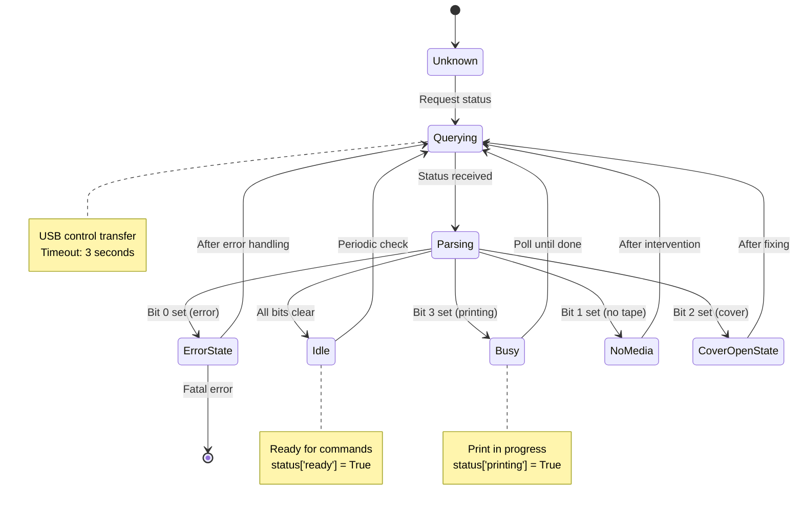

## Print Job Lifecycle

### Complete Print Job State Machine

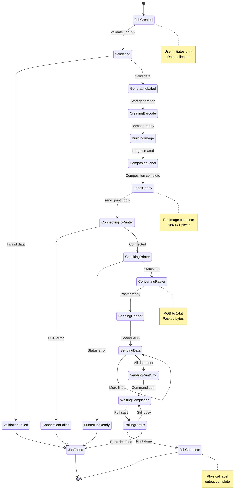

### Label Generation States

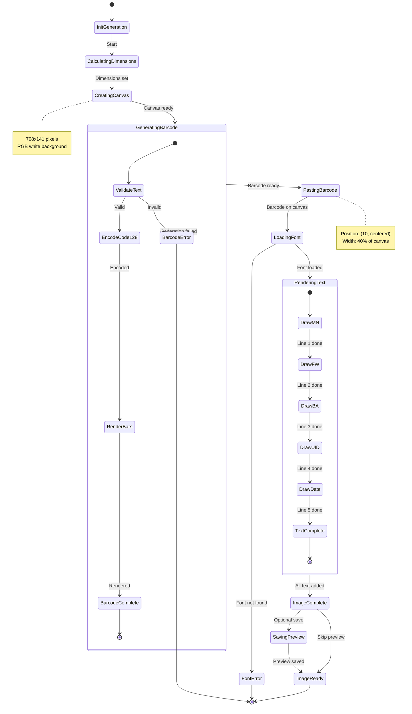

## Connection State Machine

### USB Connection States

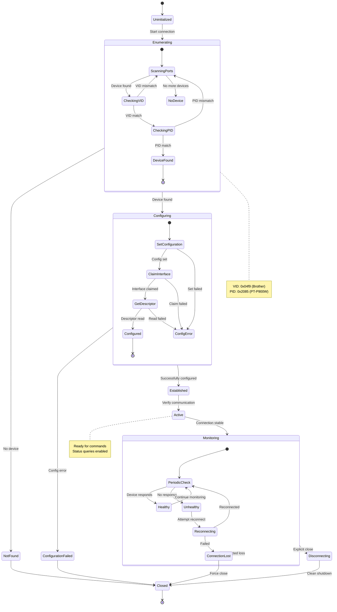

### Connection Retry Logic

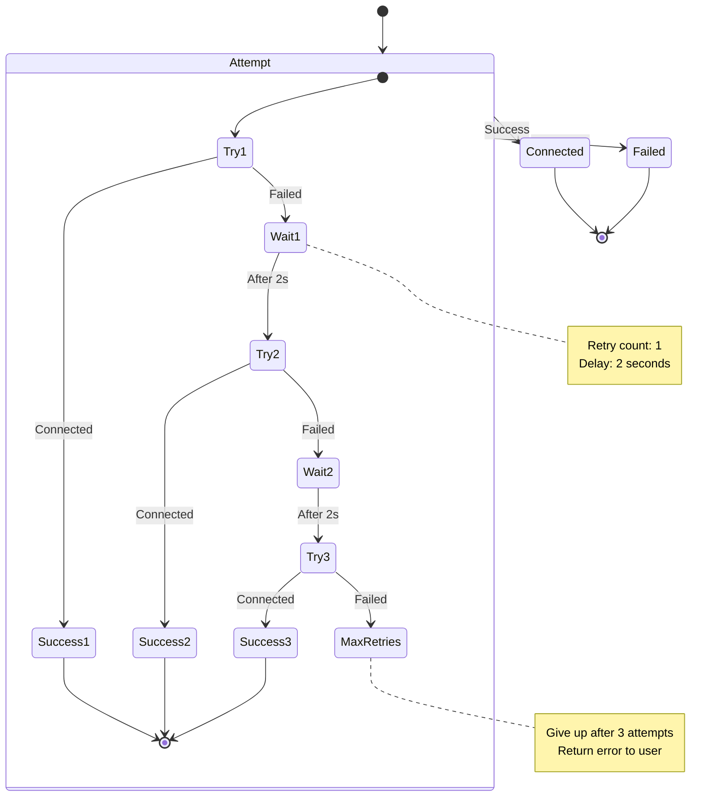

## Error State Management

### Error Handling State Machine

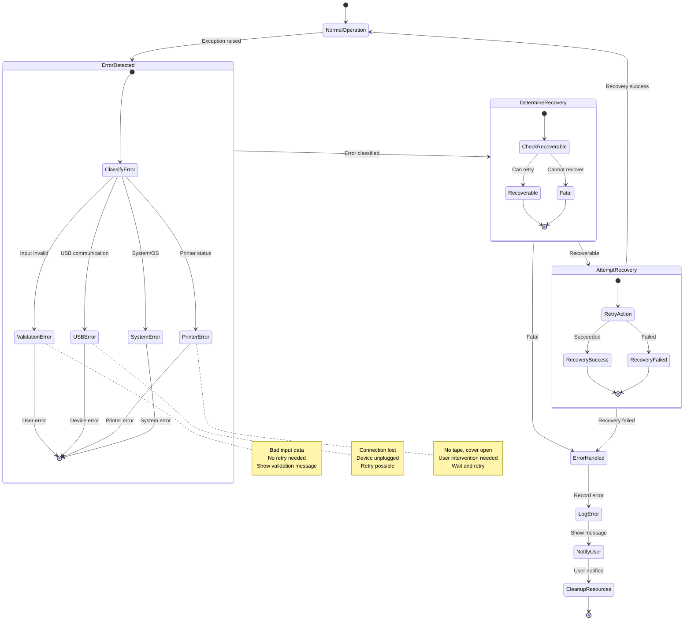

### Error Recovery Strategies

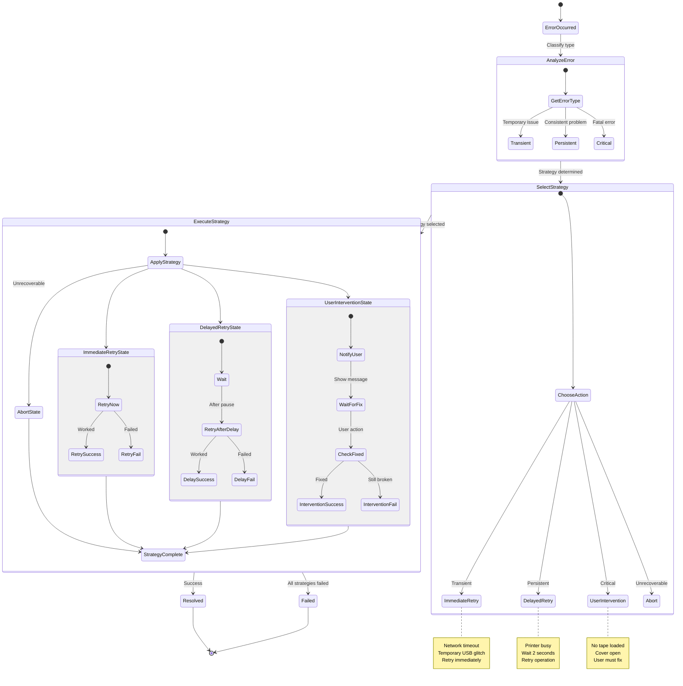

## Electron Integration States

### IPC Request Lifecycle

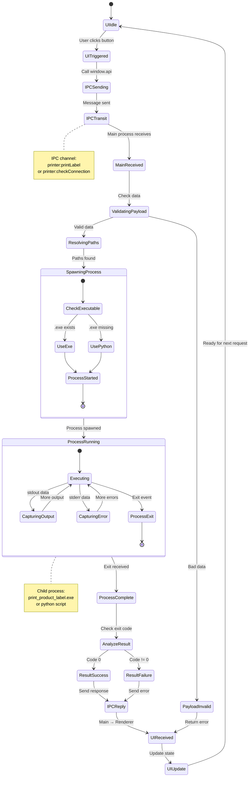

### Application State Machine

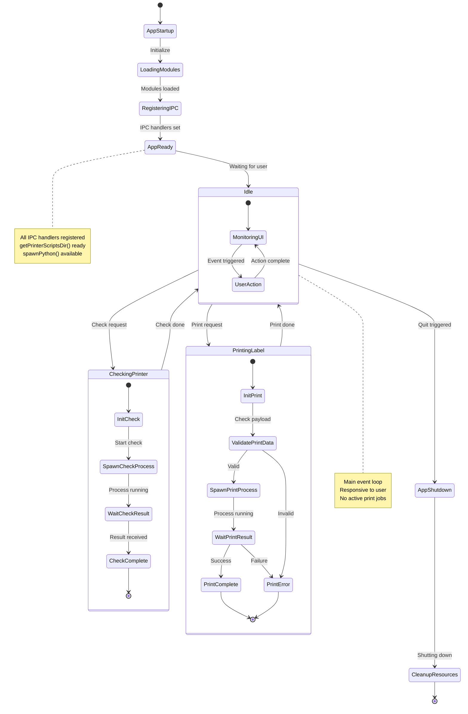

### Process State Monitoring

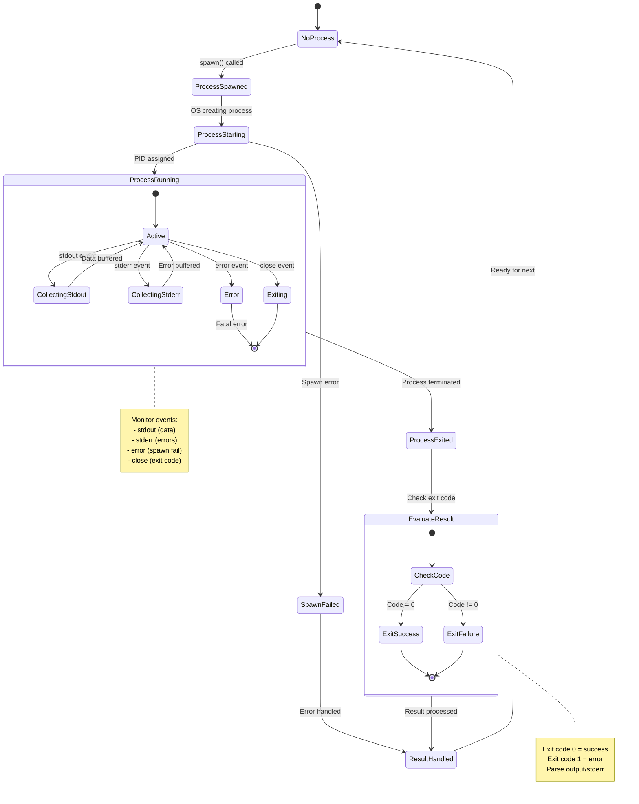

## State Transition Summary

### State Transition Table

| Current State | Event | Next State | Action |
|--------------|-------|------------|--------|
| Disconnected | connect_printer() | Connecting | Enumerate USB devices |
| Connecting | Device found | Connected | Set USB configuration |
| Connecting | Device not found | Error | Log error, notify user |
| Connected | Status OK | Ready | Enable operations |
| Ready | send_print_job() | Printing | Start print workflow |
| Printing | Data sent | WaitingPrint | Poll status |
| WaitingPrint | Print done | Ready | Complete job |
| Ready | disconnect() | Disconnected | Close USB connection |
| Any error state | clear_error() | Ready | Resume operations |

### Critical State Guards

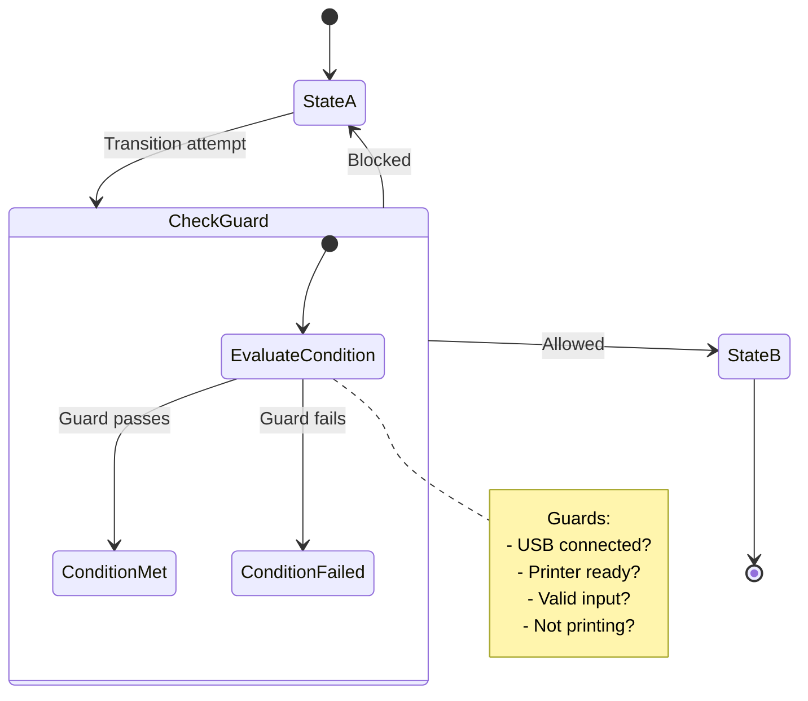

**Common Guards:**

1. **Can Print?**
   - Connected = true
   - Status = Ready
   - Tape loaded = true
   - Cover closed = true

2. **Can Connect?**
   - Not already connected
   - USB device available
   - Driver installed

3. **Can Disconnect?**
   - Currently connected
   - No active print job
   - Resources can be released
